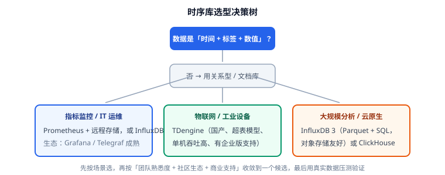

# 常见问题与最佳实践

本文汇总时序数据库在**选型、建模、写入、查询、运维**五个环节的高频疑问，给出可直接落地的结论，并把最容易踩的坑集中成一份清单。每一条都标注了结论与原因，方便团队内部对齐。



## 选型高频问题

### 关系型数据库能不能直接存时序数据？

能存，但**很快会撑不住**。关系型库为"事务 + 更新 + 复杂关联"设计，而时序数据的特征是"只追加 + 按时间范围聚合 + 整块过期"：

| 维度 | 关系型（MySQL/PostgreSQL） | 时序库（InfluxDB/TDengine） |
| --- | --- | --- |
| 写入模式 | 行级 B+ 树，随机写 | 追加写 + 列式压缩 |
| 索引开销 | 每行索引膨胀，时间列索引几乎无用 | 时间为主键，天然有序，无需额外索引 |
| 聚合性能 | 大范围 `AVG`/`MAX` 全表扫 | 列存 + 预聚合，扫的列更少 |
| 过期清理 | `DELETE` 生成大量 undo/redo，锁表 | 按时间分区整块 drop，秒级 |
| 压缩比 | 1:1 ~ 1:2 | 5:1 ~ 20:1 |

**结论**：数据量小于千万行、查询不频繁时，MySQL 加时间索引够用；一旦进入"每天都在写、保留期几个月"的阶段，迁移到时序库的综合成本（存储 + 查询延迟 + 运维）会低一个数量级。

### Prometheus 和 InfluxDB / TDengine 是什么关系？

三者都存时序数据，但**定位不同**，常见组合而非替代：

- **Prometheus**：拉取式（pull）采集 + 短周期本地存储（默认 15 天），强项是服务发现、告警规则和云原生生态（Kubernetes 一等公民）。
- **InfluxDB / TDengine**：通用时序库，强项是**长周期存储**、高写入吞吐、SQL 查询与多租户。

典型架构是 **Prometheus 负责采集与告警，通过 remote write 把冷数据写入 InfluxDB / TDengine 做长期存储**，Grafana 同时查两边。所以问题不是"选哪个"，而是"哪一段用哪个"。

### ClickHouse 能不能当时序库用？

可以，而且在大规模分析场景表现很好——列式存储 + 高压缩 + 向量化执行，聚合性能极强。

但要注意三点差异：

1. **没有原生的"时序语义"**：窗口函数要靠 `toStartOfInterval()` 自己拼，连续查询/降采样要靠物化视图。
2. **按主键排序 + 分区，标签基数高时写入放大明显**；标签需要显式设计。
3. **过期清理**靠 TTL 表达式或 `DROP PARTITION`，比专业时序库略繁琐。

**结论**：已有 ClickHouse 且团队熟悉，用于中等规模指标分析完全可行；如果 IoT 设备数巨大、要求单机高吞吐和顺滑的降采样，TDengine / InfluxDB 更省心。

### InfluxDB 还是 TDengine？

```text
指标监控 / IT 运维  → Prometheus 采集 + InfluxDB 长期存储
IoT / 工业设备       → TDengine（超表模型天然贴合"一设备一表"）
大规模云上分析       → InfluxDB 3（Parquet + SQL）或 ClickHouse
```

收敛原则：**先按场景选，再按"团队熟悉度 + 生态 + 商业支持"收敛**，最后用真实数据压测。详见[时序数据库概述与选型](../Overview/index.md)。

## 数据模型高频问题

### 标签基数多高算"高"？

经验阈值（以单个测量/超表计）：

| 标签基数 | 性质 | 处理方式 |
| --- | --- | --- |
| < 100 | 低基数 | 直接做标签，索引友好 |
| 100 ~ 10 万 | 中基数 | 可做标签，观察内存与索引膨胀 |
| > 10 万 | 高基数 | **不要做标签**，改做字段或子表名 |

**原因**：时序库为标签建倒排索引，索引条目数 ≈ 标签值组合数。把 `user_id`、`request_id`、`session_id` 这类"几乎每行都不同"的值当标签，会让索引爆炸、写入变慢、内存飙升，这就是所谓的**序列爆炸（series explosion）**。

::: danger 最常见的建模事故
把 `user_id` 设成标签后，写入 100 万个用户就产生 100 万条时间线，InfluxDB 内存直接打满。**唯一增不重复的标识（用户 ID、订单号、IP）绝不做标签**。用 TDengine 时，正确做法是把它作为**子表名**；用 InfluxDB 时，把它作为普通字段。
:::

### 一条采样有很多指标，应该分多行还是一行？

**放同一行**（同一个测量/超表），除非这些指标的**采集频率或保留期不同**。

```text
正确：一行 6 个字段
host_metrics cpu_usage=,mem_usage=,disk_used=,net_in=,net_out=,temperature=

错误：一行一个字段
cpu_usage=...（同一时刻）
mem_usage=...（同一时刻）
```

理由：分多行会让写入条数翻倍、时间线数量翻倍，而查询时又要 `JOIN` 回来，得不偿失。只有当某个指标采样频率明显不同（如温度 1 分钟、流量 1 秒），或保留期限不同（原始 30 天 vs 永久）时，才拆成不同的测量。

### 设备 ID 该当标签还是子表名？

- **TDengine**：设备 ID 是**子表名**，设备属性（机房、型号）才是标签。
- **InfluxDB**：设备 ID 通常作为标签，但要**评估设备总数**——几十万以内可接受；上百万时考虑按"设备类型"再分测量，或改用 TDengine。

判断口诀：**"数量级可控、要按它分组查询"的放标签；"数量爆炸、只用来定位单条"的放子表名 / 字段。**

## 写入与查询高频问题

### 写入总是报"乱序写入（out of order）"怎么办？

乱序是时序库的常见告警，根因通常是**采集端时钟不准或补传重试**。

处理顺序：

1. **先判断是否真乱序**：补传、时区错乱会产生大量历史时间戳，属于预期内；单点跳变属于时钟问题。
2. **配置乱序窗口**：TDengine 建库时设 `WAL_RETENTION_PERIOD` / 乱序参数；InfluxDB 各代对乱序有不同默认容忍度。
3. **治本**：采集端统一用**服务端时间**做兜底（偏差超过阈值即改写），补传数据单独走"历史通道"。

::: warning 乱序不是"能写进去就行"
乱序写入会打散列存的数据块，**显著降低压缩率**（可跌 30%+），还会让按时间范围扫描变慢。哪怕能写入成功，也要从采集端根治。
:::

### 查询越查越慢？

按这个顺序排查：

| 现象 | 可能原因 | 对策 |
| --- | --- | --- |
| 大范围趋势查询慢 | 直接扫了原始表 | 改查分钟/小时汇总表 |
| 单设备查询慢 | 标签设计问题，扫描了全表 | 用子表 / 加设备维度过滤 |
| 看板卡顿、返回上万点 | 未限制点数 | 配置 `Max data points`，与窗口宽度联动 |
| 首查慢、再查快 | 冷数据未命中缓存 | 预热查询或提高缓存配额 |
| 并发高时抖动 | 单查询占用资源太多 | 限制单查询内存 / 并发数 |

铁律：**实时看曲线查原始表，看趋势查汇总表，看当前值用 `LAST_ROW` 而不是 `ORDER BY ... LIMIT 1`。**

### 时间戳精度选秒、毫秒还是纳秒？

| 精度 | 适用 | 说明 |
| --- | --- | --- |
| 秒（s） | 低频指标、业务埋点 | 最省空间 |
| 毫秒（ms） | 绝大多数场景（推荐默认） | 兼顾精度与空间 |
| 微秒/纳秒（us/ns） | 高频交易、网络探针 | 存储成本明显上升，非必要不用 |

原则：**按"最小采样间隔的 1/10"选精度**。采集间隔 5 秒，用秒级就够；间隔 10 毫秒，才需要毫秒级。精度一旦建库就无法更改（TDengine 需新建库迁移）。

## 运维高频问题

### 磁盘涨得比预期快？

先核对容量估算公式（见[存储与保留策略](../Storage/index.md)），再看三个常见放大源：

1. **标签基数过高**：时间线数量 = 标签值组合数，每条时间线的索引与元数据都占内存和磁盘。
2. **乱序写打散压缩块**：压缩率下降直接体现为磁盘增长。
3. **保留策略太宽松**：原始数据留了 1 年，实际只需要 30 天。

快速自查 SQL：

```sql
-- TDengine：看各库实际数据量与保留期
SHOW DATABASES;
SELECT * FROM information_schema.ins_databases;

-- InfluxDB：看测量与时间线规模
SHOW MEASUREMENTS;
SHOW SERIES CARDINALITY;
```

### 单机怎么平滑扩到集群？

1. **先垂直扩容**：加内存（时序库重度依赖内存缓存标签索引）比加 CPU 收益大。
2. **再分级存储**：热点数据用 SSD，冷数据降到机械盘或对象存储（InfluxDB 3 + Parquet 对对象存储友好）。
3. **最后水平扩展**：TDengine 企业版 / InfluxDB Enterprise 支持集群，按 `vgroup` / shard 分布；开源版通常单机，需要应用层按时间或设备分片写入多实例。
4. **扩容前先压测**：用 `taosBenchmark` 之类工具跑满目标吞吐，验证瓶颈到底在写还是查。

## 踩坑清单

::: danger 时序库十大常见错误
1. **把高基数标识当标签**（user_id、request_id）→ 序列爆炸。正确：放子表名或字段。
2. **一个指标一行** → 写入与时间线翻倍。正确：同一采样放同一行。
3. **用 `GROUP BY` 做时间窗口** → TDengine 必须用 `INTERVAL` 切窗口、`PARTITION BY` 按标签分组，两者语义不同。
4. **直接查原始表画 30 天趋势** → 慢到不可用。正确：查降采样后的汇总表。
5. **采集端不做批量与重试** → 网络抖动就丢数据。正确：攒批 + 本地缓冲 + 补传。
6. **时钟不校准** → 未来时间戳污染"最新值"。正确：上报前校验时间偏差。
7. **精度选得过高** → 存储成本翻倍。正确：按最小采样间隔的 1/10 选精度。
8. **保留策略缺失** → 磁盘无限增长。正确：建库就设 `KEEP` / TTL。
9. **看板刷新间隔太短**（如 5 秒）→ 库被压垮。正确：≥ 30 秒，或改用预聚合。
10. **降采样窗口与查询窗口错位** → 汇总数据对不上原始数据。正确：汇总窗口可被查询窗口整除。
:::

## 最佳实践速查

::: tip 十句话记住时序库
1. 只追加、按时间聚合、整块过期——用错引擎调优无用。
2. 时间戳是主键，标签是索引，字段是负载。
3. 标签基数要低，唯一标识不做标签。
4. 一条采样一行，指标放不同列。
5. 写入必批量，采集必有本地缓冲。
6. 降采样用流计算 / 连续查询，别在查询时算。
7. 实时看曲线查原始，趋势看汇总，当前值用 `LAST_ROW`。
8. 建库就设保留期，别等磁盘满。
9. 先按场景选型，再用真实数据压测收敛。
10. 乱序能从采集端治，就别只依赖库的容忍度。
:::

## 术语表

| 术语 | 含义 |
| --- | --- |
| 时间线 / Series | 一组唯一标签组合对应的一条时间序列 |
| 标签 / Tag | 低基数、可索引的维度，如机房、设备型号 |
| 字段 / Field | 实际测量的数值，高基数、不索引 |
| 基数 / Cardinality | 某个标签不同取值的数量 |
| 序列爆炸 | 标签基数过高导致时间线数量爆炸 |
| 降采样 / Downsampling | 把高频原始数据聚合为低频汇总数据 |
| 连续查询 / 流计算 | 写入后自动做聚合的服务端任务 |
| 保留策略 / TTL | 数据过期自动清理的规则 |

## 参考资料

- InfluxDB 文档：[数据模型与基数](https://docs.influxdata.com/influxdb3/core/reference/glossary/)、[InfluxQL / SQL](https://docs.influxdata.com/influxdb3/core/query-data/)
- TDengine 文档：[数据模型](https://docs.tdengine.com/tdengine-reference/sql-manual/data-model/)、[SQL 手册](https://docs.tdengine.com/tdengine-reference/sql-manual/)
- Prometheus 文档：[Remote write](https://prometheus.io/docs/prometheus/latest/storage/)
- 相关文档：[概述与选型](../Overview/index.md) / [数据模型](../DataModel/index.md) / [查询与降采样](../Query/index.md) / [存储与保留策略](../Storage/index.md) / [实战](../Practice/index.md)
- 延伸阅读：[监控告警](../../../Ops/Monitoring/index.md) / [Grafana](../../../Ops/Monitoring/Grafana/index.md) / [数据建模](../../DataModeling/index.md)
