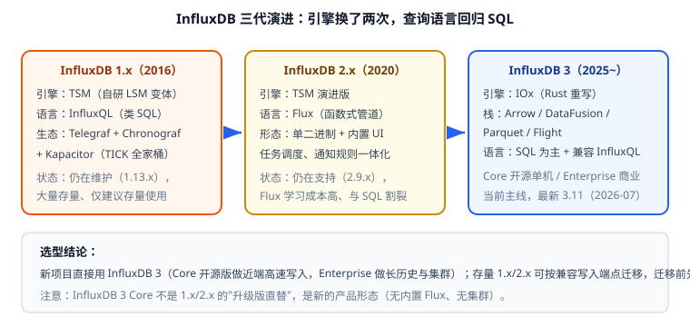

# InfluxDB 深入

InfluxDB 是目前生态最完整的时序数据库。但它**换过两次存储引擎**，1.x / 2.x / 3.x 的模型、语言、部署形态都不一样——选错版本或按旧教程操作，是最常见的踩坑来源。



## 版本状态与选择（2026-09 核对）

| 版本线 | 最新版本 | 状态 | 查询语言 | 适用建议 |
| --- | --- | --- | --- | --- |
| **3.x（Core / Enterprise）** | 3.11.4（2026-09 补丁，3.11 发布于 2026-07-30） | **当前主线**，最近两个 minor（3.10、3.11）受支持 | SQL 为主，兼容 InfluxQL | 新项目首选 |
| 3.9 及更早 | 3.9.13 | 支持已于 2026-07-30 结束 | SQL / InfluxQL | 尽快升级到 3.10+ |
| **2.x（OSS）** | 2.9.1（2026-05） | 仍在支持，官方未计划 EOL | Flux（主）/ InfluxQL | 存量项目维护；新项目不建议 |
| **1.x（OSS）** | 1.13.1（2026-08） | 仍在维护（付费客户支持） | InfluxQL | 仅存量；迁移评估优先 |

::: info 支持策略
InfluxData 对商业版（Enterprise）的公开策略是：**最近两个 minor 支持**，大版本发布后上一大版本的最后一个 minor 至少继续支持 12 个月。开源 Core 没有单独公布的策略，实践中按同一节奏理解。**生产务必固定具体镜像 tag**——`latest` 从 2026-09-15 起指向 InfluxDB 3 Core，会自动升级到 3.x，导致旧客户端不可用。
:::

### 三代差异一览

| 维度 | 1.x | 2.x | 3.x |
| --- | --- | --- | --- |
| 存储引擎 | TSM（自研） | TSM 演进版 | **IOx（Rust 重写）** |
| 底层技术栈 | 自研 | 自研 | Apache Arrow / DataFusion / Parquet / Flight |
| 查询语言 | InfluxQL | **Flux** | **SQL（DataFusion ANSI SQL）** + InfluxQL 兼容 |
| 组织单元 | database + retention policy | bucket + org | database（Core）/ 表 |
| 集群能力 | 仅商业版 | 仅商业版 | Core 无集群；Enterprise 有 |
| 默认端口 | 8086 | 8086 | 8181 |
| 内置 UI | Chronograf（独立） | 内置 | InfluxDB 3 Explorer |
| 告警 | Kapacitor（独立） | 内置任务与通知 | Enterprise / 外部（Grafana Alerting） |
| 许可证 | MIT | MIT | Core：MIT / Apache-2 双许可；Enterprise：商业 |

::: warning InfluxDB 3 Core 不是 2.x 的升级版直替
Core 是 MIT/Apache-2 双许可的**开源单机引擎**，定位是"近期数据的高速读写"（近端热数据），**不提供集群、长期历史与细粒度权限**；Enterprise 才补上长历史查询、HA、读副本、RBAC、行级删除、备份恢复。因此迁移不是"换个 jar 包"，要重新评估部署形态与功能缺口。
:::

## 安装与启动（InfluxDB 3 Core）

```shell
# Docker 方式（推荐本地验证；生产请固定具体版本 tag，不要用 latest）
docker run -d --name influxdb3 \
  -p 8181:8181 \
  -e INFLUXDB3_AUTH_TOKEN=apiv3-change-me \
  -v influxdb3-data:/var/lib/influxdb3 \
  influxdb:3.11-core
```

```shell
# 验证启动与就绪（3.10 起提供 /ready 端点）
curl -s http://localhost:8181/health
curl -s http://localhost:8181/ready
# 预期：两者均返回正常状态（2xx）
```

::: danger 三个必踩的启动坑
1. **用 `latest` 标签**：会在 2026-09-15 后被切到 3.x，2.x 客户端直接报错。生产必须写 `influxdb:2.9` 或 `influxdb:3.11-core` 这类具体 tag。
2. **忘记设 `INFLUXDB3_AUTH_TOKEN`**：开发图省事不设 token，上线时才发现没有认证；建议从第一次启动就按生产方式配。
3. **把数据卷挂在容器内未持久化路径**：容器删除后数据全丢。务必挂 `-v` 到宿主机或命名卷。
:::

## 写入：Line Protocol

InfluxDB 的写入格式是行协议（Line Protocol），格式固定：

```text
<measurement>,<tag_key>=<tag_value> <field_key>=<field_value> <timestamp>
```

```shell
# 写入示例：写入 CPU 指标（秒级时间戳）
curl -X POST "http://localhost:8181/api/v3/write_lp?db=metrics&precision=second" \
  -H "Authorization: Bearer apiv3-change-me" \
  --data-binary 'host_metrics,host=srv-01,region=cn-east cpu_usage=42.5,mem_usage=61.2 1790000000'

# 批量写入（性能关键：一次请求多行，减少 HTTP 往返）
cat > batch.lp <<'EOF'
host_metrics,host=srv-01,region=cn-east cpu_usage=43.1,mem_usage=61.4 1790000001
host_metrics,host=srv-02,region=cn-north cpu_usage=18.7,mem_usage=47.9 1790000001
EOF
curl -X POST "http://localhost:8181/api/v3/write_lp?db=metrics&precision=second" \
  -H "Authorization: Bearer apiv3-change-me" \
  --data-binary @batch.lp
```

写入要点：

| 要点 | 说明 |
| --- | --- |
| 批量 | 单请求批量 5000~10000 点（按行大小调整），吞吐可提升一个数量级 |
| 压缩 | HTTP `Content-Encoding: gzip` 可显著降低带宽 |
| 顺序 | 尽量按时间递增写入，乱序数据会降低压缩率与查询效率 |
| 类型一致性 | 同一 field 的类型由首次写入决定，后续类型不同会被拒绝 |
| 兼容端点 | 3.x 提供 `/api/v2/write`（兼容 2.x 客户端）与 `/write`（兼容 1.x） |

## 查询语言：SQL 与 Flux 的取舍

### InfluxDB 3（推荐）：SQL

```sql
-- 最近 1 小时，按 5 分钟窗口聚合各主机平均 CPU
SELECT
  date_bin(INTERVAL '5 minutes', time) AS ts,
  host,
  AVG(cpu_usage) AS avg_cpu,
  MAX(cpu_usage) AS max_cpu
FROM host_metrics
WHERE time >= now() - INTERVAL '1 hour'
  AND region = 'cn-east'
GROUP BY ts, host
ORDER BY ts DESC, host;
```

### InfluxDB 2.x：Flux

```javascript
// 等价查询（Flux）：管道式写法
from(bucket: "metrics")
  |> range(start: -1h)
  |> filter(fn: (r) => r._measurement == "host_metrics" and r.region == "cn-east")
  |> filter(fn: (r) => r._field == "cpu_usage")
  |> aggregateWindow(every: 5m, fn: mean, createEmpty: false)
  |> group(columns: ["host"])
```

::: tip Flux 还值不值得学
**新项目不必学**。InfluxDB 3 已把 SQL 作为主力查询语言，Flux 被弱化（InfluxDB 3 Explorer 1.9 甚至提供了 AI 辅助的 Flux → SQL 转换器（beta））。但存量 2.x 项目里的 Flux 任务与告警仍是"迁移必须重写"的部分，评估迁移成本时要把这块算进去。
:::

## 从 1.x / 2.x 迁移到 3.x

迁移的三条主线：**写入端点兼容、查询改写、任务与告警重建**。

| 迁移项 | 兼容程度 | 做法 |
| --- | --- | --- |
| 写入 | 高 | 3.x 提供 v1/v2 兼容写入端点，客户端库可继续用 |
| 查询 | 中 | InfluxQL 通过 v1 `/query` 兼容；**Flux 需改写为 SQL** |
| 定时任务 | 低 | 2.x 内置任务 → 3.x 用处理引擎（processing engine）触发器或外部调度 |
| 告警 | 低 | 2.x/Kapacitor 告警 → 建议改为 Grafana Alerting |
| 仪表板 | 中 | 2.x 仪表板需导出重建（Explorer 支持 InfluxQL 查询与图表） |

::: danger 迁移时必须先备份与演练
- **升级 3.10+ 会做一次性的 catalog 格式升级（v2 → v3），不可回退**：升级前必须备份 catalog。
- Enterprise 3.11 起新集群默认使用 Parquet 存储引擎，老集群用 `--upgrade-pacha-tree` 升级；变更前做全量备份。
- 迁移演练请在**独立环境**用真实数据规模跑一遍，重点验证：写入吞吐、看板查询延迟、任务与告警是否等价。
:::

## 验证方式

```shell
# 1. 探活与就绪
curl -s http://localhost:8181/health && curl -s http://localhost:8181/ready

# 2. 写入后立刻查最新值（验证写入链路）
curl -s -X POST "http://localhost:8181/api/v3/query_sql" \
  -H "Authorization: Bearer apiv3-change-me" \
  -H "Content-Type: application/json" \
  -d '{"db":"metrics","q":"SELECT host, cpu_usage, time FROM host_metrics ORDER BY time DESC LIMIT 5","format":"json"}'
# 预期：返回刚写入的 5 条数据，时间戳正确（不是 1970/55000 年）
```

```sql
-- 3. 校验聚合查询可用（窗口 + 分组）
SELECT date_bin(INTERVAL '1 minute', time) AS ts, AVG(cpu_usage) AS avg_cpu
FROM host_metrics WHERE time >= now() - INTERVAL '10 minutes' GROUP BY ts ORDER BY ts;
```

收尾确认：`/health`、`/ready` 正常；写入后查询能立即读到；时间戳单位与 `precision` 参数一致；容器使用固定版本 tag。

## 参考资料

- InfluxDB 3 文档：[Core](https://docs.influxdata.com/influxdb3/core/) / [Enterprise](https://docs.influxdata.com/influxdb3/enterprise/)
- 迁移指南：[Migrate from InfluxDB v1 or v2](https://docs.influxdata.com/influxdb3/enterprise/get-started/migrate-from-influxdb-v1-v2)
- 版本生命周期参考：[endoflife.date/influxdb](https://endoflife.date/influxdb)
- 延伸阅读：[数据模型](../DataModel/index.md) / [查询与降采样](../Query/index.md) / [TDengine 深入](../TDengine/index.md)
