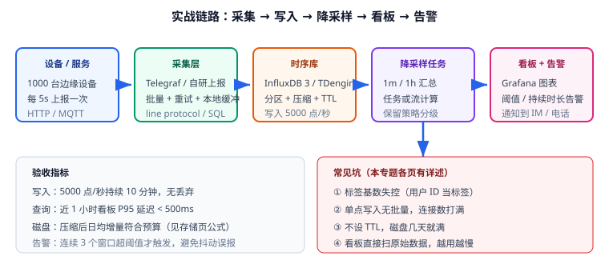

# 实战：设备监控指标平台

本文把前面所有知识串成一条可运行的链路：**采集 → 写入 → 降采样 → 看板 → 告警**。示例用 TDengine 3.x 作为存储（IoT 场景典型），InfluxDB 3 的对应写法在关键步骤给出对照。



## 需求与验收指标

业务需求：

1. 1000 台边缘设备，每 5 秒上报 6 项指标（CPU、内存、磁盘、进/出流量、温度）。
2. 运维要能按机房、按设备查看近 1 小时实时曲线。
3. 要能看近 30 天趋势（分钟级粒度）。
4. CPU 持续 5 分钟超过 90% 要告警。
5. 原始数据保留 30 天，分钟汇总保留 1 年。

验收指标（可量化，必须实测）：

| 指标 | 目标 | 验证方式 |
| --- | --- | --- |
| 写入吞吐 | 5000 点/秒持续 10 分钟无丢弃 | `taosBenchmark` 压测 + 计数比对 |
| 看板查询延迟 | 近 1 小时 P95 < 500ms | 压测脚本循环查询 |
| 30 天趋势查询 | < 2s | 查分钟汇总表 |
| 磁盘占用 | 日均增量符合容量预算 | 对比写入前后磁盘 |
| 告警准确性 | 连续 5 分钟超阈值才触发，抖动不误报 | 构造抖动数据验证 |

## 第一步：建模

```text
超级表 host_metrics
  标签：region（机房，低基数）、role（角色，低基数）
  数据列：cpu_usage、mem_usage、disk_used、net_in、net_out、temperature
  时间：ms 精度

子表：per host（由采集端自动建表）
汇总表：host_metrics_1m（1 分钟）、host_metrics_1h（1 小时）
```

设计要点：

- **不用 `device_ip` 当标签**（DHCP 会变、基数高），用 `host` 作为子表名；
- **不在标签里放时间戳或随机串**（详见[数据模型](../DataModel/index.md)）；
- 6 个指标放**同一行**（同一超表），避免一条采样拆成 6 行。

## 第二步：建库建表

```sql
-- 库：毫秒精度、原始保留 30 天、单文件 10 天
CREATE DATABASE metrics
  PRECISION 'ms'
  KEEP 30d
  DURATION 10d
  BUFFER 256
  WAL_LEVEL 1
  VGROUPS 4;

USE metrics;

-- 原始超表
CREATE STABLE host_metrics (
  ts           TIMESTAMP,
  cpu_usage    FLOAT,
  mem_usage    FLOAT,
  disk_used    FLOAT,
  net_in       BIGINT,
  net_out      BIGINT,
  temperature  FLOAT
) TAGS (
  region NCHAR(16),
  role   NCHAR(16)
);

-- 分钟汇总表（保留 1 年）
CREATE STABLE host_metrics_1m (
  ts         TIMESTAMP,
  avg_cpu    FLOAT,
  max_cpu    FLOAT,
  avg_mem    FLOAT,
  avg_disk   FLOAT,
  avg_temp   FLOAT,
  samples    INT
) TAGS (
  region NCHAR(16)
) KEEP 365d;

-- 小时汇总表（趋势用）
CREATE STABLE host_metrics_1h (
  ts         TIMESTAMP,
  avg_cpu    FLOAT,
  max_cpu    FLOAT,
  avg_mem    FLOAT,
  avg_temp   FLOAT,
  samples    INT
) TAGS (
  region NCHAR(16)
) KEEP 1095d;
```

::: warning 汇总表的标签要与查询方式匹配
汇总表通常**只保留查询会用到的分组维度**（这里是 `region`）。如果把 `host` 也留在汇总表标签里，汇总表会退化成"跟原始表一样的规模"，除了解析度降低几乎没有节省。需要按主机看趋势时，再用小时表按需聚合。
:::

## 第三步：写入（模拟采集端）

用 Shell 脚本模拟 200 台设备的批量上报（真实环境用 Telegraf 或 SDK，逻辑相同：**批量 + 重试 + 本地缓冲**）：

```bash [scripts/mock-writer.sh]
#!/usr/bin/env bash
# 模拟采集端：每 5 秒把 200 台设备的指标批量写入 TDengine（REST 方式）
set -euo pipefail

TAOS_HOST="${TAOS_HOST:-localhost}"
DB="metrics"
BATCH=200

while true; do
  NOW_MS=$(( $(date +%s) * 1000 ))
  {
    for i in $(seq 1 "$BATCH"); do
      host=$(printf 'srv-%03d' "$i")
      region=$([ $((i % 2)) -eq 0 ] && echo 'cn-east' || echo 'cn-north')
      role=$([ $((i % 3)) -eq 0 ] && echo 'web' || echo 'db')
      cpu=$(awk -v s="$i" 'BEGIN{srand(); printf "%.2f", (s%7)*10+rand()*15}')
      mem=$(awk 'BEGIN{srand(); printf "%.2f", rand()*60+20}')
      printf 'host_metrics,region=%s,role=%s cpu_usage=%s,mem_usage=%s,disk_used=33.5,net_in=102400,net_out=204800,temperature=45.1 %s\n' \
        "$region" "$role" "$cpu" "$mem" "$NOW_MS"
    done
  } | curl -sS -u root:taosdata -H 'Content-Type: text/plain' \
      --data-binary @- \
      "http://${TAOS_HOST}:6041/influxdb/v1/write?db=${DB}"

  echo "[$(date '+%H:%M:%S')] wrote ${BATCH} rows"
  sleep 5
done
```

```shell
# 运行模拟写入（本地验证用）
chmod +x scripts/mock-writer.sh
TAOS_HOST=localhost ./scripts/mock-writer.sh
# 预期：每 5 秒打印 "wrote 200 rows"，连续运行无报错
```

::: danger 写入端的三个必备能力
1. **批量**：单条一请求会把连接数与 CPU 打满，必须攒批（200~5000 行/次）。
2. **重试 + 本地缓冲**：网络抖动是常态，采集端要落本地磁盘队列，恢复后补传（注意乱序写入会降低压缩率）。
3. **时钟校验**：设备时间不准会产生未来时间戳，污染"最新值"查询，上报前校验偏差（如 >5 分钟则改用服务端时间）。
:::

## 第四步：降采样（流计算）

```sql
-- 1 分钟汇总：实时流计算，按主机分区，写入分钟汇总表
CREATE STREAM stream_host_1m INTO metrics.host_metrics_1m AS
SELECT
  _wstart          AS ts,
  AVG(cpu_usage)   AS avg_cpu,
  MAX(cpu_usage)   AS max_cpu,
  AVG(mem_usage)   AS avg_mem,
  AVG(disk_used)   AS avg_disk,
  AVG(temperature) AS avg_temp,
  COUNT(*)         AS samples
FROM metrics.host_metrics
PARTITION BY host
INTERVAL(1m);

-- 1 小时汇总：从分钟表再聚合（两级降采样，成本更低）
CREATE STREAM stream_host_1h INTO metrics.host_metrics_1h AS
SELECT
  _wstart        AS ts,
  AVG(avg_cpu)   AS avg_cpu,
  MAX(max_cpu)   AS max_cpu,
  AVG(avg_mem)   AS avg_mem,
  AVG(avg_temp)  AS avg_temp,
  SUM(samples)   AS samples
FROM metrics.host_metrics_1m
PARTITION BY region
INTERVAL(1h);

SHOW STREAMS;
```

**InfluxDB 3 对照**：用处理引擎的定时触发器把同样的聚合结果写回 `host_metrics_1m` 表；查询侧用 `date_bin()` 切窗口。核心思想完全一致：**把重计算从查询时移到写入后**。

## 第五步：看板查询

```sql
-- 看板①：近 1 小时实时曲线（直接查原始表，窗口 1 分钟）
SELECT _wstart AS ts, AVG(cpu_usage) AS avg_cpu, MAX(cpu_usage) AS max_cpu
FROM host_metrics
WHERE ts >= NOW - 1h AND region = 'cn-east'
INTERVAL(1m)
FILL(prev);

-- 看板②：近 30 天趋势（查分钟汇总表，窗口 1 小时）
SELECT _wstart AS ts, AVG(avg_cpu) AS avg_cpu
FROM host_metrics_1m
WHERE ts >= NOW - 30d
PARTITION BY region
INTERVAL(1h);

-- 看板③：当前值（LAST_ROW 比 ORDER BY LIMIT 1 快得多）
SELECT host, LAST_ROW(cpu_usage) AS cpu, LAST_ROW(ts) AS last_seen
FROM host_metrics
GROUP BY host
LIMIT 20;
```

Grafana 侧配置要点：

| 配置 | 建议 |
| --- | --- |
| 数据源 | TDengine 数据源插件（或 InfluxDB 数据源） |
| `Max data points` | 与窗口宽度联动，避免返回上万点 |
| 刷新间隔 | ≥ 30s（默认 5s 会把库压垮） |
| 时间范围变量 | 用变量切换"原始表 / 分钟表 / 小时表"作为数据源或表名 |
| 面板粒度 | 每面板只查必要字段 |

## 第六步：告警

```sql
-- 告警取数：某主机 CPU 的 1 分钟均值（连续 5 个窗口超 90 才算触发）
SELECT _wstart AS ts, host, AVG(cpu_usage) AS avg_cpu
FROM host_metrics
WHERE ts >= NOW - 10m
PARTITION BY host
INTERVAL(1m)
HAVING AVG(cpu_usage) > 90;
```

告警规则配置建议：

| 项 | 建议值 | 原因 |
| --- | --- | --- |
| 评估窗口 | 5 分钟 | 过滤单点抖动 |
| 触发条件 | 连续 3~5 个窗口超阈值 | 避免瞬时峰值误报 |
| 恢复条件 | 连续 3 个窗口低于阈值 | 避免反复抖动导致告警风暴 |
| 分组 | 按 `region` 分组抑制 | 机房级故障时合并通知 |
| 静默 | 维护窗口静默 | 发布期间不打扰 |

::: warning 告警不是"阈值越小越好"
阈值设太敏感 → 值班被淹没 → 真故障被忽略。**先用一周真实数据画出分布，取 P99 作为阈值起点**，再按误报率调整。
:::

## 验收清单

- [ ] 建库参数与设计一致（`SHOW DATABASES` 检查 `KEEP` 30d、`DURATION` 10d）。
- [ ] 模拟写入连续 10 分钟无失败，行数与理论值一致（200 行/5 秒 → 120 行/秒）。
- [ ] 两个流任务处于运行状态（`SHOW STREAMS`），分钟表与小时表有数据。
- [ ] 看板①（1 小时）P95 延迟 < 500ms，看板②（30 天）< 2s。
- [ ] 汇总数据与原始数据抽查一致（同窗口 `AVG` 差异 < 1%）。
- [ ] 告警规则在抖动数据下不触发、在持续超标时按时触发。
- [ ] 磁盘日均增量与容量预算偏差 < 30%。
- [ ] 过期策略已验证：`KEEP` 外的分区会被自动清理。

## 参考资料

- TDengine 文档：[流计算](https://docs.tdengine.com/tdengine-reference/sql-manual/stream/)、[taosBenchmark](https://docs.tdengine.com/tdengine-reference/tools/benchmark/)
- InfluxDB 3 文档：[Processing engine](https://docs.influxdata.com/influxdb3/core/)
- 相关文档：[监控告警](../../../Ops/Monitoring/index.md) / [Grafana](../../../Ops/Monitoring/Grafana/index.md) / [数据建模](../../DataModeling/index.md)
- 延伸阅读：[查询与降采样](../Query/index.md) / [存储与保留策略](../Storage/index.md)
