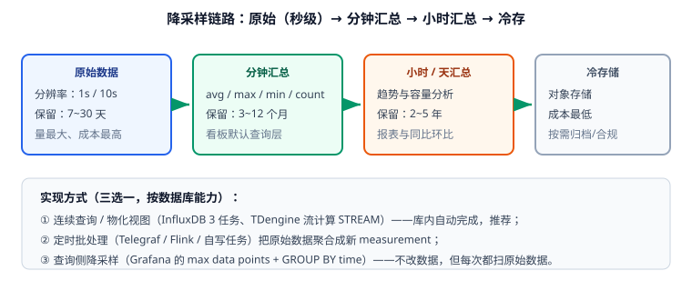

# 查询与降采样

时序查询的性能瓶颈通常不在"单条 SQL 写得快不快"，而在**一次查询要扫多少数据**。降采样（downsampling）就是让查询永远只扫"已经聚好的少量数据"。



## 三类时序查询

| 类型 | 例子 | 数据量 | 优化重点 |
| --- | --- | --- | --- |
| 最新值 | 看板"当前 CPU" | 极少 | 用 `LAST_ROW` / `last()` 之类的专用函数 |
| 趋势 | 近 1 小时曲线、近 30 天日趋势 | 大 | 时间窗口 + 降采样 + 只取必要字段 |
| 对比/排行 | 各机房 P95、Top10 主机 | 大 | 先过滤标签缩小范围，再聚合 |

## 时间窗口聚合

时间窗口聚合（time bucketing）是时序查询的核心：把时间轴切成固定宽度的桶，每桶算一次聚合。

### InfluxDB 3（SQL）

```sql
-- 每 5 分钟一个点，按主机分组
SELECT date_bin(INTERVAL '5 minutes', time) AS ts,
       host,
       AVG(cpu_usage) AS avg_cpu,
       MAX(cpu_usage) AS max_cpu,
       COUNT(*)       AS samples
FROM host_metrics
WHERE time >= now() - INTERVAL '6 hours'
  AND region = 'cn-east'
GROUP BY ts, host
ORDER BY ts DESC;
```

### TDengine（INTERVAL + PARTITION BY）

```sql
-- 每 1 分钟一个点，按机房分组
SELECT _wstart AS ts,
       AVG(cpu_usage) AS avg_cpu,
       MAX(cpu_usage) AS max_cpu,
       COUNT(*)       AS samples
FROM host_metrics
WHERE ts >= NOW - 6h
PARTITION BY region
INTERVAL(1m)
FILL(prev);      -- 缺失窗口用前值填充，避免图表断线
```

::: danger 窗口查询的四个坑
1. **窗口太细**：看板展示 30 天的曲线却按 1 分钟聚合 → 43200 个点，前端渲染与后端聚合都爆掉。**窗口宽度应 ≥ 展示宽度 × 时间跨度 / 像素数**。
2. **忘了 `FILL`**：设备掉线期间没有数据，窗口为空，图表出现断点，业务方会误判为"服务挂了"。
3. **在无索引的字段上过滤**：标签（tag）才有索引，用字段（field）做 `WHERE` 条件等价于全扫，性能会差一到两个数量级。
4. **每次查询都算 P95/去重**：这类重计算应预聚合（见下文），而不是每次实时算。
:::

## 降采样：三种实现方式

| 方式 | 做法 | 实时性 | 维护成本 | 适用 |
| --- | --- | --- | --- | --- |
| 库内连续查询 / 流计算 | InfluxDB 任务、TDengine `STREAM` | 高（秒级） | 低（库内托管） | 首选 |
| 外部批处理 | Flink / 定时任务 / Telegraf 聚合 | 中（分钟级） | 中 | 复杂逻辑、跨库聚合 |
| 查询侧降采样 | Grafana 的 max data points、`GROUP BY time` | 实时 | 无 | 兜底；每次都扫原始数据 |

### TDengine 流计算

```sql
-- 把秒级原始数据实时聚合为 1 分钟指标，并写入新超级表
CREATE STREAM stream_host_1m INTO metrics.host_metrics_1m AS
SELECT _wstart AS ts,
       AVG(cpu_usage) AS avg_cpu,
       MAX(cpu_usage) AS max_cpu,
       AVG(mem_usage) AS avg_mem
FROM metrics.host_metrics
PARTITION BY host
INTERVAL(1m);
```

### InfluxDB 3 处理引擎触发器（processing engine）

InfluxDB 3 通过处理引擎（processing engine）支持库内定时/触发计算，把结果写回目标表；1.x/2.x 时代的连续查询与 Flux 任务在 3.x 中被这套机制取代。

```sql
-- 示例：每小时把原始指标聚合成小时表（示意，具体语法以官方文档为准）
CREATE TRIGGER host_hourly
  ON metrics.host_metrics
  EVERY '1 hour'
  AS INSERT INTO metrics.host_metrics_1h
     SELECT date_bin(INTERVAL '1 hour', time) AS ts, host, AVG(cpu_usage) AS avg_cpu
     FROM metrics.host_metrics
     WHERE time >= now() - INTERVAL '2 hours'
     GROUP BY ts, host;
```

::: warning 降采样的三个实战经验
1. **保留双份数据**：原始数据（短 TTL）+ 汇总数据（长 TTL）。看板查汇总，排障查原始。
2. **聚合函数要一次算全**：不只是 `avg`——同时存 `min/max/count/sum`，否则以后想算 P95 就得回原始数据重算。
3. **流任务要能重启**：设备断网、任务失败都会造成窗口缺失，必须在任务里做**补算**（如 `WHERE time >= now() - 2h` 覆盖重叠区间）。
:::

## 看板查询优化

Grafana 是看板事实标准，性能优化的关键在**查询与展示对齐**：

```text
时间跨度 1h  → 窗口 10s~1m   → 查原始/分钟表
时间跨度 24h → 窗口 5m~15m   → 查分钟表
时间跨度 30d → 窗口 1h~6h    → 查小时表
时间跨度 1y  → 窗口 1d       → 查天表
```

| 优化项 | 做法 |
| --- | --- |
| 限制返回点数 | Grafana 数据源设置 `max data points`，与窗口宽度联动 |
| 只查必要字段 | `SELECT host, AVG(cpu)` 而不是 `SELECT *` |
| 先过滤标签 | `WHERE region = 'cn-east'` 放最前，减少扫描分区 |
| 避免高基数 `GROUP BY` | 别按 `device_id` 分组画几百条线 |
| 加缓存 | 看板查询结果缓存 30~60s（Grafana 或网关层），降低库压力 |
| 冷热分离 | 冷数据走汇总表/对象存储，热数据走原始表 |

::: danger 看板拖垮数据库是最常见的线上事故
默认配置下 Grafana 按 `refresh` 间隔自动刷新，几十块看板叠加后可能每秒几百次重查询。**上线前必须做两件事**：① 给看板设置合理刷新间隔（≥30s）；② 用降采样表承接查询，不要直连原始表。
:::

## 验证方式

```sql
-- 1. 验证窗口查询：点数应与预期一致
SELECT COUNT(*) FROM (
  SELECT date_bin(INTERVAL '5 minutes', time) AS ts FROM host_metrics
  WHERE time >= now() - INTERVAL '1 hour' GROUP BY ts
);
-- 预期：约 12（1 小时 / 5 分钟）

-- 2. 验证降采样结果与原始数据一致（抽查一个窗口）
SELECT AVG(cpu_usage) FROM host_metrics
WHERE time >= '2026-09-14T10:00:00Z' AND time < '2026-09-14T10:05:00Z';
SELECT avg_cpu FROM host_metrics_1m WHERE ts = '2026-09-14T10:00:00Z';
-- 预期：两个值应基本一致（差异来自写入延迟时需补算）
```

```shell
# 3. 看板查询延迟验证（用真实跨度压测）
for span in 1h 24h 30d; do
  time curl -s -X POST "http://localhost:8181/api/v3/query_sql" \
    -H "Authorization: Bearer apiv3-change-me" \
    -d "{\"db\":\"metrics\",\"q\":\"SELECT date_bin(INTERVAL '5 minutes', time) AS ts, AVG(cpu_usage) FROM host_metrics WHERE time >= now() - INTERVAL '$span' GROUP BY ts\"}"
done
# 预期：24h 与 30d 的查询都应落在数百毫秒级（若超过秒级，说明缺降采样表）
```

收尾确认：窗口点数与预期一致、汇总表与原始数据抽查一致、跨 30 天的看板查询延迟在可接受范围。

## 参考资料

- InfluxDB 3 文档：[Query data with SQL](https://docs.influxdata.com/influxdb3/core/query-data/sql/)
- TDengine 文档：[流计算](https://docs.tdengine.com/tdengine-reference/sql-manual/stream/)
- Grafana 文档：[Query optimization](https://grafana.com/docs/grafana/latest/datasources/influxdb/)
- 延伸阅读：[存储与保留策略](../Storage/index.md) / [实战案例](../Practice/index.md) / [监控告警](../../../Ops/Monitoring/index.md)
