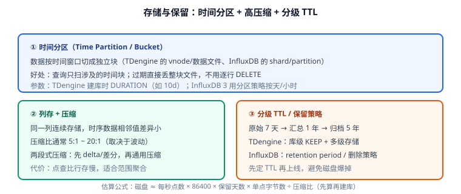

# 存储与保留策略

时序库能比关系型库便宜一个数量级，靠的是三件事：**时间分区、列存压缩、整块过期**。理解这三件事，才能把容量算准、把磁盘管住。



## 时间分区：过期不等于 DELETE

时序库把数据**按时间窗口切成独立存储块**：

| 产品 | 分区单元 | 控制参数 |
| --- | --- | --- |
| TDengine | vnode 内的数据文件 | 建库 `DURATION`（如 `10d` 表示单文件覆盖 10 天） |
| InfluxDB 3 | 分区（partition） | 按时间分区策略（天/小时级） |
| Prometheus | block | 默认 2 小时一个 block |
| TimescaleDB | chunk | `chunk_time_interval` |

好处：查询只扫命中时间范围的分区；**过期时直接删除整个分区文件**，不需要逐行 `DELETE`（后者在关系型库里可能要跑几小时并产生大量 binlog）。

::: danger 不设 TTL 就上线是最常见的翻车
时序数据的增长是线性的、可计算的，磁盘写满只是时间问题。等到写满才处理，往往要在业务高峰做紧急删数据。**建库第一天就定好 `KEEP` / 保留策略**，并把容量预算写进运维文档。
:::

## 压缩：为什么能压到 5:1~20:1

时序数据的物理特征特别适合压缩：

1. **时间戳单调递增** → 存差值（delta）后数值很小；
2. **相邻测量值变化平缓** → 二阶差分（delta-of-delta）后接近 0；
3. **同一列数据类型一致** → 列存 + 通用压缩（zstd/snappy）效率高；
4. **标签重复度极高** → 字典编码。

```text
原始需求：1000 台设备 × 每 5 秒 6 个字段
每条数据 ≈ 6 × 8 字节（double）+ 时间戳 8 字节 + 标签元数据
≈ 56~64 字节/行（行存）

列存 + 压缩后：约 3~8 字节/行（依波动幅度而定）
压缩比：约 8:1 ~ 20:1
```

::: warning 压缩比会因数据特征大幅波动
- 平稳指标（温度、内存占用）压缩比高；
- 抖动剧烈的指标（网络流量、随机数）压缩比可能只有 2:1~3:1；
- **字符串字段会显著拉低压缩率**，字段尽量用数值类型。
:::

## 分级保留（Tiered Retention）

一套典型的工业做法：

| 层级 | 数据 | 分辨率 | 保留 | 存储位置 |
| --- | --- | --- | --- | --- |
| 热 | 原始指标 | 5s / 10s | 7~30 天 | 本地 SSD |
| 温 | 分钟汇总 | 1m | 3~12 个月 | 本地 SSD/HDD |
| 冷 | 小时/天汇总 | 1h / 1d | 2~5 年 | 对象存储 / 大容量 HDD |
| 归档 | 合规留存 | 原始或日汇总 | 按合规要求 | 冷归档（低频访问） |

实现方式：

- **TDengine**：多级存储（`CREATE DATABASE ... ` 配合多级存储参数把老数据下沉），或把汇总结果写入不同库并设置不同 `KEEP`。
- **InfluxDB**：不同保留期的表/库分别承载原始与汇总数据；冷数据导出 Parquet 到对象存储。
- **通用做法**：顶层用 Grafana 的变量切换数据源（近 7 天查原始表，更早查汇总表）。

## 容量估算：先算再建库

估算公式（务必用真实数据校准）：

```text
日均原始点数 = 每秒写入点数 × 86400
单点字节数   = 字段数 × 单字段字节 + 时间戳字节 + 标签字节
日均磁盘     = 日均原始点数 × 单点字节数 ÷ 压缩比
总磁盘       ≈ 日均磁盘 × 保留天数 × 副本数 × 1.3（预留合并/索引/WAL 余量）
```

### 一个真实算例

```text
输入：
  1000 台设备，每 5 秒上报 6 个字段
  字段平均 8 字节，时间戳 8 字节，标签 16 字节
  压缩比实测 10:1（含标签开销后取保守值）

计算：
  每秒点数 = 1000 / 5 = 200 点/秒
  每点字节 = 6×8 + 8 + 16 = 72 字节
  日均原始 = 200 × 86400 = 1728 万点/天
  日均磁盘 = 1728 万 × 72 B ÷ 10 ≈ 124 MB/天
  保留 365 天 × 1 副本 × 1.3 余量 ≈ 59 GB
结论：
  单机 200GB 数据盘可覆盖一年；若开启双副本则再 ×2（≈118GB）。
```

::: tip 一定要用实测压缩比
上面的 10:1 是估算值。**上线前用 `taosBenchmark`（TDengine）或写入一批真实数据后查磁盘增量**，用实测值重算，误差可能有一倍以上。
:::

## 运维动作清单

| 动作 | 频率 | 说明 |
| --- | --- | --- |
| 检查磁盘水位 | 每天 | 超过 70% 告警；超过 85% 必须处理 |
| 检查分区/文件数量 | 每周 | 分区过小会导致文件数爆炸、元数据压力大 |
| 检查压缩比 | 每月 | 压缩比突然下降通常意味着数据特征变化（如新增字符串字段） |
| 校验降采样任务 | 每周 | 任务停摆会导致汇总表缺数据 |
| 演练恢复 | 每季度 | 备份能恢复才算备份 |
| 归档冷数据 | 按策略 | 导出 Parquet 到对象存储并清理本地 |

## 验证方式

```sql
-- 1. 确认保留策略与分区参数
SHOW DATABASES;
-- 关注 KEEP / DURATION / PRECISION；DURATION 太小会导致文件数暴涨

-- 2. 看磁盘实际增量与压缩效果（写入 10 分钟后对比）
-- TDengine：查询库占用的磁盘空间
SELECT * FROM information_schema.ins_disk_usage;
```

```shell
# 3. 压力写入后测压缩比（TDengine 容器内）
docker exec -it tdengine taos -s "SELECT SUM(data_size)/(SELECT COUNT(*) FROM host_metrics) FROM information_schema.ins_disk_usage;"
# 或用宿主机磁盘占用对比写入点数估算实际字节/点

# 4. 验证过期真的会释放空间（把 KEEP 设为 1 天，写入 2 天前数据后观察）
# 预期：过期分区被整体删除，磁盘占用回落，而不是数据仍占空间
```

收尾确认：容量预算与实测磁盘增量差异在 30% 以内、`DURATION` 与保留天数匹配、过期数据能被自动释放。

## 参考资料

- TDengine 文档：[数据库管理（KEEP / DURATION / 多级存储）](https://docs.tdengine.com/tdengine-reference/sql-manual/manage-databases/)
- InfluxDB 3 文档：[数据保留与分区](https://docs.influxdata.com/influxdb3/core/admin/)
- 延伸阅读：[查询与降采样](../Query/index.md) / [实战案例](../Practice/index.md)
