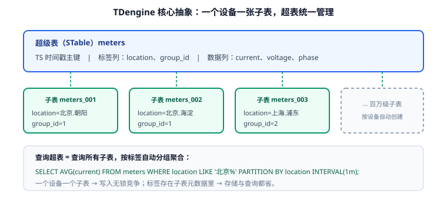

# TDengine 深入

TDengine 是国产时序数据库里物联网（IIoT）场景的代表实现。它最大的特点是把"**一个设备一张表**"做成了核心抽象（超级表 + 子表），因此写入天然分片、标签不占数据空间，单机就能扛住很高的写入速率。



## 版本状态与选择（2026-09 核对）

| 版本线 | 最新版本 | 状态 | 建议 |
| --- | --- | --- | --- |
| **3.4.1.x** | 3.4.1.9（2026-05-17） | **当前主线**（3.4 系列） | 新项目首选 |
| 3.3.x | 3.3.8.8（2025-12） / 3.3.6.x（持续补丁） | 维护中（Feature 线仍在出补丁） | 存量集群按计划升级到 3.4 |
| 2.x | —— | **仅存量**，与 3.x 不兼容 | 需联系厂商评估升级路径，不要自行原地升级 |

版本号规则（官方定义，**升级前必须搞清**）：

| 段位 | 含义 | 滚动升级 | 可回退 |
| --- | --- | --- | --- |
| Major+（第一段） | 产品重构 | ❌ 不支持 | ❌ 需联系厂商 |
| Major（第二段，如 3 → 4） | 重大新特性 | ❌ 不支持 | ❌ 不可逆 |
| Feature（第三段，如 3.3 → 3.4） | 新特性 | ❌ 不支持 | ✅ 可回退到上一 Feature |
| Maintenance（第四段，如 3.4.1.8 → 3.4.1.9） | 仅修 Bug | ✅ 支持（3 副本集群逐节点） | ✅ 可逆 |

::: danger 升级前必做两件事
1. **确认段位**：从 3.3.x 升到 3.4.x 属于 Feature 升级——**不支持滚动升级**，整个集群要停服升级；且客户端驱动（`libtaos.so`）必须与服务端同步升级。
2. **先备份**：`taosdump` 全量导出 + 验证恢复流程，再动手。**不要在生产第一次尝试跨 Feature 升级。**
:::

## 核心概念

| 概念 | 对应关系型 | 说明 |
| --- | --- | --- |
| 数据库（Database） | database | 含保留策略（`KEEP`）、分片时长（`DURATION`）、精度（`PRECISION`） |
| 超级表（STable） | 表结构模板 | 定义标签列 + 数据列，本身不存数据 |
| 子表（Table） | 分区/实例 | 每个设备一张，继承超表结构，拥有自己的标签值 |
| vnode | 分片 | 数据按子表哈希分布在 vnode 上，vnode 内按时间分文件 |
| 流计算（STREAM） | 物化视图/连续查询 | 库内降采样与实时聚合 |

## 建库与建表

```sql
-- 1. 建库：保留 365 天、单文件 10 天、毫秒精度
CREATE DATABASE metrics
  PRECISION 'ms'
  KEEP 365d
  DURATION 10d
  BUFFER 256
  WAL_LEVEL 1
  VGROUPS 4;

-- 2. 建超级表：标签列在前（TAGS 段），数据列在后
CREATE STABLE host_metrics (
  ts            TIMESTAMP,
  cpu_usage     FLOAT,
  mem_usage     FLOAT,
  disk_used     DOUBLE,
  net_in_bytes  BIGINT,
  net_out_bytes BIGINT
) TAGS (
  region NCHAR(16),
  role   NCHAR(16)
);

-- 3. 每台主机建子表（实践里由采集端"自动建表"完成，无需手写）
CREATE TABLE host_metrics_srv01 USING host_metrics TAGS ('cn-east', 'web');
CREATE TABLE host_metrics_srv02 USING host_metrics TAGS ('cn-north', 'db');
```

建库参数怎么定：

| 参数 | 作用 | 取值建议 |
| --- | --- | --- |
| `PRECISION` | 时间戳精度 | 秒级场景用 `'s'`，工业采集常用 `'ms'`，别滥用 `'ns'` |
| `KEEP` | 数据保留时长 | 按业务与磁盘预算定；也可用多级存储把冷数据下沉 |
| `DURATION` | 单个数据文件覆盖的时间跨度 | 常用 10d；太大则过期删除粒度粗、单文件大 |
| `BUFFER` | 写入缓存（MB） | 高吞吐场景调大（如 256~1024） |
| `WAL_LEVEL` | WAL 级别（1 写 WAL、2 写副本） | 单副本用 1；有副本要求用 2 |
| `VGROUPS` | vnode 数量 | 影响并发与扩展性，集群按节点数规划 |

::: warning 建库参数改起来比你想的贵
`KEEP`、`DURATION` 可以改（`ALTER DATABASE`），但**改动只对新写入的数据分区生效**，历史分区仍按老参数保存，会出现"同一库两种分区粒度"的情况。**第一次建库就要把 TTL 与磁盘预算算清楚**（公式见[存储与保留策略](../Storage/index.md)）。
:::

## 写入

### SQL 写入

```sql
-- 单行
INSERT INTO host_metrics_srv01 VALUES (1790000000000, 42.5, 61.2, 33.5, 102400, 204800);

-- 批量（同一子表多行）
INSERT INTO host_metrics_srv01 VALUES
  (1790000001000, 43.1, 61.4, 33.6, 103400, 205600)
  (1790000002000, 41.8, 61.1, 33.6, 104100, 206300);

-- 一次写入多张子表（推荐：减少网络往返）
INSERT INTO host_metrics_srv02 VALUES (1790000001000, 18.7, 47.9, 12.1, 51200, 76800)
           host_metrics_srv01 VALUES (1790000003000, 44.0, 61.5, 33.7, 105000, 207100);
```

### 无模式写入（Schemaless，采集端最常用）

```shell
# 行协议方式写入：字段需与超表列名对应
curl -u root:taosdata -d 'host_metrics,region=cn-east,role=web cpu_usage=42.5,mem_usage=61.2 1790000000000' \
  -H 'Content-Type: text/plain' \
  'http://localhost:6041/influxdb/v1/write?db=metrics'
```

要点：

1. **批量写**：单次写入尽量多行（几千行级别），或使用参数绑定（STMT2）写入。
2. **多子表合并写**：一次 INSERT 覆盖多张子表，能显著提升吞吐。
3. **连接方式**：原生连接（6030）性能最好；REST/WebSocket（6041，经 taosAdapter）便于跨网络与容器化。
4. **客户端与服务端版本必须一致（大版本内）**，Feature 升级时同步升级驱动。

## 查询

### 基础与窗口聚合

```sql
-- 最近 1 小时各主机平均 CPU
SELECT AVG(cpu_usage) FROM host_metrics WHERE ts >= NOW - 1h GROUP BY host;

-- 按 5 分钟窗口、按机房分组（窗口 + 标签分组用 PARTITION BY）
SELECT _wstart AS ts, AVG(cpu_usage) AS avg_cpu, MAX(cpu_usage) AS max_cpu
FROM host_metrics
WHERE ts >= NOW - 1h
PARTITION BY region
INTERVAL(5m);

-- 每台主机最后一条数据（last_row 是高频用法，性能远优于 ORDER BY LIMIT 1）
SELECT LAST_ROW(cpu_usage), LAST_ROW(ts) FROM host_metrics GROUP BY host;
```

::: tip 窗口 + 标签分组用 `PARTITION BY`，不是 `GROUP BY`
TDengine 里 `INTERVAL` 负责**切时间窗口**，`PARTITION BY` 负责**按标签分组**；两者可以组合。`GROUP BY` 用于按表达式/列聚合，适合不带窗口的场景。写错不会报错但结果不符合预期——这是从 SQL 转过来最容易混淆的一处。
:::

| 能力 | 语法 | 适用场景 |
| --- | --- | --- |
| 时间窗口 | `INTERVAL(5m)` | 指标趋势、报表 |
| 状态窗口 | `STATE_WINDOW(status)` | 设备状态持续时长统计 |
| 会话窗口 | `SESSION(ts, 30s)` | 会话/行程切分 |
| 事件窗口 | `EVENT_WINDOW(start, end)` | 异常片段提取 |
| 最新值 | `LAST_ROW()` / `FIRST()` | 看板"当前值" |
| 插值填充 | `FILL(linear)` / `FILL(prev)` | 补齐缺失点，避免图表断线 |

### 流计算（降采样）

```sql
-- 创建流：把原始数据实时聚合成 1 分钟指标
CREATE STREAM stream_host_1m
  INTO metrics.host_metrics_1m AS
SELECT
  _wstart AS ts,
  AVG(cpu_usage) AS avg_cpu,
  MAX(cpu_usage) AS max_cpu,
  AVG(mem_usage) AS avg_mem
FROM metrics.host_metrics
PARTITION BY host
INTERVAL(1m);

-- 查看流状态
SHOW STREAMS;
```

## 运维常用命令

```sql
SHOW DATABASES;                          -- 库列表与参数
SHOW STABLES;                            -- 超级表列表
DESCRIBE host_metrics;                    -- 超表结构（标签 + 数据列）
SHOW TABLE TAGS FROM host_metrics;        -- 所有子表标签（排查异常标签）
SHOW VGROUPS;                             -- 分片与节点分布
SHOW DNODES;                              -- 集群节点状态
SELECT * FROM information_schema.ins_tables WHERE stable_name='host_metrics';  -- 子表数量
```

## 验证方式

```shell
# 1. 客户端连接（容器内）
docker exec -it tdengine taos -h localhost -s "SHOW DATABASES;"
# 预期：输出信息库与自建库列表

# 2. REST 写入 → 查询闭环
curl -u root:taosdata -d 'host_metrics,region=cn-east,role=web cpu_usage=42.5 1790000000000' \
  -H 'Content-Type: text/plain' \
  'http://localhost:6041/influxdb/v1/write?db=metrics'

curl -u root:taosdata -d 'SELECT COUNT(*), AVG(cpu_usage) FROM host_metrics' \
  'http://localhost:6041/rest/sql/metrics'
# 预期：返回 1 行统计，COUNT >= 1
```

```sql
-- 3. 窗口聚合与最新值验证
SELECT _wstart, AVG(cpu_usage) FROM host_metrics INTERVAL(1m);
SELECT LAST_ROW(cpu_usage) FROM host_metrics GROUP BY host;
-- 预期：窗口结果行数 = 覆盖的时间窗口数；LAST_ROW 每台主机一行
```

收尾确认：库/超表参数与设计一致、写入后能查询到、`INTERVAL` 与 `LAST_ROW` 均返回预期结果。

## 参考资料

- TDengine 官方文档：[docs.tdengine.com](https://docs.tdengine.com/)
- 版本规则与发布历史：[Engine Release History](https://docs.tdengine.com/release-history/engine/)
- 延伸阅读：[数据模型](../DataModel/index.md) / [查询与降采样](../Query/index.md) / [常见问题](../FAQ/index.md)
