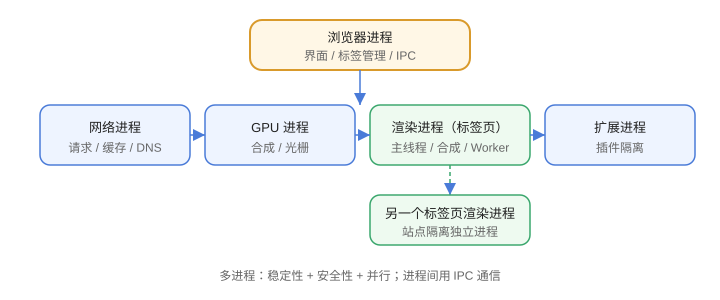

# 浏览器架构

现代浏览器（Chrome、Edge 等）采用**多进程架构**：不同的职责跑在不同进程，互相隔离。一个页面卡死不会拖垮整个浏览器，这也是“标签页崩溃”只影响单个页面的原因。



## 主要进程

| 进程 | 职责 |
| --- | --- |
| 浏览器进程（Browser） | 界面、地址栏、标签管理、跨进程通信 |
| 渲染进程（Renderer） | 每个标签页一个：HTML/CSS/JS、布局绘制 |
| GPU 进程 | 合成、位图绘制、CSS 3D 加速 |
| 网络进程（Network） | 网络请求、缓存、DNS |
| 插件/扩展进程 | 插件隔离运行 |

## 渲染进程内部线程

一个渲染进程内有多个线程：

| 线程 | 职责 |
| --- | --- |
| 主线程 | 解析、布局、绘制、执行 JS |
| 合成线程 | 合成图层、滚动、动画 |
| 光栅线程 | 把图层转成位图 |
| 工作线程 | Web Worker（独立 JS 环境） |

## 站点隔离（Site Isolation）

同一站点（origin）的页面共享一个渲染进程；不同站点隔离到不同进程，防止恶意页面读取其他站点的内存数据。

## 为什么多进程

1. **稳定性**：渲染进程崩溃不影响浏览器主界面。
2. **安全性**：进程级隔离 + 沙箱。
3. **性能**：GPU 进程分担渲染，标签页并行。

代价：内存占用更高（每个进程独立内存）。

## 进程间通信（IPC）

```text
浏览器进程 ⇄ 渲染进程 ⇄ 网络进程 ⇄ GPU 进程
            通过 IPC 消息通信
```

例如：渲染进程要发请求 → 经浏览器/网络进程 → 响应再回传。

## 易错点

::: danger 常见错误
1. 以为 JS 和渲染在同一个线程就是“卡顿唯一原因”：其实布局、绘制也占用主线程。
2. 忽略进程隔离：内存占用高是特性，不是 bug，但要避免无意义的多开。
3. 在渲染进程做重计算：阻塞主线程 → 卡顿，用 Web Worker。
4. 长任务不拆分：主线程一次执行超过 50ms 就会卡顿（Long Task）。
5. 不了解站点隔离：`<iframe>` 跨源会单独进程，通信要用 postMessage。
:::

## 验证方式

1. Chrome 打开 `chrome://process-internals` 或任务管理器查看进程数量。
2. 打开多个不同站点标签页，观察进程是否按站点隔离。
3. 在 DevTools Performance 里录制，查看主线程任务耗时。

## 参考资料

- Chrome 多进程架构：https://www.chromium.org/developers/design-documents/multi-process-architecture/
- 浏览器渲染进程（Inside look at modern web browser）：https://developer.chrome.com/blog/inside-browser-part2/
- Site Isolation：https://www.chromium.org/Home/chromium-security/site-isolation/
