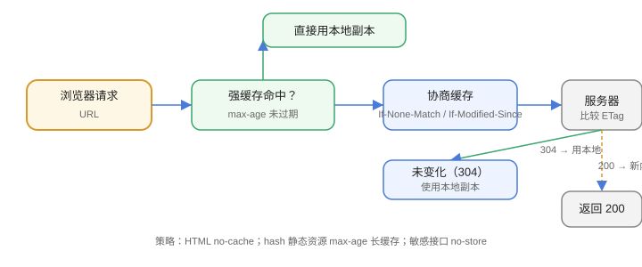

# HTTP 缓存

缓存是前端性能的第一杠杆：一次强缓存命中省掉的不只是一个请求，还有 DNS、TLS、TTFB 和整条渲染链路。这一页讲清**浏览器侧 HTTP 缓存**的判定顺序、请求头与响应头、以及三类资源各自的参数配方。

本页只讲**浏览器 HTTP 缓存**；用 JS 显式管理缓存的 `Cache API` / `Service Worker` 见 [浏览器存储](../Storage/index.md)。代理层（Nginx/CDN）的缓存是另一套机制，见 [Nginx 缓存配置](../../../../Ops/Nginx/Cache/index.md)。



## 两类缓存：强缓存与协商缓存

浏览器检查缓存时**先强后协商**，顺序不可颠倒：

| 类型 | 判据 | 是否发请求 | 命中后 | 典型响应头 |
| --- | --- | --- | --- | --- |
| **强缓存** | `Cache-Control: max-age` / `Expires` 未过期 | **不发**（也可能不发到网络，直接读内存/磁盘缓存） | 200（from cache） | `Cache-Control`、`Expires` |
| **协商缓存** | 强缓存过期，带上验证头去问服务器 | 发（但服务器可能只回 304，**无响应体**） | 200 或 304 | `ETag` / `If-None-Match`、`Last-Modified` / `If-Modified-Since` |

::: tip 用 DevTools 一眼看穿
Network 面板看 Size 列：`(memory cache)` / `(disk cache)` 是**强缓存**命中，请求根本没发出去；`304 Not Modified` 是**协商缓存**命中，请求发了但没传响应体。若两列都是实际字节数，说明完全没命中。
:::

## `Cache-Control` 指令表

`Cache-Control` 是唯一需要记住的响应头（`Expires` 是 HTTP/1.0 遗留，同一响应里 `Cache-Control` 优先）：

| 指令 | 作用 | 什么时候用 |
| --- | --- | --- |
| `max-age=N` | 相对当前时间 N 秒内强缓存有效 | 静态资源的主力 |
| `s-maxage=N` | 只对**共享缓存**（CDN / 代理）生效，覆盖 `max-age` | 想让 CDN 缓存更久、但浏览器缓存更短时 |
| `no-cache` | **可以缓存，但每次必须回源校验**（等价于「总是走协商缓存」） | HTML 入口文件 |
| `no-store` | **完全不许缓存**（不写内存、不写磁盘） | 含个人敏感信息的接口 |
| `private` | 只允许浏览器私有缓存，共享缓存不得存 | 登录后的页面 |
| `public` | 允许共享缓存（默认行为，写出来是为了和 `private` 对照） | CDN 上的静态资源 |
| `must-revalidate` | 过期后**不得**用陈旧副本，必须回源 | 强一致要求的资源 |
| `immutable` | 在 `max-age` 内**连协商都不做**（刷新页面也直接用本地） | 带内容 hash 的文件名 |
| `stale-while-revalidate=N` | 过期后先返回旧的，同时后台异步刷新 | 容忍短暂陈旧的列表页 |

::: danger `no-cache` 不是「不缓存」
最常见的误读。**`no-cache` = 缓存但每次校验**，**`no-store` = 不缓存**。把 `no-store` 当 `no-cache` 用会白白丢掉 304 带来的性能收益；把 `no-cache` 当 `no-store` 用则会让敏感数据留在磁盘上。
:::

## `ETag` 与 `Last-Modified`

协商缓存靠一对头部，二选一或都带，**`ETag` 优先**：

| 头部 | 由谁生成 | 精度 | 缺点 |
| --- | --- | --- | --- |
| `Last-Modified` | 文件修改时间 | 秒级 | ① 秒内多次修改看不出来；② 内容改回原样仍算「已修改」；③ 时间格式/时区容易写错 |
| `ETag` | 内容的指纹（弱校验常为长度+时间，强校验为 hash） | 内容级 | 多集群部署时若各自生成，同一文件得到不同 ETag → 缓存反复失效 |

```http
# 服务端返回（首次）
HTTP/1.1 200 OK
Cache-Control: no-cache
ETag: "a1b2c3"
Last-Modified: Wed, 01 Oct 2026 08:00:00 GMT

# 浏览器下次带上（协商）
GET /index.html HTTP/1.1
If-None-Match: "a1b2c3"
If-Modified-Since: Wed, 01 Oct 2026 08:00:00 GMT

# 未变化
HTTP/1.1 304 Not Modified
ETag: "a1b2c3"
```

::: warning 反向代理 / CDN 后面要特别小心 ETag
Nginx 默认对上游响应**原样转发** ETag；但一旦在代理层做了 gzip 压缩，同一资源的 ETag 若由上游按未压缩内容生成，就可能出现「内容不同、ETag 相同」。交给 CDN 处理时，优先用内容 hash 命名的文件名（`app.9f3c1a.js`）而不是依赖 ETag 判断新鲜度。
:::

## 三类资源的三套配方

缓存策略不是「一刀切」，按**文件名是否随内容变化**分三类：

| 资源类型 | 文件名带 hash？ | 建议响应头 | 理由 |
| --- | --- | --- | --- |
| HTML 入口 | 否 | `Cache-Control: no-cache`（或 `max-age=0, must-revalidate`） | 入口一变就要能立刻生效；靠 304 省流量 |
| JS / CSS / 字体 / 图片 | **是**（`app.9f3c1a.js`） | `Cache-Control: public, max-age=31536000, immutable` | 内容变则文件名变，旧文件永不复用，可以放心缓存一年 |
| 接口数据 | — | 用户相关：`private, no-cache`；公开且稳定：`public, max-age=60` | 默认走 `no-store` 的代价是每次都全量传输 |

```text
# 发布流程的关键：新 HTML 引用新 hash 文件
index.html  → app.9f3c1a.js   （HTML 不缓存 → 读者立刻拿到新引用）
app.9f3c1a.js                 （一年强缓存 → 不重复下载）
app.0d7e42.js                 （旧文件保留一段时间，避免老页面 404）
```

## `Vary`：别让缓存投毒

只要响应内容随**请求头**变化（语言、压缩方式、UA），就必须声明 `Vary`，否则中间缓存会把 A 的响应喂给 B：

```http
Vary: Accept-Encoding, Accept-Language
```

::: danger 两条纪律
① **`Vary: *` 等于禁用缓存**——没有缓存能匹配，直接退化成每次都回源；
② **不要 `Vary: User-Agent`**——UA 组合近乎无限，缓存命中率会崩到接近 0。要做移动端适配，用 `Vary: Accept-Language` 加响应式设计，而不是按 UA 分缓存。
:::

## 易错点

::: danger 高频翻车点
1. **给 HTML 加了长缓存**：`max-age=31536000` 配在 `index.html` 上，结果发布后读者半年看不到新版本（经典事故）。
2. **`no-cache` / `no-store` 混用**：把敏感接口写成 `no-cache`，数据仍会落盘。
3. **强缓存过期时间取「当前时间 + N」而不是「响应生成时间 + N」**：多次代理传输会无限延长有效期。
4. **改了文件名却复用旧 URL**：`app.js` 内容变了但名字没变，强缓存期内所有人拿到旧的（这也是要上 hash 的原因）。
5. **只设 `Last-Modified` 不设 `ETag`**：秒内修改探测不到，快速迭代时出现「明明改了却还是 304」。
6. **用 `Ctrl+F5` 验证就以为对了**：强制刷新会绕过缓存，看到的是「无缓存」的表现，不能证明正常访问时的行为。
7. **忘了 `Vary: Accept-Encoding`**：CDN 上先缓存了未压缩版本，后续所有请求都拿不到 gzip。
:::

## 验证方式

```shell
# ① 看强缓存参数（响应头里是否有 max-age / immutable）
curl -sI https://example.com/assets/app.9f3c1a.js | grep -i 'cache-control\|etag\|vary'

# ② 走一次协商缓存：带上 ETag，期望 304 且无响应体
ETAG=$(curl -sI https://example.com/index.html | grep -i '^etag:' | tr -d '\r' | cut -d' ' -f2)
curl -s -o /dev/null -w '%{http_code} %{size_download}\n' -H "If-None-Match: $ETAG" https://example.com/index.html
# 期望：304 0

# ③ HTML 不应被强缓存：期望出现 no-cache（或 max-age=0）
curl -sI https://example.com/index.html | grep -i 'cache-control'
```

浏览器侧核对：DevTools → Network → 勾选 **Disable cache 之前**先刷新一次（让资源落盘），再普通刷新看 Size 列是否出现 `(disk cache)`；对 HTML 与带 hash 的 JS **分别**验证，两者表现应当不同。

## 参考资料

- MDN：HTTP 缓存 —— https://developer.mozilla.org/zh-CN/docs/Web/HTTP/Caching
- RFC 9111（HTTP Caching，现行标准）—— https://www.rfc-editor.org/rfc/rfc9111.html
- web.dev：缓存最佳实践（含 hash 命名的取舍）—— https://web.dev/articles/http-cache
- [浏览器存储](../Storage/index.md)：`Cache API` 与 Service Worker 的显式缓存
- [性能指标](../Performance/index.md)：LCP 与缓存命中率的关系
- [Nginx 缓存配置](../../../../Ops/Nginx/Cache/index.md)：代理层缓存（另一套机制）
- [PWA 与离线应用 · 缓存策略](../../../PWA/CachingStrategy/index.md)：**分工是**——本页讲**浏览器与 HTTP 协议自己决定的那一层缓存**（`Cache-Control` / `ETag` / 强缓存与协商缓存，刷新行为由浏览器规范定义），该页讲**你用 Service Worker 显式接管的第二层缓存**（预缓存与运行时缓存、五种策略、离线回退）。两者的判据也不一样：本页看 `Size` 列是否出现 `(disk cache)`，该页看是否出现 `(ServiceWorker)`。**一个常见误判**：勾上 DevTools 的 Disable cache 只影响本页这一层，**不会**绕过 Service Worker——要真正绕过必须勾 Application 里的 Bypass for network。
