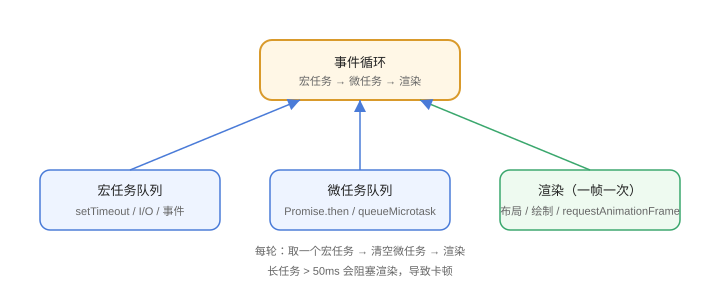

# 事件循环

浏览器用**事件循环（Event Loop）**调度任务：同步代码、宏任务、微任务、渲染按固定节奏执行。理解它才能解释 `setTimeout` 为什么不准时、Promise 为什么先执行。



## 任务类型

| 类型 | 示例 | 执行时机 |
| --- | --- | --- |
| 同步代码 | 普通语句 | 立即 |
| 宏任务（Task） | setTimeout、setInterval、I/O、事件回调 | 每轮一个 |
| 微任务（Microtask） | Promise.then、queueMicrotask | 宏任务结束后清空 |
| 渲染（Render） | 布局、绘制 | 帧节奏执行 |

## 执行顺序

```text
1. 执行当前宏任务（同步代码）
2. 清空微任务队列（直到为空）
3. 渲染更新（浏览器决定时机）
4. 取下一个宏任务
```

```javascript
console.log("1");                          // 同步
setTimeout(() => console.log("2"), 0);     // 宏任务
Promise.resolve().then(() => console.log("3")); // 微任务
// 输出：1 3 2
```

## 渲染时机

浏览器通常**一帧（16.7ms）执行一次渲染**，且渲染前会先清空微任务。`requestAnimationFrame` 在渲染前执行，适合动画：

```javascript
requestAnimationFrame(() => {
  el.style.transform = "translateX(100px)";
});
```

## 长任务与卡顿

单个宏任务执行超过 **50ms** 就是 Long Task，会阻塞渲染：

```text
主线程忙 → 渲染被推迟 → 卡顿
```

解决：拆任务（`setTimeout` 分批）、`requestIdleCallback` 低优先级、Web Worker 重计算。

## async/await 与微任务

```javascript
async function f() {
  console.log("a");
  await Promise.resolve();   // 后续代码进入微任务
  console.log("b");
}
f();
console.log("c");
// 输出：a c b
```

## 易错点

::: danger 常见错误
1. `setTimeout(0)` 不是“立即”：排在宏任务队列，晚于微任务。
2. 微任务里再排微任务：可能无限循环阻塞页面。
3. 长循环占满主线程：动画/点击全部卡死，拆分任务。
4. 以为 `requestAnimationFrame` 是节流替代品：它跟随帧率，适合动画不适合精确节流。
5. 忽略渲染时机：连续改样式浏览器会合并，但读布局属性会打断合并。
:::

## 验证方式

1. 运行上面的代码块，对照输出顺序。
2. Performance 面板查看 Long Task 与帧率。
3. 写一个 1 亿次循环，观察页面卡顿与恢复。

## 参考资料

- 事件循环（MDN）：https://developer.mozilla.org/zh-CN/docs/Web/JavaScript/Event_loop
- 渲染进程中的事件循环：https://developer.chrome.com/blog/inside-browser-part3/
- Long Tasks API：https://web.dev/articles/long-tasks-devtools
