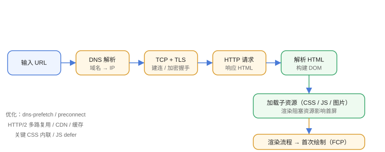

# URL 到渲染

从输入 URL 到页面显示，浏览器经历：**DNS → TCP → TLS → HTTP 请求/响应 → 解析 → 渲染**。理解这条链路，才能定位“慢在哪一步”。



## 完整流程

```text
1. 输入 URL
2. DNS 解析域名 → IP
3. 建立 TCP 连接（三次握手）
4. HTTPS：TLS 握手（四次/1.3 一次往返）
5. 发送 HTTP 请求
6. 服务器响应（HTML）
7. 浏览器解析 HTML → 构建 DOM
8. 加载子资源（CSS、JS、图片）
9. 执行渲染流程
10. 首次绘制完成
```

## 关键步骤详解

### DNS

```text
浏览器缓存 → 系统缓存 → 本地 hosts → 递归 DNS → 权威 DNS
```

优化：减少域名数量、开启预解析（`dns-prefetch` / `preconnect`）。

### TCP / TLS

1. TCP 三次握手建立连接。
2. HTTPS 需要 TLS 握手协商密钥。
3. HTTP/2 多路复用减少连接数；HTTP/3（QUIC）基于 UDP，握手更快。

### HTTP 请求与响应

```shell
curl -v https://example.com
```

关注：状态码、响应头（Cache-Control、Content-Type）、资源大小。

## 关键路径资源

页面首屏取决于关键路径资源：

1. HTML（必须首先拿到）。
2. CSS：渲染阻塞资源（Render-Blocking）。
3. JS：默认解析器阻塞（Parser-Blocking），`defer` / `async` 可调整。
4. 图片/字体：非阻塞，但影响 LCP。

## 优化方向

| 阶段 | 手段 |
| --- | --- |
| DNS | dns-prefetch、preconnect |
| TCP/TLS | HTTP/2、HTTP/3、减少握手 |
| 请求 | 缓存、CDN、压缩 |
| 解析 | 精简 HTML、内联关键 CSS |
| 渲染 | 减少阻塞脚本、懒加载 |

## 易错点

::: danger 常见错误
1. 把“后端响应慢”和“浏览器渲染慢”混为一谈：先看 DevTools Network 分段。
2. 忽略渲染阻塞资源：CSS/JS 不优化，HTML 再快首屏也慢。
3. 一个页面几十个域名请求：DNS 查询多，收敛域名或 preconnect。
4. 不用 HTTP/2：多请求串行等待，开启后多路复用。
5. 只看 TTFB 不看整体：TTFB 快但 LCP 慢，问题在资源加载。
:::

## 验证方式

1. DevTools → Network 面板，开启“Slow 4G”模拟，观察各阶段耗时。
2. 用 Lighthouse 看 TTFB、FCP、LCP 分解。
3. `curl -w` 输出 DNS/TCP/TLS/请求各阶段耗时。

## 相关专题

- [网络编程专题](../../../../Backend/NetworkProgramming/index.md)：TCP 握手、HTTP/HTTPS 与 Socket
- [TCP 与 UDP 详解](../../../../Backend/NetworkProgramming/TCPUDP/index.md)：导航请求底层的可靠传输

## 参考资料

- 关键路径（Web Fundamentals）：https://web.dev/articles/critical-rendering-path
- 导航流程（Inside look at modern web browser）：https://developer.chrome.com/blog/inside-browser-part1/
- HTTP/3 说明：https://developer.chrome.com/blog/http3-roughly-half-the-time-to-first-byte/
