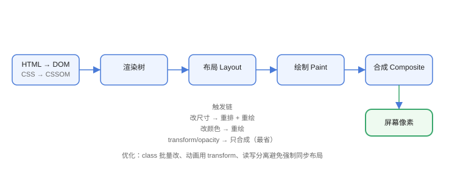

# 渲染流程

浏览器把 HTML/CSS 变成像素的流水线：**DOM → CSSOM → 渲染树 → 布局 → 绘制 → 合成**。性能优化的核心就是减少这条链路上的浪费。



## 渲染管线

```text
HTML → DOM
CSS  → CSSOM
DOM + CSSOM → 渲染树（Render Tree）
渲染树 → 布局（Layout）：计算几何位置
布局 → 绘制（Paint）：生成绘制指令
绘制 → 合成（Composite）：GPU 合成图层 → 屏幕
```

## 各阶段说明

| 阶段 | 做什么 | 性能影响 |
| --- | --- | --- |
| 解析 | HTML/CSS → 树 | 阻塞脚本影响 |
| 布局 | 计算尺寸位置 | 元素结构变化触发 |
| 绘制 | 生成位图 | 颜色/阴影变化触发 |
| 合成 | GPU 合成图层 | 最便宜（transform/opacity） |

## 重排（Reflow）与重绘（Repaint）

| 操作 | 触发 | 成本 |
| --- | --- | --- |
| 重排 | 改尺寸、位置、增删元素 | 高（重新布局整棵子树） |
| 重绘 | 改颜色、背景、可见性 | 中（重新绘制，不重新布局） |
| 合成 | transform / opacity 动画 | 低（GPU 合成） |

```javascript
// 触发重排
el.style.width = "100px";
el.offsetHeight;          // 强制同步布局（读布局属性）

// 只触发合成（推荐动画方式）
el.style.transform = "translateX(100px)";
```

## 减少重排重绘

1. 批量修改样式（class 切换）。
2. 动画用 `transform` / `opacity`。
3. 读写分离：避免“读-写-读-写”强制同步布局。
4. 使用 `content-visibility`、`contain` 隔离。
5. 文档片段批量 DOM 操作。

## 图层（Layer）

合成以图层为单位：

```css
.animated {
  transform: translateZ(0);   /* 提升为独立图层 */
  will-change: transform;     /* 提示浏览器 */
}
```

图层过多也消耗内存，只在动画元素上使用。

## 易错点

::: danger 常见错误
1. 动画改 `left/top` 而不是 `transform`：每帧触发重排，掉帧。
2. 循环里读 `offsetHeight`：强制同步布局（Layout Thrashing）。
3. 动画元素叠加 `will-change` 不清理：内存占用上升。
4. 大列表整体渲染：用虚拟列表/分批渲染。
5. 忽略 `contain`：元素变化影响整页布局。
:::

## 验证方式

1. DevTools → Rendering → 勾选“Paint flashing / Layout Shift”，直观看到重绘区域。
2. Performance 面板录制，查看 Layout/Paint/Composite 阶段耗时。
3. 用 `transform` 与 `left` 各写一个动画对比帧率。

## 参考资料

- 渲染树构建（Critical Rendering Path）：https://web.dev/articles/critical-rendering-path/render-tree-construction
- 渲染性能优化：https://web.dev/learn/performance/rendering
- 强制同步布局说明：https://web.dev/articles/avoid-large-complex-layouts-and-layout-thrash
