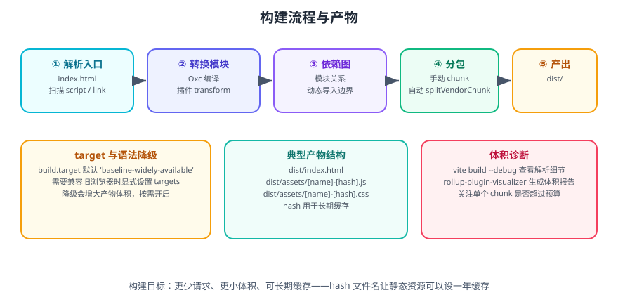

# Vite 构建优化

Vite 的默认构建已经相当优化，但真实项目总会遇到「产物太大、首屏太慢、缓存命中率低」的问题。本页给出**可落地、可验证**的优化手段与判断顺序。

一句话理解：**构建优化就是三件事——少加载（分包与懒加载）、加载得更快（压缩与 CDN）、改一处不重下（稳定 hash）**。

## 1. 先测量，再优化



```shell
# 1. 查看构建耗时与解析细节
vite build --debug

# 2. 生成体积可视化报告
npm install -D rollup-plugin-visualizer
```

```ts [vite.config.ts]
import { defineConfig } from 'vite'
import { visualizer } from 'rollup-plugin-visualizer'

export default defineConfig({
  plugins: [
    visualizer({
      filename: 'stats.html',   // 构建后自动打开该文件
      gzipSize: true,           // 同时统计 gzip 后体积
      brotliSize: true,
      template: 'treemap',      // treemap / sunburst / network
    }),
  ],
})
```

```shell
npm run build
# 打开 stats.html，按体积排序，找出「大块头」
```

| 指标 | 关注点 |
| --- | --- |
| 入口 chunk 体积 | 首屏必须加载的代码量，最影响 LCP |
| 单个 chunk 最大体积 | 是否有某个库异常巨大 |
| gzip / brotli 后体积 | 实际网络传输量 |
| 重复依赖 | 同一个库被打进多个 chunk |

::: tip 判断顺序
1. 先看 **入口 chunk** 是否过大——这是首屏的硬成本。
2. 再看 **是否有应该懒加载的大模块**（图表库、富文本编辑器、地图）。
3. 最后看 **是否有重复打包**的依赖。
:::

## 2. 分包（Code Splitting）

### 2.1 路由级懒加载

最高收益、最低成本的手段。以 Vue Router 为例：

```ts [src/router/index.ts]
import { createRouter, createWebHistory } from 'vue-router'

const router = createRouter({
  history: createWebHistory(import.meta.env.BASE_URL),
  routes: [
    {
      path: '/',
      component: () => import('@/views/Home.vue'),   // 懒加载
    },
    {
      path: '/dashboard',
      // 给 chunk 命名，便于在构建报告中定位
      component: () => import('@/views/Dashboard.vue').then((m) => m.default),
    },
  ],
})

export default router
```

React 对应 `React.lazy` + `Suspense`：

```tsx [src/App.tsx]
import { lazy, Suspense } from 'react'

const Dashboard = lazy(() => import('./views/Dashboard'))

export default function App() {
  return (
    <Suspense fallback={<div>loading...</div>}>
      <Dashboard />
    </Suspense>
  )
}
```

### 2.2 手动分包（manualChunks）

```ts [vite.config.ts]
export default defineConfig({
  build: {
    rollupOptions: {
      output: {
        manualChunks(id) {
          if (!id.includes('node_modules')) {
            return
          }
          // 按库分组，便于长期缓存
          if (id.includes('vue') || id.includes('pinia') || id.includes('vue-router')) {
            return 'vendor-vue'
          }
          if (id.includes('echarts')) {
            return 'vendor-echarts'
          }
          if (id.includes('element-plus') || id.includes('naive-ui')) {
            return 'vendor-ui'
          }
          return 'vendor-misc'
        },
      },
    },
  },
})
```

| 分包策略 | 收益 | 风险 |
| --- | --- | --- |
| 按框架核心分包 | 框架很少变，缓存收益最大 | 几乎无 |
| 按重型库分包（图表/编辑器） | 可配合懒加载，避免首屏加载 | 拆太细会增加请求数 |
| 按业务域分包 | 多页面应用下命中率好 | 需要维护映射规则 |

::: danger 注意
1. **不要为「分包而分包」**：HTTP/2 下每个请求仍有开销，把 100 KB 拆成 20 个 5 KB 的文件通常更慢。
2. **`manualChunks` 用函数时要保证返回稳定**：同一个模块在不同构建中必须落到同一个 chunk，否则 hash 会漂移，缓存全部失效。
3. **循环依赖会导致 vendor 和业务 chunk 相互依赖**，出现警告并失去缓存收益。看到 `Circular dependency` 警告要认真处理。
:::

## 3. 精简依赖

```shell
# 查找体积大的依赖
npx vite-bundle-visualizer
```

| 问题 | 处理 |
| --- | --- |
| 整库引入（如 `import _ from 'lodash'`） | 改为按需：`import debounce from 'lodash/debounce'` |
| 引入了 Node 版构件（如 ESM/CJS 双版本都进包） | 检查 `resolve.conditions`，必要时排除 |
| 依赖带大量无用代码 | 换更轻的替代品（`dayjs` 替代 `moment`、`klona` 替代 `lodash.clonedeep`） |
| 图标全量引入 | 用按需插件或 SVG Sprite |
| 语言包全量引入（如 ECharts 的 locale） | 只 import 需要的 locale |

```ts [vite.config.ts]
export default defineConfig({
  build: {
    rollupOptions: {
      // 明确声明外部依赖（库项目用，应用通常不需要）
      external: [],
    },
  },
  optimizeDeps: {
    // 强制预构建，避免开发期重复请求
    include: ['lodash-es', 'echarts/core'],
  },
})
```

## 4. 压缩与资源处理

```ts [vite.config.ts]
export default defineConfig({
  build: {
    minify: 'esbuild',        // 默认，速度快
    // minify: 'terser',      // 压缩率更高但慢很多，需安装 terser
    cssMinify: 'lightningcss', // Vite 8 起 lightningcss 为常规依赖，CSS 压缩开箱更优
    assetsInlineLimit: 4096,   // 小于 4 KB 内联为 base64
    reportCompressedSize: false, // 大项目可关闭，显著加快构建
  },
})
```

### 4.1 预压缩产物（配合服务端 gzip_static）

```shell
npm install -D vite-plugin-compression
```

```ts [vite.config.ts]
import viteCompression from 'vite-plugin-compression'

export default defineConfig({
  plugins: [
    viteCompression({ algorithm: 'gzip', threshold: 10240 }),
    viteCompression({ algorithm: 'brotliCompress', ext: '.br', threshold: 10240 }),
  ],
})
```

```nginx [nginx.conf]
# 优先返回预压缩文件，避免每次请求实时压缩
gzip_static on;
brotli_static on;
```

::: tip 关键取舍
| 方案 | 优点 | 缺点 |
| --- | --- | --- |
| 服务端实时压缩 | 无需额外产物 | 消耗 CPU，首次响应慢 |
| 构建期预压缩 | 零运行时开销 | 产物体积翻倍（每份都有 .gz/.br） |
| CDN 自动压缩 | 无需配置 | 依赖 CDN 能力 |
中大型项目推荐**预压缩 + CDN**；小项目用服务端实时压缩即可。
:::

### 4.2 图片与字体

```ts [vite.config.ts]
export default defineConfig({
  build: {
    // 不要把大图内联
    assetsInlineLimit: (filePath) => {
      // PNG 大图一律不内联
      if (filePath.endsWith('.png')) {
        return false
      }
      return undefined // 其它走默认规则（4 KB）
    },
  },
})
```

图片优先转 WebP/AVIF，字体用 `woff2` 并做子集化。资源优化的完整方法见 [前端性能优化 · 资源优化](../../../../Others/PerformanceOptimization/Resources/index.md)。

## 5. 缓存策略

目标：**业务代码变更时，用户不需要重新下载第三方库。**

```ts [vite.config.ts]
export default defineConfig({
  build: {
    rollupOptions: {
      output: {
        // 带 hash，内容变则文件名变
        entryFileNames: 'assets/[name]-[hash].js',
        chunkFileNames: 'assets/[name]-[hash].js',
        assetFileNames: 'assets/[name]-[hash][extname]',
      },
    },
  },
})
```

```nginx [nginx.conf]
# 带 hash 的资源可长期缓存
location /assets/ {
    expires 1y;
    add_header Cache-Control "public, immutable";
}
# index.html 绝不能长期缓存，否则用户拿到旧版本引用
location = /index.html {
    add_header Cache-Control "no-cache";
}
```

::: danger 注意
**`index.html` 必须不缓存或短缓存。** 它是 html 引用带 hash 资源的入口；一旦 `index.html` 被长期缓存，用户会一直加载旧版本引用的旧资源，出现「改了内容用户看不到」。

判断缓存是否健康的方法：连续两次构建，若业务代码未改，`vendor-*` 文件名应与上次完全一致。
:::

## 6. 浏览器目标与兼容

```ts [vite.config.ts]
export default defineConfig({
  build: {
    // 默认面向「广泛可用的现代浏览器」基线
    target: 'baseline-widely-available',
    // 需要兼容更旧环境时显式指定
    // target: ['es2015', 'chrome64', 'firefox78', 'safari12'],
  },
})
```

如果需要支持 IE 或很旧的移动端内核：

```shell
npm install -D @vitejs/plugin-legacy terser
```

```ts [vite.config.ts]
import legacy from '@vitejs/plugin-legacy'

export default defineConfig({
  plugins: [
    legacy({
      targets: ['defaults', 'not IE 11'],
      modernPolyfills: true,
    }),
  ],
})
```

::: danger 注意
`@vitejs/plugin-legacy` 会**同时产出两套产物**（modern + legacy），产物体积大幅增加，且必须使用 `terser`（esbuild 不支持 legacy 所需的降级）。**只在业务确实需要时才开启**，并评估是否值得用一套更简单的实现替代。
:::

## 7. 构建性能

| 手段 | 效果 | 代价 |
| --- | --- | --- |
| `build.reportCompressedSize: false` | 大项目构建明显变快 | 终端不再显示 gzip 体积 |
| 缩小 `transform` 范围（插件层面） | 减少重复工作 | 需要改插件 |
| 关闭不必要的 sourcemap | 减少 IO 与体积 | 线上排障变难 |
| 升级到 Vite 8（Rolldown） | 大型项目构建时间显著下降 | 需要处理迁移 |
| 减少 `manualChunks` 规则复杂度 | 降低打包阶段开销 | — |

```shell
# 测量构建各阶段耗时
vite build --debug 2>&1 | grep -i "transform\|render\|bundle"
```

## 8. 完整示例：优化后的构建配置

```ts [vite.config.ts]
import { fileURLToPath, URL } from 'node:url'
import { defineConfig } from 'vite'
import vue from '@vitejs/plugin-vue'
import { visualizer } from 'rollup-plugin-visualizer'

const ANALYZE = process.env.ANALYZE === 'true'

export default defineConfig({
  base: '/',

  plugins: [
    vue(),
    // 只在需要时生成体积报告，避免每次构建都写文件
    ...(ANALYZE
      ? [visualizer({ filename: 'stats.html', gzipSize: true, brotliSize: true })]
      : []),
  ],

  resolve: {
    alias: {
      '@': fileURLToPath(new URL('./src', import.meta.url)),
    },
  },

  build: {
    target: 'baseline-widely-available',
    sourcemap: false,
    reportCompressedSize: false,
    chunkSizeWarningLimit: 800,
    assetsInlineLimit: 4096,
    rollupOptions: {
      output: {
        manualChunks(id) {
          if (!id.includes('node_modules')) {
            return
          }
          if (/[\\/]node_modules[\\/](vue|vue-router|pinia)[\\/]/.test(id)) {
            return 'vendor-vue'
          }
          if (id.includes('echarts')) {
            return 'vendor-echarts'
          }
          return 'vendor-misc'
        },
        entryFileNames: 'assets/[name]-[hash].js',
        chunkFileNames: 'assets/[name]-[hash].js',
        assetFileNames: 'assets/[name]-[hash][extname]',
      },
    },
  },
})
```

```shell
# 普通构建
npm run build

# 带体积分析
ANALYZE=true npm run build
# 打开 stats.html 查看

# 本地验证产物
npm run preview
```

**验证方式**：

1. 构建无警告，`dist/assets` 下能看到 `vendor-vue-*.js` 与若干业务 chunk。
2. 打开 `stats.html`，`vendor-echarts` 与其他大库不在入口 chunk 内。
3. 连续构建两次，未改代码，`vendor-vue` 的 hash 保持一致。
4. `npm run preview` 后首屏正常，Network 面板中入口 JS 的传输体积符合预算。

::: tip 体积预算建议
给入口 chunk 设一个硬预算并写进 CI（例如 gzip 后不超过 200 KB）。**没有预算的体积优化会反复回退**——这是长期维持性能的唯一可靠办法。参考 [前端性能优化 · 监控与性能预算](../../../../Others/PerformanceOptimization/Monitoring/index.md)。
:::

## 9. 参考资料

- [Vite 官方文档：构建生产环境](https://vite.dev/guide/build)
- [Vite 配置参考：build 选项](https://vite.dev/config/build-options)
- [Vite 8 发布公告](https://vite.dev/blog/announcing-vite8)
- [rollup-plugin-visualizer](https://github.com/btd/rollup-plugin-visualizer)
- [vite-plugin-compression](https://github.com/vbenjs/vite-plugin-compression)
- [@vitejs/plugin-legacy](https://github.com/vitejs/vite/tree/main/packages/plugin-legacy)
