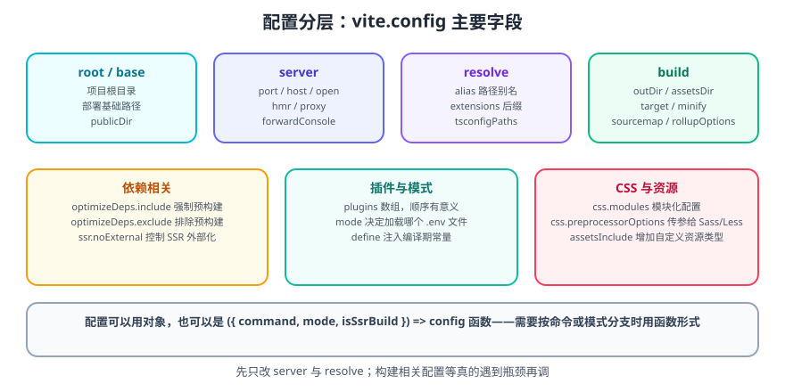
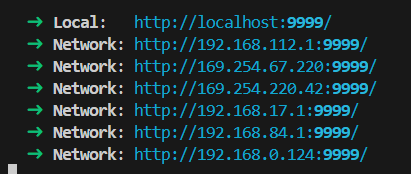

# Vite 配置详解

Vite 的配置文件默认是项目根目录下的 `vite.config.ts`（也支持 `.js`、`.mjs`、`.mts`、`.cts`）。以命令行方式运行 `vite` 时会自动读取它。

一句话理解：**Vite 的配置大部分可以「不配」**——默认值已经适配现代项目。真正需要改的通常只有 `server`（本地调试）、`resolve.alias`（路径别名）和 `base`（部署路径）。

## 1. 配置文件的两种形态



```ts [vite.config.ts]
import { defineConfig } from 'vite'
import vue from '@vitejs/plugin-vue'

// 形态一：直接导出配置对象
export default defineConfig({
  plugins: [vue()],
  server: {
    port: 9999,
    open: true,
  },
})
```

```ts [vite.config.ts]
import { defineConfig, loadEnv } from 'vite'
import vue from '@vitejs/plugin-vue'

// 形态二：导出函数，可按 command / mode 分支
export default defineConfig(({ command, mode, isSsrBuild }) => {
  // command: 'serve'（dev）或 'build'
  // mode: 'development' / 'production' / 自定义
  const isDev = command === 'serve'

  return {
    plugins: [vue()],
    define: {
      __MODE__: JSON.stringify(mode),
    },
    build: {
      sourcemap: !isDev,
    },
  }
})
```

::: tip 什么时候用函数形态
需要**按命令或模式产生不同配置**时（例如生产才开 sourcemap、开发才配代理）。如果配置是静态的，用对象形态更直观——能让 Vite 更早完成配置解析，也能被其它工具静态读取。
:::

## 2. 常用配置总览

| 分类 | 字段 | 说明 | 常用度 |
| --- | --- | --- | --- |
| 基础 | `root` | 项目根目录（`index.html` 所在处） | 低 |
| 基础 | `base` | 部署时的公共基础路径 | **高** |
| 基础 | `publicDir` | 静态资源目录，默认 `public` | 低 |
| 基础 | `mode` | 当前模式，决定加载哪个 `.env` | 中 |
| 基础 | `define` | 注入编译期常量 | 中 |
| 基础 | `envPrefix` | 客户端可见的环境变量前缀，默认 `VITE_` | 低 |
| 服务器 | `server.port` | 开发服务器端口 | **高** |
| 服务器 | `server.host` | 监听地址 | **高** |
| 服务器 | `server.open` | 启动后自动打开浏览器 | 中 |
| 服务器 | `server.hmr` | HMR 连接配置 | 中 |
| 服务器 | `server.proxy` | 开发期接口代理（解决跨域） | **高** |
| 服务器 | `server.forwardConsole` | 浏览器 console 转发到终端（Vite 8） | 低 |
| 解析 | `resolve.alias` | 路径别名 | **高** |
| 解析 | `resolve.extensions` | 省略后缀的解析顺序 | 低 |
| 解析 | `resolve.tsconfigPaths` | 读取 tsconfig 的 paths（Vite 8） | 中 |
| 构建 | `build.outDir` | 产物目录，默认 `dist` | 中 |
| 构建 | `build.assetsDir` | 产物中静态资源子目录，默认 `assets` | 低 |
| 构建 | `build.target` | 目标运行环境/浏览器 | **高** |
| 构建 | `build.sourcemap` | 是否生成 sourcemap | 中 |
| 构建 | `build.minify` | 压缩器（默认使用内置压缩） | 中 |
| 构建 | `build.rollupOptions` | 透传给打包器的选项（分包、多入口） | **高** |
| 构建 | `build.chunkSizeWarningLimit` | chunk 体积告警阈值（KB） | 低 |
| 优化 | `optimizeDeps.include` | 强制预构建的依赖 | 中 |
| 优化 | `optimizeDeps.exclude` | 排除预构建的依赖 | 中 |
| 插件 | `plugins` | 插件数组，**顺序有意义** | **高** |
| CSS | `css.preprocessorOptions` | 传给 Sass/Less 的参数 | 中 |
| CSS | `css.modules` | CSS Modules 行为 | 低 |
| 资源 | `assetsInclude` | 额外纳入构建处理的文件类型 | 低 |
| 日志 | `logLevel` | `info` / `warn` / `error` / `silent` | 低 |
| Devtools | `devtools` | 启用 Vite Devtools（Vite 8） | 低 |

## 3. 开发服务器配置

### 3.1 端口号

使用 `server.port` 指定端口。

- **类型**：`number`
- **默认值**：`5173`

```ts [vite.config.ts]
import { defineConfig } from 'vite'
import vue from '@vitejs/plugin-vue'

export default defineConfig({
  plugins: [vue()],
  server: {
    port: 9999,
  },
})
```

::: danger 注意
**端口被占用时 Vite 会自动顺延到下一个可用端口**，所以终端打印的地址可能不是 9999。需要严格固定端口就加 `strictPort: true`，此时端口冲突会直接报错。
:::

### 3.2 自动打开浏览器

使用 `server.open` 在服务器启动时自动打开浏览器。值为字符串时会被当作 URL 路径。

- **类型**：`boolean | string`

```ts [vite.config.ts]
import { defineConfig } from 'vite'
import vue from '@vitejs/plugin-vue'

export default defineConfig({
  plugins: [vue()],
  server: {
    port: 9999,
    open: true,
  },
})
```

也可以用环境变量指定浏览器：`process.env.BROWSER`（如 `firefox`）与 `process.env.BROWSER_ARGS`（如 `--incognito`），二者都可以写在 `.env` 文件里。

### 3.3 监听地址（IP）

使用 `server.host` 指定监听地址。设为 `0.0.0.0` 或 `true` 会监听所有地址，包括局域网与公网。

- **类型**：`string | boolean`
- **默认**：`'localhost'`

```ts [vite.config.ts]
import { defineConfig } from 'vite'
import vue from '@vitejs/plugin-vue'

export default defineConfig({
  plugins: [vue()],
  server: {
    port: 9999,
    open: true,
    host: '0.0.0.0',
  },
})
```

也可以用 CLI：`vite --host` 或 `vite --host 0.0.0.0`。



### 3.4 HMR 连接

使用 `server.hmr` 禁用或配置 HMR 连接（用于 HMR WebSocket 必须使用不同 HTTP 地址的场景，如反向代理后）。

- **类型**：`boolean | { protocol?: string, host?: string, port?: number, path?: string, timeout?: number, overlay?: boolean, clientPort?: number, server?: Server }`

```ts [vite.config.ts]
import { defineConfig } from 'vite'
import vue from '@vitejs/plugin-vue'

export default defineConfig({
  plugins: [vue()],
  server: {
    port: 9999,
    open: true,
    host: '0.0.0.0',
    hmr: true,
  },
})
```

::: warning 说明
放在 Nginx 或容器端口映射后面时，HMR 常因 `clientPort` 不匹配而失效，表现为「改了代码浏览器不更新，控制台反复重连」。此时按实际对外端口配置：

```ts
export default defineConfig({
  server: {
    hmr: {
      clientPort: 443,     // 浏览器实际访问的端口
      protocol: 'wss',     // 若经 HTTPS 代理
    },
  },
})
```
:::

### 3.5 接口代理（解决开发期跨域）

```ts [vite.config.ts]
export default defineConfig({
  server: {
    proxy: {
      // 字符串简写：等价于 { target: '...', changeOrigin: true }
      '/api': 'http://localhost:8080',

      // 完整写法
      '/user': {
        target: 'https://user.example.com',
        changeOrigin: true,
        rewrite: (path) => path.replace(/^\/user/, ''),
      },
    },
  },
})
```

| 选项 | 说明 |
| --- | --- |
| `target` | 目标地址 |
| `changeOrigin` | 修改请求头的 `Host` 为目标域名，服务端按域名分流时必需 |
| `rewrite` | 重写路径，去掉本地前缀 |
| `secure` | 目标为 HTTPS 且证书自签时设为 `false` |
| `ws` | 代理 WebSocket |
| `configure` | 拿到 `http-proxy` 实例做更细的控制 |

::: danger 注意
**开发期代理只在 `vite dev` 生效**，生产环境必须由网关或后端处理跨域（CORS）。不要以为配了 proxy 就解决了生产跨域问题——常见事故是「本地好好的，上线全跨域报错」。
:::

## 4. 路径别名 @

使用 `resolve.alias` 配置别名。因为 `path` 是 Node 内置模块而 Node 不认识 TS，需要安装类型声明：

```shell
npm install -D @types/node
```

```ts [vite.config.ts]
import { defineConfig } from 'vite'
import vue from '@vitejs/plugin-vue'
import { fileURLToPath, URL } from 'node:url'

export default defineConfig({
  plugins: [vue()],
  resolve: {
    alias: {
      // ESM 配置文件中没有 __dirname，用 import.meta.url 推导
      '@': fileURLToPath(new URL('./src', import.meta.url)),
    },
  },
})
```

::: warning 说明
老教程里常用 `resolve(__dirname, 'src')`。在 **ESM 配置文件**（`"type": "module"` 或 `.mts`）中 `__dirname` 不存在，会报 `__dirname is not defined`。两种修法：

```ts
// 修法一（推荐）：用 import.meta.url
import { fileURLToPath, URL } from 'node:url'
'@': fileURLToPath(new URL('./src', import.meta.url))

// 修法二：在当前文件内重建 __dirname
import { dirname } from 'node:path'
import { fileURLToPath } from 'node:url'
const __dirname = dirname(fileURLToPath(import.meta.url))
```
:::

### 4.1 同步 TypeScript 的 paths

**Vite 的别名只影响打包，不影响 IDE 与 `tsc` 的类型检查**，因此还需要在 `tsconfig.json` 中声明同名映射：

```json [tsconfig.json]
{
  "compilerOptions": {
    "baseUrl": ".",
    "paths": {
      "@/*": ["src/*"]
    }
  }
}
```

**Vite 8 起**可直接让 Vite 读取 tsconfig 的映射，避免两处维护不一致：

```ts [vite.config.ts]
export default defineConfig({
  resolve: {
    tsconfigPaths: true, // 读取 tsconfig.json 的 compilerOptions.paths
  },
})
```

::: tip 提示
`resolve.tsconfigPaths` 有少量性能开销且默认关闭。如果你已经手工维护 `alias`，不需要开启；如果是 monorepo 且有大量别名，开启它更省事。
:::

### 4.2 让 TS 认识 .vue 模块

若 TS 报「找不到模块 `./App.vue`」，在 `src/vite-env.d.ts` 中补声明：

```ts [src/vite-env.d.ts]
/// <reference types="vite/client" />

declare module '*.vue' {
  import type { DefineComponent } from 'vue'
  const component: DefineComponent<{}, {}, any>
  export default component
}
```

## 5. 构建配置

```ts [vite.config.ts]
import { defineConfig } from 'vite'

export default defineConfig({
  build: {
    outDir: 'dist',                 // 产物目录
    assetsDir: 'assets',            // 静态资源子目录
    assetsInlineLimit: 4096,        // 小于 4 KB 的资源内联为 base64
    cssCodeSplit: true,             // 按入口拆分 CSS
    sourcemap: false,               // 生产默认关闭
    minify: 'esbuild',              // 或 'terser'（更慢但压缩更狠）
    target: 'baseline-widely-available', // 默认目标基线
    chunkSizeWarningLimit: 500,     // 单 chunk 体积告警阈值（KB）
    rollupOptions: {
      output: {
        // 手动分包：把第三方库单独抽出，提升缓存命中率
        manualChunks: {
          'vendor-vue': ['vue', 'vue-router', 'pinia'],
          'vendor-utils': ['axios', 'dayjs'],
        },
        // 产物文件命名规则
        chunkFileNames: 'assets/[name]-[hash].js',
        entryFileNames: 'assets/[name]-[hash].js',
        assetFileNames: 'assets/[name]-[hash][extname]',
      },
    },
  },
})
```

::: warning 说明
`manualChunks` 的收益来自**缓存稳定性**：把很少变动的第三方库拆到独立 chunk 后，业务代码变更不会让用户重新下载整个 vendor。但如果拆得过细，反而增加请求数。**先看构建报告的体积构成，再决定拆哪些。**
:::

## 6. 按模式区分配置

```ts [vite.config.ts]
import { defineConfig, loadEnv } from 'vite'
import vue from '@vitejs/plugin-vue'

export default defineConfig(({ mode }) => {
  const env = loadEnv(mode, process.cwd(), '')

  return {
    plugins: [vue()],
    base: env.VITE_PUBLIC_PATH || '/',
    server: {
      port: Number(env.VITE_SERVER_PORT) || 5173,
      open: env.VITE_AUTO_OPEN === 'true',
      proxy: {
        '/api': {
          target: env.VITE_BASE_URL || 'http://localhost:8080',
          changeOrigin: true,
        },
      },
    },
    build: {
      outDir: env.VITE_OUTPUT_DIR || 'dist',
      sourcemap: mode !== 'production',
    },
  }
})
```

环境变量如何定义与使用见 [Vite 环境变量与模式](../EnvVariables/index.md)。

## 7. 完整示例：可直接复用的配置

```ts [vite.config.ts]
import { fileURLToPath, URL } from 'node:url'
import { defineConfig, loadEnv } from 'vite'
import vue from '@vitejs/plugin-vue'

export default defineConfig(({ command, mode }) => {
  const isBuild = command === 'build'
  const env = loadEnv(mode, process.cwd(), 'VITE_')

  return {
    base: env.VITE_PUBLIC_PATH || '/',

    plugins: [vue()],

    resolve: {
      alias: {
        '@': fileURLToPath(new URL('./src', import.meta.url)),
      },
    },

    server: {
      port: Number(env.VITE_SERVER_PORT || 5173),
      open: env.VITE_AUTO_OPEN === 'true',
      host: true,
      proxy: {
        '/api': {
          target: env.VITE_BASE_URL || 'http://localhost:8080',
          changeOrigin: true,
          rewrite: (p) => p.replace(/^\/api/, ''),
        },
      },
    },

    build: {
      outDir: env.VITE_OUTPUT_DIR || 'dist',
      chunkSizeWarningLimit: 800,
      sourcemap: isBuild && mode !== 'production',
      rollupOptions: {
        output: {
          manualChunks: {
            vue: ['vue', 'vue-router', 'pinia'],
          },
        },
      },
    },

    // 打包时移除 console / debugger（由环境变量控制）
    esbuild: {
      drop: env.VITE_DROP_CONSOLE === 'true' ? ['console', 'debugger'] : [],
    },
  }
})
```

**验证方式**：

```shell
npm run dev
# 终端应打印 Local 与 Network 两个地址；访问 http://<内网IP>:5173/ 可从手机打开
npm run build
# 无报错；dist/assets 下的文件名带 hash；vendor chunk 单独存在
npm run preview
# 访问 http://localhost:4173/ 页面正常；修改任意业务文件后重新 build，vue chunk 的 hash 保持不变
```

## 8. 参考资料

- [Vite 配置参考](https://vite.dev/config/)
- [Vite 配置：共享选项](https://vite.dev/config/shared-options)
- [Vite 配置：服务器选项](https://vite.dev/config/server-options)
- [Vite 配置：构建选项](https://vite.dev/config/build-options)
- [Vite 配置：依赖优化选项](https://vite.dev/config/dep-optimization-options)
- [Vite 8 发布公告](https://vite.dev/blog/announcing-vite8)
