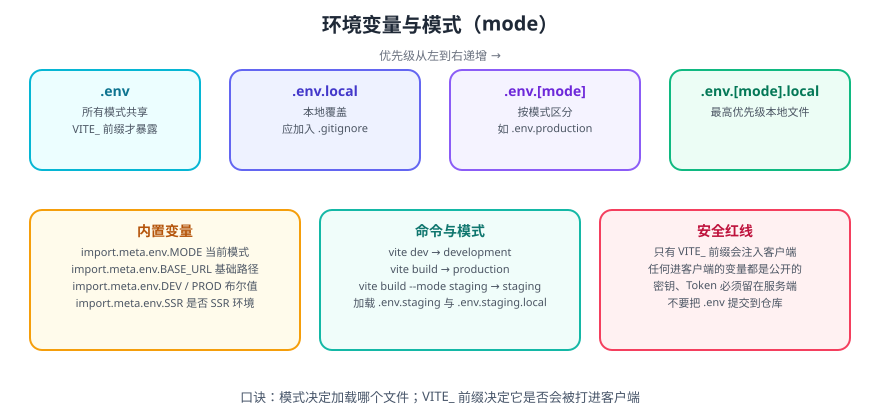

# Vite 环境变量与模式

Vite 用 `.env` 文件管理环境变量，用 **mode（模式）** 决定加载哪些文件。这两套机制组合起来，就能实现「不同环境用不同接口地址、不同开关」而无需改代码。

一句话理解：**模式决定加载哪个 `.env` 文件；`VITE_` 前缀决定这个变量能不能进客户端。**

## 1. 模式（mode）

| 命令 | 默认 mode |
| --- | --- |
| `vite dev` / `vite` | `development` |
| `vite build` | `production` |
| `vite preview` | `production` |
| `vite build --mode staging` | `staging` |

```shell
# 指定模式构建
vite build --mode staging

# 也可以在配置函数里读取 mode
```

```ts [vite.config.ts]
import { defineConfig } from 'vite'

export default defineConfig(({ mode }) => {
  console.log('当前模式:', mode)
  return {
    define: {
      __APP_MODE__: JSON.stringify(mode),
    },
  }
})
```

## 2. .env 文件与加载优先级



Vite 会按以下顺序加载（**后者覆盖前者**）：

| 文件 | 说明 |
| --- | --- |
| `.env` | 所有模式共享 |
| `.env.local` | 所有模式共享的本地覆盖（应加入 `.gitignore`） |
| `.env.[mode]` | 仅指定模式，如 `.env.production` |
| `.env.[mode].local` | 指定模式的本地覆盖（应加入 `.gitignore`） |

```text [.env]
# 所有环境共享（必须以 VITE_ 开头才会暴露给客户端）

# 应用标题
VITE_APP_TITLE='Vite App'

# 打包输出目录
VITE_OUTPUT_DIR='dist'

# 资源基础路径
VITE_PUBLIC_PATH='/'

# API 接口地址
VITE_BASE_API='/api'

# 接口代理地址
VITE_BASE_URL='https://example.com'

# 超时时间（毫秒）
VITE_REQUEST_TIMEOUT='10000'

# 是否移除 console
VITE_DROP_CONSOLE='true'

# 是否自动打开浏览器
VITE_AUTO_OPEN='false'

# 开发服务器端口
VITE_SERVER_PORT='5173'
```

```text [.env.production]
VITE_BASE_URL='https://api.example.com'
VITE_DROP_CONSOLE='true'
VITE_AUTO_OPEN='false'
```

```text [.env.development]
VITE_BASE_URL='http://localhost:8080'
VITE_DROP_CONSOLE='false'
VITE_AUTO_OPEN='true'
```

```text [.gitignore]
# 本地覆盖文件不要提交
.env.local
.env.*.local
```

::: danger 注意
1. **只有 `VITE_` 前缀的变量会被注入客户端代码**。其它变量只在 `vite.config.ts` 里可用（通过 `loadEnv`），不会出现在浏览器里。
2. **任何进入客户端的变量都是公开的**。打开浏览器 DevTools 就能看到打包后的值，因此**密钥、Token、数据库密码绝对不能放 `VITE_` 变量**。
3. **`.env.local` 与 `.env.*.local` 必须加入 `.gitignore`**。
4. **修改 `.env` 后需要重启开发服务器**，Vite 不会热更新环境变量本身。
:::

## 3. 客户端读取

```ts
// 内置变量
import.meta.env.MODE        // 当前模式：'development' / 'production' / 自定义
import.meta.env.BASE_URL    // 基础路径（由 base 配置决定）
import.meta.env.DEV         // 是否开发模式（boolean）
import.meta.env.PROD        // 是否生产模式（boolean）
import.meta.env.SSR         // 是否运行在 SSR 环境（boolean）

// 自定义变量（必须有 VITE_ 前缀）
import.meta.env.VITE_APP_TITLE
import.meta.env.VITE_BASE_API
```

```ts [src/main.ts]
console.log(import.meta.env.MODE)          // 'development'
console.log(import.meta.env.VITE_APP_TITLE) // 'Vite App'
```

::: warning 说明
`import.meta.env` 的替换发生在**构建期**，不是运行时。也就是说 `import.meta.env.VITE_BASE_API` 会被**静态替换**为字面量字符串。因此：

- **不能用动态键访问**：`import.meta.env[key]` 不会被替换，会得到 `undefined`。
- **不存在「运行时改环境变量」**：想做到这一点需要后端下发配置，再用 `fetch` 加载。
:::

## 4. TypeScript 类型声明

为保证环境变量的类型安全，在 `src/vite-env.d.ts`（或 `types/vite-env.d.ts`）中声明：

```ts [types/vite-env.d.ts]
/** 原生读取出的环境变量类型 */
interface ImportMetaEnv {
  /** 应用默认标题 */
  VITE_APP_TITLE: string
  /** 后端接口公共路径 */
  VITE_BASE_API: string
  /** 后端接口代理地址 */
  VITE_BASE_URL: string
  /** 指定打包文件的输出目录 */
  VITE_OUTPUT_DIR: string
  /** 部署应用包时的基本 URL */
  VITE_PUBLIC_PATH: string
  /** 路由模式 */
  VITE_ROUTER_MODE: 'hash' | 'history'

  /** 开发服务器的监听端口 */
  VITE_SERVER_PORT: string
  /** 打包后移除所有的 console、debugger */
  VITE_DROP_CONSOLE: string
  /** 请求超时时间 单位秒 */
  VITE_REQUEST_TIMEOUT: string
  /** 是否自动打开浏览器 */
  VITE_AUTO_OPEN: string
  /** 是否开启路由加载时的顶部进度条 */
  VITE_ROUTER_NPROGRESS: string
  /** 是否开启请求接口时的顶部进度条 */
  VITE_REQUEST_NPROGRESS: string
  /** 打包后是否移除所有的注释 */
  VITE_CLEAR_COMMENT: string
}

/** 原生读取出的环境变量经过处理后的类型 */
interface ViteEnv extends Omit<ImportMetaEnv, 'BASE_URL'> {
  /** 当前运行模式 */
  MODE: string
  /** 是否为开发环境 */
  DEV: boolean
  /** 是否为生产环境 */
  PROD: boolean
  /** 开发服务器的监听端口 */
  VITE_SERVER_PORT: number
  /** 请求超时时间 单位秒 */
  VITE_REQUEST_TIMEOUT: number
  /** 是否自动打开浏览器 */
  VITE_AUTO_OPEN: boolean
  /** 打包后移除所有的 console、debugger */
  VITE_DROP_CONSOLE: boolean
  /** 是否开启路由加载时的顶部进度条 */
  VITE_ROUTER_NPROGRESS: boolean
  /** 是否开启请求接口时的顶部进度条 */
  VITE_REQUEST_NPROGRESS: boolean
  /** 打包后是否移除所有的注释 */
  VITE_CLEAR_COMMENT: boolean
}

/** 让 Vite 识别 env 类型 */
interface ImportMeta {
  /** 利用 Readonly 泛型工具类全部修改为只读属性 */
  readonly env: Readonly<ImportMetaEnv>
}

/** 处理后的环境变量（全局可用，类比 __dirname 在 src 下任意位置可访问） */
declare const __RUNTIME_CONFIG__: ViteEnv
```

::: danger 注意
1. **声明文件必须能被 TypeScript 包含到**（在 `tsconfig.json` 的 `include` 范围内），否则类型不生效。
2. **接口名必须是 `ImportMetaEnv` 与 `ImportMeta`** 才能与 Vite 内置类型合并（declaration merging）。改名后 Vite 的类型会丢失。
3. **不要给 `ImportMetaEnv` 加 `export`**，一旦变成模块，全局合并就失效了。
:::

## 5. 在 vite.config.ts 中读取与转换

在配置文件中用 `loadEnv` 读取 `.env`，并可转换为正确的类型：

```ts [vite.config.ts]
import { defineConfig, loadEnv } from 'vite'

/** 把字符串形式的布尔与数值转换为真实类型 */
function warpperEnv(envConfig: Record<string, string>, mode: string): ViteEnv {
  const runtimeConfig = {} as ViteEnv
  runtimeConfig.MODE = mode
  runtimeConfig.DEV = mode === 'development'
  runtimeConfig.PROD = mode === 'production'

  for (const [key, value] of Object.entries(envConfig)) {
    // 默认先给原值
    ;(runtimeConfig as Record<string, unknown>)[key] = value

    // 布尔值
    if (['true', 'false'].includes(value)) {
      ;(runtimeConfig as Record<string, unknown>)[key] = value === 'true'
      continue
    }
    // 数值（排除空串与纯空格）
    if (value.trim() !== '' && !Number.isNaN(Number(value))) {
      ;(runtimeConfig as Record<string, unknown>)[key] = Number(value)
    }
  }
  return runtimeConfig
}

export default defineConfig(({ mode }) => {
  // 第三个参数为 'VITE_' 表示只加载该前缀的变量
  // 传 '' 则加载全部（含未加前缀的变量）
  const root = process.cwd()
  const runtimeConfig = warpperEnv(loadEnv(mode, root, 'VITE_'), mode)

  return {
    define: {
      /** 把处理后的环境变量挂成全局常量，可在 src 下任意位置直接使用 */
      __RUNTIME_CONFIG__: JSON.stringify(runtimeConfig),
    },

    // 部署应用包时的基本 URL
    base: runtimeConfig.VITE_PUBLIC_PATH,

    esbuild: {
      // 打包后是否移除 console、debugger
      drop: runtimeConfig.VITE_DROP_CONSOLE ? ['console', 'debugger'] : [],
      // 打包后是否移除所有注释
      legalComments: runtimeConfig.VITE_CLEAR_COMMENT ? 'none' : 'inline',
    },
  }
})
```

::: danger 注意
`define` 的值**必须是已序列化的字符串**。直接写 `__RUNTIME_CONFIG__: runtimeConfig` 会导致构建报错或注入 `[object Object]`。正确写法是 `JSON.stringify(...)`。
:::

## 6. 在业务代码中使用

### 6.1 在 Vue 组件中

```vue [src/views/Dashboard/index.vue]
<script setup lang="ts">
defineOptions({ name: 'Dashboard' })

// 直接访问全局环境变量
const appTitle = __RUNTIME_CONFIG__.VITE_APP_TITLE
console.log('应用标题:', appTitle) // Vite App
</script>

<template>
  <h1>{{ appTitle }}</h1>
</template>
```

### 6.2 在 TypeScript 工具模块中

```ts [src/utils/request.ts]
import axios from 'axios'

const request = axios.create({
  // API 基础路径
  baseURL: __RUNTIME_CONFIG__.VITE_BASE_API,
  // 超时时间（环境变量单位是秒，转换为毫秒）
  timeout: __RUNTIME_CONFIG__.VITE_REQUEST_TIMEOUT * 1000,
})

export default request
```

### 6.3 只用 import.meta.env 的轻量做法

如果不需要类型转换，直接用 `import.meta.env` 更简单：

```ts [src/config/index.ts]
export const appConfig = {
  title: import.meta.env.VITE_APP_TITLE,
  baseApi: import.meta.env.VITE_BASE_API,
  isDev: import.meta.env.DEV,
}
```

::: tip 两种做法怎么选
| 方案 | 优点 | 缺点 |
| --- | --- | --- |
| `import.meta.env.X` | 简单、类型自动推断为 string | 需要自己 `Number()` / 比较 `'true'` |
| `__RUNTIME_CONFIG__` | 类型已转换、可集中处理 | 需要额外声明与 `define` 配置 |
小项目用前者，需要大量数值/布尔开关的中大型项目用后者。
:::

## 7. 环境变量的安全边界

```text [.env.production]
# ✅ 可以进客户端：公开信息
VITE_APP_TITLE='My App'
VITE_BASE_API='/api'

# ❌ 绝对不能进客户端：密钥类
# VITE_SECRET_KEY=xxxx          （错误示范）
# VITE_DATABASE_PASSWORD=xxxx   （错误示范）
```

::: danger 注意
**所有 `VITE_` 变量都会被打进产物，任何人都能在 `dist/assets/*.js` 里搜到。** 需要密钥的场景只有两种正确做法：

1. **放在后端**：前端请求自己的后端，由后端携带密钥访问第三方。
2. **运行时下发**：后端提供一个 `/config` 接口，前端启动时拉取并按需使用（此时密钥仍在浏览器里，仅适用于本身就要暴露在前端的公钥类凭证，如地图 JS API Key——这类 Key 必须在服务端做域名/额度限制）。
:::

## 8. 验证环境变量是否生效

```shell
# 1. 开发模式应加载 .env 与 .env.development
npm run dev

# 2. 构建时指定模式
npm run build -- --mode staging

# 3. 检查产物中是否注入了正确的值
grep -r "https://api" dist/assets/*.js | head -n 1
```

```ts [src/main.ts]
// 启动时打印关键配置，便于确认环境是否正确
if (import.meta.env.DEV) {
  console.table({
    MODE: import.meta.env.MODE,
    BASE_URL: import.meta.env.BASE_URL,
    VITE_BASE_API: import.meta.env.VITE_BASE_API,
  })
}
```

**验证方式**：开发模式打印 `MODE=development`；执行 `npm run build -- --mode staging` 后，产物中的接口地址应为 `staging` 对应的值；把某个变量前缀去掉（改成 `SECRET_X`）后，浏览器里应读不到它。

## 9. 参考资料

- [Vite 官方文档：环境变量与模式](https://vite.dev/guide/env-and-mode)
- [Vite 配置参考：define](https://vite.dev/config/shared-options#define)
- [Vite 配置参考：envPrefix](https://vite.dev/config/shared-options#envprefix)
- [Vite 配置参考：loadEnv](https://vite.dev/config/#loadenv)
- [Vite 客户端类型声明](https://vite.dev/guide/env-and-mode#intellisense-for-typescript)
