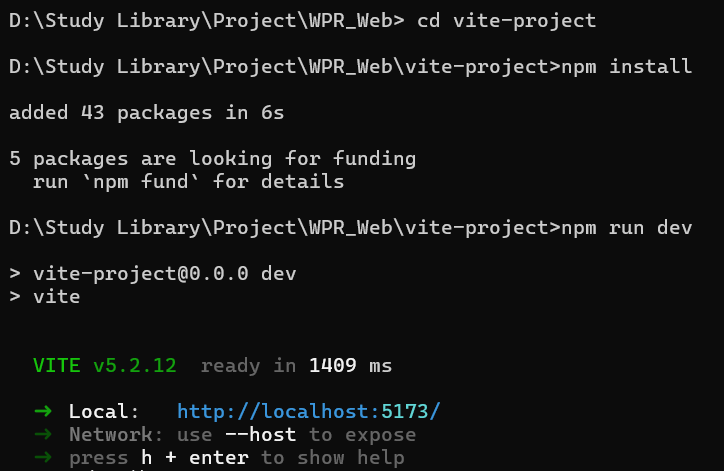

# Vite 环境与项目创建

本页讲清 **Node 版本要求、创建项目、目录结构、日常命令、构建与部署**，以及常见环境报错的处理。跑完本页你能得到一个可开发、可构建、可部署的 Vite 项目。

一句话理解：Vite 的环境要求比 Webpack 更严格——**Node 版本不对就直接起不来**，所以第一件事永远是确认版本。

## 1. 环境要求

| 项目 | 要求 |
| --- | --- |
| Node.js | **20.19+ 或 22.12+**（Vite 8 与 Vite 7 一致） |
| 推荐版本 | 当前 LTS（22.x / 24.x），或通过 nvm / fnm 管理多版本 |
| 包管理器 | npm 10+ / pnpm 9+ / yarn 1.22+ / bun 均可 |
| 磁盘 | 注意 Vite 8 安装体积比 Vite 7 大约 15 MB（含 Rolldown 与 lightningcss） |

```shell
node -v
# 期望：v20.19.0 及以上，或 v22.12.0 及以上
# 注意：v20.9.0、v22.11.0 之类「看起来够新」的版本仍会报错

npm -v
# 期望：10.x 及以上
```

::: danger 注意
**只满足大版本号是不够的。** Vite 7 起内部调用 `crypto.hash()`，该 API 在 Node 20.19.0 与 22.12.0 才稳定提供。如果你在 `v20.9.0` 上运行，会得到：

```text
TypeError: crypto.hash is not a function
    at getHash (file:///.../node_modules/vite/dist/node/chunks/dep-xxxx.js)
```

**修法（按优先级）**：

1. 升级 Node 到 20.19+ 或 22.12+（首选）。
2. 用 nvm / fnm 切换：`nvm install 22 && nvm use 22`。
3. 检查 CI 与部署环境的 Node 版本——「本地正常、CI 失败」几乎都是这里不一致。
4. 若短期内无法升级，只能降级 Vite 到 6.x（不推荐，会失去后续安全修复）。
:::

## 2. 创建项目

### 2.1 使用官方脚手架

```shell
npm create vite@latest
```

执行后会依次询问：

1. **项目名**（Project name）。
2. **框架**（Vanilla / Vue / React / Preact / Svelte / Solid / Qwik / Lit / Others）。
3. **语言**（TypeScript / JavaScript / 变体）。

也可以一行命令跳过交互：

```shell
# 创建 React + TypeScript 项目
npm create vite@latest my-app -- --template react-ts

# 创建 Vue + TypeScript 项目
npm create vite@latest my-app -- --template vue-ts

# 查看全部模板
npm create vite@latest -- --help
```

首次执行会提示 `Need to install the following packages: create-vite@latest`，输入 `y` 确认：


然后输入项目名、选择框架与语言：


### 2.2 初始化并启动

```shell
cd my-app
npm install     # 安装项目依赖
npm run dev     # 启动开发服务器
```

按终端提示操作：



启动成功后访问 `http://localhost:5173/`：


::: tip 提示
`npm create vite@latest` 会自动安装 Vite 本身，**不需要手动 `npm install vite`**。项目模板里 `vite` 已作为 devDependency 写好。
:::

### 2.3 用其它包管理器

```shell
# pnpm（推荐用于 monorepo，依赖复用更省磁盘）
pnpm create vite my-app --template vue-ts
cd my-app && pnpm install && pnpm dev

# yarn
yarn create vite my-app --template vue-ts

# bun
bun create vite my-app --template vue-ts
```

## 3. 目录结构

```text
my-app/
├── index.html              # 应用入口（Vite 把它作为构建入口）
├── package.json
├── vite.config.ts          # Vite 配置
├── tsconfig.json           # TS 配置（模板通常还会拆 tsconfig.app.json 等）
├── public/                 # 原样拷贝到产物根目录的静态资源
│   └── favicon.ico
└── src/
    ├── main.ts             # 应用启动入口
    ├── App.vue
    ├── components/
    ├── assets/             # 会被构建处理的资源（图片、样式）
    └── vite-env.d.ts       # Vite 客户端类型声明
```

要点：

| 目录 | 说明 |
| --- | --- |
| `index.html` | 是**入口文件**而不是模板。Vite 会解析其中的 `<script type="module">` 与 `<link>`，因此不需要 `HtmlWebpackPlugin` 这类插件 |
| `public/` | 内容原样复制到产物根目录。引用时用绝对路径 `/favicon.ico`，**不要**用 `import` 导入 |
| `src/assets/` | 会被构建处理（小图会内联为 base64，大图会生成带 hash 的文件）。引用用 `import` 或模板中的相对路径 |
| `vite-env.d.ts` | 让 TypeScript 认识 `import.meta.env`、`*.vue` 等非标准模块 |

::: danger 注意
1. **不要把业务代码放 `public/`**：它不参与构建，改文件名不会自动更新引用。
2. **`public/` 里的资源必须用绝对路径引用**（`/logo.png`）。用相对路径会在子路由下解析错误。
3. **`index.html` 不要放到 `public/` 里**：否则 Vite 无法把它当作入口处理。
:::

## 4. 日常命令

```shell
npm run dev        # 启动开发服务器（默认 5173）
npm run build      # 生产构建，输出到 dist/
npm run preview    # 本地预览构建产物（默认 4173）
```

```json [package.json]
{
  "scripts": {
    "dev": "vite --open",
    "build": "run-p type-check \"build-only {@}\" --",
    "preview": "vite preview",
    "build-only": "vite build",
    "type-check": "vue-tsc --build --force"
  }
}
```

常用 CLI 参数：

| 参数 | 作用 |
| --- | --- |
| `vite --open` / `-o` | 启动后自动打开浏览器 |
| `vite --host` / `--host 0.0.0.0` | 监听所有地址（局域网/手机调试） |
| `vite --port 9999` | 指定端口 |
| `vite --force` | 强制重新进行依赖预构建（清缓存） |
| `vite --mode staging` | 指定模式，加载对应的 `.env.staging` |
| `vite build --debug` | 输出调试信息（解析、插件耗时等） |
| `vite build --sourcemap` | 生成 sourcemap |

### 4.1 安装依赖

```shell
npm install              # 安装 package.json 中的全部依赖
npm install axios        # 安装到 dependencies
npm install -D vitest    # 安装到 devDependencies
npm install -g pnpm      # 全局安装某工具
```

::: warning 说明
**`dependencies` 与 `devDependencies` 的区分对库项目很重要**：库应当把运行时必需的依赖放进 `dependencies`，把仅构建/测试用到的放进 `devDependencies`。应用项目则影响相对较小，但保持区分能让安装更快、镜像更小。
:::

## 5. 构建与部署

```shell
npm run build
```

产物结构：

```text
dist/
├── index.html
└── assets/
    ├── index-B3xK9mQ1.js
    ├── index-Dq2vL7pR.css
    └── logo-a1B2c3D4.svg
```

文件名中的 hash 用于**长期缓存**：内容不变则文件名不变，可以把静态资源缓存设为一年。

### 5.1 本地验证产物

```shell
npm run preview
# ➜  Local: http://localhost:4173/
```

::: tip 为什么要 preview
`preview` 起的是一个静态服务器，会按产物真实行为响应请求。**很多「只有生产环境才出现的白屏/404」在 `dev` 下永远复现不了，必须用 `preview` 复现。**
:::

### 5.2 部署到静态服务器

把 `dist/` 内容上传到服务器即可。Nginx 示例（含 SPA history 路由回退）：

```nginx [nginx.conf]
server {
    listen 80;
    server_name example.com;
    root /var/www/my-app/dist;
    index index.html;

    # 静态资源长缓存（文件名带 hash，内容变化会换名）
    location /assets/ {
        expires 1y;
        add_header Cache-Control "public, immutable";
    }

    # SPA：找不到文件时回退到 index.html
    location / {
        try_files $uri $uri/ /index.html;
    }
}
```

```shell
# 手动部署示例
npm run build
scp -r dist/* user@example.com:/var/www/my-app/dist/
```

### 5.3 部署到子路径

如果站点部署在子路径（如 `https://example.com/app/`），必须设置 `base`：

```ts [vite.config.ts]
import { defineConfig } from 'vite'

export default defineConfig({
  base: '/app/',
})
```

```shell
# 也可以用命令行覆盖
vite build --base=/app/
```

::: danger 注意
**`base` 与部署路径不一致是生产白屏最常见的原因**。表现为 HTML 能打开，但 JS/CSS 全部 404。排查方法：打开浏览器 Network 面板，看请求的资源路径是否带上了正确的子路径前缀。
:::

### 5.4 容器化部署

```dockerfile [Dockerfile]
# ---- 构建阶段 ----
FROM node:22-alpine AS build
WORKDIR /app
RUN corepack enable

COPY package.json pnpm-lock.yaml ./
RUN pnpm install --frozen-lockfile

COPY . .
RUN pnpm build

# ---- 运行阶段 ----
FROM nginx:1.29-alpine
COPY --from=build /app/dist /usr/share/nginx/html
COPY nginx.conf /etc/nginx/conf.d/default.conf
EXPOSE 80
```

```shell
docker build -t my-app:local .
docker run --rm -p 8080:80 my-app:local
# 访问 http://localhost:8080/
```

## 6. 编辑器与插件

| 工具 | 作用 |
| --- | --- |
| VS Code 插件 **Vue - Official** | Vue 3 SFC 的语言支持、类型检查 |
| VS Code 插件 **ESLint / Prettier** | 代码规范与格式化 |
| VS Code 插件 **Error Lens** | 行内显示错误，配合 Vite 的快速反馈很有用 |
| `vite-plugin-checker` | 把 TS / ESLint 错误直接显示在浏览器覆盖层 |

```ts [vite.config.ts]
import { defineConfig } from 'vite'
import vue from '@vitejs/plugin-vue'
import checker from 'vite-plugin-checker'

export default defineConfig({
  plugins: [
    vue(),
    checker({
      typescript: true,
      eslint: { lintCommand: 'eslint "./src/**/*.{ts,vue}"' },
    }),
  ],
})
```

## 7. 常见环境问题

::: details 提示 端口被占用
Vite 会**自动尝试下一个可用端口**，因此终端显示的端口可能不是 5173。若需要固定端口且被占用时直接失败：

```ts
export default defineConfig({
  server: {
    port: 5173,
    strictPort: true, // 端口被占用则报错退出，而不是顺延
  },
})
```
:::

::: details 提示 手机 / 局域网无法访问
设置 `server.host` 为 `true` 或 `'0.0.0.0'`：

```ts
export default defineConfig({
  server: { host: '0.0.0.0' },
})
```

然后通过本机内网 IP 访问（终端会打印 `Network: http://192.168.x.x:5173/`）。若公司网络有防火墙，还需放行对应端口。
:::

::: details 提示 依赖更新后不生效
Vite 会把预构建结果缓存到 `node_modules/.vite`。依赖升级后若行为异常：

```shell
rm -rf node_modules/.vite
# 或者启动时强制重建
npm run dev -- --force
```
:::

::: details 提示 构建时报内存不足
```shell
# 提高 Node 堆上限（单位 MB）
NODE_OPTIONS=--max-old-space-size=4096 npm run build
```

Windows PowerShell：

```powershell
$env:NODE_OPTIONS="--max-old-space-size=4096"; npm run build
```

若长期需要提高上限，说明单包体积过大，应优先做分包而不是加内存。
:::

## 8. 参考资料

- [Vite 官方文档：开始](https://vite.dev/guide/)
- [Vite 官方文档：部署静态站点](https://vite.dev/guide/static-deploy)
- [Vite 官方文档：构建生产环境](https://vite.dev/guide/build)
- [Vite 官方文档：CLI](https://vite.dev/guide/cli)
- [Node.js 官方下载](https://nodejs.org/en/download)
