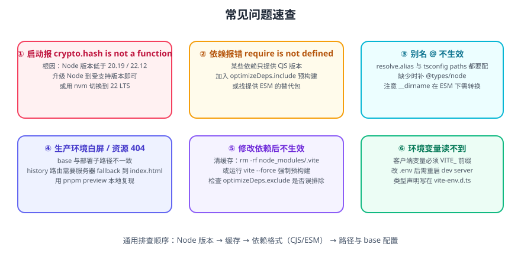

# Vite 常见问题与最佳实践

本页汇总 Vite 使用中最常遇到的具体报错、根因与修法，以及一套可以直接执行的工程规范。



## 1. 环境与启动

::: details 报错 TypeError: crypto.hash is not a function
**根因**：Node.js 版本低于 20.19.0 / 22.12.0。Vite 7 起内部使用 `crypto.hash()` 计算内容哈希，该 API 在这两个版本才稳定提供。

**修法（按优先级）**：

```shell
# 1. 确认当前版本（注意次版本号！）
node -v

# 2. 升级到 LTS
nvm install 22
nvm use 22
node -v   # 应为 v22.12.0 或更高

# 3. 同步检查 CI 与部署环境
#    .github/workflows/*.yml 里的 node-version
#    Dockerfile 的基础镜像
#    Nginx/托管平台的 Node 运行时
```

**常见误区**：以为「我是 Node 20 就没事」。`v20.9.0` 会报错，`v20.19.0` 才正常。奇数大版本（21、23）不在官方支持范围内。
:::

::: details 报错 Cannot find module 'vite' / 端口起不来
1. 依赖没装：`npm install`。
2. 只在全局装了 Vite，项目里没有：`npm install -D vite`。
3. 用 `npx vite` 而不是 `npm run dev`，导致版本漂移：统一用 `package.json` scripts。
4. `package.json` 缺少 `"type": "module"` 且配置文件用了 ESM 语法：加 `"type": "module"` 或把配置改名为 `vite.config.mts`。
:::

::: details 端口被占用，实际端口和配置不一致
Vite 会自动顺延端口。要严格固定：

```ts [vite.config.ts]
export default defineConfig({
  server: {
    port: 5173,
    strictPort: true, // 被占用则直接报错退出
  },
})
```
:::

::: details 手机 / 局域网访问不了
```ts [vite.config.ts]
export default defineConfig({
  server: { host: true }, // 等价于 0.0.0.0
})
```

终端会打印 `Network: http://192.168.x.x:5173/`。若仍不通，检查系统防火墙与公司网络策略（部分企业 Wi-Fi 隔离客户端间通信）。
:::

## 2. 依赖与模块

::: details 报错 require is not defined / process is not defined
**根因**：某些依赖只发布 CommonJS 版本，或直接使用了 Node 内置模块。

**修法**：

```ts [vite.config.ts]
export default defineConfig({
  // 1. 强制预构建（把 CJS 转成 ESM）
  optimizeDeps: {
    include: ['some-cjs-package'],
  },

  // 2. 浏览器里没有 Node 内置模块，显式声明为不可用
  resolve: {
    alias: {
      // 或提供浏览器可用的替代实现
      path: 'path-browserify',
    },
  },

  define: {
    // 3. 某些库需要 process.env.NODE_ENV
    'process.env.NODE_ENV': JSON.stringify(process.env.NODE_ENV || 'development'),
  },
})
```

**更推荐的做法**：换一个同时提供 ESM 的替代包。长期靠 polyfill 维护只会积累技术债。
:::

::: details 依赖更新后行为异常 / 改了 node_modules 不生效
Vite 把预构建结果缓存在 `node_modules/.vite`：

```shell
rm -rf node_modules/.vite
npm run dev -- --force
```
:::

::: details 报错 Failed to resolve import "xxx"
1. 路径拼写错误或大小写不一致（Linux 大小写敏感，Windows 不敏感——这是「本地正常、CI 失败」的经典原因）。
2. 别名配置只加在了 `tsconfig.json`，没加在 `resolve.alias`（或反之）。
3. 缺少文件扩展名且不在 `resolve.extensions` 中。
4. 包未安装或版本不匹配。

排查顺序：确认文件真实存在（`ls`）→ 确认两处别名一致 → 清缓存重试。
:::

## 3. 样式与资源

::: details 样式不生效 / 被顺序覆盖
- CSS 的引入顺序决定优先级。在入口集中引入全局样式（如 `reset.css`、变量文件），组件内样式放 SFC 的 `<style>` 中。
- 使用 `<style scoped>` 时注意 `:deep()` 穿透写法。
- CSS 变量定义要放在 `:root` 且先于使用它的样式加载。

```ts [src/main.ts]
import '@/styles/reset.css'   // 全局重置先引入
import '@/styles/variables.css'
import { createApp } from 'vue'
```
:::

::: details 图片路径在生产环境 404
三种情况的正确写法：

| 位置 | 引用方式 | 说明 |
| --- | --- | --- |
| `src/assets/xxx.png` | `import img from '@/assets/xxx.png'` 或模板内相对路径 | 会被构建处理，生成带 hash 的产物 |
| `public/xxx.png` | 绝对路径 `/xxx.png` | 原样复制到产物根目录 |
| 子路径部署 | `` `${import.meta.env.BASE_URL}xxx.png` `` | 自动带上 base 前缀 |

::: danger 注意
**绝对路径 `/xxx.png` 在子路径部署下会 404。** 部署到 `https://example.com/app/` 时，必须写成 `/app/xxx.png` 或使用 `import.meta.env.BASE_URL` 拼接。
:::
:::

::: details CSS 预处理器报错
预处理器需要显式安装，Vite 只内置了配置入口：

```shell
npm install -D sass-embedded        # 推荐（基于 Dart Sass，性能更好）
npm install -D less
npm install -D stylus
```

```ts [vite.config.ts]
export default defineConfig({
  css: {
    preprocessorOptions: {
      scss: {
        // 全局注入变量文件，避免每个文件都 @use
        additionalData: `@use "@/styles/variables.scss" as *;`,
      },
    },
  },
})
```
:::

## 4. 构建与部署

::: details 生产环境白屏，控制台报资源 404
**最高频原因：`base` 与部署路径不一致。**

```ts [vite.config.ts]
export default defineConfig({
  base: '/app/', // 必须与部署子路径一致
})
```

排查步骤：

1. 打开 Network 面板，看请求的资源路径前缀是否与实际部署路径一致。
2. 用 `npm run preview` 本地复现。
3. 检查网关是否有 rewrite 规则把路径改掉了。
:::

::: details 路由刷新 404（history 模式）
这是服务器问题，不是 Vite 问题：history 模式下所有路径都要回退到 `index.html`。

```nginx [nginx.conf]
location / {
    try_files $uri $uri/ /index.html;
}
```

如果无法改服务器配置，改用 hash 模式：

```ts
createRouter({ history: createWebHashHistory(), routes })
```
:::

::: details 构建报 JavaScript heap out of memory
```shell
# 提高 Node 堆上限（单位 MB）
NODE_OPTIONS=--max-old-space-size=4096 npm run build
```

```powershell
# Windows PowerShell
$env:NODE_OPTIONS="--max-old-space-size=4096"; npm run build
```

::: warning 说明
**不要长期靠加内存解决。** 内存不足通常意味着单包体积过大或构建过程中保留了过多中间数据，应优先做分包、检查是否有插件做了全量 AST 处理。
:::
:::

::: details 构建很慢
按收益顺序排查：

| 手段 | 说明 |
| --- | --- |
| 升级到 Vite 8（Rolldown） | 大型项目构建时间显著下降 |
| `reportCompressedSize: false` | 跳过 gzip 体积统计 |
| 关闭生产 sourcemap | 减少 IO 与体积 |
| 精简 `manualChunks` 规则 | 降低打包阶段开销 |
| 检查插件是否做了重活 | 插件里的全量遍历是常见瓶颈 |
:::

::: details 产物 hash 每次都变，缓存失效
常见原因：

1. 代码里混入了 `Date.now()`、随机数等构建期变量。
2. `manualChunks` 返回了不稳定分组。
3. 插件注入了构建时间戳。
4. 使用了 `hash` 而不是 `contenthash` 语义的命名。

验证方法：连续两次构建（不改代码），对比文件名是否一致。
:::

## 5. TypeScript 相关

::: details 报错找不到模块 './App.vue'
```ts [src/vite-env.d.ts]
/// <reference types="vite/client" />

declare module '*.vue' {
  import type { DefineComponent } from 'vue'
  const component: DefineComponent<{}, {}, {}>
  export default component
}
```

确认该文件在 `tsconfig.json` 的 `include` 范围内。
:::

::: details import.meta.env.XXX 类型是 any / 报错
在声明文件里扩展 `ImportMetaEnv`：

```ts [src/types/env.d.ts]
interface ImportMetaEnv {
  readonly VITE_BASE_API: string
  readonly VITE_APP_TITLE: string
}

interface ImportMeta {
  readonly env: ImportMetaEnv
}
```

::: danger 注意
**不要给这两个 interface 加 `export`**。一旦文件变成模块，全局合并失效，Vite 内置的 `import.meta.env` 类型会全部丢失。
:::
:::

::: details 环境变量读不到值
1. 客户端变量必须有 `VITE_` 前缀。
2. 改 `.env` 后要**重启开发服务器**。
3. **不能用动态键**：`import.meta.env[key]` 不会被静态替换。
4. 用 `loadEnv(mode, root, '')` 才能读到无前缀变量（仅在配置文件中）。

```ts
// 配置文件中读取全部变量
const env = loadEnv(mode, process.cwd(), '')
```
:::

## 6. 最佳实践

### 6.1 配置规范

- **配置分层**：`base` / `dev` / `prod` 三个文件，`vite.config.ts` 只做装配。
- **别名只维护一处**：`resolve.alias` 与 `tsconfig.json` 的 `paths` 必须一致；Vite 8 起可考虑 `resolve.tsconfigPaths`。
- **`base` 用环境变量管理**，不要写死在多处。
- **不要在配置里做网络请求或重 IO**：会拖慢每次启动。

### 6.2 依赖规范

- 优先选择**同时提供 ESM 与类型声明**的包。
- 重量级库（图表、编辑器、地图）**必须懒加载**。
- 锁定依赖版本（提交锁文件），CI 用 `--frozen-lockfile`。
- 定期跑 `npm outdated` 与 `npm audit`，但不要批量盲目升级。

### 6.3 构建规范

```ts [vite.config.ts]
export default defineConfig({
  build: {
    // 1. 明确目标浏览器
    target: 'baseline-widely-available',
    // 2. 生产关闭 sourcemap（或上传到错误监控平台后删除）
    sourcemap: false,
    // 3. 明确分包规则
    rollupOptions: {
      output: {
        manualChunks: {
          'vendor-vue': ['vue', 'vue-router', 'pinia'],
        },
      },
    },
    // 4. 设置体积告警阈值
    chunkSizeWarningLimit: 800,
  },
})
```

### 6.4 交付规范

| 环节 | 要求 |
| --- | --- |
| 提交前 | 跑 `type-check`，确保无类型错误 |
| CI | `install --frozen-lockfile` → `type-check` → `build` → 体积预算门禁 |
| 发布前 | 必须跑一次 `preview` 验证产物 |
| 上线后 | 检查首屏、路由刷新、接口连通性、控制台报错 |
| 缓存 | `/assets/` 长期缓存，`index.html` 不缓存 |

### 6.5 排查顺序（万能清单）

遇到问题时按这个顺序排查，能覆盖 90% 的场景：

```text
1. Node 版本（20.19+ / 22.12+）
2. 缓存（node_modules/.vite，--force）
3. 依赖格式（CJS / ESM / Node 内置模块）
4. 路径与 base（别名、大小写、部署子路径）
5. 配置（两处别名是否一致、mode 是否正确）
6. 用 preview 复现生产行为
7. 最小化复现：把配置删到只剩必要项，逐个加回来
```

::: tip 关于「最小化复现」
这是最有效但最常被跳过的一步。当问题难以定位时，**新建一个空项目，只复制怀疑的依赖与配置**，如果问题消失，说明是配置组合导致的；如果问题复现，说明是依赖本身的问题。这比在复杂项目里猜要快得多。
:::

## 7. 参考资料

- [Vite 官方文档：故障排查](https://vite.dev/guide/troubleshooting)
- [Vite 官方文档：依赖预构建](https://vite.dev/guide/dep-pre-bundling)
- [Vite 官方文档：构建](https://vite.dev/guide/build)
- [Vite 8 发布公告](https://vite.dev/blog/announcing-vite8)
- [Vite GitHub Issues](https://github.com/vitejs/vite/issues)
