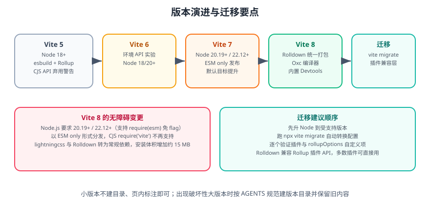

# Vite 版本演进与迁移

Vite 的版本节奏大致是**每年 1~2 个大版本**。本页梳理 Vite 5 → 8 的关键差异、迁移步骤与回滚方案，并说明哪些旧写法要保留标注、哪些可以直接替换。

一句话理解：**Vite 8 是分水岭**——它把开发期与生产期的打包器统一为 Rust 实现的 Rolldown，因此工程配置与插件生态都需要一次对齐。



## 1. 版本对照

| 版本 | 发布时间（约） | Node.js 要求 | 关键变化 |
| --- | --- | --- | --- |
| Vite 5 | 2023-11 | 18+ / 20+ | CJS Node API 弃用警告、`define` 支持非字符串值 |
| Vite 6 | 2024-11 | 18+ / 20+ | 环境 API（Environment API）实验、库模式增强 |
| Vite 7 | 2025-06 | **20.19+ / 22.12+** | 以 ESM-only 分发、默认浏览器目标提升、内部使用 `crypto.hash()` |
| **Vite 8** | **2026-03** | **20.19+ / 22.12+** | **Rolldown 统一打包**、Oxc 编译器、内置 Devtools、tsconfig paths、Wasm SSR、浏览器日志转发 |

::: info 信息
Vite 采用「**主线 + 维护**」的维护策略：最新大版本为主力，上一两个大版本继续接收安全修复。生产环境建议使用当前主线的**最新小版本**（如 8.0.x），不要停留在有已知问题的旧小版本。

版本号与要求以 [Vite 官方发布说明](https://github.com/vitejs/vite/releases) 与 [Vite 8 发布公告](https://vite.dev/blog/announcing-vite8) 为准。
:::

## 2. Vite 8 的主要变化

### 2.1 Rolldown 统一打包器

此前 Vite 使用两套引擎：开发期用 **esbuild**（快，但不做完整打包），生产期用 **Rollup**（插件生态好，但慢）。Vite 8 用 **Rolldown** 取代两者：

- Rust 实现，性能优于纯 JS 的 Rollup，官方与社区报告的大型项目构建时间下降在**数十个百分点**量级。
- **兼容 Rollup 插件 API**，绝大多数既有 Vite 插件可直接使用。
- 与 Oxc 编译器同源，解析、转换、压缩行为一致。

::: danger 注意
**Rolldown 不是「完全等价的 Rollup」**。以下情况升级后需要重点验证：

1. 依赖 esbuild 特有能力（如 `esbuild.target` 对某些语法的处理）的自定义配置。
2. 直接调用 Rollup 内部 API 的插件。
3. 极度依赖打包顺序或 chunk 命名的定制逻辑。

升级前建议先用 `rolldown-vite` 预览包在分支上验证，再合并主线。
:::

### 2.2 安装体积变化

| 来源 | 变化 | 原因 |
| --- | --- | --- |
| `lightningcss` | 从可选 peer 依赖变为**常规依赖** | 提供更优的 CSS 压缩，开箱可用 |
| `rolldown` | 新增常规依赖 | Rolldown 二进制约 5 MB 以上 |
| 合计 | 比 Vite 7 大约 **+15 MB** | 官方已明确说明，属于性能换体积的取舍 |

### 2.3 新能力

| 能力 | 配置 | 说明 |
| --- | --- | --- |
| 内置 Devtools | `devtools: true` | 可视化模块图、产物体积、HMR 诊断 |
| tsconfig paths | `resolve.tsconfigPaths: true` | 直接读取 tsconfig 的 `paths`，避免两处维护别名（有少量性能开销，默认关闭） |
| `emitDecoratorMetadata` | 内置支持 | 不再需要额外插件 |
| Wasm SSR | `.wasm?init` | WebAssembly 可在 SSR 环境导入 |
| 浏览器日志转发 | `server.forwardConsole` | 浏览器 console 与运行时错误转发到终端，便于与 AI/CI 协作 |
| 新 React 插件 | `@vitejs/plugin-react@6` | 用 Oxc 实现 Fast Refresh，不再依赖 Babel |

## 3. 迁移步骤

```shell
# 0. 先确保工作区干净，便于随时回滚
git status
git checkout -b chore/vite8-migration

# 1. 升级 Node.js（如果低于 20.19 / 22.12）
nvm install 22 && nvm use 22
node -v

# 2. 升级 Vite 与框架插件
npm install -D vite@latest
npm install -D @vitejs/plugin-vue@latest   # 或 @vitejs/plugin-react@6

# 3. 运行官方迁移脚本（转换配置文件）
npx vite migrate

# 4. 清理缓存后重装，排除旧缓存干扰
rm -rf node_modules/.vite
npm install

# 5. 逐步验证
npm run dev      # 启动与 HMR
npm run build    # 构建是否通过
npm run preview  # 产物是否可运行
```

### 3.1 迁移检查清单

| 检查项 | 说明 |
| --- | --- |
| Node 版本 | 本地、CI、镜像、部署环境全部对齐到 20.19+/22.12+ |
| 配置文件 | `npx vite migrate` 自动转换常见项，但 `rollupOptions` 自定义部分需人工确认 |
| 插件兼容性 | 逐个确认是否有 Rolldown 兼容版本，参考官方插件目录 |
| `esbuild` 相关配置 | 检查是否使用了仅 esbuild 支持的选项 |
| CSS 处理 | `lightningcss` 成为常规依赖，确认 CSS 压缩结果符合预期 |
| 构建产物 | 对比迁移前后的 chunk 划分与体积，避免回归 |
| sourcemap | 确认生产 sourcemap 策略未意外改变 |
| CI 流水线 | Node 版本、缓存目录、构建命令是否仍适用 |

::: danger 注意
**不要一次性改完所有东西再验证。** 建议顺序：先只升 Node → 再只升 Vite → 再升插件 → 最后调配置。每一步都跑一遍 `dev` + `build` + `preview`，出问题时能立刻定位到具体改动。
:::

## 4. 从 Vite 7 及更早版本迁移的具体差异

### 4.1 Node 版本与 `crypto.hash`

Vite 7 起内部使用 `crypto.hash()`，该 API 在 Node **20.19.0** 与 **22.12.0** 才稳定提供。低于这些版本会报：

```text
TypeError: crypto.hash is not a function
```

::: warning 说明
「我装的是 Node 20，为什么不行」是最常见的误区。必须看**次版本号**：`20.9.0` 不行，`20.19.0` 才行；奇数大版本（21、23）不在官方支持范围内。
:::

### 4.2 ESM-only 分发

Vite 7 起以 **ESM-only** 形式发布，`require('vite')` 不再可用。影响范围：

| 场景 | 影响与修法 |
| --- | --- |
| `vite.config.js` 使用 `require` | 改名 `vite.config.mjs`，或改用 `import` |
| 脚本中 `require('vite')` | 改为 `import { build } from 'vite'` |
| 测试/工具里动态加载 | 使用 `await import('vite')` |
| TS 配置 `module: commonjs` | 改为 `"module": "ESNext"` 并使用 ESM 语法 |

```js [vite.config.mjs]
// ESM 写法
import { defineConfig } from 'vite'

export default defineConfig({
  server: { port: 5173 },
})
```

### 4.3 默认浏览器目标

Vite 7 起默认构建目标由 `modules` 调整为更现代、更贴合实际的基线。若项目需要支持较旧浏览器：

```ts [vite.config.ts]
export default defineConfig({
  build: {
    target: ['es2020', 'chrome87', 'firefox78', 'safari14'],
  },
})
```

### 4.4 旧写法标注

以下写法**保留说明但标注为仅存量项目使用**，新项目不要采用：

| 旧写法 | 状态 | 替代方案 |
| --- | --- | --- |
| `require('vite')` / CJS 配置文件 | 仅存量项目使用 | ESM 配置（`.mjs` / `.mts`） |
| `build.minify: 'terser'` 作为默认 | 仅特殊场景 | 默认 esbuild/内置压缩；legacy 场景才需 terser |
| `@vitejs/plugin-legacy` 兼容 IE | 仅存量项目使用 | 面向现代浏览器基线；必须兼容时再开启 |
| 手工维护 `resolve.alias` 与 tsconfig 双份 | 可优化 | Vite 8 起可用 `resolve.tsconfigPaths` |
| 使用 `vite-plugin-eslint` 做全量检查 | 建议替换 | 交给 CI 或 `vite-plugin-checker` |

## 5. 回滚方案

```shell
# 方案一：回退分支
git checkout main

# 方案二：锁定旧版本
npm install -D vite@7

# 方案三：用 npm overrides / pnpm overrides 临时钉住版本
```

```json [package.json]
{
  "overrides": {
    "vite": "7.0.6"
  }
}
```

::: danger 注意
回滚只应作为**临时手段**。旧版本会逐渐停止安全修复，长期停留在旧版本会积累安全债。如果因为某个插件不兼容而被迫回滚，应把「替换或推动该插件升级」列入明确计划。
:::

## 6. 升级后的验证清单

```shell
# 类型与规范
npx vue-tsc --noEmit     # 或 tsc --noEmit

# 开发
npm run dev
# 手动验证：首页渲染、路由跳转、修改文件后 HMR 生效、接口代理可用

# 构建与产物
npm run build
npm run preview
# 手动验证：首屏正常、控制台无报错、动态路由刷新不 404

# 产物对比
ls -lh dist/assets | sort -k5 -h | tail -n 10
```

| 验证项 | 通过标准 |
| --- | --- |
| 启动 | 无报错、无「依赖需要预构建」的异常提示 |
| HMR | 改组件与改样式都能在不刷新页面下生效 |
| 构建 | 零错误、零新增警告 |
| 产物体积 | 各 chunk 体积与迁移前相比无异常增长（±10% 内） |
| hash 稳定性 | 未改代码时二次构建的 vendor chunk 名一致 |
| 运行时 | 首屏、路由、接口、静态资源均正常 |

## 7. 参考资料

- [Vite 8 发布公告](https://vite.dev/blog/announcing-vite8)
- [Vite 迁移指南](https://vite.dev/guide/migration)
- [Vite 官方发布记录](https://github.com/vitejs/vite/releases)
- [Rolldown 官方仓库](https://github.com/rolldown/rolldown)
- [Vite 插件目录](https://registry.vite.dev/)
- [Node.js 版本发布日程](https://nodejs.org/en/about/previous-releases)
