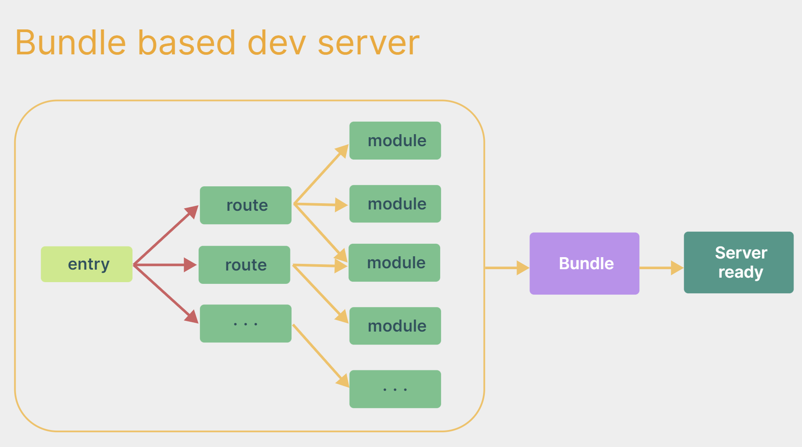
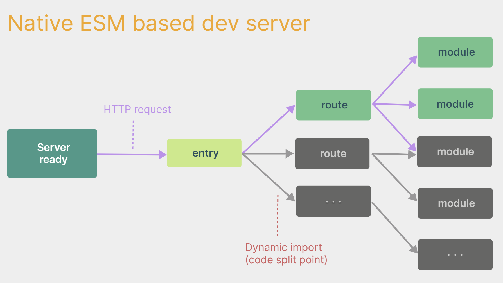
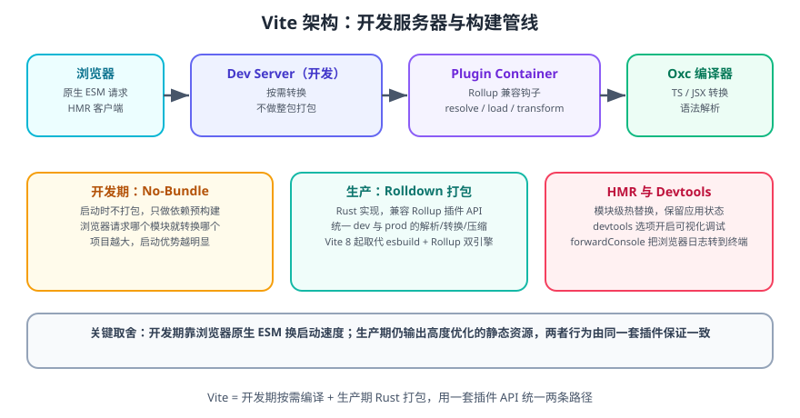
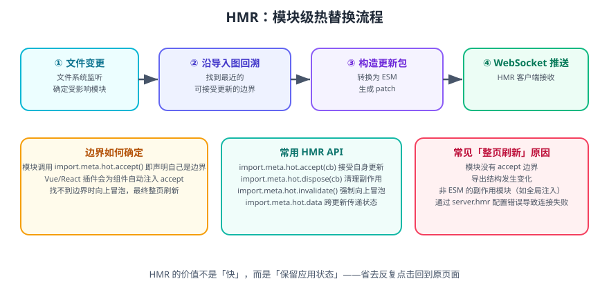

# Vite 概述与原理

Vite 是新一代前端构建工具，目标是**把「启动项目」和「改一行看效果」这两个高频动作压缩到近乎瞬时**。

一句话理解：Webpack 是「先把整个应用打包好再启动服务器」，Vite 是「服务器先起来，浏览器请求哪个模块就现场编译哪个模块」。前者耗时随项目规模增长，后者只跟你**当前访问的页面**有关。

## 1. 为什么需要 Vite

### 1.1 传统打包式开发服务器的瓶颈

以 Webpack 为例，开发期启动流程是：

1. 从入口开始递归解析所有模块，构建完整依赖图。
2. 所有模块经过 Loader 转换、Plugin 处理。
3. 把整棵依赖图打包成 bundle。
4. 启动开发服务器，浏览器请求 bundle。

因此**模块越多，启动越慢**；改一个文件要重新构建受影响的部分，热更新延迟也随之上升。大型项目冷启动几十秒、HMR 数百毫秒都很常见。



### 1.2 Vite 的做法：先起服务，按需编译

Vite 把顺序颠倒过来：

1. 开发服务器**立即启动**（只需做一次依赖预构建）。
2. 浏览器请求页面时，Vite 把 `index.html` 当作入口，把其中的 `<script type="module">` 交给浏览器。
3. 浏览器按 ESM 规范**逐个请求**它需要的模块。
4. Vite 只对「被请求到的模块」做转换，并把结果缓存起来。



::: tip 一句话理解
**没有访问到的路由就不会被处理。** 项目有 500 个页面，你只打开首页，Vite 就只编译首页链路所需的模块。
:::

### 1.3 冷启动为什么还能更快

浏览器原生 ESM 只能处理 JavaScript，但项目里有 TypeScript、JSX、CSS、图片。Vite 的处理方式：

| 类型 | 处理方式 |
| --- | --- |
| 业务源码（`.ts`、`.jsx`、`.vue`） | 按需转换，不打包，浏览器直接加载 |
| 第三方依赖（`node_modules`） | **预构建**（pre-bundling）成少量 ESM 文件，避免成百上千次请求 |
| CSS / 静态资源 | 转换为 JS 模块或按 URL 请求 |

**依赖预构建**是关键优化：`node_modules` 里的包大多是 CommonJS 或由上千个小文件组成，直接让浏览器加载会产生海量请求。Vite 用打包器把它们合并成少量 ESM 文件，同时把 CJS 转成 ESM。

## 2. Vite 的架构



### 2.1 开发期

```text
浏览器 ──HTTP──> Dev Server ──> Plugin Container ──> Oxc / 预构建产物
   ↑                                    │
   └──────── WebSocket（HMR 推送）──────┘
```

- **Dev Server**：基于 `connect` 的中间件服务器，负责静态资源、模块请求、HMR 通道。
- **Plugin Container**：实现 Rollup 兼容的插件钩子（`resolveId` / `load` / `transform`），让插件在开发期与生产期行为一致。
- **Oxc**：Rust 实现的编译器，负责 TS/JSX 转换与语法解析。
- **模块图**：Vite 维护模块之间的导入关系，用于 HMR 时快速定位受影响范围。

### 2.2 生产期

从 **Vite 8** 起，生产构建使用 **Rolldown**（Rust 实现、兼容 Rollup 插件 API 的打包器），取代了此前「开发用 esbuild、生产用 Rollup」的双引擎方案。

统一引擎带来的好处：

| 收益 | 说明 |
| --- | --- |
| 行为一致 | 开发与生产使用同一套解析、转换、压缩逻辑，减少「dev 正常、build 出错」 |
| 性能提升 | 大型项目生产构建时间明显下降（官方与社区报告在数十个百分点量级） |
| 插件生态延续 | 兼容 Rollup 插件 API，绝大多数既有 Vite 插件可直接使用 |
| 语言特性跟进更快 | 解析器与编译器同源，新语法支持更快 |

::: warning 说明
Rolldown 的二进制体积大于 esbuild + Rollup，且 `lightningcss` 从可选依赖变为常规依赖，因此 **Vite 8 的安装体积比 Vite 7 大约多 15 MB**。这是官方明确说明的取舍。
:::

## 3. HMR：热模块替换



HMR 的价值不只是「快」，而是**保留应用状态**——改样式或改组件逻辑时，不需要重新走一遍「登录 → 进入页面 → 填表」的流程。

工作流程：

1. 文件系统监听发现文件变更。
2. 沿模块导入图回溯，寻找最近的「接受更新」的边界模块。
3. 只重新转换受影响模块，通过 WebSocket 把补丁推给浏览器。
4. 浏览器端 HMR 客户端应用补丁；若无边界可用，则整页刷新。

业务代码里可以显式声明边界：

```ts [src/counter.ts]
export let count = 0

if (import.meta.hot) {
  // 接受自身更新：模块被替换时不刷新页面
  import.meta.hot.accept((newModule) => {
    if (newModule) {
      count = newModule.count
      render()
    }
  })

  // 清理副作用，避免重复注册
  import.meta.hot.dispose(() => {
    clearInterval(timer)
  })
}
```

框架插件（`@vitejs/plugin-vue`、`@vitejs/plugin-react`）会为组件自动注入 HMR 处理，业务侧通常不需要手写。

## 4. Vite 与 Webpack 对比

| 维度 | Vite | Webpack 5 |
| --- | --- | --- |
| 开发期策略 | 按需编译，不打包 | 全量构建依赖图后打包 |
| 冷启动 | 通常百毫秒级，与项目规模弱相关 | 随模块数增长，大项目可达数十秒 |
| HMR | 基于 ESM 的模块级替换 | 基于 bundle 差异的热更新 |
| 生产打包器 | Rolldown（Rust） | 自研（JavaScript） |
| 配置复杂度 | 开箱即用，配置较少 | 高度可配置，配置量大 |
| 插件 API | 兼容 Rollup 钩子 | 自有 Tapable 钩子体系 |
| 生态成熟度 | 新项目主流，组件库/老插件仍在补齐 | 极成熟，历史项目与复杂定制场景多 |
| 适用场景 | 新项目、现代浏览器、SPA/SSR/库 | 存量大型项目、需要深度定制构建流程 |

::: tip 选型建议
**新项目默认用 Vite。** 只有在以下情况才考虑 Webpack：项目已深度依赖 Webpack 特有插件、需要复杂的自定义构建流程、或必须支持非常旧的运行环境且迁移成本高于收益。
:::

## 5. 核心特性清单

- **开箱支持 TypeScript / JSX / CSS**：无需额外配置 Loader，`.ts`、`.tsx`、`.scss`、`.less` 直接可用（预处理器需装对应依赖）。
- **按需编译**：不访问的路由不编译，加速大型项目开发。
- **极速 HMR**：模块级替换，保留应用状态。
- **依赖预构建**：把 CJS 转 ESM，把碎片化依赖合并成少量请求。
- **统一构建管线**：Vite 8 起开发与生产共用 Rolldown 与 Oxc。
- **内置 Devtools**（Vite 8）：`devtools` 选项开启可视化调试面板，查看模块图、产物体积与 HMR 诊断。
- **tsconfig paths 支持**（Vite 8）：设置 `resolve.tsconfigPaths: true` 即可让 Vite 读取 `tsconfig.json` 的 `paths` 别名（有少量性能开销，默认关闭）。
- **Wasm SSR 支持**（Vite 8）：`.wasm?init` 导入在 SSR 环境可用。
- **浏览器日志转发**（Vite 8）：开启 `server.forwardConsole` 后，浏览器端的 `console` 与运行时错误会转发到终端，便于排查。
- **完整的 TypeScript 类型支持**：`vite` 包自带类型定义，配置项与插件 API 均有类型。

## 6. 版本与适用环境

| 项目 | 要求 |
| --- | --- |
| Vite 8 最低 Node.js | 20.19+ 或 22.12+ |
| 推荐 Node.js | 当前 LTS（22.x / 24.x） |
| 包管理器 | npm / pnpm / yarn / bun 均可，pnpm 在 monorepo 下体验更好 |
| 浏览器目标 | 默认面向「广泛可用的现代浏览器」基线；需要兼容旧环境时显式设置 `build.target` 或 `@vitejs/plugin-legacy` |

::: danger 注意
1. **Node 版本不足会直接报 `TypeError: crypto.hash is not a function`**——Vite 7 起内部使用 Node 20.19 / 22.12 才提供的 `crypto.hash()` API。升级 Node 是最可靠的修法。
2. **不要用 `npx vite` 而不装本地依赖**：版本会漂移，团队成员的构建结果可能不一致。
3. **Vite 8 以 ESM-only 形式分发**，旧的 `require('vite')` 用法不再支持。
:::

## 7. 三分钟上手

```shell
# 1. 创建项目（交互式选择框架与语言）
npm create vite@latest my-app
cd my-app

# 2. 安装依赖
npm install

# 3. 启动开发服务器
npm run dev
# 输出示例：
# VITE v8.x.x  ready in 187 ms
# ➜  Local:   http://localhost:5173/
```

```shell
# 4. 生产构建
npm run build
# 产物在 dist/ 目录

# 5. 本地预览构建产物
npm run preview
# ➜  Local:   http://localhost:4173/
```

**验证方式**：浏览器打开 `http://localhost:5173/` 页面正常渲染、控制台无报错；修改任意源文件后浏览器在不刷新的情况下更新（HMR 生效）；`npm run build` 输出 `dist/` 且无错误。

## 8. 参考资料

- [Vite 官方文档](https://vite.dev/)
- [Vite 中文文档](https://cn.vitejs.dev/)
- [Vite 8 发布公告](https://vite.dev/blog/announcing-vite8)
- [Rolldown 官方仓库](https://github.com/rolldown/rolldown)
- [Oxc 官方仓库](https://github.com/oxc-project/oxc)
- [Vite 插件目录](https://registry.vite.dev/)
