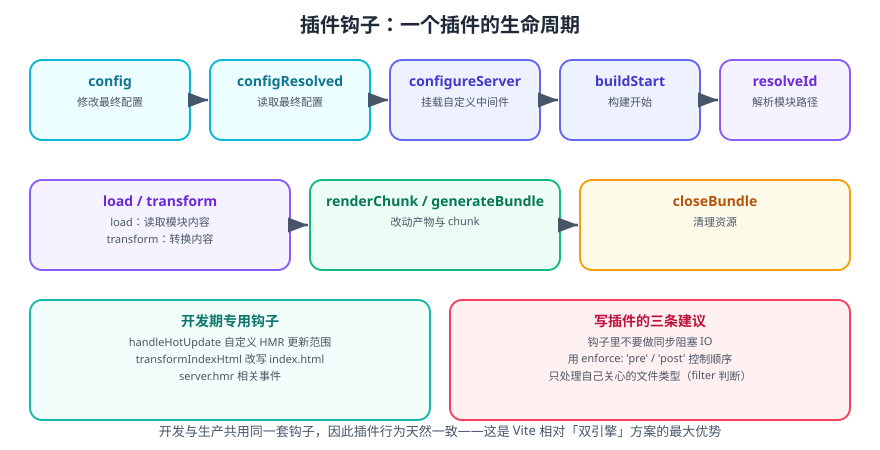

# Vite 插件开发

Vite 插件是一套**兼容 Rollup 插件 API 的扩展机制**：同一个插件既能在开发服务器里工作，也能在生产构建里工作。这是 Vite「开发与生产行为一致」的根本原因。

一句话理解：**插件就是一组按生命周期被调用的钩子函数**。你只关心「在哪个阶段、拿到什么、返回什么」，不必关心它是 dev 还是 build。

## 1. 插件的基本形态

```ts [vite.config.ts]
import { defineConfig, type Plugin } from 'vite'

function myPlugin(): Plugin {
  return {
    name: 'vite-plugin-my', // 必须唯一，用于报错定位与去重
    // 钩子...
  }
}

export default defineConfig({
  plugins: [myPlugin()],
})
```

### 1.1 常用钩子速查



| 钩子 | 阶段 | 作用 | 返回 |
| --- | --- | --- | --- |
| `config` | 解析配置前 | 修改/合并用户配置 | 部分配置对象 |
| `configResolved` | 配置解析完成 | 读取最终配置并保存 | void |
| `configureServer` | 开发服务器创建后 | 挂载自定义中间件 | void / 后置函数 |
| `configurePreviewServer` | 预览服务器创建后 | 同 `configureServer` | void |
| `buildStart` | 构建开始 | 初始化资源 | void / Promise |
| `resolveId` | 解析模块路径 | 自定义模块解析（虚拟模块） | string / 对象 / null |
| `load` | 读取模块内容 | 提供模块内容 | string / null |
| `transform` | 转换模块 | 改写代码 | 代码 / SourceMap / null |
| `transformIndexHtml` | 处理 HTML | 注入 script / meta | HTML / 标签数组 |
| `handleHotUpdate` | HMR 更新 | 缩小更新范围 | 模块数组 |
| `renderChunk` | 产物生成后 | 改写单个 chunk | 代码 / null |
| `generateBundle` | 写文件前 | 增删改产物文件 | void |
| `closeBundle` | 构建结束 | 清理资源 | void |

### 1.2 钩子的执行顺序修饰

```ts
export default function myPlugin(): Plugin {
  return {
    name: 'vite-plugin-my',
    enforce: 'pre',   // 'pre' 在最前，'post' 在最后，不写则在常规插件之间
    apply: 'build',   // 'build' | 'serve' | 函数 (config, env) => boolean
    // ...
  }
}
```

| 修饰符 | 取值 | 意义 |
| --- | --- | --- |
| `enforce` | `'pre'` / `'post'` | 控制插件在队列中的位置 |
| `apply` | `'build'` / `'serve'` / 函数 | 只在特定命令下生效 |

::: tip 为什么顺序重要
Vite 会把 `enforce: 'pre'` 的插件排在核心插件（如构建期需要的解析）之前，`'post'` 排在最后。典型例子：**别名插件通常放 `pre`**（要在解析前生效），**产物分析插件放 `post`**（要在一切处理完成后统计）。
:::

## 2. 编写一个完整插件

下面实现一个「把 `virtual:build-info` 虚拟模块注入构建信息，并在 HTML 里插入注释」的插件：

```ts [plugins/build-info.ts]
import type { Plugin } from 'vite'

const VIRTUAL_ID = 'virtual:build-info'
const RESOLVED_ID = '\0' + VIRTUAL_ID // \0 前缀表示「虚拟模块，不走文件系统」

export interface BuildInfoOptions {
  /** 是否在 HTML 中插入构建注释 */
  injectHtmlComment?: boolean
}

export function buildInfo(options: BuildInfoOptions = {}): Plugin {
  let isBuild = false
  let outDir = 'dist'

  return {
    name: 'vite-plugin-build-info',
    enforce: 'post',

    // ① 读取最终配置（此时用户配置已合并完成）
    configResolved(config) {
      isBuild = config.command === 'build'
      outDir = config.build.outDir
    },

    // ② 解析虚拟模块 ID
    resolveId(id) {
      if (id === VIRTUAL_ID) {
        return RESOLVED_ID
      }
      return null // 返回 null 表示交给其他插件处理
    },

    // ③ 提供虚拟模块内容
    load(id) {
      if (id !== RESOLVED_ID) {
        return null
      }
      const info = {
        mode: isBuild ? 'production' : 'development',
        outDir,
        builtAt: new Date().toISOString(),
      }
      return `export default ${JSON.stringify(info)}`
    },

    // ④ 改写模块内容（示例：把 console.log 标记为构建信息）
    transform(code, id) {
      if (!id.endsWith('.ts') || !code.includes('__BUILD_INFO_TAG__')) {
        return null
      }
      return code.replaceAll('__BUILD_INFO_TAG__', JSON.stringify('injected'))
    },

    // ⑤ 改写 HTML
    transformIndexHtml(html) {
      if (!options.injectHtmlComment) {
        return html
      }
      return html.replace(
        '</head>',
        `  <!-- generated by vite-plugin-build-info -->\n</head>`,
      )
    },

    // ⑥ 开发服务器里暴露一个调试接口
    configureServer(server) {
      server.middlewares.use('/__build-info', (_req, res) => {
        res.setHeader('Content-Type', 'application/json')
        res.end(JSON.stringify({ command: isBuild ? 'build' : 'serve', outDir }))
      })
    },
  }
}
```

使用：

```ts [vite.config.ts]
import { defineConfig } from 'vite'
import { buildInfo } from './plugins/build-info'

export default defineConfig({
  plugins: [buildInfo({ injectHtmlComment: true })],
})
```

```ts [src/env.ts]
// import 虚拟模块，TypeScript 需要类型声明
import info from 'virtual:build-info'

console.log('build info:', info)
```

```ts [src/vite-env.d.ts]
declare module 'virtual:build-info' {
  const info: {
    mode: string
    outDir: string
    builtAt: string
  }
  export default info
}
```

```shell
npm run dev
curl http://localhost:5173/__build-info
# {"command":"serve","outDir":"dist"}
```

**验证方式**：浏览器控制台打印出 `build info` 对象；`/__build-info` 返回 JSON；构建后 `dist/index.html` 的 `</head>` 前出现插件注释。

::: danger 注意
1. **虚拟模块 ID 必须用 `\0` 前缀**（`RESOLVED_ID`），否则别的插件或文件系统解析可能截胡。
2. **`resolveId` / `load` / `transform` 返回 `null` 表示「我不处理」**，返回 `undefined` 也没问题，但不要返回 `false`。
3. **`name` 必须唯一且有意义**，报错时会显示插件名，重名会让排查变得困难。
4. **不要在 `transform` 里做全量 AST 遍历**，会显著拖慢开发服务器。
:::

## 3. 只作用于开发期的插件

```ts [plugins/mock.ts]
import type { Plugin } from 'vite'

// 一个极简 Mock 中间件：拦截 /api 请求并返回假数据
export function mockApi(): Plugin {
  return {
    name: 'vite-plugin-mock-api',
    apply: 'serve', // 只在 dev 生效
    configureServer(server) {
      server.middlewares.use('/api/mock', async (req, res, next) => {
        if (req.method !== 'GET') {
          return next()
        }
        res.setHeader('Content-Type', 'application/json')
        res.end(JSON.stringify({ code: 0, msg: 'ok', data: { id: 1, name: 'mock' } }))
      })
    },
  }
}
```

::: tip 中间件签名
`server.middlewares` 是 `connect` 实例，签名 `(req, res, next)`。**必须调用 `next()` 或结束响应**，否则请求会挂起。若只想在 Vite 内置中间件之后执行，可以让 `configureServer` 返回一个函数：

```ts
configureServer(server) {
  return () => {
    server.middlewares.use(...) // 在内置中间件之后注册
  }
}
```
:::

## 4. 插件排序与冲突

```ts
export default defineConfig({
  plugins: [
    legacyPre(),      // 会排到 pre 组
    normalA(),
    normalB(),
    postA(),          // 会排到 post 组
  ],
})
```

实际执行顺序：

```text
[pre 插件] → [Vite 核心插件] → [普通插件（按数组顺序）] → [Vite 构建插件] → [post 插件]
```

::: danger 注意
1. **同一个钩子被多个插件实现时，顺序由插件顺序决定**，不是数组加进去就按数组顺序——`enforce` 会插队。
2. **不要在插件里直接改 `config.plugins`**，会破坏 Vite 的插件顺序推导。
3. **`config` 钩子可以返回部分配置对象做浅合并**，但不要返回 `undefined` 之外的意外值；数组类选项需要显式返回合并后的结果。
:::

## 5. 常用官方与社区插件

| 插件 | 作用 |
| --- | --- |
| `@vitejs/plugin-vue` | Vue 3 单文件组件支持 |
| `@vitejs/plugin-react` | React（Vite 8 起用 Oxc 做 Fast Refresh，不再依赖 Babel） |
| `@vitejs/plugin-vue-jsx` | Vue 的 JSX 支持 |
| `@vitejs/plugin-legacy` | 为旧浏览器提供降级产物与 polyfill |
| `vite-plugin-checker` | 在浏览器覆盖层显示 TS / ESLint 错误 |
| `vite-plugin-svg-icons` | 批量引入 SVG 图标 |
| `unplugin-auto-import` | 自动导入常用 API |
| `unplugin-vue-components` | 自动按需引入组件库 |
| `vite-plugin-compression` | 生成 gzip / brotli 预压缩产物 |
| `rollup-plugin-visualizer` | 产物体积可视化报告 |
| `vite-plugin-dts` | 为库项目生成 `.d.ts` |

### 5.1 React 插件的变化（Vite 8）

```shell
npm install -D @vitejs/plugin-react@6
```

Vite 8 配套发布的 `@vitejs/plugin-react` v6 用 **Oxc** 实现 React Fast Refresh，**不再依赖 Babel**，安装体积更小。需要 React Compiler 的项目通过 `reactCompilerPreset` 显式开启，而不是默认加载：

```ts [vite.config.ts]
import { defineConfig } from 'vite'
import react from '@vitejs/plugin-react'

export default defineConfig({
  plugins: [react()],
})
```

::: tip 版本提示
`@vitejs/plugin-react` v5 仍可与 Vite 8 一起工作。你可以先升级 Vite，再单独升级该插件，降低一次改动带来的排查面。
:::

## 6. 写插件的工程规范

```text
plugins/
├── build-info.ts        # 一个插件一个文件
├── mock-api.ts
└── index.ts             # 统一导出，config 只 import 这里
```

```ts [plugins/index.ts]
export { buildInfo } from './build-info'
export { mockApi } from './mock-api'
```

| 规范 | 原因 |
| --- | --- |
| 一个插件一个文件 | 便于单测与按需启用 |
| `name` 唯一且带前缀 | 报错时能立刻定位到自己的插件 |
| 用 `apply` 限定生效范围 | 避免开发期执行生产逻辑 |
| 不在 `transform` 里做重活 | 开发服务器是热路径 |
| 只处理自己关心的文件 | 用 `id` 后缀或正则提前 return |
| 类型用 `import type { Plugin } from 'vite'` | 避免把 vite 打进运行时依赖 |

## 7. 调试插件

```shell
# 查看解析与插件耗时
vite build --debug

# 提高日志级别
vite --logLevel info
```

```ts
// 在插件里打点（用 debug 库或直接 console）
export function myPlugin(): Plugin {
  const log = (msg: string, ...args: unknown[]) => {
    if (process.env.DEBUG_VITE_PLUGIN) {
      console.log(`[vite-plugin-my] ${msg}`, ...args)
    }
  }

  return {
    name: 'vite-plugin-my',
    transform(code, id) {
      log('transform', id, code.length)
      return null
    },
  }
}
```

```shell
DEBUG_VITE_PLUGIN=1 npm run build
```

::: warning 说明
**不要在插件里无条件 `console.log`**：开发服务器的 `transform` 会被调用成千上万次，日志会淹没终端并明显拖慢热更新。用环境变量开关控制。
:::

## 8. 参考资料

- [Vite 官方文档：插件 API](https://vite.dev/guide/api-plugin)
- [Vite 官方文档：插件钩子列表](https://vite.dev/guide/api-plugin#universal-hooks)
- [Rollup 插件开发文档](https://rollupjs.org/plugin-development/)
- [Vite 插件目录（官方 registry）](https://registry.vite.dev/)
- [@vitejs/plugin-react 文档](https://github.com/vitejs/vite-plugin-react)
