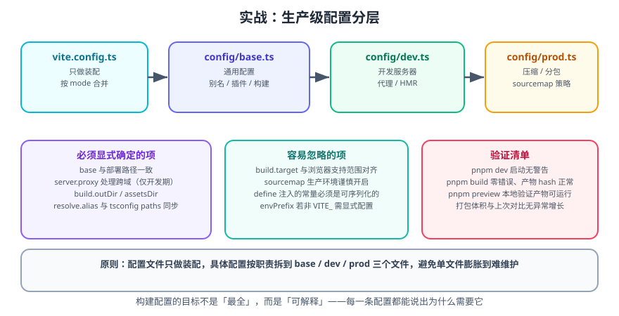

# 实战：生产级 Vite 配置

本页把一个「能跑」的 Vite 项目升级为「**能长期维护、能上生产**」的工程：配置分层、多环境、别名统一、分包与体积预算、以及一套可验证的交付清单。

一句话理解：**配置文件的复杂度必须可控**——单文件超过 200 行就该分层，否则半年后没人敢改。

## 1. 目标与约束

| 目标 | 具体约束 |
| --- | --- |
| 配置可维护 | `vite.config.ts` 只做装配，具体配置拆到 `config/` 下 |
| 多环境 | 开发 / 测试 / 生产三套接口地址与开关，不改代码 |
| 别名统一 | `@` 在 Vite 与 TypeScript 中行为一致 |
| 首屏可控 | 路由懒加载 + vendor 分包 + 体积预算 |
| 交付可验证 | 一套命令能验证 dev / build / preview 三个环节 |

## 2. 目录结构

```text
my-app/
├── config/
│   ├── index.ts          # 统一导出
│   ├── base.ts           # 通用配置
│   ├── dev.ts            # 开发服务器
│   └── prod.ts           # 构建与优化
├── env/
│   ├── .env              # 共享变量
│   ├── .env.development
│   ├── .env.staging
│   └── .env.production
├── src/
│   ├── main.ts
│   ├── router/index.ts
│   ├── vite-env.d.ts
│   └── types/env.d.ts    # 环境变量类型
├── vite.config.ts
└── package.json
```



::: danger 注意
上例把 `.env` 放在 `env/` 目录，需要在配置中设置 `envDir`，否则 Vite 默认只读项目根目录。**如果团队更习惯根目录，就不要改这个结构**——额外的心智负担往往不值得。
:::

## 3. 配置分层实现

### 3.1 通用配置

```ts [config/base.ts]
import { fileURLToPath, URL } from 'node:url'
import type { UserConfig } from 'vite'
import vue from '@vitejs/plugin-vue'
import { buildInfo } from '../plugins/build-info'

export function baseConfig(env: ImportMetaEnv): UserConfig {
  return {
    base: env.VITE_PUBLIC_PATH || '/',

    plugins: [
      vue(),
      buildInfo({ injectHtmlComment: env.MODE === 'production' }),
    ],

    resolve: {
      alias: {
        // 用 import.meta.url 推导，避免 ESM 下 __dirname 不存在
        '@': fileURLToPath(new URL('../src', import.meta.url)),
      },
    },

    define: {
      __APP_TITLE__: JSON.stringify(env.VITE_APP_TITLE || 'My App'),
    },
  }
}
```

### 3.2 开发配置

```ts [config/dev.ts]
import type { UserConfig, ConfigEnv } from 'vite'

export function devConfig(env: ImportMetaEnv, _configEnv: ConfigEnv): UserConfig {
  return {
    server: {
      host: true,
      port: Number(env.VITE_SERVER_PORT || 5173),
      open: env.VITE_AUTO_OPEN === 'true',
      proxy: {
        // 只代理需要跨域的接口，避免把所有请求都转发
        '/api': {
          target: env.VITE_BASE_URL || 'http://localhost:8080',
          changeOrigin: true,
          rewrite: (p) => p.replace(/^\/api/, ''),
        },
      },
      // 浏览器 console 转发到终端，便于排查运行时错误
      forwardConsole: {
        unhandledErrors: true,
        logLevels: ['warn', 'error'],
      },
    },
  }
}
```

### 3.3 生产配置

```ts [config/prod.ts]
import type { UserConfig } from 'vite'

export function prodConfig(env: ImportMetaEnv, mode: string): UserConfig {
  return {
    build: {
      outDir: env.VITE_OUTPUT_DIR || 'dist',
      target: 'baseline-widely-available',
      sourcemap: mode === 'staging', // 测试环境留 sourcemap 便于排障
      reportCompressedSize: false,
      chunkSizeWarningLimit: 800,
      rollupOptions: {
        output: {
          manualChunks(id) {
            if (!id.includes('node_modules')) {
              return
            }
            if (/[\\/]node_modules[\\/](vue|vue-router|pinia)[\\/]/.test(id)) {
              return 'vendor-vue'
            }
            return 'vendor-misc'
          },
          entryFileNames: 'assets/[name]-[hash].js',
          chunkFileNames: 'assets/[name]-[hash].js',
          assetFileNames: 'assets/[name]-[hash][extname]',
        },
      },
    },

    // 打包时移除 console 与 debugger
    esbuild: {
      drop: env.VITE_DROP_CONSOLE === 'true' ? ['console', 'debugger'] : [],
    },
  }
}
```

### 3.4 装配入口

```ts [vite.config.ts]
import { defineConfig, loadEnv, type ConfigEnv } from 'vite'
import { baseConfig } from './config/base'
import { devConfig } from './config/dev'
import { prodConfig } from './config/prod'

/** 把 .env 读出的字符串按需转换为布尔 / 数值 */
function normalizeEnv(raw: Record<string, string>, mode: string): ImportMetaEnv & Record<string, any> {
  const out: Record<string, any> = { MODE: mode }
  for (const [k, v] of Object.entries(raw)) {
    if (v === 'true' || v === 'false') {
      out[k] = v === 'true'
    } else if (v.trim() !== '' && !Number.isNaN(Number(v))) {
      out[k] = Number(v)
    } else {
      out[k] = v
    }
  }
  return out as ImportMetaEnv & Record<string, any>
}

export default defineConfig((configEnv: ConfigEnv) => {
  const { mode, command } = configEnv
  const raw = loadEnv(mode, process.cwd(), 'VITE_')
  const env = normalizeEnv(raw, mode)

  const isBuild = command === 'build'

  return {
    ...baseConfig(env),
    ...(isBuild ? prodConfig(env, mode) : devConfig(env, configEnv)),
  }
})
```

::: tip 分层原则
- **`base.ts`**：开发和生产都必须一致的东西（别名、通用插件、`define`）。
- **`dev.ts`**：只在 `vite dev` 有意义的东西（`server.*`）。
- **`prod.ts`**：只在 `vite build` 有意义的东西（`build.*`、压缩、分包）。
- **`vite.config.ts`**：只负责读环境变量、合并、导出。
:::

## 4. 环境变量文件

```text [env/.env]
VITE_APP_TITLE='My App'
VITE_PUBLIC_PATH='/'
VITE_OUTPUT_DIR='dist'
VITE_SERVER_PORT='5173'
VITE_DROP_CONSOLE='false'
VITE_AUTO_OPEN='false'
```

```text [env/.env.development]
VITE_BASE_URL='http://localhost:8080'
VITE_AUTO_OPEN='true'
VITE_DROP_CONSOLE='false'
```

```text [env/.env.staging]
VITE_BASE_URL='https://api-staging.example.com'
VITE_PUBLIC_PATH='/'
VITE_DROP_CONSOLE='false'
```

```text [env/.env.production]
VITE_BASE_URL='https://api.example.com'
VITE_PUBLIC_PATH='/'
VITE_DROP_CONSOLE='true'
```

```json [package.json]
{
  "scripts": {
    "dev": "vite",
    "build": "vite build",
    "build:staging": "vite build --mode staging",
    "preview": "vite preview",
    "type-check": "vue-tsc --noEmit",
    "analyze": "cross-env ANALYZE=true vite build"
  }
}
```

## 5. 类型声明

```ts [src/types/env.d.ts]
interface ImportMetaEnv {
  readonly MODE: string
  readonly VITE_APP_TITLE: string
  readonly VITE_PUBLIC_PATH: string
  readonly VITE_OUTPUT_DIR: string
  readonly VITE_BASE_URL: string
  readonly VITE_SERVER_PORT: string | number
  readonly VITE_DROP_CONSOLE: string | boolean
  readonly VITE_AUTO_OPEN: string | boolean
}

interface ImportMeta {
  readonly env: ImportMetaEnv
}

declare const __APP_TITLE__: string
```

```ts [src/vite-env.d.ts]
/// <reference types="vite/client" />

declare module '*.vue' {
  import type { DefineComponent } from 'vue'
  const component: DefineComponent<{}, {}, {}>
  export default component
}
```

## 6. 使用示例

```ts [src/main.ts]
import { createApp } from 'vue'
import App from './App.vue'
import { createAppRouter } from './router'

const app = createApp(App)
app.use(createAppRouter())
app.mount('#app')

if (import.meta.env.DEV) {
  // 开发环境打印关键配置，便于确认当前环境是否正确
  console.info('[env]', {
    MODE: import.meta.env.MODE,
    BASE_URL: import.meta.env.BASE_URL,
    API: import.meta.env.VITE_BASE_URL,
  })
}
```

```ts [src/router/index.ts]
import { createRouter, createWebHistory, type RouteRecordRaw } from 'vue-router'

const routes: RouteRecordRaw[] = [
  {
    path: '/',
    name: 'home',
    component: () => import('@/views/Home.vue'),
    meta: { title: '首页' },
  },
  {
    path: '/about',
    name: 'about',
    // 懒加载：只有访问该路由时才下载对应 chunk
    component: () => import('@/views/About.vue'),
    meta: { title: '关于' },
  },
]

export function createAppRouter() {
  return createRouter({
    history: createWebHistory(import.meta.env.BASE_URL),
    routes,
  })
}
```

## 7. 交付验证

### 7.1 三个环境的构建

```shell
# 开发
npm run dev
# 期望：终端打印 Local 与 Network 地址；http://localhost:5173/ 渲染正常

# 测试环境构建
npm run build:staging
# 期望：dist/ 生成；产物中的接口地址为 api-staging.example.com

grep -o "api-staging.example.com" dist/assets/*.js | head -n 1

# 生产构建
npm run build
grep -o "api.example.com" dist/assets/*.js | head -n 1

# 预览产物
npm run preview
# 期望：http://localhost:4173/ 页面正常，路由跳转与刷新均正常
```

### 7.2 体积检查

```shell
npm run analyze
# 打开 stats.html，确认：
# 1. vendor-vue 独立存在
# 2. 各路由 chunk 独立存在
# 3. 入口 chunk 的 gzip 体积在预算内
```

### 7.3 缓存稳定性检查

```shell
npm run build
ls dist/assets | grep vendor-vue   # 记录 hash
npm run build
ls dist/assets | grep vendor-vue   # hash 应完全一致
```

::: tip 如果 hash 变了
说明有东西在构建间不稳定，常见原因：
1. `manualChunks` 返回了不稳定的分组名。
2. 代码里用了 `Date.now()` 之类的构建期变量进入产物。
3. 插件注入了随机内容（如随机构建 ID）。
4. 产物里包含了绝对路径或时间戳。
:::

### 7.4 缓存策略与 Nginx

```nginx [nginx.conf]
server {
    listen 443 ssl http2;
    server_name example.com;
    root /var/www/my-app/dist;

    gzip_static on;
    brotli_static on;

    # 带 hash 的资源：长期缓存
    location /assets/ {
        expires 1y;
        add_header Cache-Control "public, immutable";
    }

    # 入口 HTML：绝不长期缓存
    location = /index.html {
        add_header Cache-Control "no-cache";
    }

    # SPA 路由回退
    location / {
        try_files $uri $uri/ /index.html;
    }
}
```

### 7.5 CI 流水线骨架

```yaml [.github/workflows/ci.yml]
name: CI

on:
  push:
    branches: [main]
  pull_request:

jobs:
  build:
    runs-on: ubuntu-latest
    steps:
      - uses: actions/checkout@v4

      - uses: pnpm/action-setup@v4
        with:
          version: 9

      - uses: actions/setup-node@v4
        with:
          node-version: 22          # 必须 ≥ 22.12
          cache: pnpm

      - run: pnpm install --frozen-lockfile
      - run: pnpm type-check
      - run: pnpm build

      # 体积预算门禁：入口 gzip 后超过 200 KB 则失败
      - name: Check bundle budget
        run: node scripts/check-budget.mjs
```

```js [scripts/check-budget.mjs]
import { readdirSync, statSync } from 'node:fs'
import { gzipSync } from 'node:zlib'
import { readFileSync } from 'node:fs'
import { join } from 'node:path'

const DIST = 'dist/assets'
const LIMIT_KB = 200

const entry = readdirSync(DIST).find((f) => f.startsWith('index-') && f.endsWith('.js'))
if (!entry) {
  console.error('未找到入口 JS，构建产物结构可能已变化')
  process.exit(1)
}

const file = join(DIST, entry)
const gz = gzipSync(readFileSync(file)).length / 1024
console.log(`入口 ${entry} gzip=${gz.toFixed(1)} KB（预算 ${LIMIT_KB} KB）`)

if (gz > LIMIT_KB) {
  console.error('体积超出预算，请检查是否引入了过大依赖或漏配懒加载')
  process.exit(1)
}
```

**验证方式**：本地 `pnpm build` 后 `node scripts/check-budget.mjs` 输出体积并返回码为 0；故意在入口引入一个大库后重跑，脚本返回码为 1 并给出提示。

## 8. 常见反模式

| 反模式 | 问题 | 正确做法 |
| --- | --- | --- |
| 所有配置堆在一个文件里并用 `if (mode === 'x')` 分支 | 难以维护，改动风险高 | 拆 `base` / `dev` / `prod` |
| 别名只在 `vite.config` 配，tsconfig 没配 | IDE 报错、`tsc` 失败 | 两处同步，或用 `resolve.tsconfigPaths` |
| 把接口真实域名写死在代码里 | 换环境要改代码 | 用 `VITE_` 环境变量 |
| 把密钥写进 `VITE_` 变量 | 密钥泄露到客户端 | 密钥只留在后端 |
| `base` 与部署路径不一致 | 生产白屏、资源 404 | 用 `VITE_PUBLIC_PATH` 统一管理 |
| 只有 `dev` 验证，从不跑 `preview` | 上线才发现问题 | 每次发布前跑 `preview` |
| 无体积预算 | 体积反复回退 | CI 加体积门禁 |

## 9. 参考资料

- [Vite 官方文档：配置](https://vite.dev/config/)
- [Vite 官方文档：环境变量与模式](https://vite.dev/guide/env-and-mode)
- [Vite 官方文档：部署静态站点](https://vite.dev/guide/static-deploy)
- [Vite 8 发布公告](https://vite.dev/blog/announcing-vite8)
- [rollup-plugin-visualizer](https://github.com/btd/rollup-plugin-visualizer)
