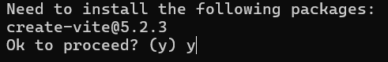
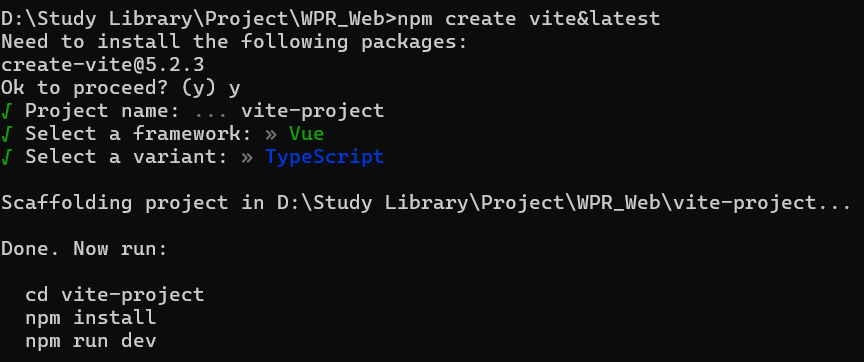
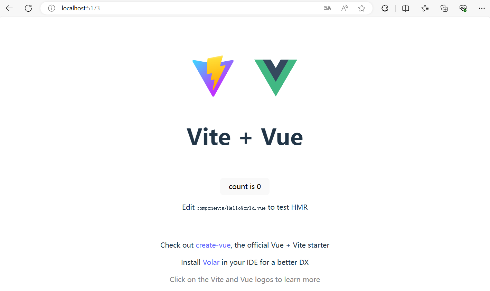

# Vite

Vite 是快速构建前端的脚手架

`Vite` 是新一代前端构建工具。具有统一的工程化规范：目录结构、代码规范、git提交规范 等
、自动化构建和部署：前端脚手架可以自动进行代码打包、压缩、合并、编译等常见的构建工作，可以通过集成自动化部署脚本，自动将代码部署到测试、生产环境等。

**官网地址**：https://vitejs.cn

**官方文档**：https://cn.vitejs.dev

`vite`的优势：

- 轻量快速的热重载（`HMR`），能实现极速的服务启动。
- 对 `TypeScript`、`JSX`、`CSS` 等支持开箱即用。
- 真正的按需编译，不再等待整个应用编译完成。

`webpack`构建 与 `vite`构建对比：

- webpack构建过程：从入口进来，先分析路由再分析模块，分析之后在进行处理，之后服务启动。路由过多，模块过多时，耗时较长

  

- vite构建过程：首先服务启动，请求进入入口时，进入对应的路由，之后处理模块来返回。没有访问的路由就不会处理

  

## 创建项目

`npm create vite@latest` 用于使用npm 包管理器创建一个vite项目

执行该命令会初始化一个新的项目，配置好必要的文件，并安装所有必要的依赖，包括安装好Vite本身(执行这个命令会自动安装Vite，不需要手动安装vite)

**注意**：Vite 需要 [Node.js](https://nodejs.org/en/) 版本 18+，20+。然而，有些模板需要依赖更高的 Node 版本才能正常运行，当包管理器发出警告时，请注意升级Node 版本。

**参数**：

- npm是Node Package Manager 的缩写，是Nodejs的包管理工具
- create是npm命令，用于创建新的npm包
- vite@latest 表示使用最新版本的vite

```shell
npm create vite&latest
```

提示：`Need to install the following packages`，输入y即可：



输入：项目名、前端框架、编程语言即可



按照提示：cd进入创建的项目 --> 安装项目依赖(npm install) --> 运行项目(npm run dev)


访问：http://localhost:5173/



## 安装依赖

```shell
npm install #安装项目所有依赖

npm install axios #安装指定依赖到当前项目
npm install -g xxx # 全局安装
```

## 项目启动

```shell
npm run dev #启动项目
```

## 项目打包

```shell
npm run build #构建后 生成 dist 文件夹
```

## 项目部署

把 dist 文件夹内容部署到如 nginx 之类的服务器上。

## 更改配置

当以命令行方式运行 `vite` 时，Vite 会自动解析 项目根目录 下名为 `vite.config.js` 的配置文件 (支持其他 JS 和 TS 扩展名)。

### 设置端口号

使用`server.port`指定开发服务器端口。

**注意**：如果端口已经被使用，Vite 会自动尝试下一个可用的端口，所以这可能不是开发服务器最终监听的实际端口。

- **类型：** `number`
- **默认值：** `5173`

https://cn.vitejs.dev/config/server-options.html#server-port

```typescript
import { defineConfig } from 'vite'
import vue from '@vitejs/plugin-vue'

// https://vitejs.dev/config/
export default defineConfig({
  plugins: [vue()],
  server: {
    port: 9999, //设置端口号
  },
})
```

### 设置自动打开程序

使用`server.open`开启在开发服务器启动时，自动在浏览器中打开应用程序。当该值为字符串时，它将被用作 URL 的路径名。如果想在喜欢的某个浏览器打开该开发服务器，你可以设置环境变量 `process.env.BROWSER` （例如 `firefox`）。还可以设置 `process.env.BROWSER_ARGS` 来传递额外的参数（例如 `--incognito`）。

`BROWSER` 和 `BROWSER_ARGS` 都是特殊的环境变量，你可以将它们放在 `.env` 文件中进行设置。

- **类型：** `boolean | string`

官方教程：https://cn.vitejs.dev/config/server-options.html#server-open

```typescript
import { defineConfig } from 'vite'
import vue from '@vitejs/plugin-vue'

// https://vitejs.dev/config/
export default defineConfig({
  plugins: [vue()],
  server: {
    port: 9999, //设置端口号
    open: true, //设置自动打开浏览器
  },
})
```

也可以在package.json配置文件中设置自动打开：

```json
"scripts": {
  "dev": "vite --open",
  "build": "run-p type-check \"build-only {@}\" --",
  "preview": "vite preview",
  "build-only": "vite build",
  "type-check": "vue-tsc --build --force"
},
```

### 配置IP地址

使用`server.host`指定服务器应该监听哪个 IP 地址。 如果将此设置为 `0.0.0.0` 或者 `true` 将监听所有地址，包括局域网和公网地址。

也可以通过 CLI 使用 `--host 0.0.0.0` 或 `--host` 来设置。

- **类型：** `string | boolean`
- **默认：** `'localhost'`

官方教程：https://cn.vitejs.dev/config/server-options.html#server-host

```typescript
import { defineConfig } from 'vite'
import vue from '@vitejs/plugin-vue'

// https://vitejs.dev/config/
export default defineConfig({
  plugins: [vue()],
  server: {
    port: 9999, //设置端口号
    open: true, //设置自动打开浏览器
    host: '0.0.0.0', //设置IP
  },
})
```


### 配置 HMR 连接

使用 `server.hmr`禁用或配置 HMR 连接 (用于 HMR websocket 必须使用不同的 http 服务器地址的情况)。

- **类型：** `boolean | { protocol?: string, host?: string, port?: number, path?: string, timeout?: number, overlay?: boolean, clientPort?: number, server?: Server }`

官方教程：https://cn.vitejs.dev/config/server-options.html#server-hmr

```typescript
import { defineConfig } from 'vite'
import vue from '@vitejs/plugin-vue'

// https://vitejs.dev/config/
export default defineConfig({
  plugins: [vue()],
  server: {
    port: 9999, //设置端口号
    open: true, //设置自动打开浏览器
    host: '0.0.0.0', //设置IP
    hmr: true,
  },
})
```

### 配置@路径别名

path模块是node.js的内置模块。而node.js默认不支持ts文件，所以需要安装：

```shell
npm install @types/node --save-dev
```

修改vite.config.ts：

```typescript
import { defineConfig } from 'vite'
import vue from '@vitejs/plugin-vue'
import { resolve } from 'path'

// https://vitejs.dev/config/
export default defineConfig({
  plugins: [vue()],
  server: {
    port: 9999, //设置端口号
    open: true, //设置自动打开浏览器
    host: '0.0.0.0', //设置IP
  },
  resolve: {
    alias: [
      {
        find: '@',
        replacement: resolve(__dirname, 'src'),
      },
    ],
  },
})
```

在tsconfig.json配置：

```json
{
  "compilerOptions": {
	...

    "baseUrl": ".",
    "paths": {
      "@/*":[
        "src/*"
      ]
    }
  },
...
}
```

如果别名配置还报错，src下新建`vite-env.d.ts`

> vite-env.d.ts

```typescript
// <reference types="vite/client" />

declare module '*.vue' {
  import type { DefineComponent } from 'vue'
  const component: DefineComponent<{}, {}, any>
  export default component
}
```

## 环境变量

官方文档：https://cn.vitejs.dev/guide/env-and-mode

Vite 支持 `.env` 文件定义环境变量，需以 `VITE_` 开头才能在客户端访问：

```sh
# 自定义环境变量（必须以 VITE_ 开头）

# 应用标题
VITE_APP_TITLE='Vite App'

# 打包输出目录
VITE_OUTPUT_DIR='dist'

# 资源基础路径
VITE_PUBLIC_PATH='/'

# API 接口地址
VITE_BASE_API='/api'

# 接口代理地址
VITE_BASE_URL='https://example.com'

# 超时时间（毫秒）
VITE_REQUEST_TIMEOUT='10000'

# 是否移除 console
VITE_DROP_CONSOLE='true'

# 是否自动打开浏览器
VITE_AUTO_OPEN='false'
```

### TypeScript 类型声明

为保证环境变量的类型安全，可在 `types/vite-env.d.ts` 中声明：

```typescript [types/vite-env.d.ts]
/** 原生读取出的环境变量类型 */
interface ImportMetaEnv {
  /** 应用默认标题 */
  VITE_APP_TITLE: string
  /** 后端接口公共路径 */
  VITE_BASE_API: string
  /** 后端接口代理地址 */
  VITE_BASE_URL: string
  /** 指定打包文件的输出目录 */
  VITE_OUTPUT_DIR: string
  /** 部署应用包时的基本 URL */
  VITE_PUBLIC_PATH: string
  /** 路由模式 */
  VITE_ROUTER_MODE: 'hash' | 'history'

  /** 开发服务器的监听端口 */
  VITE_DROP_CONSOLE: string
  /** 打包后移除所有的 console、debugger */
  VITE_SERVER_PORT: string
  /** 请求超时时间 单位秒 */
  VITE_REQUEST_TIMEOUT: string
  /** 是否自动打开浏览器 */
  VITE_AUTO_OPEN: string
  /** 是否开启路由加载时的顶部进度条 */
  VITE_ROUTER_NPROGRESS: string
  /** 是否开启请求接口时的顶部进度条 */
  VITE_REQUEST_NPROGRESS: string
  /** 打包后是否移除所有的注释 */
  VITE_CLEAR_COMMENT: string
}

/** 原生读取出的环境变量经过处理后的类型 */
interface ViteEnv extends Omit<ImportMetaEnv, 'BASE_URL'> {
  /** 当前运行模式 */
  MODE: string
  /** 是否为开发环境 */
  DEV: boolean
  /** 是否为生产环境 */
  PROD: boolean
  /** 开发服务器的监听端口 */
  VITE_SERVER_PORT: number
  /** 请求超时时间 单位秒 */
  VITE_REQUEST_TIMEOUT: number
  /** 是否自动打开浏览器 */
  VITE_AUTO_OPEN: boolean
  /** 打包后移除所有的 console、debugger */
  VITE_DROP_CONSOLE: boolean
  /** 是否开启路由加载时的顶部进度条 */
  VITE_ROUTER_NPROGRESS: boolean
  /** 是否开启请求接口时的顶部进度条 */
  VITE_REQUEST_NPROGRESS: boolean
  /** 打包后是否移除所有的注释 */
  VITE_CLEAR_COMMENT: boolean
}

/** 让 Vite 识别 env 类型 */
interface ImportMeta {
  /** 利用 Readonly 泛型工具类全部修改为只读属性 */
  readonly env: Readonly<ImportMetaEnv>
}

/** 处理后的环境变量（全局可用） */
/** 原生读取出的环境变量经过处理后的类型 src 下任意位置可用此访问 类比 __dirname 使用 */
declare const __RUNTIME_CONFIG__: ViteEnv
```

### 处理.env变量

在 `vite.config.ts` 处理 `.env` 变量，转换为正确的类型：

```typescript
import { defineConfig, loadEnv } from 'vite'

/** 处理环境变量 */
function warpperEnv(envConfing: Recordable<string>, mode: string): ViteEnv {
  const runtimeConfig = {} as ViteEnv
  runtimeConfig.MODE = mode
  runtimeConfig.DEV = mode === 'development'
  runtimeConfig.PROD = mode === 'production'
  for (const [key, value] of Object.entries(envConfing)) {
    // 默认先给原值 其后看情况处理
    runtimeConfig[key] = value
    // 布尔值
    if (typeof value === 'string' && ['true', 'false'].includes(value)) {
      runtimeConfig[key] = value === 'true' ? true : false
    }
    // 数值
    if (typeof value === 'string' && !Number.isNaN(Number(value))) {
      runtimeConfig[key] = +value // 数值类型处理
    }
  }
  return runtimeConfig
}

export default defineConfig(({ mode }) => {
  // 根据当前工作目录中的 `mode` 加载 .env 文件
  // 设置第三个参数为 '' 来加载所有环境变量，而不管是否有 `VITE_` 前缀
  const runtimeConfig = warpperEnv(loadEnv(mode, root, 'VITE_'), mode) // 对原生环境变量进行二次处理

  return {
    define: {
      /** 将处理后的环境变量定义为全局常量 */
      __RUNTIME_CONFIG__: runtimeConfig,
    },

    // 部署应用包时的基本 URL
    base: runtimeConfig.VITE_PUBLIC_PATH,

    esbuild: {
      // 打包后是否移除所有的 console、debugger
      drop: runtimeConfig.VITE_DROP_CONSOLE ? ['console', 'debugger'] : [],
      // 打包后是否移除所有的注释
      legalComments: runtimeConfig.VITE_CLEAR_COMMENT ? 'none' : 'inline',
    },
  }
})
```

### 在Vue组件中使用环境变量

在 `src/views/Dashboard/index.vue` 组件中：

```vue
<script setup lang="ts">
defineOptions({ name: 'Dashboard' })

// 直接访问全局环境变量
const VITE_APP_TITLE = __RUNTIME_CONFIG__.VITE_APP_TITLE
console.log('应用标题:', VITE_APP_TITLE) // Vite App
</script>
```

### 在TypeScript代码中使用

在 `src/utils/request.ts` 配置 Axios：

```typescript
import axios from 'axios'

const request = axios.create({
  // API 基础路径
  baseURL: __RUNTIME_CONFIG__.VITE_BASE_API,
  // 超时时间（转换为毫秒）
  timeout: __RUNTIME_CONFIG__.VITE_REQUEST_TIMEOUT * 1000,
})

export default request
```
