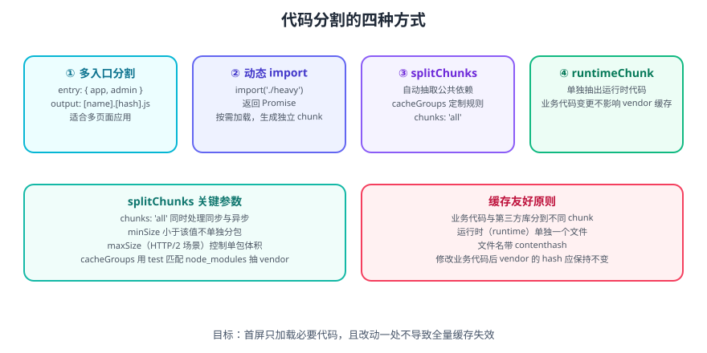

# Webpack 代码分割

**代码分割（Code Splitting）是把产物拆成多个 chunk、按需加载的技术**。它直接决定首屏体积与缓存命中率，是 Webpack 生产优化的头号课题。



## 一句话定位

代码分割解决的核心矛盾是：**「用户不需要在首屏加载全部代码」** 与 **「浏览器缓存需要粒度足够细才有效」**。前者靠按需加载（懒加载），后者靠合理分包。

## 为什么要分割

未分割的单 bundle 有两个致命问题：

1. **首屏体积大**：一个 3MB 的 `bundle.js` 会拖慢首次渲染，且解析执行时间长。
2. **缓存全失效**：改一行业务代码，`bundle.js` 的整体 hash 变化，用户要重新下载全部内容（含体积最大的第三方库）。

分割后：首屏只加载必要 chunk；第三方库单独成 chunk，业务改动不影响它的缓存。

## 四种分割方式

### ① 多入口分割

适合多页应用（MPA），每个页面一个入口、一个 chunk：

```javascript [webpack.config.js]
module.exports = {
  entry: {
    app: './src/app.js',
    admin: './src/admin.js',
  },
  output: {
    filename: '[name].[contenthash:8].js',
    path: require('node:path').resolve(__dirname, 'dist'),
  },
  plugins: [
    new HtmlWebpackPlugin({ filename: 'app.html', chunks: ['app'] }),
    new HtmlWebpackPlugin({ filename: 'admin.html', chunks: ['admin'] }),
  ],
};
```

::: warning 说明
多入口下若两个入口都引了同一份库，Webpack 默认会**各打一份**（重复），需要配合 `splitChunks` 抽取公共部分（见方式③）。
:::

### ② 动态 import

在代码里用 `import()` 按需加载，Webpack 自动为该模块生成独立 chunk：

```javascript [src/index.js]
document.getElementById('btn').addEventListener('click', async () => {
  const { renderChart } = await import(/* webpackChunkName: "chart" */ './chart.js');
  renderChart();
});
```

`/* webpackChunkName: "chart" */` 这个 **魔法注释**指定 chunk 名，否则会生成 `1.js`、`2.js` 这类无语义的文件名。

::: danger 注意
1. **动态 import 必须出现在顶层作用域之外**。写在 `if` / `function` 里没问题，但若 Webpack 无法静态分析（例如 `import(someVariable)`），会报「Critical dependency: the request of a dependency is an expression」，且无法分割。
2. **路径要可静态推断**：`import('./views/' + name + '.js')` 只能做**目录级**上下文分割（会把整个目录打成一个 chunk），不要指望它只加载匹配到的那一个文件。
3. 动态 import 返回 `Promise`，**别忘了 `await` 或 `.then`**，否则 chunk 永远不加载。
:::

### ③ splitChunks：自动抽取公共依赖

这是最核心的分包配置：

```javascript [webpack.config.js]
optimization: {
  splitChunks: {
    chunks: 'all',            // 同时处理同步与异步引用
    minSize: 20000,           // 小于 20KB 不单独分包
    maxAsyncRequests: 30,     // 异步请求上限
    maxInitialRequests: 30,   // 入口并行请求上限
    cacheGroups: {
      // 第三方库抽到 vendor
      vendors: {
        test: /[\\/]node_modules[\\/]/,
        name: 'vendors',
        priority: 10,
        reuseExistingChunk: true,
      },
      // 被两个以上入口引用才抽公共
      common: {
        name: 'common',
        minChunks: 2,
        priority: 5,
        reuseExistingChunk: true,
      },
    },
  },
}
```

关键参数：

| 参数 | 含义 | 建议 |
| --- | --- | --- |
| `chunks` | 作用范围：`'async'`（默认）/ `'initial'` / `'all'` | 用 `'all'` |
| `minSize` | 分包最小体积，小于则不拆 | 20KB 左右 |
| `maxSize` | 单个 chunk 最大体积（HTTP/2 场景） | 谨慎使用，见下 |
| `minChunks` | 被引用的最小次数 | 2 |
| `cacheGroups` | 自定义分组规则 | 至少配 `vendors` |
| `priority` | 规则优先级，数字大者先匹配 | 大库给高值 |
| `reuseExistingChunk` | 复用已存在的 chunk | `true` |

::: danger 注意
`maxSize` **不是硬性上限**：它只在模块可被进一步拆分时才生效。对一个巨大的 `node_modules` 包（如 `lodash` 单文件）设置 `maxSize` 无效。网络请求数也要权衡——HTTP/2 下多请求开销小，但过度分包仍会增加解析与调度成本。
:::

### ④ runtimeChunk：抽出运行时代码

Webpack 的运行时（负责模块加载、chunk 调度）默认内联在入口 chunk 里。业务代码一变，入口 hash 变，运行时也变——但运行时一变，**所有依赖它的 chunk 的 hash 都会连锁变化**。

```javascript
optimization: {
  runtimeChunk: 'single',   // 抽出一个单独的 runtime chunk
}
```

这就是「改一行代码导致全部缓存失效」的根因，**生产环境务必开启**。

## 缓存友好的分包原则


| 原则 | 做法 |
| --- | --- |
| 业务与第三方分离 | `cacheGroups.vendors` 抽 `node_modules` |
| 运行时单独一个文件 | `runtimeChunk: 'single'` |
| 文件名用 `contenthash` | **绝不用 `[hash]`** |
| 稳定模块 id | `moduleIds: 'deterministic'`、`chunkIds: 'deterministic'` |

验证缓存是否真的生效：

```shell
# 第一次构建
npx webpack --config build/webpack.prod.js
ls dist/js

# 只改业务代码里的一行，再构建
npx webpack --config build/webpack.prod.js
ls dist/js   # vendors 与 runtime 的 hash 应保持不变
```

::: tip 建议
把「hash 稳定性」纳入 CI 检查：连续两次构建（第二次不改任何文件）产出的文件名应完全一致；只改业务代码时，`vendors.*.js` 的文件名应不变。这能在上线前发现绝大多数缓存问题。
:::

## 按路由懒加载的实战写法

以「列表页 → 详情页」为例，详情页较重且非首屏必需，应懒加载：

```javascript [src/router.js]
const routes = [
  { path: '/', load: () => import('./pages/List.js') },
  { path: '/detail/:id', load: () => import(/* webpackChunkName: "detail" */ './pages/Detail.js') },
  // 魔法注释还可加预取/预加载
  { path: '/about', load: () => import(/* webpackChunkName: "about" */ /* webpackPrefetch: true */ './pages/About.js') },
];

export async function render(path) {
  const route = routes.find((r) => r.path === path) || routes[0];
  const mod = await route.load();
  document.getElementById('app').innerHTML = mod.render();
}
```

魔法注释清单：

| 注释 | 作用 |
| --- | --- |
| `webpackChunkName: "name"` | 指定 chunk 名 |
| `webpackPrefetch: true` | 空闲时**预取**（`<link rel="prefetch">`） |
| `webpackPreload: true` | 与父 chunk 并行**预加载**（`<link rel="preload">`） |
| `webpackMode: "lazy"` | 默认模式，按需加载 |
| `webpackIgnore: true` | 不处理该 import，保留原生 `import()` |

::: warning 说明
`webpackPrefetch` 适合「下一步大概率要用」的资源（如首页预取详情页），`webpackPreload` 适合「当前导航立即需要」的资源。**滥用 prefetch 会抢占首屏带宽**，反而拖慢 LCP。
:::

## 分割带来的副作用

| 副作用 | 缓解方式 |
| --- | --- |
| 请求数增加 | 控制 `maxInitialRequests`，避免碎片化 |
| 首屏需要多轮请求（瀑布） | 关键路由**不要**懒加载，或使用 `preload` |
| 懒加载导致交互延迟 | 对可预测的操作提前 `prefetch` |
| chunk 命名混乱 | 统一用 `webpackChunkName` 魔法注释 |

## 参考资料

- [Webpack 官方 Code Splitting](https://webpack.js.org/guides/code-splitting/)
- [Webpack 官方 SplitChunksPlugin](https://webpack.js.org/plugins/split-chunks-plugin/)
- [Webpack 魔法注释](https://webpack.js.org/api/module-methods/#magic-comments)
