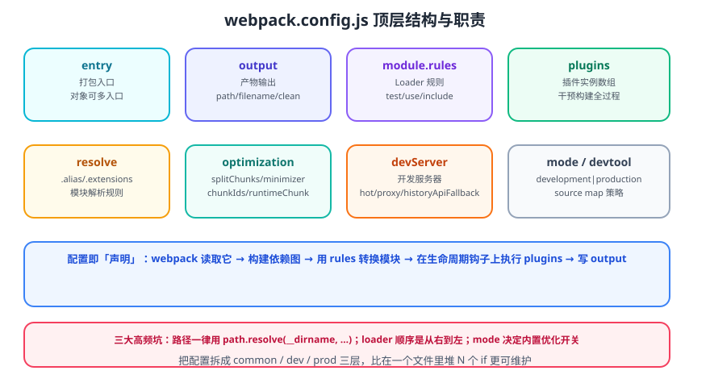

# Webpack 配置详解

Webpack 的配置就是一份**声明式描述**：告诉它从哪进（`entry`）、怎么转（`module.rules`）、在哪出（`output`）、中途挂什么钩子（`plugins`）。理解每个顶层字段的职责，比死记配置片段更重要。



## 一句话定位

`webpack.config.js` 是一个 Node.js 模块，导出一个**配置对象**（或返回配置对象的函数 / 配置数组）。它被 `webpack-cli` 读取后交给 `webpack()` 执行。

```javascript [webpack.config.js]
const path = require('node:path');

/** @type {import('webpack').Configuration} */
module.exports = {
  mode: 'production',
  entry: './src/index.js',
  output: {
    path: path.resolve(__dirname, 'dist'),
    filename: '[name].[contenthash:8].js',
    clean: true,
  },
};
```

::: tip 一句话理解
配置对象 = **告诉 Webpack「做什么」**，而 Loader / Plugin 是**告诉它「怎么做」**。先有配置骨架，再往下填细节。
:::

## 顶层字段一览

| 字段 | 作用 | 常用程度 |
| --- | --- | --- |
| `entry` | 构建入口，可字符串 / 数组 / 对象（多入口） | 必填 |
| `output` | 产物位置、文件名、清理策略、公共路径 | 必填 |
| `module.rules` | Loader 规则数组，按 `test` 匹配文件 | 必填 |
| `plugins` | 插件实例数组 | 极常用 |
| `resolve` | 模块解析规则（别名、扩展名、mainFields） | 极常用 |
| `optimization` | 分包、压缩、chunkId、runtimeChunk | 常用 |
| `devServer` | 开发服务器（`webpack-dev-server`） | 开发必用 |
| `mode` | `development` / `production` / `none` | 必填 |
| `devtool` | source map 生成策略 | 常用 |
| `target` | 目标环境（`web` / `node` / `browserslist`） | 常用 |
| `cache` | 持久化缓存配置 | 常用 |
| `externals` | 排除外部依赖，不打进产物 | 按需 |
| `performance` | 体积警告阈值 | 按需 |
| `stats` | 控制构建日志详细程度 | 按需 |

## entry：入口

三种写法，越往后能力越强：

```javascript
// ① 单入口（简写）
entry: './src/index.js'

// ② 数组入口：多个文件合并进同一个 chunk（共用一份运行时代码）
entry: ['./src/polyfills.js', './src/index.js']

// ③ 对象入口：多入口，key 即 chunk 名，可用于多页应用
entry: {
  app: './src/app.js',
  admin: './src/admin.js',
}
```

::: warning 说明
对象入口下必须配合 `output.filename: '[name].js'`，否则多个入口会互相覆盖。
:::

### 动态入口

入口可以是函数，适合按文件系统自动收集页面：

```javascript [webpack.config.js]
const glob = require('glob');

entry: () =>
  Object.fromEntries(
    glob.sync('./src/pages/*/index.js').map((file) => [
      file.replace('./src/pages/', '').replace('/index.js', ''),
      file,
    ]),
  );
```

## output：输出

```javascript [webpack.config.js]
output: {
  path: path.resolve(__dirname, 'dist'),   // 必须是绝对路径
  filename: 'js/[name].[contenthash:8].js',
  chunkFilename: 'js/[name].[contenthash:8].chunk.js',
  assetModuleFilename: 'assets/[name].[hash:6][ext]',
  publicPath: '/',                          // CDN 场景可写完整域名
  clean: true,                              // 构建前清空 output.path
}
```

### 占位符（Template Strings）

| 占位符 | 含义 | 说明 |
| --- | --- | --- |
| `[name]` | chunk 名称 | 入口 key 或自动生成的名称 |
| `[id]` | chunk id | 生产环境默认为确定性短 id |
| `[hash]` | 整个构建的哈希 | **任一文件变化都会变**，慎用 |
| `[chunkhash]` | 单个 chunk 的哈希 | 同一 chunk 内变化才变 |
| `[contenthash]` | 基于内容计算的哈希 | **缓存首选**，改内容才变 |
| `[ext]` | 文件扩展名（含点） | Asset Modules 用 |
| `[query]` | `?` 后面的查询串 | 按需 |

::: danger 注意
1. **`[hash]` 不要用于长期缓存**：改一个文件会让所有产物 hash 变化，缓存全失效。
2. **`path` 必须是绝对路径**：`path: 'dist'` 在部分平台会报错或写错位置，统一用 `path.resolve(__dirname, 'dist')`。
3. **`publicPath` 配置错误**会导致 HTML 引用的 JS/CSS 404，尤其是部署到子路径或 CDN 时。
:::

## module.rules：Loader 规则

```javascript [webpack.config.js]
module: {
  rules: [
    {
      test: /\.css$/,
      include: path.resolve(__dirname, 'src'),
      use: ['style-loader', 'css-loader'],   // 从右到左执行
    },
    {
      test: /\.(png|jpe?g|gif|svg)$/i,
      type: 'asset',                          // Asset Modules
      parser: { dataUrlCondition: { maxSize: 8 * 1024 } },
      generator: { filename: 'images/[hash:8][ext]' },
    },
  ],
},
```

规则对象的常用字段：

| 字段 | 作用 |
| --- | --- |
| `test` | 匹配文件路径的正则 |
| `include` | 只处理该目录，**强烈建议配置** |
| `exclude` | 排除目录，通常写 `/node_modules/` |
| `use` | Loader 数组（可带 options 对象） |
| `loader` | 单个 Loader 的简写 |
| `type` | Asset Modules 类型：`asset` / `asset/resource` / `asset/inline` / `asset/source` |
| `oneOf` | 命中第一个规则后停止匹配，减少重复 |
| `enforce` | `'pre'` / `'post'` 调整执行时机 |
| `sideEffects` | 影响 tree shaking 的副作用标记 |

### oneOf：性能优化利器

默认所有规则都会尝试匹配。用 `oneOf` 包裹后，**一命中即停**，可显著减少匹配开销：

```javascript
module: {
  rules: [
    {
      oneOf: [
        { test: /\.css$/, use: ['style-loader', 'css-loader'] },
        { test: /\.scss$/, use: ['style-loader', 'css-loader', 'sass-loader'] },
        { test: /\.ts$/, use: 'ts-loader' },
      ],
    },
    // 不走 oneOf 的兜底规则放这里
  ],
}
```

## resolve：模块解析

```javascript [webpack.config.js]
resolve: {
  alias: {
    '@': path.resolve(__dirname, 'src'),
    '@components': path.resolve(__dirname, 'src/components'),
  },
  extensions: ['.ts', '.tsx', '.js', '.jsx', '.json'],
  mainFields: ['browser', 'module', 'main'],
  modules: [path.resolve(__dirname, 'src'), 'node_modules'],
},
```

::: warning 说明
`extensions` 数组越长，解析越慢。**不要加 `.css`、`.png` 这类非 JS 扩展**，只在 import 时不写后缀的场景添加必要项。别名修改后记得同步 `tsconfig.json` 的 `paths`，否则 IDE 与 TS 编译会不认。
:::

## optimization：优化

```javascript [webpack.config.js]
optimization: {
  minimize: true,
  minimizer: ['...'],                   // '...' 表示保留默认压缩器
  splitChunks: { chunks: 'all' },
  runtimeChunk: 'single',
  moduleIds: 'deterministic',
  chunkIds: 'deterministic',
  usedExports: true,                    // tree shaking 依赖它
}
```

详见 [构建优化](../Optimize/index.md) 与 [代码分割](../CodeSplitting/index.md)。

## mode 与 devtool

`mode` 不是「开关一个变量」，而是**一整套内置优化的预设**：

| mode | 内置行为 |
| --- | --- |
| `development` | `NODE_ENV=development`、`devtool: eval`、不压缩、开启 `namedModules` |
| `production` | `NODE_ENV=production`、压缩、tree shaking、`deterministic` id、`sideEffects` 优化 |
| `none` | 不预设任何优化，完全手动 |

```javascript
devtool: isProd ? 'source-map' : 'eval-cheap-module-source-map';
```

| devtool | 构建速度 | 质量 | 适用 |
| --- | --- | --- | --- |
| `eval` | 最快 | 差（不映射行号） | 开发快速迭代 |
| `eval-cheap-module-source-map` | 快 | 较好（只到行） | **开发推荐** |
| `source-map` | 慢 | 最好（独立文件） | **生产推荐** |
| `hidden-source-map` | 慢 | 好但不上报 | 生产 + 错误监控 |
| `false` | 最快 | 无 | 不关心排障的极端场景 |

::: danger 注意
1. **生产环境不要用 `eval` 系列**：会把源码以字符串形式内联到 bundle 里，体积暴涨且暴露源码。
2. **开发环境不要用完整 `source-map`**：构建与重建速度会明显变慢。
3. `mode` 与 `NODE_ENV` 是两回事，但 `mode: 'production'` 会自动把 `process.env.NODE_ENV` 替换为 `"production"`（通过 DefinePlugin 内置行为），业务代码里的分支才能被 tree shaking 掉。
:::

## 配置分层：common / dev / prod

单文件堆 `if (isProd)` 会让配置迅速失控。推荐按环境拆三层，用 `webpack-merge` 合并：

```text
build/
├─ webpack.common.js   # 入口 / 输出 / 通用 loader / 插件
├─ webpack.dev.js      # devServer / HMR / sourcemap
└─ webpack.prod.js     # 压缩 / 分包 / 缓存
```

```javascript [build/webpack.common.js]
const path = require('node:path');
const HtmlWebpackPlugin = require('html-webpack-plugin');

module.exports = {
  entry: './src/index.js',
  output: {
    path: path.resolve(__dirname, '../dist'),
    filename: 'js/[name].[contenthash:8].js',
    clean: true,
  },
  module: {
    rules: [
      { test: /\.tsx?$/, use: 'ts-loader', exclude: /node_modules/ },
      { test: /\.css$/, use: ['style-loader', 'css-loader'] },
    ],
  },
  resolve: { extensions: ['.tsx', '.ts', '.js'] },
  plugins: [new HtmlWebpackPlugin({ template: './public/index.html' })],
};
```

```javascript [build/webpack.prod.js]
const { merge } = require('webpack-merge');
const common = require('./webpack.common.js');

module.exports = merge(common, {
  mode: 'production',
  devtool: 'source-map',
  optimization: {
    splitChunks: { chunks: 'all' },
    runtimeChunk: 'single',
  },
  cache: { type: 'filesystem' },
});
```

```json [package.json]
{
  "scripts": {
    "dev": "webpack serve --config build/webpack.dev.js",
    "build": "webpack --config build/webpack.prod.js"
  }
}
```

## 配置文件用 ESM / TypeScript

`webpack-cli 7` 支持直接加载 ESM 与 TS 配置（TS 走 Node 原生类型剥离）：

```javascript [webpack.config.mjs]
import path from 'node:path';
import { fileURLToPath } from 'node:url';

const __dirname = path.dirname(fileURLToPath(import.meta.url));

export default {
  mode: 'production',
  output: { path: path.resolve(__dirname, 'dist') },
};
```

::: warning 说明
项目 `package.json` 若声明了 `"type": "module"`，`.js` 配置会被当作 ESM；此时 `require` / `module.exports` 会报错，要么改名 `.cjs`，要么改成 `export default`。
:::

## 验证配置

```shell
# 打印解析后的完整配置（含默认值），排查"我明明配了为什么不生效"
npx webpack configtest ./build/webpack.prod.js

# 只输出错误，适合 CI
npx webpack --config build/webpack.prod.js --stats errors-only
```

::: tip 建议
写配置时最有效的习惯是**一次只改一个字段并立即构建验证**。Webpack 配置项之间会互相影响（例如 `splitChunks` 与 `output.filename` 的 chunk 命名联动），一次性大改很难定位问题。
:::

## 参考资料

- [Webpack 官方配置文档](https://webpack.js.org/configuration/)
- [Webpack 官方 Output 占位符说明](https://webpack.js.org/configuration/output/#template-strings)
- [webpack-merge 官方文档](https://github.com/survivejs/webpack-merge)
