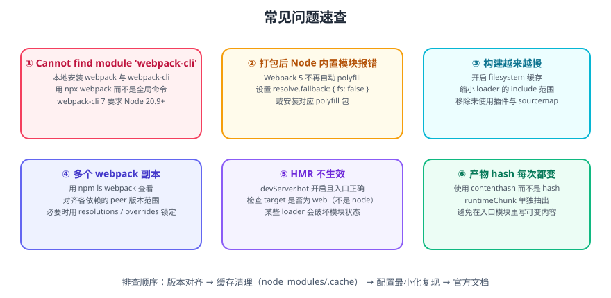

# Webpack 常见问题与最佳实践

本篇汇总 Webpack 5 使用中的高频问题、报错与最佳实践，按「版本与安装 → 配置 → 性能 → 缓存 → 排障」组织，便于速查。



## 版本与安装

### webpack 与 webpack-cli 的关系

Webpack 5 起，CLI 被拆成独立包，**必须同时安装**：

```shell
npm i -D webpack webpack-cli
```

::: danger 注意
1. **不要全局安装 webpack**：不同项目依赖的版本不同，全局版本极易冲突。统一用 `npx webpack`（读本地 `node_modules`）。
2. `webpack-cli 7` 要求 **Node.js 20.9+ 与 webpack 5.101+**；Node 版本过低会报 engine 不匹配。
3. 出现 `Cannot find module 'webpack-cli'` 时，先确认它被装在 `devDependencies`，而不是只看 `package.json` 里有没有写。
:::

### 检查版本

```shell
npx webpack --version
node -v
npm ls webpack
```

### 多个 webpack 副本

`npm ls webpack` 显示多个版本时，说明各依赖的 `peerDependencies` 范围不一致。处理顺序：

1. 对齐各插件版本，使其 peer 范围重叠。
2. 用 `overrides`（npm）/ `resolutions`（yarn、pnpm）强制统一。
3. 实在无法统一时，考虑升级或替换版本落后的插件。

```json [package.json]
{
  "overrides": {
    "webpack": "5.101.0"
  }
}
```

## 配置类问题

### Node 内置模块报错

**现象**：`Module not found: Error: Can't resolve 'fs'` / `path` / `crypto`。

**原因**：Webpack 5 **不再自动注入 Node 内置模块的 polyfill**（这是 4 → 5 的重大变更）。

**处理**：

```javascript [webpack.config.js]
resolve: {
  fallback: {
    fs: false,        // 明确不需要，直接置 false
    path: require.resolve('path-browserify'),
    crypto: require.resolve('crypto-browserify'),
    buffer: require.resolve('buffer/'),
    stream: require.resolve('stream-browserify'),
  },
}
```

::: tip 建议
先判断「真的需要在浏览器用这个模块吗」。很多 `fs` / `path` 报错来自某依赖在 Node 环境下才走的分支，`fallback: { fs: false }` 就够了，装 polyfill 反而增大体积。
:::

### 未处理的告警

```javascript [webpack.config.js]
ignoreWarnings: [
  { module: /node_modules\/some-lib/, message: /Critical dependency/ },
],
```

::: warning 说明
`ignoreWarnings` 只适合「已知且无害」的告警。**不要为了日志干净屏蔽所有告警**，那会埋掉真正的问题（如动态导入无法静态分析）。
:::

### `process.env` 未定义

```javascript [webpack.config.js]
const webpack = require('webpack');

plugins: [
  new webpack.DefinePlugin({
    'process.env.NODE_ENV': JSON.stringify(process.env.NODE_ENV),
    'process.env.API_BASE': JSON.stringify(process.env.API_BASE || '/api'),
  }),
],
```

::: danger 注意
`DefinePlugin` 是**文本替换**，值必须是 `JSON.stringify(...)` 后的字符串。直接写 `'process.env.API_BASE': process.env.API_BASE`（不加 stringify）会把原始值当代码插入，出现「`/api` is not defined」这类诡异错误。若要在构建时替换整个对象，用 `EnvironmentPlugin` 更安全。
:::

### CSS Modules 类名不生效

```javascript
{
  test: /\.module\.css$/,
  use: [
    'style-loader',
    {
      loader: 'css-loader',
      options: {
        modules: {
          localIdentName: '[name]__[local]--[hash:base64:5]',
          exportLocalsConvention: 'camelCase',
        },
      },
    },
  ],
}
```

::: warning 说明
同时存在全局 CSS 与 CSS Modules 时，**用文件后缀区分**（`*.module.css` 走 modules，`*.css` 走全局），比在 JS 里动态开关可靠得多。
:::

## 性能类问题

### 构建越来越慢

按顺序排查：

| 步骤 | 动作 |
| --- | --- |
| 1 | 开 `cache: { type: 'filesystem' }` |
| 2 | 检查每个 Loader 是否配了 `include` / `exclude` |
| 3 | 用 `oneOf` 减少规则匹配 |
| 4 | 把 babel / ts 换成 `esbuild-loader` 或 `swc-loader` |
| 5 | 用 `--profile --json` 看耗时集中在哪一步 |
| 6 | 重 Loader 加 `thread-loader` |

```shell
npx webpack --config build/webpack.prod.js --profile --json > profile.json
```

### 开发启动慢

| 手段 | 说明 |
| --- | --- |
| 开发不要跑 `tsc` | 用 `transpileOnly` 或 babel，类型检查交给 IDE / 独立进程 |
| 关掉不必要的优化 | 开发下 `splitChunks`、`minimize` 关掉 |
| `devtool` 用 `eval-cheap-module-source-map` | 完整 sourcemap 很慢 |
| 用 `webpack-dev-server` 的 `cache.type: 'memory'` | 避免读写磁盘 |
| 减少入口 | 多入口开发时只启需要的那一个 |

### 产物过大

```shell
npm run build
npx webpack-bundle-analyzer dist/stats.json   # 或用插件生成
```

| 常见原因 | 处理 |
| --- | --- |
| 整包引入 UI 库 | 改为按需引入 / 直接引 ESM 子模块 |
| `moment` 带全部 locale | 用 `IgnorePlugin` 或换 `dayjs` |
| 重复的依赖版本 | `npm ls <pkg>` 排查，用 overrides 统一 |
| 内联了过多 base64 | 调小 `dataUrlCondition.maxSize` |
| 没做代码分割 | 配 `splitChunks` + 路由懒加载 |

```javascript
// 忽略 moment 的 locale 目录
plugins: [
  new webpack.IgnorePlugin({ resourceRegExp: /^\.\/locale$/, contextRegExp: /moment$/ }),
],
```

## 缓存类问题

### 产物 hash 每次都变

| 原因 | 处理 |
| --- | --- |
| 用了 `[hash]` | 改 `[contenthash]` |
| 运行时代码内联在入口 | `runtimeChunk: 'single'` |
| 模块 id 不稳定 | `moduleIds: 'deterministic'`、`chunkIds: 'deterministic'` |
| 构建时间戳写进产物 | 移除 banner 中的时间戳 |
| 异步 chunk 命名随顺序变化 | 用魔法注释固定 `webpackChunkName` |

验证方式见 [构建优化](../Optimize/index.md) 与 [实战](../Practice/index.md) 的缓存稳定性检查。

### 改了配置不生效

::: danger 注意
首选原因是**文件系统缓存未失效**。修复方式：

1. 配置 `cache.buildDependencies: { config: [__filename] }`。
2. 删除 `node_modules/.cache/webpack` 后重试。
3. 检查是否被 `webpack-merge` 覆盖（后面的对象优先级更高，`dev` 不应覆盖 `common` 的关键字段）。
:::

## HMR 相关

### HMR 不生效

| 检查项 | 说明 |
| --- | --- |
| `devServer.hot: true` | 是否开启 |
| 入口是否接受更新 | React 需 `react-refresh`，Vue 需对应 Loader |
| `target` 是否为 `web` | 设成 `node` 会导致 HMR 完全失效 |
| 是否有 Loader 破坏模块状态 | 部分自定义 Loader 返回新对象会中断 HMR |
| 是否在 iframe / 特殊环境中 | HMR 依赖 WebSocket，代理需放行 |

```shell
# 查看 HMR 客户端日志，确认 WebSocket 是否连接成功
# 浏览器控制台搜索 "[HMR]"
```

## 排障通用流程

::: tip 建议
遇到任何 Webpack 问题，按这个顺序走，能解决 80% 的情况：

1. **版本对齐**：`npm ls webpack`、确认 Node 版本、确认插件 peer 版本。
2. **清缓存**：删 `node_modules/.cache`，重新构建。
3. **最小复现**：把配置砍到只剩入口 + 输出 + 出问题的规则，逐个加回。
4. **看真实配置**：`npx webpack configtest` 打印解析后的完整配置（含默认值）。
5. **查官方文档**：Webpack 官方文档对每个选项都有明确说明，不要依赖二手博客。
:::

### 有用的调试命令

```shell
# 打印解析后的完整配置
npx webpack configtest ./webpack.config.js

# 只显示错误
npx webpack --stats errors-only

# 显示模块被哪些文件引用（定位重复打包）
npx webpack --stats reasons

# 输出 JSON 统计
npx webpack --json > stats.json
```

## 最佳实践清单

| 类别 | 实践 |
| --- | --- |
| 配置组织 | 拆 `common` / `dev` / `prod`，用 `webpack-merge` 合并 |
| 路径 | 一律 `path.resolve(__dirname, ...)`，不用相对路径 |
| Loader | 必配 `include`（或 `exclude: /node_modules/`） |
| 规则 | 用 `oneOf` + Asset Modules，减少 Loader 依赖 |
| 缓存 | `cache: { type: 'filesystem' }` + `buildDependencies` |
| 命名 | `[contenthash]` + `deterministic` id + `runtimeChunk` |
| 分包 | `splitChunks: { chunks: 'all' }`，按更新频率分层 |
| 类型 | babel 转译时务必额外跑 `tsc --noEmit` |
| 分析 | 定期跑 bundle-analyzer 与 `--profile` |
| 验证 | 两次构建文件名一致 + 本地 http-server 打开产物 |

## 参考资料

- [Webpack 官方 Troubleshooting](https://webpack.js.org/guides/troubleshooting/)
- [Webpack 5 迁移指南](https://webpack.js.org/migrate/5/)
- [Webpack 官方 Resolve 文档](https://webpack.js.org/configuration/resolve/)
