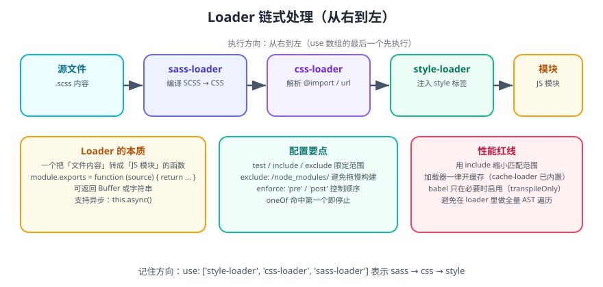

# Webpack Loader 详解

**Loader 是 Webpack 的「模块转换器」**：Webpack 原生只认识 JavaScript，凡是 CSS、图片、字体、TS、Vue 单文件这类资源，都要靠 Loader 转换成 JS 能理解的模块。



## 一句话定位

Loader 是一个**导出函数的 Node 模块**，接收源文件内容，返回转换后的内容。Webpack 按配置的规则，把匹配到的文件交给对应的 Loader 处理。

```javascript
module.exports = function (source) {
  // source 是文件内容（字符串或 Buffer）
  return source.replace(/foo/g, 'bar');
};
```

::: tip 一句话理解
Plugin 管「整个构建」，Loader 管「一个文件」。所有 Loader 的职责都是同一件事：**把非 JS 资源变成 JS 模块**。
:::

## 执行顺序：从右到左

```javascript
{
  test: /\.scss$/,
  use: ['style-loader', 'css-loader', 'sass-loader'],
}
```

实际执行方向是 **`sass-loader` → `css-loader` → `style-loader`**：

1. `sass-loader`：把 `.scss` 编译成 CSS。
2. `css-loader`：把 CSS 里的 `@import`、`url()` 解析成 JS 模块依赖。
3. `style-loader`：把 CSS 注入到页面的 `<style>` 标签。

::: danger 注意
顺序写反会直接报错。记忆口诀：**数组从右往左执行，最后加载的最先运行**（与 `compose` 一致）。写成 `use: ['sass-loader', 'css-loader', 'style-loader']` 会得到「用 SCSS 编译 JS 模块」的荒谬结果。
:::

同时 Loader 分两个阶段：

| 阶段 | 执行方向 | 典型用途 |
| --- | --- | --- |
| Normal（默认） | 从右到左 | 常规转换 |
| Pitching | 从左到右 | 提前短路、跳过后续 Loader |

## Loader 的三种写法

```javascript
// ① 单 Loader 简写
{ test: /\.txt$/, loader: 'raw-loader' }

// ② use 数组（推荐，顺序清晰）
{ test: /\.css$/, use: ['style-loader', 'css-loader'] }

// ③ 带 options 的对象写法
{
  test: /\.css$/,
  use: [
    'style-loader',
    {
      loader: 'css-loader',
      options: {
        modules: { localIdentName: '[name]__[local]--[hash:base64:5]' },
        importLoaders: 1,
      },
    },
  ],
}
```

## 常用 Loader 清单

| Loader | 处理对象 | 关键点 |
| --- | --- | --- |
| `babel-loader` | JS / TS | 配合 `@babel/preset-env` 做语法降级 |
| `ts-loader` | TS | 走 `tsconfig.json`，可配 `transpileOnly` 提速 |
| `esbuild-loader` | JS / TS | 用 esbuild 替换 babel/ts，**快 10 倍以上** |
| `swc-loader` | JS / TS | Rust 实现的 babel 替代 |
| `css-loader` | CSS | 解析 `@import` / `url()`，支持 CSS Modules |
| `style-loader` | CSS | 注入 `<style>`，开发用 |
| `postcss-loader` | CSS | 接 autoprefixer、nested 等 PostCSS 插件 |
| `sass-loader` | SCSS/Sass | 依赖 `sass` 或 `sass-embedded` |
| `less-loader` | Less | 依赖 `less` |
| `vue-loader` | `.vue` | Vue 官方单文件组件 Loader |
| `html-loader` | HTML | 导出 HTML 字符串并处理内部资源引用 |
| `raw-loader` | 任意 | 把文件内容当字符串导出（Webpack 5 可用 `type: 'asset/source'` 替代） |

::: warning 说明
Webpack 5 起，图片、字体、原始文本推荐直接用 **Asset Modules**（`type: 'asset'` 等），不必再装 `url-loader` / `file-loader` / `raw-loader`。
:::

## 配置文件类型（Asset Modules）

```javascript
module: {
  rules: [
    // 小于 8KB 转 base64 内联，否则输出独立文件
    {
      test: /\.(png|jpe?g|gif|webp)$/i,
      type: 'asset',
      parser: { dataUrlCondition: { maxSize: 8 * 1024 } },
      generator: { filename: 'images/[name].[hash:6][ext]' },
    },
    // 始终输出文件
    { test: /\.(woff2?|eot|ttf|otf)$/i, type: 'asset/resource' },
    // 始终内联
    { test: /\.svg$/i, type: 'asset/inline' },
    // 读取为字符串
    { test: /\.txt$/i, type: 'asset/source' },
  ],
}
```

## 编写一个自定义 Loader

Loader 本质上是一个 CommonJS 函数。下面实现一个把 `console.log` 在生产环境删掉的简易 Loader：

```javascript [loaders/strip-console-loader.js]
const { parse } = require('@babel/parser');
const traverse = require('@babel/traverse').default;
const generate = require('@babel/generator').default;

module.exports = function stripConsoleLoader(source) {
  // 异步 Loader：先声明 async，处理完再回调
  const callback = this.async();
  const options = this.getOptions() || {};
  const drop = options.drop || ['console'];

  const ast = parse(source, { sourceType: 'module', plugins: ['jsx'] });

  traverse(ast, {
    CallExpression(path) {
      const callee = path.get('callee');
      if (
        callee.isMemberExpression() &&
        callee.get('object').isIdentifier({ name: 'console' }) &&
        drop.includes('console')
      ) {
        path.remove();
      }
    },
  });

  const { code } = generate(ast, { comments: false });
  callback(null, code);
};
```

```javascript [webpack.config.js]
{
  test: /\.js$/,
  exclude: /node_modules/,
  enforce: 'pre',            // 在 babel-loader 之前执行
  use: [{ loader: path.resolve(__dirname, 'loaders/strip-console-loader.js'), options: { drop: ['console'] } }],
}
```

### Loader 上下文 API（this）

| API | 作用 |
| --- | --- |
| `this.async()` | 声明异步，返回 `callback(err, result, map, meta)` |
| `this.getOptions()` | 读取 Loader 的 `options`（Webpack 5 内置校验） |
| `this.resourcePath` | 当前文件绝对路径 |
| `this.resourceQuery` | 文件路径上 `?` 后面的查询串 |
| `this.emitFile(name, content)` | 输出一个文件到产物目录 |
| `this.addDependency(file)` | 声明额外依赖，参与 watch 与缓存 |
| `this.cacheable()` | 标记可缓存（默认已开启） |
| `this.callback(err, code, map, meta)` | 异步返回结果 |

::: danger 注意
1. **异步 Loader 必须调用 `callback`**，否则构建会一直挂起（无报错，只是卡住），这是最常见的「Loader 写死」原因。
2. **不要返回 `undefined`**：要么 `return code`，要么 `callback(null, code)`，返回空会导致模块解析异常。
3. `this.getOptions()` 在 Webpack 5 中会**校验 options schema**，写错字段会直接构建失败，比 Webpack 4 更严格也更安全。
:::

### raw 属性

若希望拿到 Buffer 而不是字符串：

```javascript
module.exports = function (source) {
  this.cacheable && this.cacheable();
  const buf = Buffer.isBuffer(source) ? source : Buffer.from(source);
  return buf;
};
module.exports.raw = true;
```

## 性能：Loader 是构建耗时的大头

| 优化手段 | 说明 |
| --- | --- |
| 缩小 `include` 范围 | 只处理 `src`，用 `exclude: /node_modules/` 兜底 |
| `oneOf` 命中即停 | 避免每个规则都跑一遍匹配 |
| 用 `esbuild-loader` / `swc-loader` | 替换 babel/ts-loader，提速最明显 |
| `transpileOnly: true` | ts-loader 关掉类型检查，把类型检查交给 `fork-ts-checker-webpack-plugin` |
| `thread-loader` | 放在耗时 Loader 之前，多进程并行 |
| 开启 `cache: { type: 'filesystem' }` | 二次构建直接命中缓存 |
| 减少 Loader 数量 | 能用 Asset Modules 就别装 Loader |

```javascript [webpack.config.js]
{
  test: /\.tsx?$/,
  exclude: /node_modules/,
  use: [
    { loader: 'thread-loader', options: { workers: 2 } },   // 必须放在最前面（最左）
    { loader: 'ts-loader', options: { transpileOnly: true } },
  ],
}
```

::: warning 说明
`thread-loader` 对**重 Loader**（babel、ts）才有收益；对轻量 Loader 反而因为进程通信开销变慢，且它**不支持 `emitFile` 等部分 API**，用错会报错。
:::

## 一个完整可运行的例子

```shell
mkdir loader-demo && cd loader-demo
npm init -y
npm i -D webpack webpack-cli css-loader style-loader
```

```javascript [src/index.js]
import './style.css';
console.log('loader demo ready');
```

```css [src/style.css]
body { background: #f8fafc; color: #334155; }
```

```javascript [webpack.config.js]
const path = require('node:path');

module.exports = {
  mode: 'development',
  devtool: false,
  entry: './src/index.js',
  output: { path: path.resolve(__dirname, 'dist'), filename: 'main.js' },
  module: {
    rules: [
      { test: /\.css$/, use: ['style-loader', 'css-loader'] },
    ],
  },
};
```

```shell
npx webpack
npx http-server dist
```

**验证**：打开页面，`<head>` 中出现注入的 `<style>`，控制台打印 `loader demo ready`，说明 Loader 链工作正常。

## 参考资料

- [Webpack 官方 Loader 文档](https://webpack.js.org/concepts/loaders/)
- [Webpack 官方 API：Loader Interface](https://webpack.js.org/api/loaders/)
- [esbuild-loader](https://github.com/privatenumber/esbuild-loader)
