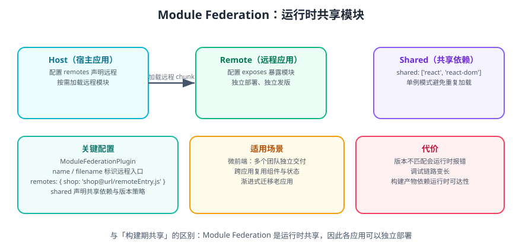

# Webpack 模块联邦

**模块联邦（Module Federation，简称 MF）让多个独立构建、独立部署的应用在运行时共享模块**。它是微前端落地的核心机制，也是 Webpack 5 相比 4 最具分量的能力之一。



## 一句话定位

传统的「共享」发生在**构建期**（npm 包、monorepo 软链）；模块联邦的共享发生在**运行时**——宿主应用在浏览器里动态加载远程应用暴露的模块，因此各应用可以独立发版、互不阻塞。

## 三个核心角色

| 角色 | 配置项 | 职责 |
| --- | --- | --- |
| **Host**（宿主） | `remotes` | 声明要消费哪些远程模块 |
| **Remote**（远程） | `exposes` | 声明对外暴露哪些模块 |
| **Shared**（共享依赖） | `shared` | 声明运行时共享的依赖（如 React） |

```text
Host  ──请求 remoteEntry.js──▶  Remote
  │                                │
  └──── 加载 exposes 的模块 ◀──────┘
           │
      shared 里的 react 只加载一份
```

## 最小可运行示例

### Remote 应用（被消费方）

```javascript [remote/webpack.config.js]
const { ModuleFederationPlugin } = require('webpack').container;
const HtmlWebpackPlugin = require('html-webpack-plugin');

module.exports = {
  mode: 'development',
  devtool: false,
  entry: './src/index.js',
  output: {
    publicPath: 'http://localhost:3001/',
    clean: true,
  },
  devServer: { port: 3001, headers: { 'Access-Control-Allow-Origin': '*' } },
  plugins: [
    new ModuleFederationPlugin({
      name: 'remoteApp',
      filename: 'remoteEntry.js',          // 远程入口清单
      exposes: {
        './Button': './src/Button.js',     // 对外暴露的模块
      },
      shared: { react: { singleton: true }, 'react-dom': { singleton: true } },
    }),
    new HtmlWebpackPlugin({ template: './public/index.html' }),
  ],
};
```

```javascript [remote/src/Button.js]
import React from 'react';

export default function Button({ children }) {
  return <button style={{ background: '#3b82f6', color: '#fff' }}>{children}</button>;
}
```

### Host 应用（消费方）

```javascript [host/webpack.config.js]
const { ModuleFederationPlugin } = require('webpack').container;

module.exports = {
  mode: 'development',
  devtool: false,
  output: { publicPath: 'http://localhost:3000/', clean: true },
  devServer: { port: 3000 },
  plugins: [
    new ModuleFederationPlugin({
      name: 'hostApp',
      remotes: {
        // key 是使用时的前缀，值是"远程名@远程入口地址"
        remoteApp: 'remoteApp@http://localhost:3001/remoteEntry.js',
      },
      shared: { react: { singleton: true }, 'react-dom': { singleton: true } },
    }),
  ],
};
```

```javascript [host/src/index.js]
import React, { lazy, Suspense } from 'react';
import { createRoot } from 'react-dom/client';

// 从远程应用加载 Button
const RemoteButton = lazy(() => import('remoteApp/Button'));

function App() {
  return (
    <Suspense fallback={<p>loading remote module...</p>}>
      <RemoteButton>来自远程的按钮</RemoteButton>
    </Suspense>
  );
}

createRoot(document.getElementById('root')).render(<App />);
```

```shell
# 终端 1：启动远程
cd remote && npx webpack serve

# 终端 2：启动宿主
cd host && npx webpack serve
```

**验证**：访问 `http://localhost:3000`，页面渲染出远程应用的按钮，且网络面板中 `remoteEntry.js` 加载成功、`react` 只加载一份。

::: danger 注意
1. **`output.publicPath` 必须是远程应用的绝对地址**：写相对路径会导致宿主从自己的域名去找 `remoteEntry.js`，必然 404。
2. **CORS**：跨域加载远程 chunk 需要远程服务返回 `Access-Control-Allow-Origin`，开发环境在 `devServer.headers` 里加。
3. **`shared` 里必须 `singleton: true`**：React、Vue 这类要求全局单例的库，若不设单例会出现「两份 React 实例」，`Context` 失效、Hooks 报错。
4. **版本要匹配**，否则运行时报 `Unsatisfied version` 或直接白屏。
:::

## shared 的版本策略

```javascript
shared: {
  react: {
    singleton: true,             // 全局只保留一份
    requiredVersion: '^19.0.0',  // 宿主对版本的要求
    eager: false,                // 是否把共享依赖打进初始包
    strictVersion: false,        // 版本不满足时是否硬报错
  },
}
```

| 选项 | 说明 |
| --- | --- |
| `singleton` | 只保留一个实例，避免多实例问题 |
| `requiredVersion` | 声明可接受的版本范围 |
| `eager` | `true` 表示立即加载（不异步），会增大初始包 |
| `strictVersion` | 版本不符时是否直接抛错（调试期建议 `true`，便于暴露问题） |

::: warning 说明
`eager: true` 能让共享模块同步可用（某些场景下 `lazy` 无法正常工作），代价是**共享依赖会被打进每个应用的初始包**，失去「只加载一份」的优势。除非有明确的同步加载需求，否则保持 `false`。
:::

## 典型应用场景

| 场景 | 说明 |
| --- | --- |
| **微前端** | 多个团队独立交付模块，主应用负责编排 |
| **跨应用复用** | 组件库、工具函数在多个站点间运行时共享 |
| **渐进式迁移** | 老应用暴露模块，新应用逐步接管部分页面 |
| **插件化系统** | 第三方在运行时交付功能插件 |

## 与「构建期共享」的对比

| 维度 | npm 包 / monorepo | 模块联邦 |
| --- | --- | --- |
| 共享时机 | 构建期 | 运行时 |
| 发版耦合 | 需重新构建宿主 | 各自独立发版 |
| 依赖重复 | 各应用各自打包 | 可运行时共享 |
| 调试复杂度 | 低 | 高（跨应用链路） |
| 失败影响面 | 构建失败 | 运行时可能白屏 |

## 代价与风险

| 风险 | 缓解 |
| --- | --- |
| 版本不匹配运行时报错 | `shared` 明确 `requiredVersion`，CI 校验版本 |
| 远程不可用导致整页白屏 | 用 `lazy` + `Suspense` / 错误边界兜底 |
| 调试链路长 | 开发环境保证 sourcemap 可用，日志带应用标识 |
| 循环依赖 | 明确依赖方向：宿主依赖远程，远程不反向依赖宿主 |
| 首屏依赖远程可用性 | 关键路径模块不要放远程 |

::: danger 注意
**不要让远程模块成为首屏阻塞项**。远程服务挂了、网络慢，都会直接拖垮宿主。把远程加载限制在非关键路径，并配置降级方案（加载失败时渲染本地兜底组件）。
:::

## 与 Vite / 现代方案的关系

Vite 生态通过 `@originjs/vite-plugin-federation` 与 `@module-federation/enhanced` 支持 MF，但实现路径与 Webpack 不同（Vite 的开发期是 No-Bundle，需要额外协调）。跨构建工具共享时，务必对齐 **shared 依赖的版本与单例策略**，否则仍会出现多实例。

## 参考资料

- [Webpack 官方 Module Federation](https://webpack.js.org/concepts/module-federation/)
- [Module Federation 官方站点](https://module-federation.io/)
- [Vite 模块联邦插件](https://github.com/originjs/vite-plugin-federation)
