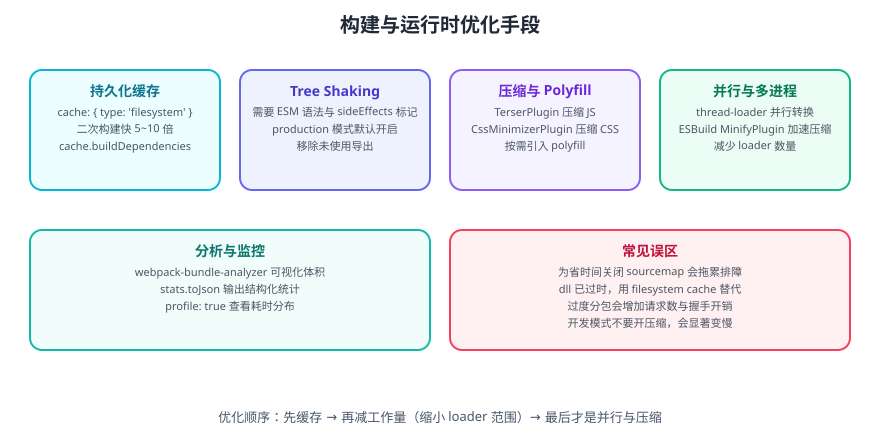

# Webpack 构建优化

构建优化分两条线：**让构建本身更快**（开发体验）与**让产物更小更快**（用户体感）。两条线的优化手段不通用，先分清目标再动手。



## 一句话定位

优化的本质是**减少工作量**：少处理文件、少重复编译、少传输字节。所有「换更快的工具」「开缓存」的手段，都只是在减少工作量。

## 优化优先级

::: tip 建议
按这个顺序做，收益递减、成本递增：**① 持久化缓存 → ② 缩小 loader 范围 → ③ 换更快的编译器 → ④ 并行 → ⑤ 压缩与分析**。跳过前两步直接上并行，往往收效甚微。
:::

## 一、持久化缓存

Webpack 5 内置文件系统缓存，二次构建可快 5~10 倍：

```javascript [webpack.config.js]
module.exports = {
  cache: {
    type: 'filesystem',
    // 缓存失效依据：这些文件变化时清空缓存
    buildDependencies: {
      config: [__filename],
    },
    // 缓存目录，默认 node_modules/.cache/webpack
    cacheDirectory: require('node:path').resolve(__dirname, 'node_modules/.cache/webpack'),
    // 开发环境下压缩缓存，减小体积
    compression: 'gzip',
    maxAge: 7 * 24 * 60 * 60 * 1000,   // 7 天
  },
};
```

关键点：

| 项 | 说明 |
| --- | --- |
| `buildDependencies.config` | **必须配**，否则改了配置文件缓存不失效，会出现「配置改了不生效」 |
| 缓存失效时机 | loader / plugin 版本、配置文件、`buildDependencies` 变化时自动失效 |
| 手动清缓存 | 删除 `node_modules/.cache/webpack` |
| CI 场景 | 把缓存目录纳入 CI 缓存（key 用 lockfile 的 hash） |

::: danger 注意
1. **改了 `webpack.config.js` 却不生效**：90% 是 `buildDependencies` 没配好。至少写 `{ config: [__filename] }`。
2. **升级 loader / plugin 后出现诡异错误**：先清 `node_modules/.cache` 再试。缓存跨版本复用会读到不兼容的中间产物。
3. **不要为了缓存给 `cache` 传 `true`**：Webpack 5 用字符串 `'filesystem'` 或 `'memory'`，传布尔值行为不符合预期。开发环境用 `'memory'` 即可，生产才用 `'filesystem'`。
:::

## 二、缩小处理范围

这是**性价比最高**的一步，很多人跳过它直接换工具。

```javascript [webpack.config.js]
module: {
  rules: [
    {
      test: /\.jsx?$/,
      include: require('node:path').resolve(__dirname, 'src'),   // 只处理 src
      use: 'babel-loader',
    },
    // 用 oneOf 让规则一命中即停
    {
      oneOf: [
        { test: /\.css$/, use: ['style-loader', 'css-loader'] },
        { test: /\.scss$/, use: ['style-loader', 'css-loader', 'sass-loader'] },
      ],
    },
  ],
},
```

| 手段 | 效果 |
| --- | --- |
| `include: path.resolve(__dirname, 'src')` | 避免把 `node_modules` 也走一遍编译 |
| `exclude: /node_modules/` | 同上，作为兜底 |
| `oneOf` | 规则命中即停，减少正则匹配 |
| `resolve.extensions` 精简 | 减少文件探测次数 |
| `resolve.modules` 限定 | 避免逐级向上查找 |
| `resolve.alias` 直达 | 跳过目录解析 |

```javascript
resolve: {
  alias: { '@': path.resolve(__dirname, 'src') },
  extensions: ['.ts', '.tsx', '.js'],   // 够用就好，别加 .css/.png
  symlinks: false,                       // 无软链场景可关闭，加快解析
},
```

## 三、Tree Shaking

Tree Shaking 依赖 **ESM 静态结构**：只有能被静态分析的导入导出，才能安全地删除未使用代码。

```javascript
optimization: {
  usedExports: true,       // 标记未使用的导出
  sideEffects: true,       // 遵循 package.json 的 sideEffects 字段
  providedExports: true,
  concatenateModules: true, // 生产模式默认开启（Scope Hoisting）
}
```

```json [package.json]
{
  "sideEffects": false
}
```

或精确声明（推荐，避免误删有副作用的文件）：

```json [package.json]
{
  "sideEffects": [
    "*.css",
    "./src/polyfill.js"
  ]
}
```

::: danger 注意
1. **CommonJS 无法 tree shaking**：`require` / `module.exports` 是运行时行为，Webpack 无法静态判断哪些导出被用了。做 tree shaking 的项目必须统一用 ESM。
2. **`sideEffects: false` 会误删有副作用的模块**：例如直接引入的 CSS、polyfill、全局注册代码。`import './style.css'` 在 `sideEffects: false` 下会被整段删除，务必用数组精确声明。
3. **Babel 会把 ESM 转成 CJS**：如果 `@babel/preset-env` 的 `modules` 不是 `false`，ESM 会先被转成 CJS，tree shaking 直接失效。配置 `presets: [['@babel/preset-env', { modules: false }]]`。
:::

## 四、压缩

```javascript [webpack.config.js]
const CssMinimizerPlugin = require('css-minimizer-webpack-plugin');
const TerserPlugin = require('terser-webpack-plugin');

optimization: {
  minimize: true,
  minimizer: [
    new TerserPlugin({
      parallel: true,
      terserOptions: {
        compress: { drop_console: true, drop_debugger: true },
      },
    }),
    new CssMinimizerPlugin(),
  ],
}
```

::: warning 说明
`minimizer` 里一旦显式列出插件，**默认压缩器会被覆盖**，所以生产配置里保留 `'...'` 或把 Terser / CssMinimizer 都列全，否则可能出现「JS 压缩了但 CSS 没压」。
:::

### 用 esbuild 加速压缩

Terser 是纯 JS 实现，压缩是构建耗时大头。换成 esbuild 可提速数倍：

```javascript [webpack.config.js]
const { ESBuildMinifyPlugin } = require('esbuild-loader');

optimization: {
  minimizer: [
    new ESBuildMinifyPlugin({
      target: 'es2015',
      css: true,
    }),
  ],
}
```

::: danger 注意
esbuild 压缩比 Terser 略激进，**在极端边界情况下可能有兼容问题**。上线前务必对产物做一轮回归测试；对兼容性要求高的老项目，可只对现代浏览器产物用 esbuild、对 legacy 产物保留 Terser。
:::

## 五、并行与多进程

```javascript [webpack.config.js]
{
  test: /\.tsx?$/,
  exclude: /node_modules/,
  use: [
    { loader: 'thread-loader', options: { workers: 2 } },
    { loader: 'ts-loader', options: { transpileOnly: true } },
  ],
}
```

配合独立的类型检查进程：

```javascript [webpack.config.js]
const ForkTsCheckerWebpackPlugin = require('fork-ts-checker-webpack-plugin');

plugins: [
  new ForkTsCheckerWebpackPlugin({ async: true }),
];
```

| 手段 | 说明 |
| --- | --- |
| `thread-loader` | 把重 Loader 放进 worker 池 |
| `ForkTsCheckerWebpackPlugin` | 类型检查移出主进程 |
| `terser` 的 `parallel: true` | 压缩多进程 |
| `esbuild-loader` | 单进程也够快，通常无需 thread-loader |

## 六、分析与监控

不看数据就优化，等于凭空猜测。

```javascript [webpack.config.js]
const BundleAnalyzerPlugin = require('webpack-bundle-analyzer').BundleAnalyzerPlugin;

plugins: [
  new BundleAnalyzerPlugin({ analyzerMode: 'static', openAnalyzer: false }),
],
```

```shell
# 结构化统计，可喂给脚本做体积回归
npx webpack --config build/webpack.prod.js --json > stats.json

# 查看耗时分布（各 loader / plugin 各耗时多久）
npx webpack --config build/webpack.prod.js --profile --json > profile.json
```

常用分析维度：

| 工具 | 回答什么问题 |
| --- | --- |
| webpack-bundle-analyzer | 哪个包占了最大体积？ |
| `--profile` | 哪个 loader / plugin 最耗时？ |
| `stats.json` | 是否引入了重复依赖、体积是否回归？ |
| `performance` 配置 | 产物超阈值时告警 |

```javascript
performance: {
  hints: 'warning',
  maxAssetSize: 512 * 1024,      // 单个资源 512KB 告警
  maxEntrypointSize: 1024 * 1024, // 入口 1MB 告警
},
```

## 常见误区

| 误区 | 正确做法 |
| --- | --- |
| 用 `dll` 做加速 | 已过时，用 `cache: { type: 'filesystem' }` |
| 生产环境关 `sourcemap` 省时间 | 保留 `source-map` 独立文件，别牺牲排障能力 |
| 开发环境开压缩 | 开发不压缩，压缩拖慢构建且无意义 |
| 无限细分 chunk | 增加请求数，HTTP/2 下也要控制 |
| 用 `[hash]` 追求「文件名唯一」 | 用 `[contenthash]`，否则缓存全失效 |
| 只优化构建，不看产物 | 两者目标不同，需分别度量 |

## 优化效果度量

优化必须有前后对照，否则无法判断是否有效：

```shell
# 记录基线
npx webpack --config build/webpack.prod.js --profile --json > before.json

# 做优化...

# 对比
npx webpack --config build/webpack.prod.js --profile --json > after.json
```

对比清单：

1. **冷启动构建耗时**（清空缓存后）。
2. **二次构建耗时**（缓存命中后）。
3. **产物体积**（`dist` 总大小与各 chunk 大小）。
4. **入口首屏资源**（HTML 里引用的资源总和）。

::: tip 建议
把「入口体积」与「构建耗时」写入 CI 断言：体积增长超过阈值（如 5%）时 CI 失败。这比事后人工发现有效得多。
:::

## 参考资料

- [Webpack 官方 Build Performance](https://webpack.js.org/guides/build-performance/)
- [Webpack 官方 Caching](https://webpack.js.org/guides/caching/)
- [Webpack 官方 Tree Shaking](https://webpack.js.org/guides/tree-shaking/)
- [esbuild-loader](https://github.com/privatenumber/esbuild-loader)
