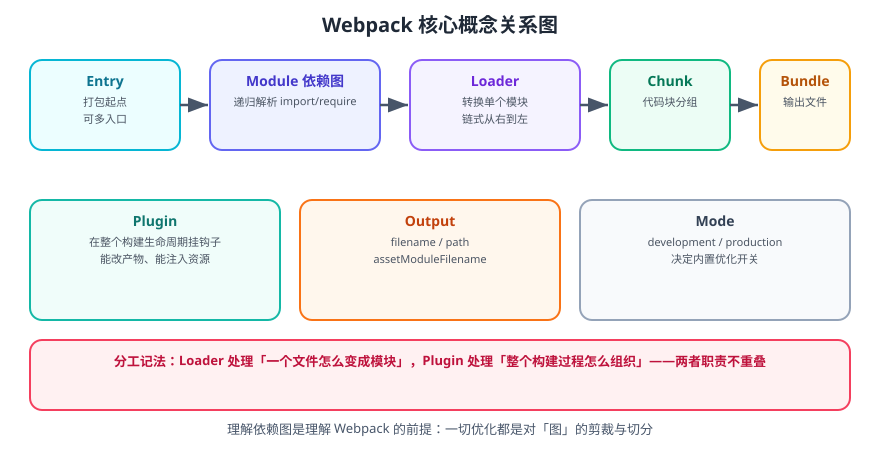
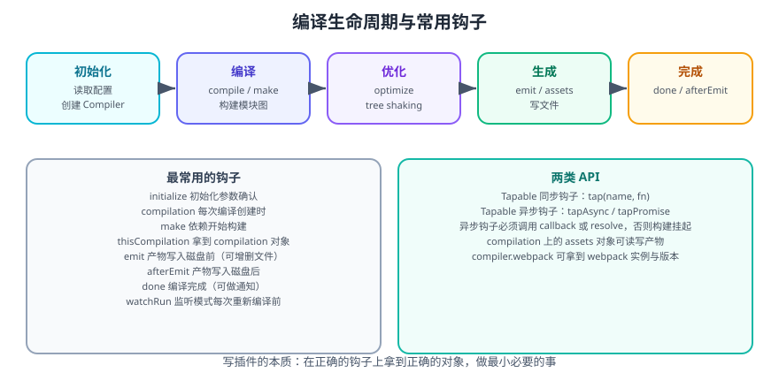

# Webpack 概述与核心概念

Webpack 是一个现代 JavaScript 应用的**静态模块打包器**。它把项目看作一张**依赖图**：从入口开始，递归地找出每个模块的依赖，用 Loader 转换它们，最后输出浏览器可运行的静态资源。

一句话理解：**Webpack 只做三件事——建图、转换、输出**。所有配置项都是在描述「怎么建图、用什么转换、输出成什么样」。

## 1. 为什么需要打包器

浏览器原生只认识有限的能力：

| 问题 | 打包器的解决方式 |
| --- | --- |
| 浏览器不认识 TypeScript / JSX / SCSS | Loader 把它们转换成 JS / CSS |
| 模块化语法（ESM、CJS、AMD）需要统一 | Webpack 统一解析并支持混用 |
| 大量小文件产生海量请求 | 合并成少量 bundle |
| 需要按需加载 | 把部分模块拆成独立 chunk，运行时异步加载 |
| 需要只剔除未使用的代码 | Tree Shaking 移除死代码 |
| 静态资源需要指纹与优化 | 生成带 hash 的文件、内联小资源 |

## 2. 核心概念



### 2.1 入口（Entry）

指定 Webpack 从哪个文件开始构建依赖图。

```js [webpack.config.js]
module.exports = {
  entry: './src/index.js',
  // 多入口
  // entry: {
  //   app: './src/app.js',
  //   admin: './src/admin.js',
  // },
}
```

### 2.2 出口（Output）

指定产物输出位置与文件名。

```js [webpack.config.js]
const path = require('path')

module.exports = {
  entry: './src/index.js',
  output: {
    filename: 'bundle.js',
    path: path.resolve(__dirname, 'dist'),
  },
}
```

### 2.3 Loader

Loader 负责**转换单个模块**：把非 JS 文件变成 Webpack 能处理并最终交给浏览器的形式。

```js [webpack.config.js]
module.exports = {
  module: {
    rules: [
      // CSS 处理
      {
        test: /\.css$/,
        use: ['style-loader', 'css-loader'],
      },
      // TypeScript 处理
      {
        test: /\.ts$/,
        use: 'ts-loader',
        exclude: /node_modules/,
      },
      // 图片处理（Webpack 5 的 Asset Modules，替代 file-loader / url-loader）
      {
        test: /\.(png|jpg|gif)$/,
        type: 'asset/resource',
      },
    ],
  },
}
```

### 2.4 插件（Plugin）

Plugin 负责**干预整个构建过程**：能读写产物、修改配置、触发额外编译。

```js [webpack.config.js]
const HtmlWebpackPlugin = require('html-webpack-plugin')
const { CleanWebpackPlugin } = require('clean-webpack-plugin')

module.exports = {
  plugins: [
    new HtmlWebpackPlugin({
      template: './index.html',
    }),
    new CleanWebpackPlugin(),
  ],
}
```

### 2.5 Module / Chunk / Bundle

这三个词常被混用，但含义不同：

| 概念 | 含义 |
| --- | --- |
| **Module** | 一个源文件（或经过 Loader 转换后的资源），是依赖图的节点 |
| **Chunk** | 一组被一起加载的模块，是「打包的中间单位」 |
| **Bundle** | Chunk 经过最终处理（哈希、压缩）后写出的文件，是「产物的单位」 |

关系：多个 Module → 组成一个 Chunk → 输出为一个 Bundle。

### 2.6 Mode

`mode` 决定内置优化开关：

| mode | 行为 |
| --- | --- |
| `development` | 输出可读、保留注释、开启 `devtool` 便捷调试，速度快 |
| `production` | 压缩、Tree Shaking、作用域提升、确定性 chunk id |

```js [webpack.config.js]
module.exports = {
  mode: 'production',
}
```

::: danger 注意
**必须显式设置 `mode`**。不设置时 Webpack 会警告并使用 `production` 的默认优化但关闭部分优化，行为不确定，容易导致「本地与生产不一致」。
:::

## 3. 一个最小可运行示例

```shell
mkdir webpack-demo && cd webpack-demo
npm init -y
npm install -D webpack webpack-cli
```

```text [index.html]
<!DOCTYPE html>
<html lang="zh-CN">
  <head>
    <meta charset="UTF-8" />
    <title>Webpack Demo</title>
  </head>
  <body>
    <div id="app"></div>
    <script src="./dist/bundle.js"></script>
  </body>
</html>
```

```js [src/greet.js]
export function greet(name) {
  return `Hello, ${name}!`
}
```

```js [src/index.js]
import { greet } from './greet.js'

document.querySelector('#app').textContent = greet('Webpack')
```

```js [webpack.config.js]
const path = require('path')

module.exports = {
  mode: 'production',
  entry: './src/index.js',
  output: {
    filename: 'bundle.js',
    path: path.resolve(__dirname, 'dist'),
    clean: true,
  },
}
```

```shell
npx webpack
# asset bundle.js xx.x KiB [emitted] [minimized] (name: main)
# webpack 5.x.x compiled successfully
```

**验证方式**：`dist/bundle.js` 生成；用浏览器打开 `index.html`，页面显示 `Hello, Webpack!`；把 `mode` 改成 `development` 重新构建，产物不再压缩且体积明显变大。

## 4. 构建流程



一次完整构建可以拆成五个阶段：

```text
① 初始化    读取配置 → 创建 Compiler → 应用插件（调用 plugin.apply）
② 编译      entry → 递归 resolve → load → transform → 得到依赖图
③ 优化      Tree Shaking → 作用域提升 → 分包（splitChunks）→ 生成 Chunk
④ 生成      由 Chunk 生成最终代码 → emit 钩子 → 写入磁盘
⑤ 完成      done 钩子 → 输出统计信息
```

关键对象：

| 对象 | 生命周期 | 说明 |
| --- | --- | --- |
| `Compiler` | 整个构建过程唯一 | 持有配置与全局钩子，跨多次编译复用 |
| `Compilation` | 每次编译新建 | 持有依赖图、模块与产物 `assets` |
| `assets` | 属于 Compilation | 产物文件集合，可在 `emit` 阶段增删改 |

::: tip 记住这条分界线
**Loader 处理「一个文件怎么变成模块」，Plugin 处理「整个构建过程怎么组织」。** 两者职责不重叠——想改单个文件的转换就用 Loader，想改整体行为或产物就用 Plugin。
:::

## 5. 与其它构建工具的对比

| 维度 | Webpack 5 | Vite 8 | Rollup | esbuild |
| --- | --- | --- | --- | --- |
| 定位 | 应用打包器 | 开发服务器 + 打包器 | 库打包器 | 编译器/压缩器 |
| 开发期 | 全量构建依赖图 | 按需编译（No-Bundle） | 无开发服务器 | 无开发服务器 |
| 生产打包 | 自研（JS） | Rolldown（Rust） | 自研（JS） | 可用但生态弱 |
| 配置量 | 高 | 低 | 中 | 极低 |
| 插件机制 | Tapable 钩子 | Rollup 兼容钩子 | Rollup 钩子 | 自有插件 API |
| 代码分割 | 极强 | 强 | 强（面向库） | 弱 |
| 模块联邦 | 原生支持 | 无（需自行实现） | 无 | 无 |
| 典型场景 | 存量大型应用、复杂定制 | 新项目、现代浏览器 | 组件库 / SDK | 工具链底层 |

::: tip 选型建议
| 场景 | 推荐 |
| --- | --- |
| 新应用 | **Vite** |
| 已深度依赖 Webpack 插件的大型应用 | **继续用 Webpack**，逐步评估迁移 |
| 发布 npm 库 | **Rollup**（或 tsup / unbuild 这类封装） |
| 需要极致的转换速度 | **esbuild**（常作为其他工具的底层） |
| 微前端需要运行时共享模块 | **Webpack + Module Federation** |
:::

## 6. 环境要求

| 项目 | 要求 |
| --- | --- |
| Node.js | webpack-cli 7 要求 **20.9+** |
| webpack | **5.101+**（配合 webpack-cli 7） |
| wem>webpack-dev-middleware | 8.0+（要求 Node 20.9+ 与 webpack 5.101+） |
| 包管理器 | npm / yarn / pnpm 均可 |

```shell
npm install -D webpack webpack-cli
npx webpack --version
# webpack: 5.x.x
# webpack-cli: 7.x.x
```

::: warning 说明
Webpack 5 **不再自动 polyfill Node.js 内置模块**（`buffer`、`path`、`stream` 等）。如果依赖里用到了它们，需要显式配置：

```js [webpack.config.js]
module.exports = {
  resolve: {
    fallback: {
      // 明确声明为不可用（比静默失败更好）
      fs: false,
      path: false,
      // 或者安装并提供浏览器替代实现
      // buffer: require.resolve('buffer/'),
    },
  },
}
```
:::

## 7. 参考资料

- [Webpack 官方文档](https://webpack.js.org/)
- [Webpack 中文文档](https://webpack.docschina.org/)
- [Webpack 官方入门指南](https://webpack.js.org/guides/getting-started/)
- [Webpack 5.106 发布说明（webpack-cli 7）](https://webpack.js.org/blog/2026-04-08-webpack-5-106)
- [Webpack 概念总览](https://webpack.js.org/concepts/)
