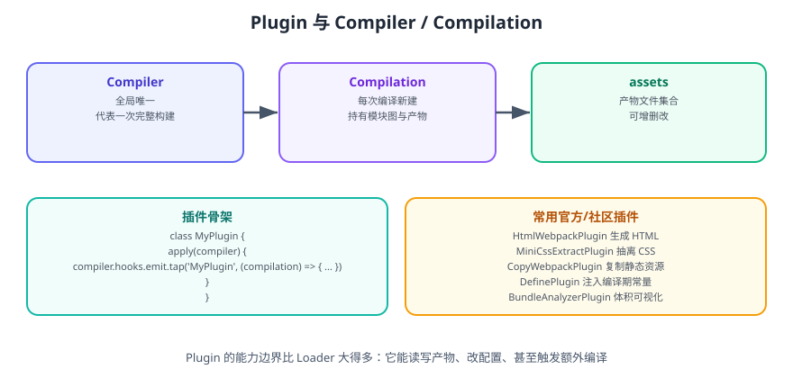

# Webpack Plugin 详解

**Plugin 是 Webpack 的「构建过程扩展点」**：它能在构建生命周期的任意时刻拿到 `compiler` / `compilation` 对象，做 Loader 做不到的事——增删产物、改配置、注入资源、触发额外编译。



## 一句话定位

Plugin 是一个**带 `apply(compiler)` 方法的类**（或函数）。Webpack 在初始化阶段调用每个插件实例的 `apply`，插件在 `apply` 里通过 `compiler.hooks.xxx.tap(...)` 注册钩子，等待构建流程触发。

```javascript
class HelloPlugin {
  apply(compiler) {
    compiler.hooks.done.tap('HelloPlugin', (stats) => {
      console.log('构建完成，耗时', stats.endTime - stats.startTime, 'ms');
    });
  }
}

module.exports = HelloPlugin;
```

::: tip 一句话理解
Loader 是「管道里的一个环节」，Plugin 是「在人手够得着的每个环节安插了一个观察者 + 操作手」。
:::

## 生命周期钩子


Webpack 的整个过程分为**初始化 → 编译 → 优化 → 生成 → 完成**五个阶段，每阶段都有对应钩子。

### 最常用钩子

| 钩子 | 触发时机 | 典型用途 |
| --- | --- | --- |
| `initialize` | 初始化参数确认 | 校验配置 |
| `compilation` | 每次编译创建新 compilation | 拿到完整的模块图 |
| `thisCompilation` | 创建 compilation 时（更早） | 注册 compilation 级钩子 |
| `make` | 依赖开始构建 | 自定义模块来源 |
| `emit` | 产物写入磁盘**前** | **增删改产物**（最高频） |
| `afterEmit` | 产物写入磁盘**后** | 上传 CDN、生成清单 |
| `done` | 编译完成 | 通知、统计、报错汇总 |
| `watchRun` | 监听模式每次重编译前 | 清理临时状态 |
| `failed` | 编译失败 | 错误上报 |

```javascript [webpack.config.js]
class MyPlugin {
  apply(compiler) {
    // ① 编译开始时
    compiler.hooks.thisCompilation.tap('MyPlugin', (compilation) => {
      // ② 产物写入前，可以增删改
      compilation.hooks.processAssets.tap(
        { name: 'MyPlugin', stage: compilation.PROCESS_ASSETS_STAGE_ADDITIONAL },
        (assets) => {
          compilation.emitAsset('hello.txt', new compiler.webpack.sources.RawSource('hi'));
        },
      );
    });
  }
}
```

## Tapable：钩子的底层机制

Webpack 的钩子系统由 **Tapable** 提供。钩子分同步与异步两类，注册方式与返回方式不同：

| 类型 | 注册方法 | 执行方式 | 返回 |
| --- | --- | --- | --- |
| SyncHook | `tap` | 同步依次执行 | 无 |
| AsyncSeriesHook | `tapAsync` | 串行，逐个回调 | 必须调 `callback()` |
| AsyncSeriesHook | `tapPromise` | 串行，返回 Promise | 必须 `resolve()` / reject |
| AsyncParallelHook | `tapAsync` | 并行执行 | 必须调 `callback()` |

```javascript
// 同步
compiler.hooks.done.tap('A', (stats) => { /* ... */ });

// 异步（回调式）
compiler.hooks.emit.tapAsync('B', (compilation, callback) => {
  doAsync().then(() => callback()).catch(callback);
});

// 异步（Promise 式，推荐）
compiler.hooks.emit.tapPromise('C', async (compilation) => {
  await doAsync();
});
```

::: danger 注意
1. **异步钩子不调用 `callback` / 不 `resolve`，构建会永久挂起**（无任何报错）。这是自研插件最常见的「死锁」原因。
2. **不要在 `emit` 钩子里再发起一次完整编译**，会破坏当前 compilation 状态；需要生成额外内容请用 `childCompiler`。
3. `compilation.assets` 在 Webpack 5 中是**只读快照**，直接赋值会报错或无效，必须用 `emitAsset` / `updateAsset` / `deleteAsset`。
:::

## compilation 上能做什么

```javascript
compiler.hooks.thisCompilation.tap('InspectPlugin', (compilation) => {
  // 遍历所有模块
  compilation.hooks.finishModules.tap('InspectPlugin', (modules) => {
    modules.forEach((m) => {
      // m.resource 是文件绝对路径
      // m.dependencies 是它的依赖
    });
  });

  // 读产物内容
  compilation.hooks.processAssets.tap(
    { name: 'InspectPlugin', stage: compilation.PROCESS_ASSETS_STAGE_ANALYSE },
    () => {
      for (const name of compilation.getAssets().map((a) => a.name)) {
        const source = compilation.assets[name].source();
        // source 是字符串或 Buffer
      }
    },
  );
});
```

### processAssets 阶段（stage）

Webpack 5 用数字常量定义产物处理顺序，**选错阶段会导致产物被后续步骤覆盖**：

| 常量 | 说明 |
| --- | --- |
| `PROCESS_ASSETS_STAGE_ADDITIONAL` | 添加额外产物 |
| `PROCESS_ASSETS_STAGE_PRE_PROCESS` | 预处理 |
| `PROCESS_ASSETS_STAGE_ADDITIONS` | 追加内容（如 banner） |
| `PROCESS_ASSETS_STAGE_OPTIMIZE` | 优化（压缩在此前后） |
| `PROCESS_ASSETS_STAGE_ANALYSE` | 分析产物（体积分析器在此） |

## 常用插件清单

| 插件 | 作用 | 备注 |
| --- | --- | --- |
| `HtmlWebpackPlugin` | 生成 HTML 并自动注入 JS/CSS | 必装 |
| `MiniCssExtractPlugin` | 抽离 CSS 为独立文件 | 生产必装（替代 style-loader） |
| `CssMinimizerPlugin` | 压缩 CSS | 配在 `optimization.minimizer` |
| `TerserPlugin` | 压缩 JS | 生产默认内置 |
| `CopyWebpackPlugin` | 复制静态资源到产物目录 | 按需 |
| `DefinePlugin` | 注入编译期常量 | 内置，无需安装 |
| `EnvironmentPlugin` | 批量注入 `process.env` | 基于 DefinePlugin |
| `BundleAnalyzerPlugin` | 体积可视化 | 分析必备 |
| `ForkTsCheckerWebpackPlugin` | 独立进程做 TS 类型检查 | 配合 transpileOnly |
| `compression-webpack-plugin` | 生成 `.gz` / `.br` | 静态托管场景 |
| `WebpackManifestPlugin` | 生成资源清单 | 服务端渲染 |
| `CleanWebpackPlugin` | 清理产物 | **Webpack 5 建议用 `output.clean`** |

## 编写一个自定义 Plugin：生成构建信息文件

需求：构建结束后，在 `dist` 里生成一个 `build-info.json`，包含时间、版本、产物清单。

```javascript [plugins/build-info-plugin.js]
const { RawSource } = require('webpack').sources;

class BuildInfoPlugin {
  constructor(options = {}) {
    this.filename = options.filename || 'build-info.json';
  }

  apply(compiler) {
    const pluginName = 'BuildInfoPlugin';

    compiler.hooks.thisCompilation.tap(pluginName, (compilation) => {
      compilation.hooks.processAssets.tapPromise(
        {
          name: pluginName,
          stage: compilation.PROCESS_ASSETS_STAGE_ADDITIONAL,
        },
        async () => {
          const pkg = require(require('node:path').resolve(process.cwd(), 'package.json'));

          const info = {
            name: pkg.name,
            version: pkg.version,
            builtAt: new Date().toISOString(),
            assets: compilation.getAssets().map((a) => a.name).sort(),
          };

          compilation.emitAsset(
            this.filename,
            new RawSource(JSON.stringify(info, null, 2)),
          );
        },
      );
    });

    // 构建完成后打印一行提示
    compiler.hooks.done.tap(pluginName, (stats) => {
      const time = (stats.endTime - stats.startTime) / 1000;
      console.log(`\n[BuildInfoPlugin] 构建用时 ${time.toFixed(2)}s，信息写入 ${this.filename}`);
    });
  }
}

module.exports = BuildInfoPlugin;
```

```javascript [webpack.config.js]
const BuildInfoPlugin = require('./plugins/build-info-plugin');

module.exports = {
  mode: 'production',
  plugins: [new BuildInfoPlugin({ filename: 'build-info.json' })],
};
```

**验证**：构建后执行 `npx http-server dist`，访问 `http://localhost:8080/build-info.json`，应看到包含 `assets` 数组的 JSON。

## Plugin vs Loader 的边界

| 维度 | Loader | Plugin |
| --- | --- | --- |
| 处理粒度 | 单文件 | 整个构建过程 |
| 运行时机 | 模块转换阶段 | 全生命周期钩子 |
| 实现形式 | 函数（`module.exports = fn`） | 类（`apply(compiler)`） |
| 能改产物吗 | 不能 | 能（emitAsset / updateAsset） |
| 典型用途 | 转换语法、处理资源 | 生成 HTML、抽离 CSS、体积分析 |

::: tip 建议
遇到问题先判断：**「影响的是某一个文件的编译吗？」** 是 → 写 Loader；**「影响的是整个产物的组织方式吗？」** 是 → 写 Plugin。二者不要互相越界。
:::

## 参考资料

- [Webpack 官方 Plugin 文档](https://webpack.js.org/concepts/plugins/)
- [Webpack 官方 API：Compiler Hooks](https://webpack.js.org/api/compiler-hooks/)
- [Webpack 官方 API：Compilation Hooks](https://webpack.js.org/api/compilation-hooks/)
- [Tapable 仓库与钩子类型说明](https://github.com/webpack/tapable)
