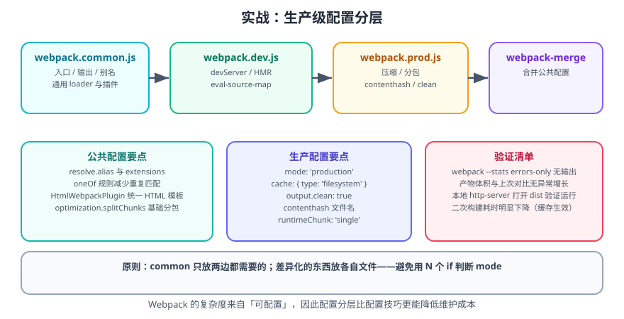

# 实战：生产级 Webpack 配置

本篇把一个从零开始的 TypeScript + React 项目，配置成**可直接上生产**的 Webpack 工程：包含分层配置、缓存、分包、压缩、体积分析与验证清单。



## 目标与验收标准

完成后应达到：

1. `npm run dev` 启动开发服务器，支持 HMR 与源码映射。
2. `npm run build` 产出经过压缩、分包、带 contenthash 的静态资源。
3. 二次构建明显快于首次（缓存生效）。
4. 改动业务代码后，`vendors` chunk 的文件名保持不变。
5. 构建输出无错误、无警告（或仅有可解释的警告）。

## 一、初始化项目

```shell
mkdir webpack-prod-demo && cd webpack-prod-demo
npm init -y
npm i react react-dom
npm i -D webpack webpack-cli webpack-dev-server webpack-merge \
  html-webpack-plugin mini-css-extract-plugin css-minimizer-webpack-plugin \
  babel-loader @babel/core @babel/preset-env @babel/preset-react @babel/preset-typescript \
  typescript ts-loader webpack-bundle-analyzer
```

```json [package.json]
{
  "name": "webpack-prod-demo",
  "version": "1.0.0",
  "private": true,
  "scripts": {
    "dev": "webpack serve --config build/webpack.dev.js",
    "build": "webpack --config build/webpack.prod.js",
    "analyze": "cross-env ANALYZE=1 npm run build"
  }
}
```

::: warning 说明
`cross-env` 用于跨平台设置环境变量，Windows 下直接 `ANALYZE=1` 不生效，需 `npm i -D cross-env`。
:::

## 二、目录结构

```text
webpack-prod-demo/
├─ build/
│  ├─ webpack.common.js
│  ├─ webpack.dev.js
│  └─ webpack.prod.js
├─ public/
│  └─ index.html
├─ src/
│  ├─ pages/
│  │  ├─ Home.tsx
│  │  └─ About.tsx        # 懒加载
│  ├─ components/
│  │  └─ Layout.tsx
│  ├─ styles/
│  │  └─ global.css
│  └─ index.tsx
├─ tsconfig.json
└─ package.json
```

## 三、公共配置

```javascript [build/webpack.common.js]
const path = require('node:path');
const HtmlWebpackPlugin = require('html-webpack-plugin');

const isProd = process.env.NODE_ENV === 'production';

module.exports = {
  entry: './src/index.tsx',
  output: {
    path: path.resolve(__dirname, '../dist'),
    filename: isProd ? 'js/[name].[contenthash:8].js' : 'js/[name].js',
    chunkFilename: isProd ? 'js/[name].[contenthash:8].chunk.js' : 'js/[name].chunk.js',
    assetModuleFilename: 'assets/[name].[hash:6][ext]',
    publicPath: '/',
    clean: true,
  },
  resolve: {
    extensions: ['.tsx', '.ts', '.jsx', '.js'],
    alias: {
      '@': path.resolve(__dirname, '../src'),
    },
  },
  module: {
    rules: [
      {
        test: /\.tsx?$/,
        include: path.resolve(__dirname, '../src'),
        use: [
          {
            loader: 'babel-loader',
            options: {
              presets: [
                ['@babel/preset-env', { modules: false, targets: 'defaults' }],
                ['@babel/preset-react', { runtime: 'automatic' }],
                '@babel/preset-typescript',
              ],
              cacheDirectory: true,
            },
          },
        ],
      },
      {
        oneOf: [
          {
            test: /\.css$/,
            use: [
              isProd ? MiniCssExtractPlugin.loader : 'style-loader',
              { loader: 'css-loader', options: { importLoaders: 1 } },
            ],
          },
          {
            test: /\.(png|jpe?g|gif|webp|svg)$/i,
            type: 'asset',
            parser: { dataUrlCondition: { maxSize: 8 * 1024 } },
            generator: { filename: 'images/[name].[hash:6][ext]' },
          },
        ],
      },
    ],
  },
  plugins: [
    new HtmlWebpackPlugin({
      template: './public/index.html',
      favicon: './public/favicon.ico',
      minify: isProd && { collapseWhitespace: true, removeComments: true },
    }),
  ],
};
```

::: danger 注意
`MiniCssExtractPlugin.loader` 在 `common` 里被引用，但插件实例在 `prod` 文件里注册。**必须确保 `MiniCssExtractPlugin` 在 prod 中 `require` 进来**，否则会报 `MiniCssExtractPlugin is not defined`。更稳妥的做法是把 CSS 相关规则整体放进 `prod` 文件。
:::

## 四、开发配置

```javascript [build/webpack.dev.js]
const { merge } = require('webpack-merge');
const common = require('./webpack.common.js');

process.env.NODE_ENV = 'development';

module.exports = merge(
  common,
  {
    mode: 'development',
    devtool: 'eval-cheap-module-source-map',
    cache: { type: 'memory' },
    devServer: {
      port: 5173,
      hot: true,
      open: false,
      historyApiFallback: true,      // SPA 路由回退
      compress: true,
      client: { overlay: { errors: true, warnings: false } },
      proxy: {
        '/api': { target: 'http://localhost:8080', changeOrigin: true },
      },
    },
    optimization: {
      runtimeChunk: 'single',
    },
  },
);
```

**验证**：`npm run dev` 后访问 `http://localhost:5173/`，修改 `Home.tsx` 中的文案，页面应热更新且不丢失组件状态。

## 五、生产配置

```javascript [build/webpack.prod.js]
const { merge } = require('webpack-merge');
const MiniCssExtractPlugin = require('mini-css-extract-plugin');
const CssMinimizerPlugin = require('css-minimizer-webpack-plugin');
const BundleAnalyzerPlugin = require('webpack-bundle-analyzer').BundleAnalyzerPlugin;
const common = require('./webpack.common.js');

process.env.NODE_ENV = 'production';

const plugins = [
  new MiniCssExtractPlugin({
    filename: 'css/[name].[contenthash:8].css',
    chunkFilename: 'css/[name].[contenthash:8].chunk.css',
  }),
];

if (process.env.ANALYZE) {
  plugins.push(new BundleAnalyzerPlugin({ analyzerMode: 'static', openAnalyzer: false }));
}

module.exports = merge(common, {
  mode: 'production',
  devtool: 'source-map',
  plugins,
  cache: {
    type: 'filesystem',
    buildDependencies: { config: [__filename] },
  },
  optimization: {
    minimize: true,
    minimizer: ['...', new CssMinimizerPlugin()],
    moduleIds: 'deterministic',
    chunkIds: 'deterministic',
    runtimeChunk: 'single',
    splitChunks: {
      chunks: 'all',
      cacheGroups: {
        react: {
          test: /[\\/]node_modules[\\/](react|react-dom|scheduler)[\\/]/,
          name: 'react-vendor',
          priority: 20,
        },
        vendors: {
          test: /[\\/]node_modules[\\/]/,
          name: 'vendors',
          priority: 10,
          reuseExistingChunk: true,
        },
      },
    },
  },
  performance: {
    hints: 'warning',
    maxAssetSize: 512 * 1024,
    maxEntrypointSize: 1024 * 1024,
  },
});
```

::: tip 为什么把 react 单独抽一层
React 生态更新频率低、体积占比大，单独成 chunk 后：① 它的缓存最稳定；② 便于观察「框架体积」是否异常。这是分包中「按更新频率分层」的常见做法。
:::

## 六、TypeScript 配置

生产环境类型检查交给 `ts-loader` 或独立的 `ForkTsCheckerWebpackPlugin`。本实战用 babel 转译（不做类型检查），因此**必须单独跑 `tsc --noEmit`**：

```json [tsconfig.json]
{
  "compilerOptions": {
    "target": "ES2020",
    "lib": ["DOM", "DOM.Iterable", "ES2020"],
    "jsx": "react-jsx",
    "module": "ESNext",
    "moduleResolution": "bundler",
    "strict": true,
    "noEmit": true,
    "skipLibCheck": true,
    "baseUrl": ".",
    "paths": { "@/*": ["src/*"] }
  },
  "include": ["src"]
}
```

```json [package.json]
{
  "scripts": {
    "typecheck": "tsc --noEmit",
    "build": "npm run typecheck && webpack --config build/webpack.prod.js"
  }
}
```

::: danger 注意
**babel 转译不会做类型检查**。若只依赖 babel-loader，类型错误会被静默放过，直到运行时才炸。务必把 `tsc --noEmit` 纳入构建或 CI。
:::

## 七、验证清单

```shell
# 1. 构建
npm run build

# 2. 检查产物结构
ls -R dist

# 3. 本地打开产物验证运行
npx http-server dist -p 8080
# 访问 http://localhost:8080/，确认页面正常、控制台无报错

# 4. 检查是否还有未处理的告警
npx webpack --config build/webpack.prod.js --stats errors-only
```

逐项确认：

| 检查项 | 预期 |
| --- | --- |
| 产物目录 | `js/`、`css/`、`images/`、`index.html` |
| 文件名 | 带 8 位 contenthash |
| JS/CSS | 已压缩（无多余空行与注释） |
| 懒加载模块 | 生成独立 `.chunk.js` |
| 构建日志 | 无 error |
| 页面运行 | 打开无报错，路由切换正常 |

## 八、缓存稳定性验证

这是生产配置最容易被忽略、也最容易出问题的一环：

```shell
# 第一次构建，记录文件名
npm run build && ls dist/js > /tmp/build1.txt

# 不做任何修改，再构建一次
npm run build && ls dist/js > /tmp/build2.txt

# 两次文件名应完全一致
diff /tmp/build1.txt /tmp/build2.txt && echo "PASS: 构建可复现"

# 修改 src/pages/Home.tsx 里的一行文案，再构建
npm run build && ls dist/js
# 预期：react-vendor、vendors、runtime 文件名不变，只有 Home 所在 chunk 的 hash 变化
```

::: tip 建议
把上面的「两次构建文件名一致」做成 CI 步骤。它能在几秒内发现绝大多数 cache 配置回归。
:::

## 九、常见踩坑与处理

| 现象 | 原因 | 处理 |
| --- | --- | --- |
| `Cannot find module 'webpack-cli'` | 只装了 webpack | `npm i -D webpack-cli`，用 `npx webpack` |
| 刷新子路由 404 | SPA 未做 history 回退 | `devServer.historyApiFallback: true`（生产由服务端 rewrite） |
| CSS 没抽离出来 | 用了 `style-loader` | prod 换 `MiniCssExtractPlugin.loader` |
| 体积反而变大 | 内联了过多 base64 | 调小 `dataUrlCondition.maxSize` |
| 改了配置不生效 | 缓存未失效 | 配 `cache.buildDependencies.config`，必要时清 `node_modules/.cache` |
| `process is not defined` | Webpack 5 不再注入 Node 全局 | 用 `DefinePlugin` 显式定义，或 `resolve.fallback` |

## 参考资料

- [Webpack 官方 Production 指南](https://webpack.js.org/guides/production/)
- [webpack-merge](https://github.com/survivejs/webpack-merge)
- [Webpack 官方 Build Performance](https://webpack.js.org/guides/build-performance/)
