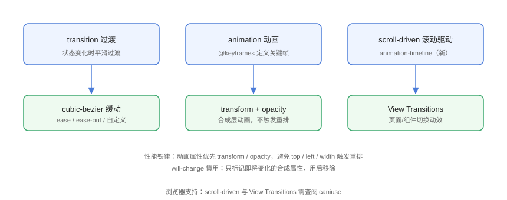

# 动画进阶

动画进阶篇在 transition / @keyframes 基础上，深入**性能优化**、**滚动驱动动画**（scroll-driven）与 **View Transitions**，让交互动效流畅且现代化。

## 动画类型全景



| 类型 | 触发方式 | 适用 |
| --- | --- | --- |
| `transition` | 属性状态变化 | hover、focus、开关态 |
| `@keyframes` 动画 | 自动/类名控制 | 循环动效、入场 |
| 滚动驱动动画 | 滚动位置/可见性 | 视差、进度条、渐显 |
| View Transitions | DOM 状态切换 | 页面/组件过渡 |

## 性能原则：只动合成属性

浏览器渲染流水线：**样式 → 布局 → 绘制 → 合成**。动画改 `width`/`top`/`left` 会触发布局与绘制（昂贵）；只改 `transform` / `opacity` 只在合成层处理（GPU 加速）。

```css
/* Animation/perf.css */
.bad {
  transition: left 0.3s ease;        /* 触发布局，卡顿风险 */
  position: absolute;
  left: 0;
}

.good {
  transition: transform 0.3s ease;   /* 合成层，流畅 */
  transform: translateX(0);
}

.bad:hover  { left: 100px; }
.good:hover { transform: translateX(100px); }
```

::: danger 动画卡顿自查
1. 是否在动画中改了 `width`/`height`/`top`/`left`/`margin`？→ 改用 transform。
2. 是否在动画中改了 `display`？→ 用 `visibility` + `opacity` 组合。
3. 是否整页大量元素同时动画？→ 控制数量与范围，必要时 `contain`。
:::

## 缓动函数

```css
/* Animation/easing.css */
.box {
  transition: transform 0.5s;
  transition-timing-function: cubic-bezier(0.68, -0.55, 0.27, 1.55);
}
```

| 缓动 | 效果 |
| --- | --- |
| `ease` | 慢-快-慢（默认） |
| `ease-out` | 快-慢（入场推荐） |
| `ease-in` | 慢-快（离场推荐） |
| `linear` | 匀速 |
| `cubic-bezier(...)` | 自定义（在线工具生成） |
| `steps(n)` | 逐帧跳变（打字机效果） |

## 滚动驱动动画

滚动驱动动画用 `animation-timeline` 把动画进度绑定到**滚动位置**或**元素可见性**，无需 JavaScript 监听滚动。

### 滚动进度条

```css
/* Animation/scroll-progress.css */
@keyframes grow {
  from { transform: scaleX(0); }
  to   { transform: scaleX(1); }
}

.progress {
  position: fixed;
  top: 0;
  left: 0;
  right: 0;
  height: 4px;
  background: #4a7bd8;
  transform-origin: left;
  animation: grow linear both;
  /* 绑定到最近的滚动容器 */
  animation-timeline: scroll();
}
```

```html
<!-- Animation/scroll-progress.html -->
<div class="progress"></div>
<div style="height: 2000px">滚动查看顶部进度条</div>
```

### 元素进入视口渐显

```css
/* Animation/reveal.css */
@keyframes reveal {
  from { opacity: 0; transform: translateY(40px); }
  to   { opacity: 1; transform: none; }
}

.reveal {
  animation: reveal both;
  /* 元素进入视口时驱动，可加 range 控制触发区间 */
  animation-timeline: view();
  animation-range: entry 0% entry 80%;
}
```

::: warning 浏览器支持
滚动驱动动画：Chrome 115+ / Edge 115+（2023 年 7 月）、Firefox 110+（部分）、Safari 26.4+（2026 年）已可用；**旧浏览器需提供无动画降级**（动画默认不执行也不影响内容可读性）。
:::

## View Transitions

View Transitions API 在 DOM 更新瞬间生成前后快照并平滑过渡，适合 SPA 页面切换、列表项增删：

```js
// Animation/view-transition.js
// 触发过渡：浏览器自动截图旧状态 → 更新 DOM → 截图新状态 → 混合过渡
document.startViewTransition(() => {
  document.querySelector('#list').append(newItem);
});
```

```css
/* Animation/view-transition.css */
::view-transition-old(root) {
  animation: fade-out 0.3s ease;
}

::view-transition-new(root) {
  animation: fade-in 0.3s ease;
}

@keyframes fade-out { to { opacity: 0; } }
@keyframes fade-in  { from { opacity: 0; } }
```

::: tip 渐进增强
不支持 View Transitions 的浏览器会**直接更新 DOM**（无过渡），功能不受影响——这是天然的渐进增强 API，放心使用。
:::

## 动画播放控制

```css
/* Animation/control.css */
.icon {
  animation: spin 2s linear infinite;
  animation-play-state: running;
}

.icon.paused {
  animation-play-state: paused;   /* 暂停/恢复 */
}

@keyframes spin {
  to { transform: rotate(360deg); }
}
```

```js
// Animation/control.js
document.querySelector('.icon').style.animationPlayState = 'paused';
```

## 易错点与最佳实践

::: danger 常见坑
1. **动画大量使用 `will-change`**：会占用合成层内存，只在动画前临时添加、结束后移除。
2. **`transition` 写在 `:hover` 上**：移出时没有过渡（突变），应写在元素默认状态。
3. **`transform` 叠加覆盖**：`translateX` 与 `rotate` 写在两个规则里会互相覆盖，需合并到一个 transform。
4. **动画与 `display:none` 冲突**：隐藏元素无法播放入场动画，先用 `visibility` 或等动画结束再隐藏。
5. **无视 `prefers-reduced-motion`**：用户系统开启「减弱动态效果」时应停用或简化动画。
:::

::: tip 无障碍动画
```css
@media (prefers-reduced-motion: reduce) {
  *,
  *::before,
  *::after {
    animation-duration: 0.01ms !important;
    animation-iteration-count: 1 !important;
    transition-duration: 0.01ms !important;
  }
}
```
:::

## 验证方式

打开 `scroll-progress.html` 滚动页面，确认顶部进度条随滚动伸缩；用 DevTools Performance 录制滚动/悬停动画，确认「Layout/Paint」区域无大块耗时（只有 Composite）。在系统设置开启「减弱动态效果」后刷新，确认动画被降级。

## 参考资料

- [MDN：CSS 动画性能](https://developer.mozilla.org/zh-CN/docs/Web/Performance/CSS_JavaScript_animation_performance)
- [MDN：滚动驱动动画](https://developer.mozilla.org/en-US/docs/Web/CSS/animation-timeline)
- [MDN：View Transitions API](https://developer.mozilla.org/zh-CN/docs/Web/API/View_Transitions_API)
