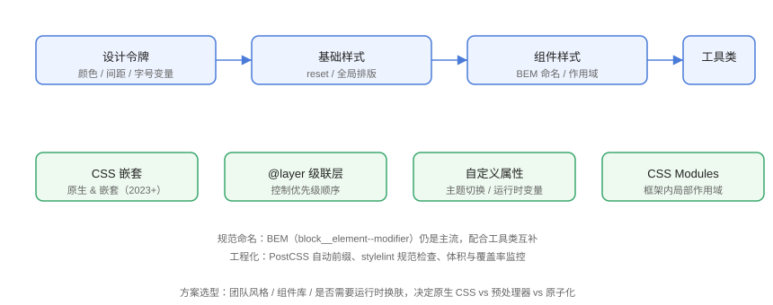

# CSS 架构与工程化

项目变大后，CSS 的敌人是**全局污染、优先级战争与不可维护的命名**。本页介绍现代 CSS 架构分层、BEM 命名、原生嵌套、`@layer` 级联层与工程化工具链，让样式系统可长期演进。

## 架构分层



推荐四层：

| 层 | 内容 | 示例 |
| --- | --- | --- |
| 设计令牌 | 颜色、间距、字号变量 | `--color-primary`、`--space-4` |
| 基础样式 | reset、全局排版、动效规范 | `html`、`body`、`a` |
| 组件样式 | 带作用域的组件类 | `.button--primary` |
| 工具类 | 单一职责类 | `.flex`、`.text-center` |

## BEM 命名

BEM（Block Element Modifier）：`块__元素--修饰符`，避免全局命名冲突。

```css
/* Architecture/bem.css */
.card { }                    /* 块 */
.card__title { }             /* 元素 */
.card__title--large { }      /* 修饰符 */
.card--featured { }          /* 块级修饰 */
```

```html
<!-- Architecture/bem.html -->
<article class="card card--featured">
  <h2 class="card__title card__title--large">标题</h2>
  <p class="card__desc">描述</p>
</article>
```

::: tip BEM 的作用
命名即文档：一看类名就知道「哪个块的哪个部分、什么状态」，特异性保持低（单类选择器），覆盖逻辑可控。
:::

## CSS 嵌套（原生）

CSS 嵌套（2023 年起主流浏览器全支持）让层级关系一目了然：

```css
/* Architecture/nesting.css */
.card {
  padding: 16px;

  /* & 表示父选择器 */
  & > h2 {
    font-size: 1.25rem;
  }

  &:hover {
    box-shadow: 0 4px 12px rgba(0, 0, 0, 0.15);
  }

  &--featured {
    border-color: #4a7bd8;
  }
}
```

::: warning 嵌套层级控制
嵌套容易写深（4 层以上），建议最多 2~3 层；过深会降低可读性并增加特异性。团队可用 stylelint 的 `max-nesting-depth` 规则约束。
:::

## @layer 级联层

`@layer` 显式声明样式层的**优先级顺序**，从根上解决「第三方库覆盖难、优先级战争」：

```css
/* Architecture/layer.css */
/* 声明顺序 = 优先级顺序（后声明的层覆盖先声明的） */
@layer reset, base, components, utilities;

/* 各层内容 */
@layer reset {
  * { margin: 0; padding: 0; box-sizing: border-box; }
}

@layer components {
  .button { background: #4a7bd8; color: #fff; }
}

/* 工具类永远最后：覆盖组件默认 */
@layer utilities {
  .bg-red { background: red; }
}
```

效果：`utilities` 层的 `.bg-red` 无论写在组件规则前还是后，都稳定覆盖 `components` 层的 `.button` 背景。

::: tip @layer 的意义
不靠特异性（ID/多类选择器）硬压，而是**显式分层**：第三方样式放 `vendor` 层，业务样式放后面，升级库不再担心样式冲突。
:::

## 自定义属性与主题

```css
/* Architecture/theme.css */
:root {
  --color-primary: #4a7bd8;
  --color-bg: #ffffff;
  --color-text: #1f2937;
  --space-4: 16px;
  --radius: 8px;
}

[data-theme="dark"] {
  --color-bg: #111827;
  --color-text: #f9fafb;
}

.page {
  background: var(--color-bg);
  color: var(--color-text);
  padding: var(--space-4);
  border-radius: var(--radius);
}
```

```js
// Architecture/theme.js
document.documentElement.dataset.theme = 'dark';   // 一键换肤
```

## 工程化工具链

| 工具 | 作用 |
| --- | --- |
| PostCSS | 自动前缀、嵌套转译、`@layer` 兼容 |
| stylelint | 风格/质量检查（顺序、嵌套深度、无效属性） |
| CSS Modules / Scoped | 框架内局部作用域 |
| PurgeCSS（Tailwind 内置） | 移除未使用样式 |
| Lightning CSS | 新一代高性能 CSS 编译器 |

## 易错点与最佳实践

::: danger 常见坑
1. **选择器过度嵌套**：`.nav .list .item a:hover` 特异性高且难维护，用 BEM 单类。
2. **`!important` 滥用**：优先级战争升级为 `!important` 互踩，用 `@layer` 规范层级。
3. **全局标签选择器改样式**：`div { ... }` 影响面不可控，组件一律用类名。
4. **变量命名无体系**：颜色变量要带语义（`--color-danger`）而不是色值（`--red`）。
5. **忽略样式体积**：不断追加样式导致 CSS 膨胀，用工具类 + 组件化控制重复。
:::

::: tip 最佳实践
- 新项目直接上原生 CSS 嵌套 + `@layer` + 自定义属性，预处理器非必须；
- 团队规范用 stylelint 落地，避免口头约定失效；
- 框架组件库（Vue/React）优先 CSS Modules/Scoped 隔离，全局层放设计令牌。
:::

## 验证方式

在浏览器中验证 `@layer`：给 `.button` 追加一个 `background: green` 的未分层规则，确认 `utilities` 层仍生效；用 stylelint 跑一遍 `max-nesting-depth`，检查嵌套是否超标。

## 参考资料

- [MDN：@layer 级联层](https://developer.mozilla.org/zh-CN/docs/Web/CSS/@layer)
- [MDN：CSS 嵌套](https://developer.mozilla.org/zh-CN/docs/Web/CSS/CSS_nesting)
- [BEM 官方文档](https://getbem.com/)
- [stylelint 官方文档](https://stylelint.io/)
