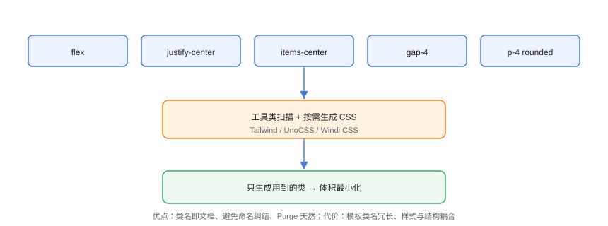

# 原子化 CSS 实战

原子化 CSS（Atomic CSS）把样式拆成**单一职责工具类**（`.flex`、`.text-center`、`.p-4`），在模板中组合使用，由工具生成按需 CSS。Tailwind CSS 与 UnoCSS 是当前主流实现。

## 工作方式



```html
<!-- AtomicCSS/usage.html -->
<div class="flex items-center justify-between gap-4 p-4 rounded">
  <span class="text-lg font-bold">标题</span>
  <button class="px-3 py-1 bg-blue-500 text-white rounded">
    按钮
  </button>
</div>
```

构建时工具扫描这些类名，只生成用到的 CSS，未使用的类不产出——体积天然最小。

## 与组件 CSS 的取舍

| 维度 | 原子化 CSS | 传统组件 CSS |
| --- | --- | --- |
| 命名 | 不用想类名 | 需要 BEM 等规范 |
| 复用 | 组合即样式 | 抽取组件 |
| 体积 | 按需生成 | 全量加载 |
| 可读性 | 类名冗长 | 语义清晰 |
| 动态主题 | 变量驱动 | 变量/预处理器 |

::: tip 一句话理解
原子化 CSS 牺牲「类名的语义」，换取「不用维护样式文件 + 体积可控」。适合组件库与快速迭代项目；复杂动画/状态样式仍可写组件 CSS。
:::

## Tailwind CSS 快速上手

```bash
# 安装（npm 项目）
npm install tailwindcss @tailwindcss/vite
```

```ts
// vite.config.ts
import tailwindcss from '@tailwindcss/vite';

export default defineConfig({
  plugins: [tailwindcss()],
});
```

```css
/* src/style.css（Tailwind v4 写法） */
@import "tailwindcss";
```

```html
<!-- 使用 -->
<button class="bg-blue-500 hover:bg-blue-600 text-white font-medium
               px-4 py-2 rounded-lg transition-colors">
  提交
</button>
```

常用工具类速查：

| 分类 | 示例 |
| --- | --- |
| 布局 | `flex`、`grid`、`gap-4`、`items-center`、`justify-between` |
| 间距 | `p-4`、`px-3`、`m-2`、`space-x-2` |
| 排版 | `text-lg`、`font-bold`、`text-center`、`leading-6` |
| 颜色 | `bg-blue-500`、`text-white`、`border-gray-200` |
| 响应式 | `md:flex`、`lg:grid-cols-3`、`max-sm:hidden` |
| 状态 | `hover:bg-*`、`focus:ring-*`、`active:scale-95` |
| 动效 | `transition`、`duration-300`、`animate-spin` |

## UnoCSS 特点

UnoCSS 是「即时按需」引擎，速度更快、可自定义规则：

```ts
// unocss.config.ts
import { defineConfig, presetUno, presetAttributify } from 'unocss';

export default defineConfig({
  presets: [
    presetUno(),            // Tailwind 兼容工具类
    presetAttributify(),    // 属性模式：<div flex />
  ],
  rules: [
    ['my-custom', { color: 'rebeccapurple' }],   // 自定义工具类
  ],
});
```

```html
<!-- attributify 模式 -->
<div flex items-center gap-2>
  <span text-lg>UnoCSS</span>
</div>
```

## 自定义主题与暗色模式

```css
/* AtomicCSS/theme.css（Tailwind v4 主题变量） */
@theme {
  --color-brand: #4a7bd8;
  --spacing-page: 24px;
}

/* 使用自定义令牌 */
<div class="bg-brand p-page">品牌色内容</div>

/* 暗色模式：class 策略 */
<html class="dark">
<div class="bg-white dark:bg-gray-900 text-gray-900 dark:text-gray-100">
```

## 性能与体积

```bash
# 构建后检查产物 CSS 体积
npx tailwindcss -i ./src/style.css -o ./dist/tailwind.css --minify
wc -c ./dist/tailwind.css
```

只有用到的类才会生成，小型页面产物通常只有几 KB；未用类不产生死代码。

::: warning 动态类名失效
工具类名必须**完整出现在源码字符串**中，字符串拼接的类名（如 `` `bg-${color}-500` ``）无法被扫描，样式会缺失。动态需求用完整映射表或 safelist。
:::

## 易错点与最佳实践

::: danger 常见坑
1. **动态拼接类名**：扫描器找不到，样式不生成。
2. **滥用 `@apply`**：把工具类堆进自定义类导致源码膨胀，优先直接在模板组合。
3. **与组件库样式冲突**：优先级与覆盖顺序需用 `@layer` 或重要程度统一管理。
4. **`dark:` 策略未配置**：暗色类不生效，检查 `darkMode: 'class'`。
5. **版本混用**：Tailwind v3 与 v4 配置差异大，按安装版本查文档。
:::

::: tip 最佳实践
- 页面布局/排版用工具类，复杂组件封装成组件并抽公共类名；
- 自定义设计令牌（颜色、间距）在 `@theme` 集中定义，禁止散落色值；
- 与 Vue/React 配合时，类名集中在模板中，样式文件只留全局与特殊场景。
:::

## 验证方式

运行 `npm run build` 后检查产物 CSS：确认只包含用到的类、体积合理；在页面中故意写一个拼错的类名（如 `bg-bule-500`），确认不报错但无样式，从而验证按需生成的机制。

## 参考资料

- [Tailwind CSS 官方文档](https://tailwindcss.com/)
- [UnoCSS 官方文档](https://unocss.dev/)
- [Windi CSS（参考）](https://windicss.org/)
