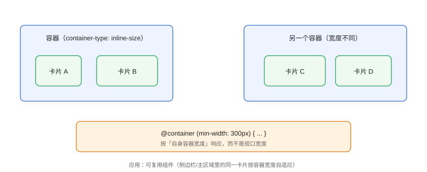

# 容器查询 Container Queries

容器查询（Container Queries）让组件样式**跟随自身容器宽度**变化，而不是跟随视口宽度。它解决了「同一个卡片组件放在侧边栏和主区域要写两套媒体查询」的痛点，是组件化时代的核心响应式能力。

## 与媒体查询的对比



| 维度 | 媒体查询 `@media` | 容器查询 `@container` |
| --- | --- | --- |
| 判断依据 | 视口（浏览器窗口） | 祖先容器尺寸 |
| 作用对象 | 全局页面 | 组件内部 |
| 组件复用 | 每个位置都要适配 | 一套样式处处生效 |
| 支持情况 | 全浏览器 | 2023 年起主流浏览器全支持 |

::: tip 一句话理解
媒体查询问「屏幕多大？」；容器查询问「**我所在的容器多宽？**」。
:::

## 基本用法

```css
/* ContainerQuery/basic.css */
.card-container {
  container-type: inline-size;   /* 声明为容器：只跟踪宽度 */
  container-name: card;          /* 命名，可多个容器区分 */
}

.card {
  display: grid;
  grid-template-columns: 1fr;
  gap: 8px;
}

/* 容器宽度 ≥ 400px 时，卡片变为横排 */
@container card (min-width: 400px) {
  .card {
    grid-template-columns: 120px 1fr;
  }
}
```

```html
<!-- ContainerQuery/basic.html -->
<div class="card-container" style="width: 300px">
  <div class="card">
    
    <div class="info">
      <h3>标题</h3>
      <p>描述文字</p>
    </div>
  </div>
</div>

<div class="card-container" style="width: 600px">
  <!-- 同一个组件，自动横排 -->
  <div class="card">...</div>
</div>
```

同一套 `.card` 样式，左侧窄容器显示竖排、右侧宽容器显示横排——无需知道它在页面哪个位置。

## container-type 的值

| 值 | 行为 |
| --- | --- |
| `inline-size` | 只跟踪内联方向（宽度），最常用 |
| `size` | 同时跟踪宽高（会创建新的格式化上下文） |
| `normal` | 不参与查询，仅作为命名容器 |

::: danger 布局陷阱
`container-type: size` 会让元素宽高由内容撑开的特性失效（类似 `contain: size`），宽高必须显式设置。**大多数场景用 `inline-size`**。
:::

## 容器查询单位

容器查询还提供相对单位，让元素尺寸随容器缩放：

| 单位 | 含义 |
| --- | --- |
| `cqw` | 容器宽度的 1% |
| `cqh` | 容器高度的 1% |
| `cqi` | 容器内联尺寸的 1% |
| `cqb` | 容器块尺寸的 1% |
| `cqmin` / `cqmax` | 两者较小/较大值 |

```css
/* ContainerQuery/units.css */
.avatar {
  width: 20cqi;      /* 容器宽度的 20% */
  height: 20cqi;
  border-radius: 50%;
}
```

## 与 Grid 组合的响应式卡片墙

```css
/* ContainerQuery/combo.css */
.dashboard {
  display: grid;
  grid-template-columns: repeat(auto-fit, minmax(260px, 1fr));
  gap: 16px;
}

.panel {
  container-type: inline-size;
  background: #fff;
  border-radius: 12px;
  padding: 16px;
}

.panel h3 { font-size: 1rem; }

/* 容器较宽时标题放大、信息横排 */
@container (min-width: 420px) {
  .panel h3 { font-size: 1.25rem; }
  .panel .meta { display: flex; justify-content: space-between; }
}
```

效果：网格自动排布列数，每个面板再按自身宽度微调内部排版——两层响应式各司其职。

## 样式查询（style queries）

容器查询还能按**自定义属性**判断（2023 年后 Chrome/Edge 支持，Firefox/Safari 进展中）：

```css
/* ContainerQuery/style-query.css */
.theme-container {
  container-type: inline-size;
  --theme: dark;
}

@container style(--theme: dark) {
  .card {
    background: #1f2937;
    color: #f9fafb;
  }
}
```

::: warning 兼容性提示
`@container style(...)` 目前主要支持 Chromium 系（Chrome/Edge 111+）；Firefox 与 Safari 支持仍在推进，跨浏览器项目需提供降级。
:::

## 易错点与最佳实践

::: danger 常见坑
1. **忘记 `container-type`**：只写 `@container` 查询但容器未声明，查询不生效。
2. **`size` 导致内容塌陷**：用 `size` 必须显式宽高，通常用 `inline-size` 即可。
3. **容器查询与媒体查询混用混乱**：组件内部用容器查询，页面骨架用媒体查询，分工明确。
4. **嵌套容器互相干扰**：组件内再声明容器会形成嵌套，查询默认找最近的祖先容器，用 `container-name` 精确指定。
5. **查询条件过细**：断点粒度粗一点（每 100~150px 一档），避免「断点地狱」。
:::

::: tip 最佳实践
- 组件库的响应式逻辑统一用容器查询，让组件「自带适配」；
- 容器查询 + Grid `auto-fit` 组合，覆盖网格层与组件层两级自适应；
- 旧浏览器降级：默认竖排（基础样式），容器查询作为增强。
:::

## 验证方式

打开 `basic.html`，拖动两个容器宽度，确认同一卡片组件在 300px 竖排、600px 横排；用 DevTools 的 Rendering 面板勾选「显示容器查询」，可视化查看容器边界与命中范围。

## 参考资料

- [MDN：CSS 容器查询](https://developer.mozilla.org/zh-CN/docs/Web/CSS/CSS_containment/Container_queries)
- [MDN：container-type](https://developer.mozilla.org/zh-CN/docs/Web/CSS/container-type)
- [caniuse：CSS Container Queries](https://caniuse.com/css-container-queries)
