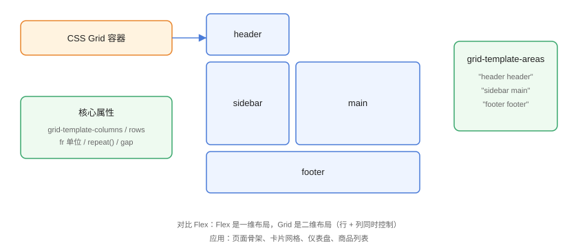

# Grid 布局详解

CSS Grid（网格布局）是 CSS 的**二维布局系统**：同时控制行与列，能轻松实现页面骨架、卡片网格、复杂区域划分。与 Flex（一维）互补，是现代布局的首选方案之一。

## Grid 与 Flex 的选型



| 维度 | Grid | Flex |
| --- | --- | --- |
| 维度 | 二维（行 + 列） | 一维（主轴） |
| 典型场景 | 页面骨架、卡片墙、仪表盘 | 导航、按钮组、单行排列 |
| 对齐控制 | `justify-items` / `align-items` 双轴 | 主轴 + 交叉轴 |
| 区域命名 | `grid-template-areas` | 无 |
| 自动换行 | `auto-fill` / `auto-fit` | `flex-wrap` |

::: tip 一句话理解
Flex 管「一排怎么排」，Grid 管「整个版面怎么切」。先问自己：这是单方向排列还是整体网格？选对布局模型事半功倍。
:::

## 基本语法

```css
/* GridLayout/grid-basic.css */
.container {
  display: grid;
  /* 三列：1fr 2fr 1fr（fr = 剩余空间分数） */
  grid-template-columns: 1fr 2fr 1fr;
  /* 两行：100px 与 auto */
  grid-template-rows: 100px auto;
  /* 间距 */
  gap: 16px;
}
```

```html
<!-- GridLayout/grid-basic.html -->
<div class="container">
  <div class="item">1</div>
  <div class="item">2</div>
  <div class="item">3</div>
  <div class="item">4</div>
  <div class="item">5</div>
  <div class="item">6</div>
</div>
```

验证：浏览器打开后看到 3 列 × 2 行的网格，中间列是两侧的两倍宽，间距 16px。

## 常用单位与函数

| 写法 | 含义 |
| --- | --- |
| `repeat(3, 1fr)` | 重复 3 列等分 |
| `minmax(200px, 1fr)` | 最小 200px，可弹性扩展 |
| `auto-fill` | 尽量多放列（会留空位） |
| `auto-fit` | 尽量拉伸填满（不留空位） |
| `fr` | 剩余空间分数 |

### 自适应网格（卡片墙）

```css
/* GridLayout/card-grid.css */
.card-grid {
  display: grid;
  /* 每列最少 240px，能放几列放几列，并自动拉伸 */
  grid-template-columns: repeat(auto-fit, minmax(240px, 1fr));
  gap: 16px;
}

.card {
  background: #fff;
  border: 1px solid #e5e7eb;
  border-radius: 8px;
  padding: 16px;
  box-shadow: 0 1px 3px rgba(0, 0, 0, 0.1);
}
```

```html
<!-- GridLayout/card-grid.html -->
<div class="card-grid">
  <div class="card">卡片 1</div>
  <div class="card">卡片 2</div>
  <div class="card">卡片 3</div>
  <div class="card">卡片 4</div>
  <div class="card">卡片 5</div>
</div>
```

改变窗口宽度，卡片列数自动在 1～5 列之间切换，无需任何媒体查询——这是 Grid 最常用的响应式手段。

## grid-template-areas 区域命名

```css
/* GridLayout/areas.css */
.layout {
  display: grid;
  grid-template-columns: 220px 1fr;
  grid-template-rows: 60px 1fr 60px;
  grid-template-areas:
    "header header"
    "sidebar main"
    "footer footer";
  height: 100vh;
  gap: 8px;
}

.header  { grid-area: header;  background: #4a7bd8; }
.sidebar { grid-area: sidebar; background: #eef4ff; }
.main    { grid-area: main;    background: #f9fafb; }
.footer  { grid-area: footer;  background: #e5e7eb; }
```

```html
<!-- GridLayout/areas.html -->
<div class="layout">
  <header class="header">顶部</header>
  <aside class="sidebar">侧边栏</aside>
  <main class="main">内容区</main>
  <footer class="footer">底部</footer>
</div>
```

区域命名让布局结构一眼可读，改版时只需调整 `grid-template-areas` 的字符画，无需改动 HTML 顺序。

## 子项控制

```css
/* GridLayout/item-control.css */
.grid {
  display: grid;
  grid-template-columns: repeat(3, 1fr);
  gap: 8px;
}

.span-2 {
  grid-column: span 2;      /* 跨两列 */
}

.start-end {
  grid-column: 2 / 4;       /* 从第 2 条线到第 4 条线 */
}

.order-last {
  order: 1;                 /* 排序（默认 0） */
}
```

常用子项属性：

| 属性 | 作用 |
| --- | --- |
| `grid-column` / `grid-row` | 跨列/跨行（`span n` 或 `起/止`） |
| `grid-area` | 指定命名区域或四条线 |
| `justify-self` / `align-self` | 单元格内水平/垂直对齐 |
| `order` | 视觉排序 |

## Subgrid（子网格）

Subgrid 让嵌套网格**继承外层网格的轨道线**，是 2023 年后广泛可用的能力：

```css
/* GridLayout/subgrid.css */
.outer {
  display: grid;
  grid-template-columns: repeat(3, 1fr);
  gap: 16px;
}

.outer > .card {
  display: grid;
  grid-template-rows: subgrid;  /* 行轨道跟随外层 */
  grid-row: span 2;             /* 占两行 */
}
```

效果：多张卡片内部的行（如图片、标题、按钮）严格对齐，不必依赖「等高 trick」。

::: warning Subgrid 支持
Subgrid 的 `grid-template-rows: subgrid` 已获 2023 年后主流浏览器支持（Chrome 117+、Firefox 71+、Safari 16+），可直接用于生产。
:::

## 易错点与最佳实践

::: danger 常见坑
1. **`grid-template-columns` 忘写导致单列**：只设 `display: grid` 默认单列，多列必须显式定义轨道。
2. **`fr` 与 `minmax` 组合溢出**：`1fr` 最小可到 0，配合 `minmax(200px, 1fr)` 防压缩。
3. **`auto-fill` 与 `auto-fit` 混淆**：`auto-fill` 保留空轨道，`auto-fit` 折叠空轨道并拉伸。
4. **`gap` 与 `margin` 混用**：Grid 布局用 `gap`，子项别再加左右 margin 造成间距翻倍。
5. **旧浏览器兼容**：需要 IE 的项目 Grid 需降级（`display: block` + 工具类），2026 年新项目通常无需考虑。
:::

::: tip 最佳实践
- 页面骨架用 `grid-template-areas`，可读性最好；
- 卡片墙用 `repeat(auto-fit, minmax(240px, 1fr))`，天然响应式；
- 一维排列（导航、按钮组）继续用 Flex，不要为了用 Grid 而用 Grid。
:::

## 验证方式

用浏览器打开 `grid-basic.html` 与 `card-grid.html`，在 DevTools 的「布局」面板打开 Grid 叠加显示，确认轨道与区域划分正确；拖动窗口宽度验证 `auto-fit` 列数变化。

## 参考资料

- [MDN：CSS Grid Layout](https://developer.mozilla.org/zh-CN/docs/Web/CSS/CSS_grid_layout)
- [CSS Grid 完全指南（CSS-Tricks）](https://css-tricks.com/snippets/css/complete-guide-grid/)
- [MDN：Subgrid](https://developer.mozilla.org/zh-CN/docs/Web/CSS/CSS_grid_layout/Subgrid)
