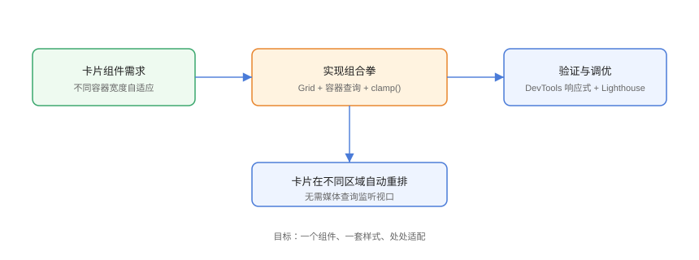

# 实战：自适应卡片组件

综合运用 Grid、容器查询、clamp() 与暗色模式变量，做一个**可在任意容器宽度下自适配**的卡片组件：侧边栏里竖排紧凑、主区域横排完整、宽屏下展示更多信息。一个组件、一套样式、处处适用。

## 设计目标



1. 容器宽度 < 360px：竖排，只显示核心信息；
2. 容器宽度 ≥ 360px：横排，显示缩略图 + 标题 + 描述；
3. 容器宽度 ≥ 560px：显示完整元信息（时间、标签、操作按钮）；
4. 支持暗色模式；
5. 标题字号用 `clamp()` 流式缩放。

## HTML 结构

```html
<!-- Practice/card.html -->
<main class="demo-grid">
  <div class="card-host">
    <article class="media-card">
      
      <div class="media-card__body">
        <h3 class="media-card__title">现代 CSS 布局实践</h3>
        <p class="media-card__desc">Grid、容器查询与流式排版的组合应用。</p>
        <div class="media-card__meta">
          <span class="media-card__tag">CSS</span>
          <time class="media-card__time">2026-08-30</time>
          <button class="media-card__btn">查看</button>
        </div>
      </div>
    </article>
  </div>

  <div class="card-host">
    <!-- 同一组件，放第二个容器里 -->
    <article class="media-card">...</article>
  </div>
</main>
```

## 核心 CSS

```css
/* Practice/card.css */
/* ========== 1. 容器声明 ========== */
.card-host {
  container-type: inline-size;
  container-name: media-card;
}

/* ========== 2. 基础（移动/窄容器）========== */
.media-card {
  display: grid;
  grid-template-columns: 1fr;
  gap: 12px;
  padding: clamp(12px, 3cqi, 20px);
  background: var(--card-bg);
  border: 1px solid var(--card-border);
  border-radius: 12px;
  box-shadow: 0 1px 3px rgba(0, 0, 0, 0.08);
}

.media-card__thumb {
  width: 100%;
  aspect-ratio: 16 / 9;
  object-fit: cover;
  border-radius: 8px;
}

.media-card__title {
  font-size: clamp(1rem, 2.5cqi, 1.5rem);
  margin: 0 0 8px;
}

.media-card__meta {
  display: none;   /* 窄容器默认隐藏元信息 */
  margin-top: 12px;
  gap: 8px;
  align-items: center;
}

/* ========== 3. 容器查询：横排 ========== */
@container media-card (min-width: 360px) {
  .media-card {
    grid-template-columns: 120px 1fr;
  }
}

/* ========== 4. 容器查询：完整信息 ========== */
@container media-card (min-width: 560px) {
  .media-card {
    grid-template-columns: 180px 1fr;
  }
  .media-card__meta {
    display: flex;
  }
  .media-card__btn {
    margin-left: auto;
  }
}

/* ========== 5. 暗色模式 ========== */
:root {
  --card-bg: #ffffff;
  --card-border: #e5e7eb;
  --card-text: #1f2937;
  --card-muted: #6b7280;
}

[data-theme="dark"] {
  --card-bg: #1f2937;
  --card-border: #374151;
  --card-text: #f9fafb;
  --card-muted: #9ca3af;
}

.media-card {
  color: var(--card-text);
}

.media-card__time {
  color: var(--card-muted);
  font-size: 0.85rem;
}
```

## 外层网格（验证多位置复用）

```css
/* Practice/demo-grid.css */
.demo-grid {
  display: grid;
  grid-template-columns: 220px 1fr;   /* 左窄右宽两个容器 */
  gap: 24px;
  padding: 24px;
}

@media (max-width: 720px) {
  .demo-grid { grid-template-columns: 1fr; }
}
```

同一组件在 220px 容器里竖排精简、在宽容器里横排完整——**容器查询让组件自己感知处境**。

## 验证步骤

1. 打开 `card.html`，确认左侧窄容器显示竖排 + 无元信息；
2. 右侧容器显示横排 + 元信息；
3. 拖动窗口宽度，确认外层网格在 720px 以下变为单列，卡片仍各自按容器宽度适配；
4. 在 DevTools 控制台执行 `document.documentElement.dataset.theme = 'dark'`，确认暗色模式生效；
5. 用 DevTools 响应式模式与 Lighthouse 检查 CLS（布局偏移）指标。

## 工程化收尾

```css
/* Practice/polyfill-hint.css */
/* 旧浏览器降级：容器查询不支持的浏览器直接展示基础竖排样式，
   不影响可读性，属于渐进增强。 */
@supports (container-type: inline-size) {
  .card-host { container-type: inline-size; }
}
```

## 易错点与最佳实践

::: danger 常见坑
1. **容器忘了 `container-type`**：查询不生效，卡片永远基础样式。
2. **`cqi` 单位误用**：`cqi` 是容器尺寸单位，容器未声明时回退异常。
3. **`aspect-ratio` 与图片拉伸**：`object-fit: cover` 防止变形。
4. **暗色模式变量未跟随**：组件颜色全部走 `var()`，不要写死色值。
5. **`clamp()` 与固定 px 混用**：关键尺寸（字号、间距）统一流式。
:::

::: tip 最佳实践
- 组件「基础样式 = 最简形态」，容器查询只做增强，天然降级；
- 设计令牌集中定义，组件不出现裸色值；
- 把组件单独放到 Storybook/组件预览环境，用不同容器宽度直观验收。
:::

## 参考资料

- [MDN：容器查询](https://developer.mozilla.org/zh-CN/docs/Web/CSS/CSS_containment/Container_queries)
- [MDN：clamp()](https://developer.mozilla.org/zh-CN/docs/Web/CSS/clamp)
- [MDN：aspect-ratio](https://developer.mozilla.org/zh-CN/docs/Web/CSS/aspect-ratio)
