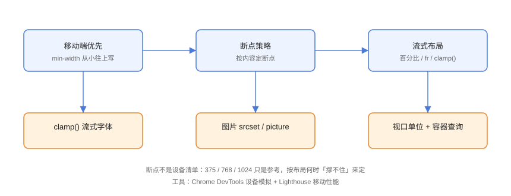

# 响应式设计进阶

响应式设计进阶篇从「套模板断点」走向**体系化**：移动优先、按内容定断点、流式排版（clamp）、响应式图片与容器查询协同，让页面在任意屏幕上都自然可用。

## 响应式体系



核心四层：

1. **流式布局**：百分比、`fr`、`clamp()`，让元素随容器伸缩；
2. **媒体查询**：按视口断点调整布局；
3. **容器查询**：组件按自身容器自适应；
4. **响应式资源**：图片、字体、视频按设备加载合适版本。

## 移动优先

```css
/* Responsive/mobile-first.css */
/* 基础样式 = 移动端 */
.page {
  padding: 12px;
}

.sidebar {
  display: none;               /* 移动端隐藏侧栏 */
}

/* 增强 = 平板及以上，用 min-width 从小到大 */
@media (min-width: 768px) {
  .page { padding: 24px; }
  .sidebar { display: block; }
}

@media (min-width: 1200px) {
  .page { max-width: 1200px; margin: 0 auto; }
}
```

::: tip 为什么移动优先
1. 移动端样式最少、最简单，作为基础默认；
2. `min-width` 增量书写，可读性好；
3. 桌面增强不会影响移动端已有样式。
:::

## 断点策略

断点应该**按布局何时撑不住来定**，而不是罗列设备宽度：

```css
/* Responsive/breakpoints.css */
/* 推荐断点参考（按内容微调） */
@media (min-width: 480px)  { /* 两列卡片 */ }
@media (min-width: 768px)  { /* 侧边栏出现 */ }
@media (min-width: 1024px) { /* 三列主内容 */ }
@media (min-width: 1280px) { /* 宽屏布局 */ }
```

::: danger 不要为每个设备写断点
设备每年都在变，为 iPhone/Android 型号写死断点必然后继无力。**按内容断点 + 流式布局兜底**，设备列表只是参考。
:::

## 流式排版：clamp()

`clamp(MIN, VAL, MAX)` 让字号/间距随视口平滑缩放：

```css
/* Responsive/clamp.css */
h1 {
  /* 最小 1.5rem，理想 5vw，最大 3rem */
  font-size: clamp(1.5rem, 5vw, 3rem);
}

.container {
  /* 间距随视口在 16~48px 间变化 */
  padding: clamp(16px, 4vw, 48px);
}
```

验证：拖动窗口宽度，标题字号连续变化而不是跳变。

## 响应式图片

```html
<!-- Responsive/picture.html -->
<!-- srcset：按屏幕宽度选图，sizes：告知浏览器实际显示宽度 -->


<!-- picture：按媒体条件选不同图（方向、格式） -->
<picture>
  <source media="(min-width: 768px)" srcset="wide.webp" type="image/webp">
  
</picture>
```

::: tip 图片优化组合
1. `srcset` + `sizes`：按显示尺寸选图，省流量；
2. WebP/AVIF：更小体积同质量；
3. `loading="lazy"`：视口外图片延迟加载；
4. `fetchpriority="high"`：首屏关键图优先加载。
:::

## 视口与容器查询协同

```css
/* Responsive/cooperate.css */
.layout {
  display: grid;
  grid-template-columns: 1fr;
}

/* 页面层：视口足够宽才出现两栏 */
@media (min-width: 900px) {
  .layout { grid-template-columns: 260px 1fr; }
}

/* 组件层：不管在哪个栏，按自身容器适配 */
.widget {
  container-type: inline-size;
}

@container (max-width: 300px) {
  .widget .details { display: none; }
}
```

分工：**页面骨架问视口，组件内部问容器**，各管一层。

## 常见陷阱

::: danger 响应式开发自查
1. **`width` 固定像素**：正文容器用 `max-width: 100%` 或 `clamp()`，避免小屏横向滚动。
2. **图片不设 `max-width: 100%`**：大图撑破容器。
3. **字号只用 px**：正文用 `rem`，随根字号缩放；`em` 用于局部相对缩放。
4. **忽略横屏与超大屏**：`orientation` 查询与 `min-width: 1440px` 档位补全。
5. **未测试触控目标**：移动端按钮最小 44×44px（WCAG 建议）。
:::

## 验证方式

用 DevTools 设备模拟遍历 360/768/1024/1440 宽度，确认无横向滚动、图片不变形、触控目标可点；用 Lighthouse 移动端跑分，重点看「图片尺寸合适」「CLS」指标。

## 参考资料

- [MDN：响应式设计](https://developer.mozilla.org/zh-CN/docs/Learn_web_development/Core/CSS_layout/Responsive_Design)
- [MDN：响应式图片](https://developer.mozilla.org/zh-CN/docs/Learn_web_development/Core/HTML_responsive/Responsive_images)
- [MDN：clamp()](https://developer.mozilla.org/zh-CN/docs/Web/CSS/clamp)
