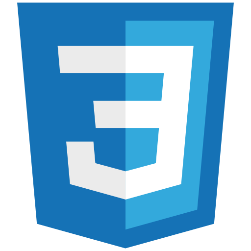

# CSS 进阶

在掌握 CSS 基础（选择器、盒子模型、Flex 等）之后，进阶篇聚焦现代布局（Grid）、动画进阶、容器查询、响应式工程化与原子化 CSS，帮助你写出**可维护、高性能、自适配**的样式系统。

浏览器支持说明：本专题以 **2026 年主流浏览器**（Chrome 151+、Firefox 149+、Safari 26.4+）为准；涉及新特性的支持情况会单独标注。

- [Grid 布局详解](GridLayout/index.md)
- [动画进阶](Animation/index.md)
- [容器查询 Container Queries](ContainerQuery/index.md)
- [响应式设计进阶](Responsive/index.md)
- [CSS 架构与工程化](Architecture/index.md)
- [原子化 CSS 实战](AtomicCSS/index.md)
- [实战：自适应卡片组件](Practice/index.md)
- [常见问题与最佳实践](FAQ/index.md)
