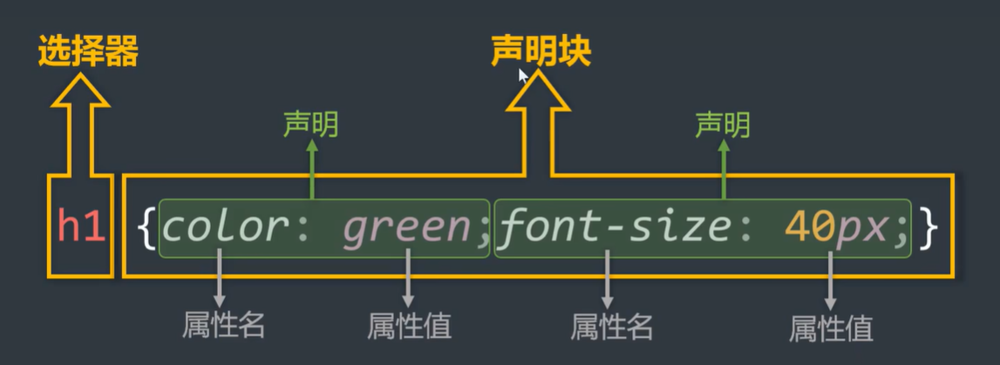

# CSS 基本使用

## 编写位置

### 行内样式

行内样式(内联样式)是写到标签内部 (`style`属性中)，可以控制**当前标签**的样式，特殊情况使用。

:::danger

1. style 的属性不能随便写，需要符合CSS的**语法**规范，以 `名:值;` 的形式。
2. 行内样式表，只能控制当前标签的样式，对其他标签无效。

:::

:::danger 存在的问题

书写繁琐、样式不能服用、并且没有体现出"**结构与样式分离**"的思想，不推荐大量使用，只有对当前元素添加简单样式时，才偶尔使用。

:::

**语法**：

```html
<h1 style="color:red;font-size:60px">你好 世界</h1>
```

### 内部样式

内部样式是写在html页面内部，将所有的CSS代码提取出来 (脱离结构)，可以控制**当前页面**的所有标签。写到`<head>` 标签中，单独放在`<style>`标签中。

:::danger

1. `<style>` 标签理论上可以放在HTML文档的任何地方，但一般都放在`<head>` 标签中。
2. 该写法样式可以复用，代码结构清晰。

:::

:::danger 存在的问题

1. 并没有实现结构与样式完全分离。
2. 多个HTML页面无法复用样式。

:::

**语法**：

```html
<head>
  <style>
    h1 {
      color: red;
      font-size: 40px;
    }
  </style>
</head>
<body>
  <h1>你好 世界</h1>
</body>
```

### 外部样式

外部样式是写在单独的 `.css` 文件中 (完全脱离结构)，随后在 HTML 文件中引入使用，可以控制**整个网站**的所有标签。

:::danger

1. `<link>` 标签要写在 `<head>` 标签中。
2. `<link>` 标签属性：
   - href：引入的文档路径。
   - rel (relation：关系)：说明引入的文档与当前文档之间的关系。
3. 外部样式的优势：样式可以复用、结构清晰、可触发浏览器的缓存机制，提高访问速度，实现了**结构与样式的完全分离**
4. 实际开发中，**几乎都使用外部样式**，推荐使用！

:::

**语法**：

1. 新建一个扩展名为 `.css` 的样式文件，把所有CSS代码都放入此文件中

   ```css
   h1 {
     color: red;
     font-size: 40px;
   }
   ```

2. 在HTML文件中引入 `.css` 文件

   ```html
   <link rel="stylesheet" herf="./xxx.css" />
   ```

## 样式表优先级

优先级规则：**行内样式 > 内部样式 = 外部样式**

:::warning

1. 内部样式、外部样式，这二者的优先级相同，后面的会覆盖前面的。
2. 同一个样式表中，优先级也和编写顺序有关，后面的会覆盖前面的。

:::

| 分类     | 优点                                                                                           | 缺点                                                       | 使用频率 | 作用范围 |
| -------- | ---------------------------------------------------------------------------------------------- | ---------------------------------------------------------- | -------- | -------- |
| 行内样式 | 优先级最高                                                                                     | 1.结构与样式未分离<br />2.代码结构混乱<br />3.样式不能服用 | 很低     | 当前标签 |
| 内部样式 | 1. 样式可复用<br />2.代码结构清晰                                                              | 1.结构与样式未彻底分离<br />2.样式不能多页面复用           | 一般     | 当前页面 |
| 外部样式 | 1.样式可多页面复用<br />2.代码结构清晰<br />3.可触发浏览器的缓存机制<br />4.结构与样式彻底分离 | 需要引入才能使用                                           | 最高     | 多个页面 |

## **语法**规范

CSS**语法**由两部分构成：

- **选择器**：找到要添加样式的元素。
- **声明块**：设置具体的样式 (声明块是由一个或多个声明组成的)。声明的格式为 `属性名: 属性值;`

:::warning

1. 最后一个声明后的分号理论上能省略，但最好写上。
2. 选择器与声明块之间，属性名与属性值之间，均有一个空格，理论上可以省略，但最好写上。
3. CSS选择器用于选择标签，CSS属性用于修改样式。

:::



## 书写规范

良好的书写规范：

1. 选择器和大括号中间保留1个**空格**距离。

2. 属性名和属性值中间也要保留1个**空格**。

3. 每个CSS属性**单独占一行**。后期会打包压缩无需担心体积问题。

```css
p {
  color: gold;
  font-size: 20px;
}
```

## 代码风格

:::warning

项目上线时，可以通过工具将"展开风格"的代码，变成 "紧凑风格"，这样可以减小文件体积，节约网络流量，同时也能让用户打开网页

:::

- **展开风格**：开发时推荐，便于维护和调试

  ```css
  h1 {
    color: red;
    font-size: 40px;
  }
  ```

- **紧凑风格**：项目上线时推荐，可减小文件体积

  ```css
  h1 {
    color: red;
    font-size: 40px;
  }
  ```

## 注释

CSS注释的快捷键是 `ctrl + /`， 注意注释内容左右两侧保持一个空格距离是良好习惯。

```css
span {
  /* 这是添加注释 */
  color: green;
}
```
