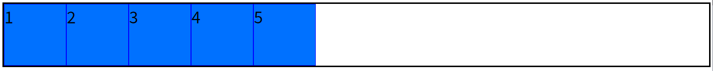
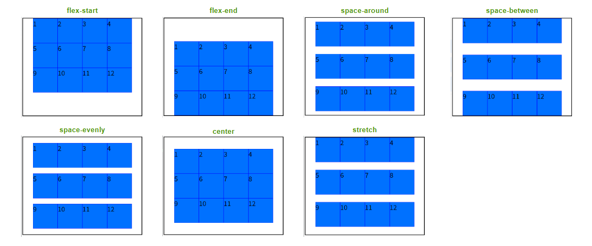
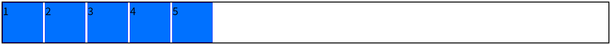
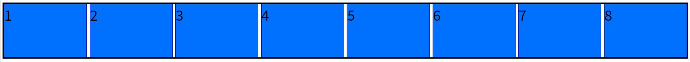
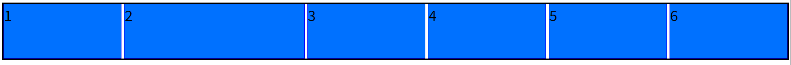
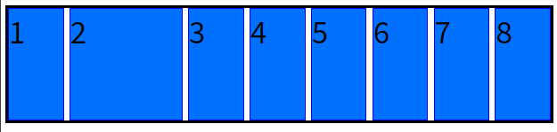
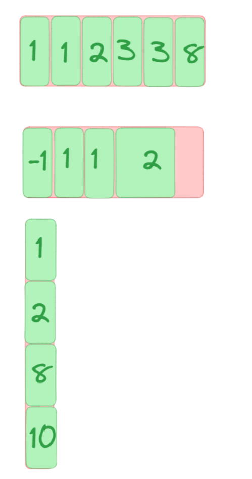
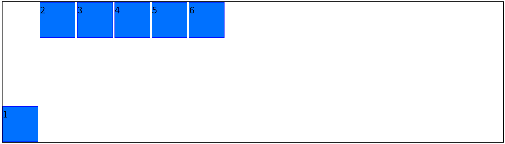

# CSS3 伸缩盒模型

2009 年， W3C 提出了一种新的盒子模型：Flexible Box (伸缩盒模型，又称：弹性盒子)。它可以轻松的控制：元素分布方式、元素对齐方式、元素视觉顺序 .......

截止目前，除了在部分 IE 浏览器不支持，其他浏览器均已全部支持。

伸缩盒模型的出现，逐渐演变出了一套新的布局方案：弹性布局 (Flex布局) 。是一种现代的CSS布局方式。

:::tip 小贴士

1. 传统布局是指：基于传统盒状模型，主要靠： display 属性 + position 属性 + float属性。

2. flex 布局目前在移动端应用比较广泛，因为传统布局不能很好的呈现在移动设备上。简化了网页布局的开发过程，提供了更灵活、响应式的布局方式。它适用于各种屏幕尺寸和设备类型，并能够快速适应不同的布局需求。

:::

## 伸缩容器

开启了 flex 的元素，就是：伸缩容器。

:::warning

1. 将父元素设置： `display:flex` 或 `display:inline-flex` ，该元素就变为了伸缩容器。

2. `display:inline-flex` 很少使用，因为可以给多个伸缩容器的父容器，也设置为伸缩容器。

3. 一个元素可以同时是：伸缩容器、伸缩项目。

:::

通过使用`display: flex`属性来创建一个弹性容器，并在其中使用灵活的盒子模型来进行元素的排列和定位：

```css
<body>
    <div class="box">1</div>
    <div class="box">2</div>
    <div class="box">3</div>
    <div class="box">4</div>
    <div class="box">5</div>
</body>
<style>
    body{
        min-width: 800px;
        border: 6px solid black;
        display: flex;
    }
    .box{
        height: 200px;
        width: 200px;
        background-color: #0071FF;
        font-size: 40pt;
        border: 1px solid blue;

    }
</style>
```



## 伸缩项目

伸缩容器所有**子元素**自动成为了：伸缩项目。子元素可以指定各自在主轴和交叉轴上的大小、顺序以及对齐方式等。

:::warning

1. 仅伸缩容器的**子元素**成为了伸缩项目，孙子元素、重孙子元素等后代，不是伸缩项目。

2. 无论原来是哪种元素（块、行内块、行内），一旦成为了伸缩项目，全都会“块状化”。

:::

## 主轴与侧轴

- **主轴 (main axis) **： 伸缩项目沿着主轴排列，主轴默认是水平方向，默认方向是：从左到右 (左边是起点，右边是终点)。
- **侧轴 (交叉轴，cross axis)**： 与主轴垂直的就是侧轴，侧轴默认是垂直方向，默认方向是：从上到下 (上边是起点，下边是终点)。

## 主轴方向

 flex-direction属性决定主轴的方向，水平或者垂直。

常用值：

1. row (默认值)：主轴为水平方向，起点在左端

2. row-reverse：主轴为水平方向，起点在右端
3. column：主轴为垂直方向，起点在上沿
4. column-reverse：主轴为垂直方向，起点在下沿

:::danger

改变了主轴的方向，侧轴方向也随之改变。

:::


```css
.box {
  display: flex;
  flex-direction: row | row-reverse | column | column-reverse;
}
```

## 主轴换行方式

flex-wrap属性决定主轴换行不换行以及换行的方向。

常用值如下：

1. nowrap (默认)：不换行

   

2. wrap：自动换行，第一行在上方，伸缩容器不够自动换行。

   

3. wrap-reverse：换行，第一行在下方，反向换行。

   

```css
.box {
  display: flex;
  flex-wrap: nowrap | wrap | wrap-reverse;
}
```

当小于某宽度则换行：

```css
@media (max-width: 575px) {
  body {
    flex-wrap: wrap;
  }
}
```

## 主轴方向及换行

flex-flow 是一个复合属性，复合了 flex-direction 和 flex-wrap 两个属性。 值没有顺序要求。

```css
.box {
  flex-flow: <flex-direction> || <flex-wrap>;
}
```

## 主轴对齐方式

伸缩项目可以在主轴上按照一定比例分配空间，也可以使用`justify-content`属性定义主轴的对齐方式。

具体对齐方式与轴的方向有关。常用值：

1. flex-start (默认值)：主轴起点对齐
2. flex-end ：主轴终点对齐
3. center ：居中对齐
4. space-between (最常用)：均匀分布 (项目之间的间隔都相等)，两端对齐
5. space-around ：均匀分布，两端距离是中间距离的一半 (每个项目两侧的间隔相等，所以，项目之间的间隔比项目与边框的间隔大一倍)
6. space-evenly ：均匀分布，两端距离与中间距离一致 (将子元素沿主轴均匀分布，每个子元素之间的间距相等，同时第一个子元素与容器的起始端和最后一个子元素与容器的末尾端之间的间距也相等。这意味着空白空间将平均分配给所有子元素)

```css
.box {
  display: flex;
  justify-content: flex-start | flex-end | center | space-between | space-around | space-evenly;
}
```


## 侧轴对齐方式

伸缩项目可以在交叉轴上进行对齐，包括顶部对齐、底部对齐、居中对齐等。

### 一行

align-items属性定义项目在侧轴 (交叉轴)上如何对齐。

常用值：

1. flex-start ：侧轴的起点对齐。

2. flex-end ：侧轴的终点对齐。

3. center ：侧轴的中点对齐。

4. baseline : 伸缩项目的第一行文字的基线对齐。

5. stretch (默认值)：如果伸缩项目未设置高度或设为auto，将占满整个容器的高度。

```css
.box {
  display: flex;
  align-items: flex-start | flex-end | center | baseline | stretch;
}
```


### 多行

align-content属性定义了多根轴线的对齐方式。如果项目只有一根轴线，该属性不起作用。

常用值：

1. flex-start ：与侧轴的起点对齐。

2. flex-end ：与侧轴的终点对齐。

3. center ：与侧轴的中点对齐。

4. space-between ：与侧轴两端对齐，中间平均分布。

5. space-around ：伸缩项目间的距离相等，比距边缘大一倍。

6. space-evenly : 在侧轴上完全平分 (将子元素沿主轴均匀分布，每个子元素之间的间距相等，同时第一个子元素与容器的起始端和最后一个子元素与容器的末尾端之间的间距也相等。这意味着空白空间将平均分配给所有子元素)。

7. stretch (默认值)：占满整个侧轴。

```css
.box {
  display: flex;
  flex-wrap: wrap | wrap-reverse;
  align-content: flex-start | flex-end | center | space-between | space-around | stretch;
}
```



## 水平垂直居中

- 方法一：父容器开启 flex 布局，随后使用 justify-content 和 align-items 实现水平垂直居中

  ```css
  .outer {
    width: 400px;
    height: 400px;
    background-color: #888;
    display: flex;
    justify-content: center;
    align-items: center;
  }
  .inner {
    width: 100px;
    height: 100px;
    background-color: orange;
  }
  ```

- 方法二：父容器开启 flex 布局，随后子元素 `margin: auto`

  ```css
  .outer {
    width: 400px;
    height: 400px;
    background-color: #888;
    display: flex;
  }
  .inner {
    width: 100px;
    height: 100px;
    background-color: orange;
    margin: auto;
  }
  ```

## 间距

gap是CSS3中的新特性，用于设置flex容器中子元素之间的间距。它可以通过设置gap属性来实现，但是在一些旧版本的浏览器中可能不被支持。具体而言，IE11及以下版本的浏览器不支持flex gap属性，而在其他浏览器中，如Chrome、Firefox、Safari等，支持程度也有所不同。为了解决这个问题，可以使用其他方法来实现类似的效果，如使用margin或padding属性来设置子元素之间的间距。另外，也可以使用一些CSS预处理器或后处理器，如Sass、PostCSS等，来实现类似的效果。

总之，需要根据具体情况来选择最适合的方法来实现flex容器中子元素之间的间距。

- 行间距row-gap
- 列间距column-gap

```css
.box {
  display: flex;
  gap: 10px;
}
```



## 放大比例

flex-grow属性定义项目的放大比例，默认为0，即如果存在剩余空间，也不放大 (拉伸)。

规则：

1. 若所有伸缩项目的 flex-grow 值都为 1 ，则它们将等分剩余空间 (如果有空间的话)。

2. 若三个伸缩项目的 flex-grow 值分别为： 1 、 2 、 3 ，则：分别瓜分到： 1/6 、 2/6 、3/6 的空间。
3. 如果一个项目的flex-grow属性为2，其他项目都为1，则前者占据的剩余空间将比其他项多一倍。

```css
.item {
  display: flex;
  flex-grow: <number>; /* default 0 */
}
```





## 伸缩性

flex-basis属性定义了在分配多余空间之前，项目占据的主轴空间（main size）。

:::tip

- 主轴横向：宽度失效
- 主轴纵向：高度失效

:::

**作用**：浏览器根据这个属性，计算主轴是否有多余空间。它的默认值为auto，即项目的本来大小 (伸缩项目的宽或高)。

```css
.item {
  flex-basis: <length> | auto; /* default auto */
}
```

它可以设为跟width或height属性一样的值（比如350px），则项目将占据固定空间。

## 压缩比例

flex-shrink属性定义了项目的压缩比例，默认为 1 ，即：如果空间不足，该项目将会缩小。

:::danger

负值对该属性无效。

:::

例如：

三个收缩项目，宽度分别为： 200px 、 300px 、 200px ，它们的 flex-shrink 值分别为： 1 、 2 、 3

若想刚好容纳下三个项目，需要总宽度为 700px ，但目前容器只有 400px ，还差 300px

所以每个人都要收缩一下才可以放下，具体收缩的值，这样计算：

1. 计算分母： (200×1) + (300×2) + (200×3) = 1400

2. 计算比例：

   - 项目一： (200×1) / 1400 = 比例值1


   - 项目二： (300×2) / 1400 = 比例值2


   - 项目三： (200×3) / 1400 = 比例值3


3. 计算最终收缩大小：

   - 项目一需要收缩： 比例值1 × 300


   - 项目二需要收缩： 比例值2 × 300


   - 项目三需要收缩： 比例值3 × 300

```css
.item {
  display: flex;
  flex-shrink: <number>; /* default 1 */
}
```

如果所有项目的flex-shrink属性都为1，当空间不足时，都将等比例缩小。如果一个项目的flex-shrink属性为0，其他项目都为1，则空间不足时，前者不缩小。


## flex复合属性

flex属性是复合属性，是复合了flex-grow、flex-shrink 和 flex-basis属性，默认值为0、1、auto。后两个属性可选。

:::tip

建议优先使用这个属性，而不是单独写三个分离的属性，因为浏览器会推算相关值。

:::

- 如果写 `flex:1 1 auto` ，则可简写为： `flex:auto`
- 如果写 `flex:1 1 0` ，则可简写为： `flex:1`
- 如果写 `flex:0 0 auto` ，则可简写为： `flex:none`
- 如果写 `flex:0 1 auto` (即 flex 初始值)，则可简写为： `flex:0 auto` 

```css
.item {
  flex: none | [ < 'flex-grow' > < 'flex-shrink' >? || < 'flex-basis' >];
}
```

## 项目排序

order属性定义项目的排列顺序。数值越小，排列越靠前，默认为0。

```css
.item {
  order: <integer>;
}
```



## 单独对齐

align-self属性允许单个项目有与其他项目不一样的对齐方式，可覆盖align-items属性。

默认值为auto，表示继承父元素的align-items属性，如果没有父元素，则等同于stretch。

```css
.item {
  display: flex;
  align-self: auto | flex-start | flex-end | center | baseline | stretch;
}
```

该属性可能取6个值，除了auto，其他都与align-items属性完全一致。



并没有`justify-self`来控制对齐方式，可以使用margin来解决：

```css
body {
  min-width: 800px;
  min-height: 800px;
  border: 6px solid black;
  display: flex;
  gap: 10px;
  align-items: flex-start;
  justify-content: flex-end;
}

#box-1 {
  margin-right: auto;
}

.box {
  height: 200px;
  width: 200px;
  background-color: #0071ff;
  font-size: 40pt;
  border: 1px solid blue;
}
```


