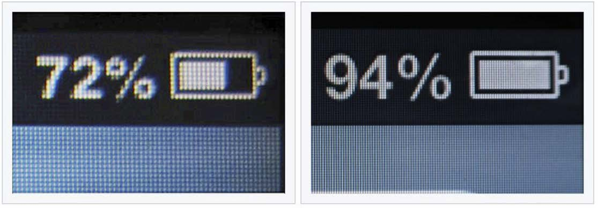

# CSS 常用属性

## 像素

电脑屏幕是，是由一个一个"小点"组成的，每个"小点"，就是一个像素 (px)。

**规律**：像素点越小，呈现的内容就越清晰、越细腻。

:::danger

如果电脑设置中开启了缩放，那么就会影响一些工具的测量结果，但这无所谓，因为工作中都是参考详细的设计稿，去给元素设置宽高。

:::

CSS 像素 (CSS Pixel)是 CSS 中用于定义长度、尺寸的单位 (简写为 px)。



## 颜色表示

### 颜色名

直接使用颜色对应的英文单词，编写比较简单。

**例如**：

1. 红色：red
2. 绿色：green
3. 蓝色：blue
4. 紫色：purple
5. 橙色：orange
6. 灰色：gray
7. ......

颜色名这种方式，表达的颜色比较单一，所以用的并不多。

具体颜色名参考MDN 官方文档：https://developer.mozilla.org/en-US/docs/Web/CSS/named-color

### rgb/rgba

使用 **红、黄、蓝** 这三种光的三原色进行组合。

- **r** 表示 **红色**
- **g** 表示 **绿色**
- **b** 表示 **蓝色**
- **a** 表示 **透明度**

::: tip 小规律

1. 若三种颜色值相同，呈现的是灰色，值越大，灰色越浅。
2. `rgb(0, 0, 0)` 是黑色， `rgb(255, 255,255)` 是白色。
3. 对于 rbga 来说，前三位的 rgb 形式要保持一致，要么都是 0~255 的数字，要么都是百分比 。最后一个数值取值 0~1 (0：完全透明，1：完全不透明)。

:::

**例**：

```css
/* 使用 0~255 之间的数字表示一种颜色 */
color: rgb(255, 0, 0);/* 红色 */
color: rgb(0, 255, 0);/* 绿色 */
color: rgb(0, 0, 255);/* 蓝色 */
color: rgb(0, 0, 0);/* 黑色 */
color: rgb(255, 255, 255);/* 白色 */
/* 混合出任意一种颜色 */
color:rgb(138, 43, 226) /* 紫罗兰色 */
color:rgba(255, 0, 0, 0.5);/* 半透明的红色 */
/* 也可以使用百分比表示一种颜色（用的少） */
color: rgb(100%, 0%, 0%);/* 红色 */
color: rgba(100%, 0%, 0%,50%);/* 半透明的红色 */
```

### HEX/HEXA

HEX 的原理同与 rgb 一样，依然是通过：**红**、**绿**、**蓝色** 进行组合，只不过要用 **6位 (分成3组)** 来表达。

格式为：`# rrggbb`

每一位数字的取值范围是： 0 ~ f ，即：（ 0, 1, 2, 3, 4, 5, 6, 7, 8, 9, a, b, c,d, e, f ）

所以每一种光的最小值是： 00 ，最大值是： ff

:::danger 

IE 浏览器不支持 HEXA ，但支持 HEX 。

:::

```css
color: #ff0000;/* 红色 */
color: #00ff00;/* 绿色 */
color: #0000ff;/* 蓝色 */
color: #000000;/* 黑色 */
color: #ffffff;/* 白色 */
/* 如果每种颜色的两位都是相同的，就可以简写*/
color: #ff9988;/* 可简为：#f98 */
/* 但要注意前三位简写了，那么透明度就也要简写 */
color: #ff998866;/* 可简为：#f986 */
```

### HSL/HSLA

HSL 是通过：色相、饱和度、亮度，来表示一个颜色的。

:::warning

HSLA 其实就是在 HSL 的基础上，添加了透明度。

:::

格式： `hsl(色相,饱和度,亮度)`

- 色相：取值范围是 0~360 度，具体度数对应的颜色：

  

- 饱和度：取值范围是 0%~100% (向色相中对应颜色中添加灰色， 0% 全灰， 100% 没有灰)

- 亮度：取值范围是 0%~100% (0% 亮度没了，所以就是黑色。 100% 亮度太强，所以就是白色了)

## 字体属性

### 字体大小

通过font-size属性控制字体的大小。

:::danger

1. Chrome 浏览器支持的最小文字为 12px ，默认的文字大小为 16px ，并且 0px 会自动消失。

2. 不同浏览器默认的字体大小可能不一致，所以最好给一个明确的值，不要用默认大小。

3. 通常以给 body 设置 font-size 属性，这样 body 中的其他元素就都可以继承了。

4. 由于字体设计原因，文字最终呈现的大小，并不一定与 font-size 的值一致，可能大，也可能小。

   例如： font-size 设为 40px ，最终呈现的文字，可能比 40px 大，也可能比 40px小。

5. 通常情况下，文字相对字体设计框，并不是垂直居中的，通常都靠下 一些。

:::

**语法**：

```css
div {
  font-size: 40px;
}
```

### 字体族

通过font-family属性控制字体类型。

:::danger

1. 使用字体的英文名字兼容性会更好，具体的英文名可以自行查询，或在电脑的设置里去寻找。windows 系统中，默认的字体就是微软雅黑。
2. 如果字体名包含空格，必须使用引号包裹起来。
3. 可以设置多个字体，按照从左到右的顺序逐个查找，找到就用，没有找到就使用后面的，且通常在最后写上 serif (衬线字体)或 sans-serif (非衬线字体)。

:::

**语法**：

```css
div {
  font-family: "STCaiyun","Microsoft YaHei",sans-serif
}
```

**小米字体**：

```css
font-family: Helvetica Neue,Helvetica,Arial,Microsoft Yahei,Hiragino Sans GB,Heiti SC,WenQuanYi Micro Hei,sans-serif；
```

**无衬线字体**：网页建议开发使用无衬线字体。


### 字体风格

通过font-style属性控制字体是否为斜体。

常用值：

1. normal ：正常 (默认值)。

2. italic ：斜体 (使用字体自带的斜体效果)。

3. oblique ：斜体 (强制倾斜产生的斜体效果)。

:::warning 

实现斜体时，更推荐使用 italic 。

:::

**语法**：

```css
div {
  font-style: italic;
}
```

em或者i标签取消默认倾斜：

```css
em {
  font-style: normal;
}
```

### 字体粗细

通过font-weight属性控制字体的粗细。

常用值：

- 关键词：
  1. lighter ：细
  2. normal ： 正常
  3. bold ：粗
  4. bolder ：很粗 (多数字体不支持)
- 数值：
  1. 100~1000 且无单位，数值越大，字体越粗 (或一样粗，具体得看字体设计时的精确程度)
  2. 100~300 等同于 lighter ， 400~500 等同于 normal ， 600 及以上等同于bold

**使用场景**：

1. 很多标题是不要加粗的，此时可以用CSS取消加粗。
2. 部分大批量文字可以利用CSS加粗。

**语法**：

```css
div {
  font-weight: bold;
}
div {
  font-weight: 600;
}
```

### 字体复合写法

通过font属性可以把上述字体样式合并成一个属性。

:::tip 编写规则

1. 字体大小、字体族必须都写上。

2. 字体族必须是最后一位、字体大小必须是倒数第二位。

3. 各个属性间用空格隔开。

:::

实际开发中更推荐复合写法，但这也不是绝对的，比如只想设置字体大小，那就直接用 font-size 属性。

**使用场景**：给整个页面设置相关字体样式。

语法：

```css
font: font-style font-weight font-size/line-height font-family;
```

:::warning

- font-size和font-family 是必须写。
- 其他可以省略，默认显示。
- 属性有严格的书写顺序。

:::

**例**：

```css
p.ex1
{
    font:15px arial,sans-serif;
}
 
p.ex2
{
    font:italic bold 12px/30px Georgia, serif;
}
```

## 文本属性

文字是无法直接通过CSS来更改样式的，必须要用适合的**标签来包裹它们**，本质是**修改标签**样式，里面文字跟随样式变化。

### 文本颜色

通过color属性来控制文字的颜色。

可选值：

1. [颜色名](#颜色名)

2. [rgb 或 rgba](#rgb/rgba)

3. [HEX 或 HEXA (十六进制)](#HEX/HEXA)

4. [HSL 或 HSLA](#HSL/HSLA)

:::warning 

开发中常用的是： rgb/rgba 或 HEX/HEXA (十六进制)。

:::

```css
div {
  color: rgb(112,45,78);
}
```

### 文本间距

用于调整字与字之间距离，用户体验更好。文本间距属性值为像素 (px) ，正值让间距增大，负值让间距缩小。

- 字母间距： letter-spacing。

  ```css
  h1 {
    letter-spacing:2px
  }
  ```


- 单词间距： word-spacing (通过空格识别词)。

  ```css
  p {
    word-spacing:30px;
  }
  ```

### 文本修饰

通过text-decoration控制文本的各种装饰线。

可选值：

1. none ： 无装饰线 (常用)。

2. underline ：下划线 (常用)。

3. overline ： 上划线。

4. line-through ： 删除线。

可搭配如下值使用：

1. dotted ：虚线。

2. wavy ：波浪线。

3. 也可以指定颜色。

**使用场景**：

1. 最常见设置链接下划线，比如取消下划线等。
2. 特殊情况添加删除线。

```css
a {
  text-decoration: none;
}
```

### 文本缩进

通过text-indent控制文本首字母的缩进。

:::danger

只能控制块级元素内的文字对齐，对行内元素无效。

:::

属性值： css 中的长度单位，例如： px、em(相对单位，本元素的文字大小。1em 等于当前元素的字体大小，如果当前元素，没有大小，则按照父元素文字大小)。

**使用场景**：

1. 段落首行缩进2个字的效果。
2. logo隐藏文字效果。

```css
p {
  text-indent: 2em;
}
```

### 文本对齐

#### 水平对齐

通过text-align控制文本的水平对齐方式。

:::danger

只能控制块级元素内的文字对齐，对行内元素无效。

:::

常用值：

1. left ：左对齐 (默认值)。

2. right ：右对齐。

3. center ：居中对齐。

4. justify：自动改变字间距，两端对齐

**使用场景**：

1. 文本/图片在盒子水平对齐。
2. 文章文字两端对齐。

```css
div {
  text-align: center;
}
```

#### 垂直对齐

1. **顶部**：无需任何属性，在垂直方向上，默认就是顶部对齐。

2. **居中**：对于单行文字，让 height = line-height 即可。

   :::danger

   多行文字**垂直居中**使用定位去做。

   :::

3. **底部**：对于单行文字，目前一个临时的方式：

让 `line-height = ( height × 2 ) - font-size - x` (x 是根据字体族，动态决定的一个值)。

```css
p.small {
  line-height:90%
}
```

垂直方向上的底部对齐，更好的解决办法是用定位去做。

通过 vertical-align 指定**同一行元素之间**，或 **表格单元格** 内文字的 **垂直对齐方式**。

常用值：

1. baseline （默认值）：使元素的基线与父元素的基线对齐。

2. top ：使元素的**顶部**与其**所在行的顶部**对齐。

3. middle ：使元素的**中部**与**父元素的基线**加上父元素**字母** x **的一半**对齐。

4. bottom ：使元素的**底部**与其**所在行的底部**对齐。

:::danger

vertical-align 不能控制块元素。

:::

```css
img {
  vertical-align:text-top;
}
```

### 行高

通过line-height控制一行文字的高度。

可选值：

1. normal ：由浏览器根据文字大小决定的一个默认值。

2. 像素 ( px )。

3. 数字：参考自身 font-size 的倍数 (很常用)。

4. 百分比：参考自身 font-size 的百分比。

:::danger

1. line-height 过小会文字产生重叠，且最小值是 0 ，不能为负数。

2. line-height 是可以继承的，且为了能更好的呈现文字，最好写数值。

3. line-height 和 height 的关系：设置了 height ，那么高度就是 height 的值。不设置 height 的时候，会根据 line-height 计算高度。

:::

应用场景：

1. 对于多行文字：控制行与行之间的距离。

2. 对于单行文字：让 height 等于 line-height ，可以实现文字垂直居中。

备注：由于字体设计原因，靠上述办法实现的居中，并不是绝对的垂直居中，但如果一行中都是文字，不会太影响观感。

```css
div {
  line-height: 60px;
  line-height: 1.5;
  line-height: 150%;
}
```

## 列表属性

列表相关的属性，可以作用在 ul 、 ol 、 li 元素上。

CSS 属性：

1. list-style-type：设置列表符号

   常用值如下：

   - none ：不显示前面的标识 (很常用)
   - square ：实心方块
   - disc ：圆形
   - decimal ：数字
   - lower-roman ：小写罗马字
   - upper-roman ：大写罗马字
   - lower-alpha ：小写字母
   - upper-alpha ：大写字母
   - list-style-position：设置列表符号的位置 


   - inside ：在 li 的里面


   - outside ：在 li 的外边

2. list-style-image：自定义列表符号 

   - url(图片地址)

3. list-style：复合属性。没有数量、顺序的要求


## 表格属性

边框相关属性（其他元素也能用）：

1. border-width：边框宽度。CSS 中可用的长度值。

2. border-color：边框颜色。CSS 中可用的颜色值。

3. border-style：边框风格
   - none 默认值

   - solid 实线

   - dashed 虚线

   - dotted 点线

   - double 双实线

4. border：边框复合属性。没有数量、顺序的要求。


表格独有属性 (只有 table 标签才能使用)：5 个属性，只有表格才能使用，即： `<table>` 标签

- table-layout：设置列宽度

   - auto ：自动，列宽根据内容计算（默认值）。

   - fixed ：固定列宽，平均分。

- border-spacing：单元格间距。CSS 中可用的长度值。

   生效的前提：单元格边框不能合并。

- border-collapse：合并单元格边框 

   - collapse ：合并

   - separate ：不合并

- empty-cells：隐藏没有内容的单元格。

   - show ：显示，默认。

   - hide ：隐藏


   生效前提：单元格不能合并。

- caption-side：设置表格标题位置。

   - top ：上面（默认值）
   - bottom ：在表格下面


## 背景属性

- 通过background-color 设置背景颜色。 符合 CSS 中颜色规范的值。

  默认背景颜色是 transparent 。

- background-image：设置背景图片。
  - url(图片的地址)


- background-repeat：设置背景重复方式。

  - repeat ：重复，铺满整个元素，默认值。
  
  
    - repeat-x ：只在水平方向重复。
  
  
    - repeat-y ：只在垂直方向重复。
  
  
    - no-repeat ：不重复。
  


- background-position：设置背景图位置。

  **通过关键字设置位置：**写两个值，用空格隔开。如果只写一个值，另一个方向的值取 center

  - 水平： left 、 center 、 right
  - 垂直: top 、 center 、 bottom

  **通过长度指定坐标位置：**以元素左上角，为坐标原点，设置图片左上角的位置。

  两个值，分别是 x 坐标和 y 坐标。只写一个值，会被当做 x 坐标， y 坐标取center

- background：复合属性。没有数量和顺序要求


## 鼠标属性

通过cursor 设置鼠标光标的样式。

常用属性：

- pointer：小手。
- move：移动图标。

- text：文字选择器。

- crosshair：十字架。

- wait：等待。

- help：帮助。


自定义鼠标图标：

```css
/* 自定义鼠标光标 */
cursor: url("./arrow.png"),pointer;
```

