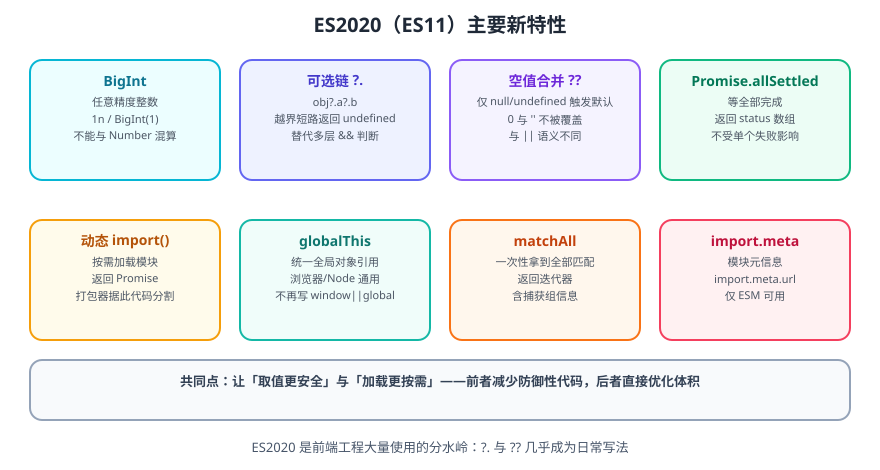

# ES11

ECMAScript 2020（ES11）于 2020 年 6 月发布。

- 官方规范：https://262.ecma-international.org/11.0/



ES2020 是前端日常写法改变最大的一版：**可选链 `?.` 与空值合并 `??` 从此成为标配**，动态 `import()` 也让「按需加载」有了语言级支持。

## BigInt

用于表示**超出 `Number.MAX_SAFE_INTEGER` 的整数**（任意精度整数）。

```javascript [bigint.js]
// 字面量加 n 后缀，或用 BigInt() 转换
const big = 9007199254740993n
const alsoBig = BigInt('9007199254740993')

console.log(typeof big)              // 'bigint'
console.log(big + 1n)                // 9007199254740994n

// 普通 Number 在超过安全整数后会丢精度
console.log(9007199254740993)        // 9007199254740992（已失真）
console.log(Number.MAX_SAFE_INTEGER) // 9007199254740991
```

::: danger 注意
1. **BigInt 与 Number 不能直接混算**：`1n + 1` 会抛 `TypeError`，必须显式转换（`1n + BigInt(1)` 或 `Number(1n)`）。
2. **`Math` 的方法不能用于 BigInt**：`Math.max(1n, 2n)` 会报错，需要用比较运算自己实现。
3. **`JSON.stringify` 不支持 BigInt**，序列化前需转成字符串，否则抛错。
:::

## 可选链 `?.`

访问深层属性时，省略逐层判空。

```javascript [optional-chaining.js]
const user = { profile: { name: '张三' } }

// 旧写法：层层短路
const oldWay = user && user.profile && user.profile.name

// ES11 写法
console.log(user?.profile?.name)        // '张三'
console.log(user?.address?.city)        // undefined（不报错）
console.log(user?.getName?.())          // undefined（方法不存在也不报错）
console.log(user?.list?.[0])            // undefined（数组越界也安全）
```

::: warning 说明
`?.` 只对 `null` 与 `undefined` 短路，**对 `0`、`''`、`false`、`NaN` 不短路**。这与 `&&` 的判断范围不同，注意区分使用场景。
:::

## 空值合并 `??`

只在左侧为 `null` / `undefined` 时取右侧默认值。

```javascript [nullish.js]
const config = { retry: 0, label: '' }

// || 的问题：0 与 '' 会被当成假值替换掉
console.log(config.retry || 3)    // 3（不符合预期，0 被覆盖）
console.log(config.label || '默认') // '默认'（空字符串被覆盖）

// ?? 只在 null/undefined 时兜底
console.log(config.retry ?? 3)    // 0（正确保留）
console.log(config.label ?? '默认') // ''（正确保留）
```

::: danger 注意
**不能把 `??` 与 `||` / `&&` 不加括号地混用**：`a ?? b || c` 是语法错误，必须写成 `(a ?? b) || c` 或 `a ?? (b || c)`。这是为了强制开发者明确表达意图。
:::

## 可选链与空值合并的组合

这是「取值兜底」最常用的形态：

```javascript [combine.js]
const res = { data: { list: null } }

// 深层取值 + 兜底默认值
const list = res?.data?.list ?? []
console.log(Array.isArray(list), list.length)  // true 0
```

## Promise.allSettled

等待**全部 Promise 结束**，无论成功或失败；不像 `Promise.all` 那样「一个失败就整体 reject」。

```javascript [allsettled.js]
const tasks = [
  Promise.resolve('ok'),
  Promise.reject(new Error('失败')),
  Promise.resolve('ok2'),
]

const results = await Promise.allSettled(tasks)
console.log(results)
// [
//   { status: 'fulfilled', value: 'ok' },
//   { status: 'rejected', reason: Error: 失败 },
//   { status: 'fulfilled', value: 'ok2' },
// ]

// 只取成功的
const values = results
  .filter((r) => r.status === 'fulfilled')
  .map((r) => r.value)
```

| 方法 | 失败时的行为 | 适用 |
| --- | --- | --- |
| `Promise.all` | 任一失败立即 reject | 「全部成功才有意义」 |
| `Promise.allSettled` | 等全部结束，不因失败中断 | 「批量上报、多接口聚合、容错」 |

## 动态 import()

在**运行时**按需加载模块，返回 Promise。

```javascript [dynamic-import.js]
// 点击时才加载重量级模块
document.getElementById('btn').addEventListener('click', async () => {
  const { renderChart } = await import('./chart.js')
  renderChart()
})

// 打包工具会据此做代码分割
const modulePath = new URL('./heavy.js', import.meta.url)
const mod = await import(modulePath.href)
```

::: tip 一句话理解
`import` 语句是**静态**的（写在文件顶部，打包时确定）；`import()` 是**函数调用**，可放在任意位置、按条件执行，因此能真正做到按需加载。
:::

## globalThis

统一的全局对象引用，不再需要写 `window || global || self`。

```javascript [globalthis.js]
globalThis.setTimeout(() => console.log('timer'), 100)

// 挂载全局变量
globalThis.__APP_VERSION__ = '1.0.0'
console.log(globalThis.__APP_VERSION__)
```

## String.prototype.matchAll

一次性拿到**所有匹配结果**（含捕获组），返回迭代器。

```javascript [matchall.js]
const str = 'a1 b2 c3'
const regex = /([a-z])(\d)/g

// 旧写法：while + exec
let m
while ((m = regex.exec(str)) !== null) {
  console.log(m[1], m[2])
}

// ES11 写法
for (const match of str.matchAll(regex)) {
  console.log(match[1], match[2], match.index)
}
```

::: warning 说明
`matchAll` 的正则**必须带 `g` 标志**，否则抛 `TypeError`。
:::

## import.meta

模块自身的元信息，**仅 ESM 可用**。

```javascript [meta.js]
// 当前模块的 URL
console.log(import.meta.url)

// Vite 等构建工具会扩展出更多字段
// console.log(import.meta.env.MODE)
```

## for-in 顺序规范化

ES11 明确规定 `for...in` 的遍历顺序：**先整数键（升序），再字符串键（插入顺序），最后 Symbol 键（不遍历）**，跨引擎行为统一。

```javascript [forin-order.js]
const obj = { b: 1, 2: 2, a: 3, 1: 4 }
console.log(Object.keys(obj))  // ['1', '2', 'b', 'a']
```

## 验证方式

1. 在控制台执行 `9007199254740993 === 9007199254740992`，观察精度问题，再用 `BigInt` 复现正确结果。
2. 对比 `0 || 3` 与 `0 ?? 3` 的输出，确认 `??` 只在 `null`/`undefined` 时兜底。
3. 构造一个部分失败的 `Promise.allSettled`，确认能拿到成功与失败的完整结果列表。
4. 用 `matchAll` 遍历一段带捕获组的文本，确认能取到索引与分组。

## 参考资料

- ECMAScript 2020 规范：https://262.ecma-international.org/11.0/
- MDN · 可选链：https://developer.mozilla.org/zh-CN/docs/Web/JavaScript/Reference/Operators/Optional_chaining
- MDN · 空值合并运算符：https://developer.mozilla.org/zh-CN/docs/Web/JavaScript/Reference/Operators/Nullish_coalescing
