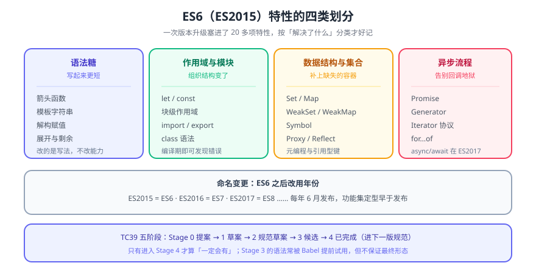

# ES6 概述

> ES6（ECMAScript 2015）是 JavaScript 历史上**最大的一次语法升级**：它把「一门脚本语言」变成了「能写大型应用的语言」。本页讲清楚 ES6 与 JavaScript 的关系、版本号命名的变更，以及每个新特性的定位与学习顺序。



## 一句话定位

ECMAScript 是**规范**，JavaScript 是**规范的一种实现**（还有 JScript、ActionScript 等历史实现）。ES6 指的是这份规范的第 6 版，2015 年 6 月正式发布，因此也叫 **ES2015**。

::: info 从「版本号」到「年份」
ES6 之后，TC39 把命名改成了年份：ES2016、ES2017……对应的旧叫法是 ES7、ES8。**两种叫法指的是同一年版本**，本库的目录名沿用了 `ES6`~`ES12Plus` 的旧叫法（历史命名），页内会在首次出现时标注年份版本。
:::

## 一、ES6 的定位

在 ES6 之前，JavaScript 只有「函数作用域」、没有原生模块、没有类语法、异步只有回调。这三点决定了它只能写页面脚本，写不了大型应用。ES6 一次补齐了它们：

| 缺口 | ES6 的解法 |
| --- | --- |
| 只有函数作用域，闭包容易出错 | `let` / `const` 的块级作用域 |
| 没有原生模块 | `import` / `export`（ESM） |
| 没有类语法 | `class`（语法糖，底层仍是原型） |
| 回调地狱 | `Promise` + 后来的 `async/await`（ES2017） |
| 字符串拼接难维护 | 模板字符串 |
| 数组 / 对象操作冗长 | 解构、展开 / 剩余、新增数组方法 |

## 二、新特性分类（按学习优先级）

### 第一组：改变写法的基础设施

- [let 和 const](../LetConst/index.md)：块级作用域与暂时性死区；
- [解构赋值](../Destructuring/index.md)：从数组/对象里按形状取值；
- [箭头函数](../ArrowFunction/index.md)：不绑定自己的 `this`——**这一条决定了它在回调里的用法**；
- [模板字符串](../TemplateString/index.md)：多行与插值；
- [展开 / 剩余语法](../SpreadRest/index.md)：`...` 的两个相反用途。

### 第二组：数据与结构

- [Set 和 Map](../SetMap/index.md)：值唯一集合与任意键映射；
- [Symbol](../Symbol/index.md)：唯一标识符，用于自定义迭代协议；
- [数组新方法](../NewArrayMethod/index.md) / [对象新方法](../NewObjectMethod/index.md)：`find` / `includes` / `Object.assign` / `Object.entries` 等。

### 第三组：异步与流程

- [迭代器](../Iterator/index.md) 与 [生成器](../Generator/index.md)：`for...of` 与惰性序列的底层；
- [ES6 Promise](../Promise/index.md)：异步的统一抽象（`async/await` 建立在它之上）。

### 第四组：元编程与工程化

- [类](../Class/index.md)：`extends` / `super` / 静态成员；
- [Proxy](../Proxy/index.md) 与 [Reflect](../Reflect/index.md)：拦截对象操作（Vue 3 响应式的基础之一）；
- [ES6 模块化开发](../Module/index.md)：`import` / `export` 的语法与语义。

## 三、规范是怎么演进出来的：TC39 五阶段

| 阶段 | 名称 | 含义 |
| --- | --- | --- |
| 0 | Strawperson | 只是一个想法 |
| 1 | Proposal | 有负责人与用例，开始成形 |
| 2 | Draft | 语义基本定稿，进入正式草案 |
| 3 | Candidate | 规范文本完成，等待实现反馈 |
| 4 | Finished | 已并入标准，将进入下一个年度版本 |

::: tip 看到「Stage 3」意味着什么
Stage 3 的特性**语义基本不会大改**，引擎通常已开始实现（多数在 flag 后面）。生产项目要用它，需要确认目标运行时的支持面并用转译兜底——**不要因为「网上能搜到」就当成标准已定**。
:::

## 四、兼容性与转译

ES6 的大部分语法可以**转译**（Babel / TypeScript 编译到更低目标），但**有些东西转译不了**，只能靠 **polyfill**（补运行时方法）：

| 类型 | 例子 | 能否转译 |
| --- | --- | --- |
| 语法 | 箭头函数、`class`、解构、模板字符串 | ✅ 能 |
| 内建方法 | `Array.prototype.includes`、`Object.entries` | ❌ 需 polyfill（`core-js`） |
| 新全局对象 | `Promise`、`Symbol`、`Map` / `Set` | ❌ 需 polyfill |
| 代理 / 反射 | `Proxy`、`Reflect` | ❌ 无法降级（引擎必须实现） |

```javascript
// 判断某个特性是"语法"还是"方法"，看它是否需要运行时配合
// 语法：转译后代码本身变了  → 提升 target 即可
[1, 2, 3].includes(2);              // 方法 → 需要 polyfill
const fn = () => 1;                 // 语法 → 转译即可
```

::: danger 三条
1. **`Proxy` 无法 polyfill**：Vue 3 因此放弃了对旧浏览器的支持（Vue 2 用 `Object.defineProperty` 绕开）。选型时要先看目标浏览器是否支持 Proxy。
2. **现代浏览器对 ESM 有独立解析**：`<script type="module">` 会自动严格模式、自动延迟执行（等价 `defer`），但**旧浏览器根本不执行它**——这也是「`nomodule` 兜底」存在的原因。
3. **不要把 `target` 设得过高**：设成 `esnext` 意味着产物里保留最新语法，一旦跑在稍旧的运行时就 SyntaxError；按**最低支持环境**来设，而不是按你的开发机。
:::

## 五、学习顺序建议

1. 先掌握第一组（let/const、解构、箭头函数、模板字符串、展开）——**它们会立刻改变你写的每一行代码**；
2. 再学 Promise（第二、三组里最影响架构的一个）；
3. 然后是类与模块化（工程化的基础）；
4. Proxy / Reflect / 生成器属于「用到再深入」，先知道它们存在与用途即可。

## 六、验证方式

```shell
# ① 看当前 Node 支持的 ES 特性与版本基线
node -p "process.versions.v8"
node --input-type=module -e "console.log([1,2,3].includes(2))"   # 期望：true

# ② 转译与 polyfill 是否配齐（检查产物的入口）
#    在浏览器控制台里直接验证内建方法是否存在
#      typeof Promise !== 'undefined' && typeof Symbol !== 'undefined'
#    期望：true

# ③ 目标浏览器是否支持 Proxy（决定能否用 Vue 3 / 某些库）
node -e "console.log(typeof Proxy)"     # 期望：function
```

## 七、深入阅读

- [ECMAScript 目录](../index.md)：ES5 → ES6 → ES7 → ES12Plus 的版本划分
- [JavaScript 模块化](../../../JavaScript/Modularization/index.md)：CJS / AMD / UMD / ESM 四种方案的取舍
- [前端工程化](../../../../Others/FrontendEngineering/index.md)：`target`、polyfill 与产物体积的权衡
- ECMAScript 语言规范（官方）：[tc39.es/ecma262](https://tc39.es/ecma262/) ｜ TC39 提案列表：[github.com/tc39/proposals](https://github.com/tc39/proposals)
