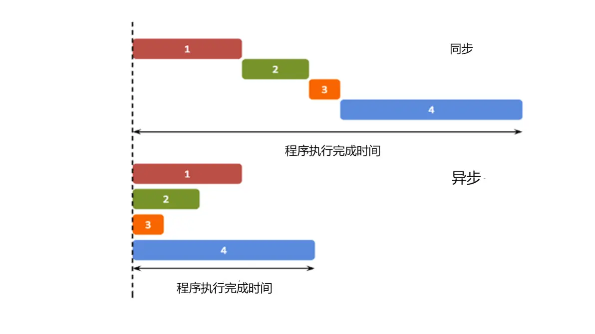
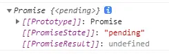
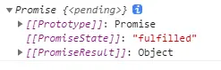
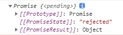
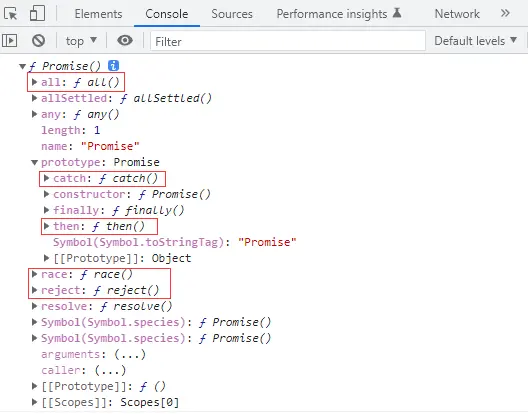
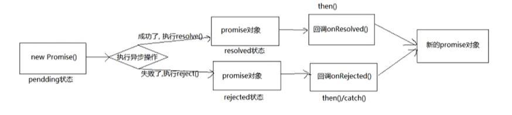

# ES6 Promise

## 同步与异步

JavaScript代码实际上是单线程的程序，那就决定了代码是一行一行的顺序执行的，处理一些简短、快速的运算操作时主线程就够了，如果在同步程序中发送了网络请求，如果超时了，下面的代码依赖于网络请求，那么整个网页将会失去响应。

而异步的概念则与同步恰恰相反，一个异步过程的执行将不再与原有的序列有顺序关系，特别是对发送网络请求，不确保响应时间时候，异步是最优选择，网络请求无论多长时间，程序将不会在此等待，直接走下面的代码，等异步的请求有了响应，主线程几乎不用关心异步任务的状态了，自己完成回调后续的操作，程序间互不影响。

简单来理解：同步按照代码顺序执行，异步不按照代码顺序执行，异步的执行效率更高。



## 概述

promise是解决异步的方法，本质上是一个构造函数，可以用它实例化一个对象。对象身上有resolve、reject、all，原型上有then、catch方法。用来封装一个异步操作并可以获取其成功/失败的结果值。

promise 作用：

- 指定回调函数的方式更加灵活：之前必须在启动异步任务前指定。在promise中启动异步任务后返回promise对象，给promise对象绑定回调函数(甚至可以在异步任务结束后指定多个)。

- 支持链式调用，可以解决回调地狱问题：

  回调地狱：回调函数嵌套调用，外部回调函数异步执行的结果是嵌套的回调执行的条件。其不便于阅读，不便于异常处理。

## 对象状态属性

promise对象有三种状态：pending (初识状态/进行中)、resolved或fulfilled (成功)、rejected (失败)。

1. pending：它的意思是 &#34;待定的，将发生的&#34;，相当于是一个初始状态。创建Promise对象时，且没有调用resolve或者是reject方法，相当于是初始状态。这个初始状态会随着调用resolve，或者是reject函数而切换到另一种状态。

   

2. resolved：表示解决了，就是说这个承诺实现了。 要实现从pending到resolved的转变，需要在 创建Promise对象时，在函数体中调用了resolve方法。成功的结果数据一般称为value。

   

3. rejected：拒绝，失败。表示这个承诺没有做到，失败了。要实现从pending到rejected的转换，只需要在创建Promise对象时，调用reject函数。失败的结果数据一般称为reason。

   

通过以下代码打印一下他里面的方法：

```javascript
console.dir(Promise)
```

浏览器打印结果：



## 基本流程

## 实现定时器

```javascript
// 生成随机数
function rand(m, n) {
  return Math.ceil(Math.random() * (n - m + 1)) + m - 1
}
// 定时器
//setTimeout(() =>{
//    // 30% 1-100 1 2 30
//    // 获取从1-100的一个随机数
//    let n = rand(1,100);
//    // 判断
//    if(n <= 30){
//        alert('恭喜')
//    }else{
//        alert('再接再厉')
//    }
//},1000);
// Promise 形式实现
// resolve 解决
// reject 拒绝
const p = new Promise((resolve, reject) => {
  setTimeout(() => {
    // 30% 1-100 1 2 30
    // 获取从1-100的一个随机数
    let n = rand(1, 100)
    // 判断
    if (n <= 30) {
      resolve(n) // 将promise对象的状态设置为成功
    } else {
      reject(n) // 将promise对象的状态设置为失败
    }
  }, 1000)
})

// 调用then方法
p.then(
  (value) => {
    alert('恭喜' + value)
  },
  (reason) => {
    alert('再接再厉' + reason)
  },
)
```

## fs读取文件

```javascript
// 回调函数形式
fs.readFile('./resouce/content.txt', (err, data) => {
  // 如果出错 则抛出错误
  if (err) throw err
  // 输出文件内容
  console.log(data.toString())
})

//Promise形式
let p = new Promise((resolve, reject) => {
  fs.readFile('./resouce/content.txt', (err, data) => {
    // 如果出错 则抛出错误
    if (err) reject(err)
    // 如果成功
    resolve(data)
  })
})

// 调用then
p.then(
  (value) => {
    console.log(value.toString())
  },
  (reason) => {
    console.log(reason)
  },
)
```

在node中，可以使用util.promisify方法转换：

```javascript
// 引入util模块
const util = require('util')
// 引入fs模块
const fs = require('fs')

//返回一个新的函数
let mineReadFile = util.promisify(fs.readFile)

mineReadFile('./resource/content.txt').then((value) => {
  console.log(value.toString())
})
```

## 自定义封装



## API

### 构造函数

Promise 构造函数：`Promise(executor){}`

- executor 函数：执行器 `(resolve,reject)=>{}`

  excutor 会在Promise 内部立即同步调用，异步操作在执行器中执行。

- resolve 函数：内部定义成功时调用的函数 `value =>{}`

- reject 函数：内部定义失败时调用的函数 `reason =>{}`

### then方法

Promise.prototype.then 方法：`(onResolved,onRejected) => {}`

- onResolved 函数：成功的回调函数 `(value) => {}`
- onRejected 函数：失败的回调函数 `(reason) => {}`

:::warning 说明

- 指定用于得到成功value的成功回调和用于得到失败reason的失败回调返回一个新的Promise对象。

- then()的语法糖，相当于：`then(undefined,onRejected)`

:::

### catch方法

Promise.prototype.catch 方法：`(onRejected) => {}`

onRejected 函数：失败的回调函数 `(reason) => {}`

### resolve方法

Promise.resolve 方法：`(value) => {}`

- value：成功的数据或Promise对象。

resolve函数返回一个成功/失败的Promise对象。

```javascript
let p1 = Promise.resolve(521)
// 如果传入的参数为 非Promise类型的对象，则返回的结果为成功的Promise对象
// 如果传入的是Promise对象，则参数的结果决定了resolve的结果
let p2 = Promise.resolve(
  new Promise((resolve, regject) => {
    // resolve('OK')
    reject('Error')
  }),
)
console.log(p2)
```

### reject方法

Promise.reject 方法：`(reason) => {}`

- reason：失败的原因。

reject 函数返回一个失败的Promise对象。

```javascript
let p1 = Promise.reject(521)
let p2 = Promise.reject(
  new Promise((resolve, regject) => {
    resolve('OK')
  }),
)
console.log(p2)
```

### all方法

Promise.all 方法：`(promises) => {}`

- promises：包含n个Promise的数组。

:::warning 说明

返回一个新的Promise，只有所有的Promise都成功才成功，只要有一个失败的就直接失败。

:::

```javascript
let p1 = new Promise((resolve, reject) => {
  relove('OK')
})
let p2 = Promise.resolve('Success')
let p3 = Promise.resolve('Oh Yeah')

const result = Promise.all([p1, p2, p3])
console.log(result)
```

### race方法

Promise.race 方法：`(promises) => {}`

- promises：包含n个Promise的数组。

:::warning 说明

返回一个新的Promise，第一个完成的Promise的结果状态就是最终的结果状态

:::

```javascript
let p1 = new Promise((resolve, reject) => {
  relove('OK')
})
let p2 = Promise.resolve('Success')
let p3 = Promise.resolve('Oh Yeah')

const result = Promise.race([p1, p2, p3])
console.log(result)
```

## 注意事项

- 改变Promise的状态可以是：

  - `resolve(value)`：如果当前是pending就会变为resolved
  - `reject(reason)`：如果当前是pending就会变为rejected
  - 抛出异常：如果当前是pending就会变为rejected

  ```javascript
  let p = new Promise((resolve, reject) => {
    //1. resolve 函数
    resolve('ok') //pending => fulfilled(resolved)
    //2. reject 函数
    reject('error') //pending => rejected
    //3. 抛出错误
    throw '出问题了'
  })
  ```

- 一个Promise指定多个成功/失败回调函数时，当Promise改变为对应状态时都会调用

  ```javascript
  let p = new Promise((resolve, reject) => {
    //resolve 函数
    resolve('ok') //pending => fulfilled(resolved)
  })

  //指定回调 -1
  p.then((value) => {
    console.log(value)
  })
  //指定回调 -2
  p.then((value) => {
    alert(value)
  })
  ```

- Promise状态和指定回调函数的顺序，正常情况下是先指定回调再改变状态，但也可以先改状态再指定回调函数。

- 先改变状态再指定回调函数时，可以使用：

  1. 在执行器中直接调用 `resolve()`/`reject()`
  2. 延迟更长时间才调用 `then()`

- 如果先指定的回调，那当状态发生改变时，回调函数就会调用，得到数据。如果先改变的状态，那当指定回调时，回调函数就会调用，得到数据。

  ```javascript
  let p = new Promise((resolve, reject) => {
    setTimeout(() => {
      //resolve 函数
      resolve('ok') //pending => fulfilled(resolved)
    }, 1000)
  })

  p.then((value) => {
    console.log(value)
  })
  ```

- Promise.then()返回的新Promise的状态由`then()` 指定的回调函数执行的结果决定。如果抛出异常，新Promise变为rejected，reason为抛出的异常。如果返回的是非Promise的任意值，新Promise变为resolved，value为返回的值。如果返回的是另一个新Promise，此Promise的结果就会称为新Promise的结果。

  ```javascript
  let p = new Promise((resolve, reject) => {
    //resolve 函数
    resolve('ok') //pending => fulfilled(resolved)
  })

  p.then(
    (value) => {
      // console.log(value);
      //1. 抛出错误
      // throw '出了问题';
      //2. 返回结果是非Promise类型的对象
      // return 521;
      //3. 返回结果是Promise对象
      return new Promise((resolve, reject) => {
        resolve('success')
      })
    },
    (reason) => {
      console.warn(reason)
    },
  )
  ```

- 串联多个操作任务：Promise的 `then()` 返回一个新的Promise，可以开成then()的链式调用。通过then()的链式调用串连多个同步/异步任务。

  ```javascript
  let p = new Promise((resolve, reject) => {
    setTimeout(() => {
      //resolve 函数
      resolve('ok') //pending => fulfilled(resolved)
    }, 1000)
  })

  p.then((value) => {
    return new Promise((resolve, reject) => {
      resolve('success')
    })
  })
    .then((value) => {
      console.log(value)
    })
    .then((value) => {
      console.log(value)
    })
  ```

- 异常传透：当使用Promise的then链式调用时，可以在最后指定失败的回调。操作出了异常，都会传到最后失败的回调中处理。

  ```javascript
  let p = new Promise((resolve, reject) => {
    setTimeout(() => {
      //resolve 函数
      resolve('ok') //pending => fulfilled(resolved)
    }, 1000)
  })

  p.then((value) => {
    return new Promise((resolve, reject) => {
      resolve('success')
    })
  })
    .then((value) => {
      throw '失败'
    })
    .then((value) => {
      console.log(value)
    })
    .catch((reason) => {
      console.warn(reason)
    })
  ```

- 中断Promise链：当使用Promise的then链式调用时，在中间中断，不再调用后面的回调函数。可以在回调函数中返回一个pending状态的Promise对象。

  ```javascript
  let p = new Promise((resolve, reject) => {
    setTimeout(() => {
      //resolve 函数
      resolve('ok') //pending => fulfilled(resolved)
    }, 1000)
  })

  p.then((value) => {
    console.log(111)
    return new Promise(() => {})
  })
    .then((value) => {
      console.log(value)
    })
    .then((value) => {
      console.log(value)
    })
    .catch((reason) => {
      console.warn(reason)
    })
  ```
