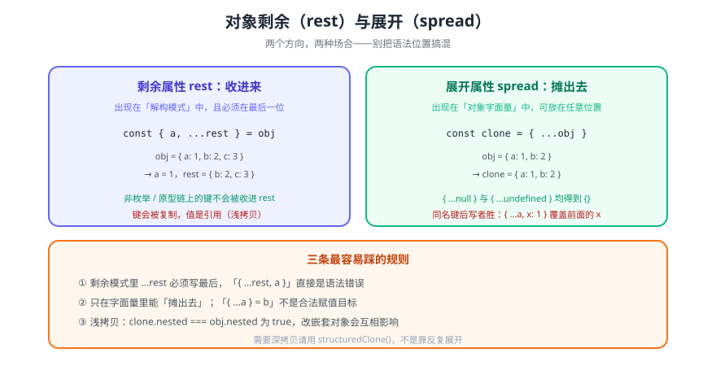

# 对象解构的剩余和展开属性

> 这是一对方向相反的语法：**剩余（rest）把没点名的键收进一个新对象**，**展开（spread）把一个对象摊成一组键值对**。两者都写作 `...`，但出现的场合完全不同——**位置错了就是语法错误**，而不是「行为不同」。

::: info 版本归属
对象剩余/展开属性属于 **ES2018（ES9）** 的 Object Rest/Spread Properties 提案，并非本库目录名所示的 ES7。数组的 rest/spread 早在 **ES2015（ES6）** 就已落地（见 [展开与剩余](../../ES6/SpreadRest/index.md)），对象版本晚了三年才进入规范。本库目录名为历史叫法，页内按年份标注版本。
:::



## 一句话定位

`const { a, ...rest } = obj` 是**收**：把 `obj` 里除 `a` 之外的**自有可枚举属性**装进一个新对象 `rest`。
`const clone = { ...obj }` 是**摊**：把 `obj` 的自有可枚举属性逐个铺进新字面量。
前者只能出现在**解构模式**，后者只能出现在**对象字面量**。

## 一、语法与两种场合

```javascript
// ① 剩余属性：解构模式里「收」，必须在最后一位
const { a, b, ...rest } = { a: 1, b: 2, c: 3, d: 4 };
a;      // 1
b;      // 2
rest;   // { c: 3, d: 4 }（新对象，不是原对象的引用）

// ② 展开属性：对象字面量里「摊」，可出现在任意位置
const base = { a: 1, b: 2 };
const clone = { ...base };            // { a: 1, b: 2 }
const merged = { x: 0, ...base, b: 9 }; // { x: 0, a: 1, b: 9 }
```

| 语法 | 出现场合 | 位置约束 | 结果 |
| --- | --- | --- | --- |
| `...rest`（剩余） | 解构模式 `const {...} = obj` | **必须是最后一项** | 一个新对象 |
| `...obj`（展开） | 对象字面量 `{ ... }` | 任意位置 | 展开成键值对 |

```javascript
// 位置写错 = 语法错误，不是运行时报错
const { ...rest, a } = obj;   // SyntaxError: Rest element must be final element
const { ...a } = b;           // SyntaxError（不是合法赋值目标）
```

::: warning 剩余/展开是「纯粹的语法」而非「对象的操作」
`...` 两端必须是**字面量位置**——要么是解构模式，要么是对象字面量。它不能当表达式用，也不能赋值给已有对象的属性位置。想覆盖已有对象只能新造一个再整体替换。
:::

## 二、复制谁？——「自有可枚举属性」的准确含义

展开与剩余都遵循同一套属性筛选规则：**自有（own）+ 可枚举（enumerable）+ 字符串键与 Symbol 键**。

| 属性来源 | 是否被复制 | 说明 |
| --- | --- | --- |
| 自有、可枚举 | ✅ | 常规对象字面量属性 |
| 自有、不可枚举 | ❌ | `Object.defineProperty` 默认 `enumerable: false` |
| 原型链上的属性 | ❌ | 不会被展开，也不会进 `rest` |
| Symbol 键（可枚举） | ✅ | 这一点常被忽略 |
| getter | ✅ 但会**求值** | 复制的是取值结果，不是 getter 本身 |

```javascript
const proto = { inherited: 'no' };
const obj = Object.create(proto);
obj.own = 'yes';
Object.defineProperty(obj, 'hidden', { value: 1, enumerable: false });

const clone = { ...obj };
clone;   // { own: 'yes' }  ← inherited 和 hidden 都不在

const { ...rest } = obj;
rest;    // { own: 'yes' }  ← 同样的筛选规则
```

::: tip getter 会被触发
`{ ...obj }` 内部用的是取值语义（`[[Get]]`），所以对象上的 getter **会执行一次**。如果 getter 有副作用（打日志、发起请求、懒初始化），展开它会意外触发。
:::

## 三、与 `Object.assign` 的对照

两者都能做「浅合并」，但有四处行为差异值得记住。

| 维度 | `{ ...src }` | `Object.assign(target, src)` |
| --- | --- | --- |
| 返回值 | **新对象** | 返回并**修改** `target` |
| 原型 | 结果原型固定为 `Object.prototype` | 保留 `target` 原有的原型 |
| 目标上的 setter | **不触发**（直接定义自有属性） | **会触发**（走 `[[Set]]`） |
| 源里的 `null` / `undefined` | 忽略，得 `{}` | 忽略，不报错 |

```javascript
// ① Object.assign 会改写第一个参数
const target = { a: 1 };
const ret = Object.assign(target, { b: 2 });
ret === target;   // true  ← 同名对象
target;           // { a: 1, b: 2 }

// ② Object.assign 会触发目标的 setter；展开不会
const withSetter = { set x(v) { this._x = v * 10; } };
Object.assign(withSetter, { x: 1 });
withSetter._x;    // 10  ← setter 生效

const literal = { ...{ x: 1 } };
literal.x;        // 1   ← 就是普通数据属性，没有 setter 参与

// ③ null / undefined 都被忽略而不是抛错
({ ...null, ...undefined });        // {}
Object.assign({}, null, undefined); // {}
```

::: danger 同名键「后写者胜」，顺序即语义
`{ ...a, ...b }` 中 `b` 覆盖 `a`；`{ ...a, x: 1 }` 中 `x` 固定赢。**合并顺序就是优先级**，这也是「默认值 + 覆盖」写法的原理：

```javascript
const config = { ...defaults, ...userOptions };   // 用户配置优先
```
:::

## 四、常见用法

```javascript
// ① 剔除敏感字段后再返回（API 出参的经典写法）
function toPublic(user) {
  const { password, salt, ...safe } = user;
  return safe;
}

// ② 不可变更新（React / Redux 风格：改一个字段，其余保持引用）
const next = { ...state, loading: false, data: res };

// ③ 函数参数：必填显式列出，其余透传
function request(url, { method = 'GET', ...options } = {}) {
  return fetch(url, { method, ...options });
}

// ④ 浅拷贝后再改（避免污染入参）
const draft = { ...form };

// ⑤ 条件性附加字段（比 if 赋值更紧凑）
const payload = {
  id,
  ...(isAdmin && { role: 'admin' }),
};
```

::: warning ⑤ 的两个坑
`...(false)` 得到 `{}`（因为布尔不是对象，被当作「无可复制属性」，不报错）——这依赖了「展开非对象会装箱但无属性」的行为，可读性一般。同时 `...(cond && obj)` 里如果 `obj` 恰好是 `''` 或 `0`，结果一样是 `{}`。参数复杂时还是写 `if` 更清楚。
:::

## 五、四个高频陷阱

### 陷阱 1：浅拷贝 ≠ 深拷贝

```javascript
const src = { a: { n: 1 }, list: [1, 2] };
const clone = { ...src };

clone.a === src.a;            // true  ← 同一个嵌套对象
clone.list === src.list;      // true  ← 同一个数组

clone.a.n = 99;
src.a.n;                      // 99    ← 改「副本」影响了原对象
```

需要真独立时用 `structuredClone(src)`（能处理循环引用、`Map`/`Set`/`Date`，但不能克隆函数）。别指望「多层展开」能代替深拷贝——层数一旦不确定，展开就写不出来了。

### 陷阱 2：`rest` 是浅层收集，不展开嵌套

```javascript
const { a, ...rest } = { a: 1, b: { c: 2 } };
rest.b === 原对象.b;          // true，仍是同一个引用
```

### 陷阱 3：类实例展开后不再是实例

```javascript
class Point { constructor() { this.x = 1; } distance() { return this.x; } }
const p = new Point();
const plain = { ...p };
plain.distance;               // undefined ← 方法在原型上，没被复制
plain instanceof Point;       // false
```

`{ ...instance }` 只拿数据、丢行为，得到的是一个**普通对象**。

### 陷阱 4：`rest` 与 `arguments` 不是一回事

```javascript
function f(...args) {         // 这是「数组剩余参数」，ES2015 就有
  Array.isArray(args);        // true
}
function g() {
  Array.isArray(arguments);   // false ← 类数组，且不随参数变化同步
}
```

对象剩余（ES2018）与函数剩余参数（ES2015）写法相同、语义层级不同：前者作用于**解构模式**，后者作用于**形参列表**。

### 附：`__proto__` 在「展开」与「字面量」里的不同待遇

对象字面量里**手写**的 `__proto__:` 是特殊语法——它设置原型，不产生自有属性。而**展开进来**的 `__proto__` 走的是「定义自有属性」路径，落地为一个普通键，**不会污染原型**。

```javascript
const evil = JSON.parse('{"__proto__": {"polluted": true}}');
const merged = { ...evil, safe: 1 };
({}).polluted;                // undefined ← 展开不会污染原型
merged.__proto__;             // 普通自有属性 { polluted: true }
```

## 六、验证方式

```shell
# ① 剩余属性的基本行为
node --input-type=module -e "
const { a, ...rest } = { a: 1, b: 2, c: 3 };
console.log(a, rest);
"
# 期望：1 { b: 2, c: 3 }

# ② 浅拷贝（嵌套引用相同）
node --input-type=module -e "
const src = { a: { n: 1 } };
const clone = { ...src };
console.log(clone.a === src.a);
"
# 期望：true

# ③ 同名键后写者胜 + null/undefined 被忽略
node --input-type=module -e "
console.log({ ...{ a: 1, b: 2 }, b: 9 });
console.log({ ...null, ...undefined });
"
# 期望：{ a: 1, b: 9 }  和  {}

# ④ 剩余必须是最后一项（语法错误在解析期就报）
node --input-type=module -e "const obj = { a: 1 }; const { ...rest, a } = obj" 2>&1 | head -3
# 期望：SyntaxError: Rest element must be final element
```

## 七、深入阅读

- [展开与剩余（数组）](../../ES6/SpreadRest/index.md)：ES2015 的数组版本，可与本页对照
- [解构赋值](../../ES6/Destructuring/index.md)：`const { a, b } = obj` 的基础语法
- [对象新方法](../../ES6/NewObjectMethod/index.md)：`Object.assign` / `Object.keys` 等
- [Array.prototype.includes()方法](../includesMethod/index.md)：同一目录下的另一项特性
- MDN · 展开语法：[developer.mozilla.org/zh-CN/docs/Web/JavaScript/Reference/Operators/Spread_syntax](https://developer.mozilla.org/zh-CN/docs/Web/JavaScript/Reference/Operators/Spread_syntax)
