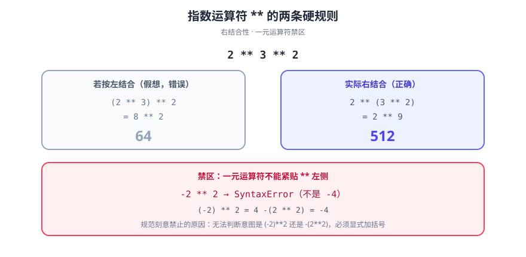

# 指数运算符

> `**` 是 **ES2016（ES7）** 新增的运算符，用来替代 `Math.pow()`。它不只是「写法更短」——**结合性是右结合**，且能和赋值运算符组合成 `**=`，这两点决定了它在链式幂运算里的行为与函数调用完全不同。

::: info 版本归属
指数运算符属于 **ES2016（即 ES7）**，与 [`Array.prototype.includes()`](../includesMethod/index.md) 同为该版本仅有的两项语言特性。
:::



## 一句话定位

`a ** b` 表示 a 的 b 次方。它与 `Math.pow(a, b)` 在数值上等价（都遵循 IEEE 754），差别在**语法层面**：运算符是右结合、可参与赋值简写、优先级高于乘除。

## 一、语法与优先级

```javascript
2 ** 3;            // 8
2 ** 3 ** 2;       // 512  ← 右结合：2 ** (3 ** 2) = 2 ** 9
Math.pow(2, 3 ** 2); // 512（要显式加括号才等价）

let x = 2;
x **= 3;           // 8  ← 赋值简写，等价于 x = x ** 3

-2 ** 2;           // SyntaxError！一元负号与 ** 不能直接组合
(-2) ** 2;         // 4（要加括号）
-(2 ** 2);         // -4（这也是一种合法读法，取决于你的意图）
```

::: danger `-2 ** 2` 是语法错误，不是 -4
规范为了避免歧义，**禁止**一元运算符（`-`、`+`、`!`、`typeof` 等）直接出现在 `**` 左侧操作数位置。这个设计是被刻意选择的：写成 `-2 ** 2` 时无法判断意图是 `(-2)**2` 还是 `-(2**2)`。正确做法是显式加括号。
:::

## 二、与 `Math.pow` 的对照

| 维度 | `a ** b` | `Math.pow(a, b)` |
| --- | --- | --- |
| 优先级 | 高于 `*` `/`，**低于**一元运算符（但不能直接相邻） | 函数调用，优先级最高 |
| 结合性 | **右结合**：`a ** b ** c` = `a ** (b ** c)` | 天然按括号组合 |
| 赋值简写 | ✅ `x **= 2` | ❌ |
| 参数求值 | 两侧均求值一次 | 同 |
| 数值语义 | 完全一致（IEEE 754） | 完全一致 |
| 可读性 | 数学公式更直观 | 长表达式更明确 |

```javascript
// 数值语义一致：特殊情况也一样
2 ** 0;             // 1
2 ** -1;            // 0.5
(-8) ** (1/3);      // NaN（负数开奇次方在实数域外，两者都返回 NaN）
0 ** -1;            // Infinity
NaN ** 0;           // 1（规范规定：指数为 0 时结果为 1）
```

## 三、常见用法

```javascript
// ① 平方/立方：比 x * x * x 更不易写错
const area = Math.PI * r ** 2;
const volume = side ** 3;

// ② 大数（注意精度边界）
2 ** 53;            // 9007199254740992（Number.MAX_SAFE_INTEGER + 1）—— 超过即丢精度
2 ** 53 + 1;        // 9007199254740992（+1 被吞掉）
2n ** 53n;          // 用 BigInt 得到精确值

// ③ 内存/存储单位换算（比 Math.pow 更贴合直觉）
const unit = 1024 ** 2;             // 1 MiB = 1048576

// ④ 反函数用 Math 而不是运算符
Math.sqrt(x);       // 平方根
x ** 0.5;           // 等价写法，但 sqrt 语义更明确
```

::: warning 超过 2^53 就不是整数了
`2 ** 53 + 1 === 2 ** 53` 为 `true`。凡是用 `**` 参与 ID、金额、时间戳这类**不能丢精度**的计算，超过安全整数范围就用 `BigInt`（`2n ** 53n`）或十进制定点方案。
:::

## 四、验证方式

```shell
# ① 右结合性
node --input-type=module -e "console.log(2 ** 3 ** 2, Math.pow(2, Math.pow(3,2)))"
# 期望：512 512

# ② 一元运算符组合是语法错误
node --input-type=module -e "console.log(-2 ** 2)" 2>&1 | head -2
# 期望：SyntaxError（提示 Unary operator used immediately before exponentiation）

# ③ 精度边界
node --input-type=module -e "
console.log(2 ** 53 === 2 ** 53 + 1);
console.log(2n ** 53n + 1n);
"
# 期望：true / 9007199254740993n
```

## 五、深入阅读

- [Array.prototype.includes()方法](../includesMethod/index.md)：ES2016 的另一项新特性
- [ES6 概述](../../ES6/Overview/index.md)：ES2015 的特性全景与版本命名变更
- [Symbol](../../ES6/Symbol/index.md)：精度与类型的另一类边界问题
- MDN · 指数运算符：[developer.mozilla.org/zh-CN/docs/Web/JavaScript/Reference/Operators/Exponentiation](https://developer.mozilla.org/zh-CN/docs/Web/JavaScript/Reference/Operators/Exponentiation)
