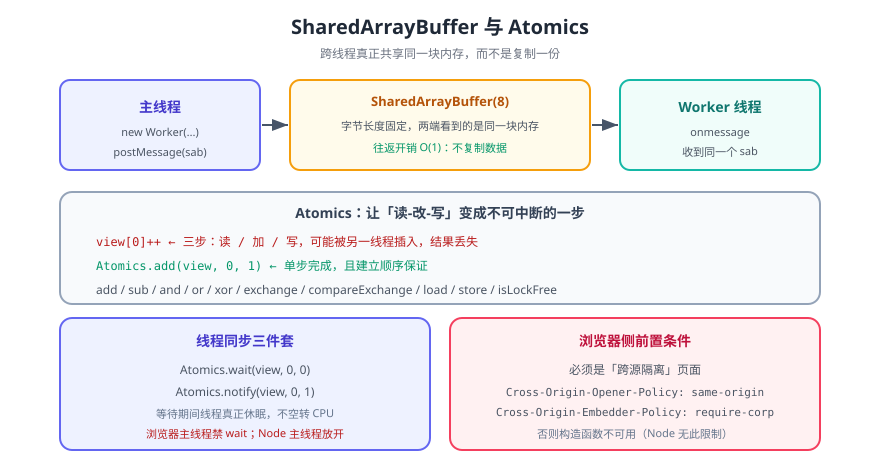

# 共享内存和原子操作

> `SharedArrayBuffer` 提供的是一块**被多个线程同时看见的同一块内存**——不是复制一份再传过去。而 `Atomics` 在这块内存上提供**不可被打断**的操作。两者是一套的：**只有 SAB 没有 Atomics，你的加法会丢数**。

::: info 版本归属
共享内存与原子操作属于 **ES2017（ES8）** 的 Shared Memory and Atomics 提案，并非本库目录名所示的 ES7。本库目录名为历史叫法，页内按年份标注版本。浏览器侧因 Spectre 漏洞曾于 2018 年**短暂禁用**，后通过「跨源隔离」方案重新开放，所以现实中的可用性比规范落地晚得多。
:::



## 一句话定位

`new SharedArrayBuffer(n)` 分配 n 字节的共享内存，本身不能直接读写，必须建立 `Int32Array` / `Float64Array` 之类的**视图**；任何持有同一 SAB 的线程，通过视图看到的是**同一份字节**。`Atomics.*` 是唯一能在共享内存上做「读-改-写」而**不丢更新**的手段。

## 一、为什么需要共享内存

先说清它替代了什么。线程间传数据的默认方式是 `postMessage`，那是**结构化克隆**：

| 方式 | 数据去向 | 开销 | 适用 |
| --- | --- | --- | --- |
| `postMessage(obj)` | **复制**一份给对端 | 随数据量线性增长 | 一次性传结果 |
| `postMessage(obj, [ab])` | **转移** ArrayBuffer（原线程失去访问权） | O(1) | 大块数据所有权交接 |
| `postMessage(sab)` | **共享**，两端同一块内存 | O(1)，永远不复制 | 高频双向读写、共享计数器 |

游戏状态、音视频处理、大数据可视化这类场景里，每帧都要在 Worker 与主线程之间交换几十 MB 的缓冲区——复制版本会把主线程拖死。共享内存把这件事变成「改一个数字」，代价是**你必须自己处理并发正确性**。

::: warning 共享不是免费的
`postMessage(obj)` 复制之后两端各玩各的，天然没有竞态；换成 SAB，**并发问题就全归你了**：数据竞争、内存序、伪共享（false sharing）都需要显式处理。没有并发需求就别引入 SAB。
:::

## 二、SharedArrayBuffer 基础

```javascript
const sab = new SharedArrayBuffer(8);   // 8 字节
// sab.byteLength === 8，但不能 sab[0] 读写 —— 它没有索引概念

const view = new Int32Array(sab);       // 建视图才能读写
Atomics.store(view, 0, 42);
Atomics.load(view, 0);                  // 42
```

| 事实 | 说明 |
| --- | --- |
| 只能通过视图访问 | `Int32Array` / `Uint8Array` / `Float64Array` 等，视图类型决定解释方式 |
| 长度以字节计 | 一个 `Int32Array` 视图含 `byteLength / 4` 个元素 |
| 初始为全 0 | 新分配的字节被清零 |
| 跨视图共享 | 同一 SAB 上建的两个视图互相可见改动 |
| 可增长（新提案） | `new SharedArrayBuffer(8, { maxByteLength: 16 })` 后 `sab.grow(16)`，Node 20+ 支持 |

```javascript
// 多个视图看到同一份字节
const sab = new SharedArrayBuffer(8);
const i32 = new Int32Array(sab);
const u8 = new Uint8Array(sab);

Atomics.store(i32, 0, 1);
u8[0];   // 1  ← 小端序下第一个字节就是 1
```

::: danger 视图类型决定「谁看得见什么」
`Int32Array` 与 `Uint8Array` 共享字节，但解释方式不同。混用不同视图读写同一区域（尤其 `Int32Array` 与 `Float64Array` 之间做类型双关）极易写出与字节序相关的 bug——**同一段区域只用一个视图类型**是最省心的纪律。
:::

## 三、Atomics 方法一览

`Atomics` 不是构造器，是一组静态方法。按用途分三类：

| 类别 | 方法 | 作用 |
| --- | --- | --- |
| 读-改-写 | `add` / `sub` / `and` / `or` / `xor` / `exchange` | 原子地修改并**返回旧值** |
| 读-改-写（条件） | `compareExchange(view, i, expected, replacement)` | 旧值 === expected 才写入，返回**旧值** |
| 纯读写 | `load` / `store` | 原子读 / 原子写 |
| 同步 | `wait` / `notify` | 阻塞等待 / 唤醒等待者 |
| 能力探测 | `isLockFree(size)` | 该字节数是否为无锁实现 |

```javascript
const v = new Int32Array(new SharedArrayBuffer(8));
Atomics.store(v, 0, 5);

// compareExchange：旧值等于期望值才替换（CAS）
Atomics.compareExchange(v, 0, 5, 9);   // 返回 5（旧值），v[0] 变成 9
Atomics.compareExchange(v, 0, 5, 7);   // 返回 9（不匹配，未写入），v[0] 仍是 9

// exchange：无条件替换，返回旧值
Atomics.exchange(v, 0, 42);            // 返回 9，v[0] 变成 42

// 算术类都返回「修改前的值」，这点决定了累加写法
Atomics.add(v, 0, 8);                  // 返回 42
Atomics.load(v, 0);                    // 50
```

::: tip `compareExchange` 是构建一切同步原语的原子
自旋锁、引用计数、无锁队列都建立在「比较并交换」上。它返回旧值（而不是布尔）是刻意的：调用方据返回值就能知道**自己是否成功**，无需再读一次。

```javascript
// 用 CAS 实现一次自旋加锁
function lock(v, idx) {
  while (Atomics.compareExchange(v, idx, 0, 1) !== 0) { /* 自旋 */ }
}
```
:::

## 四、竞态实证：为什么必须用 Atomics

`view[0] = view[0] + 1` 看起来是一步，实际是三步：**读 → 加 → 写**。两个线程交错执行时，中间的写会互相覆盖。

```javascript
// 非原子：4 个 Worker 各加 20 万次
view[0] = view[0] + 1;

// 原子：同样的循环
Atomics.add(view, 0, 1);
```

实测（Node v22，4 个 Worker，各 20 万次，期望总计 800000）：

| 写法 | 实测结果 | 丢失 |
| --- | --- | --- |
| `view[0] = view[0] + 1` | **508555** | 291445 |
| `Atomics.add(view, 0, 1)` | **800000** | 0 |

::: danger 丢多少是不确定的
上面那组数字只说明「丢了很多」，具体丢多少**每次运行都不同**，取决于 CPU 核数、调度时机与缓存。这种 bug 的可怕之处正在于此：单线程测试全绿、压测时才偶发、线上数据对不上账。**凡是共享内存上的累加，一律用 `Atomics`**。
:::

## 五、内存序：Atomics 顺带给了你什么

不只有「原子」这一个保证。`Atomics` 操作之间还建立 **happens-before** 关系：同一个 SAB 上，线程 A 在 `Atomics.store` 之前的所有写操作，线程 B 通过 `Atomics.load` 读到该值后**一定都能看见**。

```javascript
// 线程 A
Atomics.store(flag, 0, 1);      // 这一步之前的普通写，对读到 flag=1 的线程可见

// 线程 B
while (Atomics.load(flag, 0) === 0) { /* 等 */ }
// 到这里，A 在 store 之前写的数据对 B 一定可见
```

反过来，**普通读写不提供任何顺序保证**：`data[0] = 1; ready[0] = 1;` 在另一线程看来可能是 `ready` 先可见。这就是「双重检查锁定」在多线程里容易写错的原因。

::: warning `Atomics` 不能保护「一片区域」
`Atomics.add(view, 0, 1)` 只保证**这一个 4 字节槽位**的原子性。要维护「结构体」级别的原子性，得靠 `wait`/`notify` 或自旋锁把多个槽位包起来——单纯多用几个 `Atomics` 不构成事务。
:::

## 六、等待与唤醒

轮询会烧 CPU。`Atomics.wait` / `notify` 提供真正的休眠式等待：

```javascript
// 等待方（Worker 内）
// 只有当 view[i] 仍等于期望值时才阻塞；否则立即返回 'not-equal'
const result = Atomics.wait(view, 0, 0);   // 'ok' | 'not-equal' | 'timed-out'

// 唤醒方（另一线程）
Atomics.store(view, 0, 1);
Atomics.notify(view, 0, 1);                // 唤醒最多 1 个等待者
```

| 返回值 | 含义 |
| --- | --- |
| `'ok'` | 被 `notify` 唤醒 |
| `'not-equal'` | 进入时值已不等于期望值，未阻塞 |
| `'timed-out'` | 传入超时（第 4 个参数，单位毫秒）后自行返回 |

::: danger 主线程能不能 wait，浏览器与 Node 不同
**浏览器**禁止主线程调用 `Atomics.wait`（会抛 `TypeError`），因为阻塞主线程会冻结页面；Worker 内则可以。
**Node.js** 放开了这个限制，主线程也能阻塞。实测（Node v22）：

```shell
node -e "const v = new Int32Array(new SharedArrayBuffer(8)); console.log(Atomics.wait(v, 0, 999, 10))"
# 输出：not-equal（值不等于 999，未阻塞即返回）
```
:::

## 七、浏览器侧的前置条件：跨源隔离

在浏览器里直接 `new SharedArrayBuffer()` 会成功构造，但**某些高精度计时能力与 SAB 的完整能力**需要页面处于「跨源隔离」状态。要启用，服务端必须同时下发两个响应头：

```text
Cross-Origin-Opener-Policy: same-origin
Cross-Origin-Embedder-Policy: require-corp
```

代价是：**所有跨源子资源（图片、脚本、iframe）都必须显式声明 `Cross-Origin-Resource-Policy` 或使用 CORS**，否则会被拦截。这常常是「本地能跑、上线白屏」的根因。

```javascript
// 运行时自检：页面是否已进入跨源隔离
console.log(crossOriginIsolated);   // true 才能放心用共享内存
```

## 八、什么时候该用，什么时候别用

| 适合 | 不适合 |
| --- | --- |
| 高频、双向、大块的数值数据（像素、音频采样、物理状态） | 低频、一次性传递（用 `postMessage` 更省心） |
| 需要精确的跨线程计数器 | 只需要「传个结果回来」 |
| 想避免结构化克隆的复制开销 | 团队没有并发调试经验与压测手段 |

::: tip 先量再改
把 `postMessage` 换成 SAB 之前，先测出**复制到底花了多少时间**。若复制本身只占整体耗时的 1%，引入并发复杂度换不来收益——这是最常见的过度优化。
:::

## 九、验证方式

```shell
# ① SharedArrayBuffer 与 Atomics 基础（Node 原生支持，无需任何开关）
node --input-type=module -e "
const view = new Int32Array(new SharedArrayBuffer(8));
Atomics.add(view, 0, 1);
Atomics.add(view, 0, 1);
console.log(view[0], Atomics.load(view, 0));
"
# 期望：2 2

# ② CAS 与 exchange 的返回值语义
node --input-type=module -e "
const v = new Int32Array(new SharedArrayBuffer(8));
Atomics.store(v, 0, 5);
console.log(Atomics.compareExchange(v, 0, 5, 9), Atomics.load(v, 0));
console.log(Atomics.compareExchange(v, 0, 5, 7), Atomics.load(v, 0));
console.log(Atomics.exchange(v, 0, 42), Atomics.load(v, 0));
"
# 期望：5 9 / 9 9 / 9 42

# ③ 等待语义（Node 主线程放开限制）
node --input-type=module -e "
const v = new Int32Array(new SharedArrayBuffer(8));
console.log(Atomics.wait(v, 0, 999, 10));
"
# 期望：not-equal

# ④ 可增长 SAB（Node 20+）
node --input-type=module -e "
const g = new SharedArrayBuffer(8, { maxByteLength: 16 });
g.grow(16);
console.log(g.byteLength, g.growable);
"
# 期望：16 true
```

跨线程竞态与原子操作的对照实验（把下面内容存为 `race.mjs` 后运行）：

```javascript
import { Worker } from 'node:worker_threads';

const code = `
const { parentPort, workerData } = require('node:worker_threads');
for (let i = 0; i < workerData.iters; i++) {
  if (workerData.atomic) Atomics.add(workerData.view, 0, 1);
  else workerData.view[0] = workerData.view[0] + 1;   // 三步，会被打断
}
parentPort.postMessage('done');
`;

async function run(atomic, workers = 4, iters = 200000) {
  const view = new Int32Array(new SharedArrayBuffer(4));
  await Promise.all(Array.from({ length: workers }, () => new Promise((res) => {
    const w = new Worker(code, { eval: true, workerData: { view, iters, atomic } });
    w.on('message', () => { w.terminate(); res(); });
  })));
  return view[0];
}

console.log('期望  :', 4 * 200000);
console.log('非原子:', await run(false));
console.log('原子  :', await run(true));
```

```shell
node race.mjs
# 期望：非原子 < 800000（每次不同），原子 === 800000
```

## 十、深入阅读

- [异步函数](../AsyncFunc/index.md)：同一版本周期里更常用的异步能力
- [Promise](../../ES6/Promise/index.md)：单线程内的并发编排，与本文的多线程路线互补
- [ECMAScript7 目录](../index.md)：本目录其余特性的入口与版本说明
- MDN · SharedArrayBuffer：[developer.mozilla.org/zh-CN/docs/Web/JavaScript/Reference/Global_Objects/SharedArrayBuffer](https://developer.mozilla.org/zh-CN/docs/Web/JavaScript/Reference/Global_Objects/SharedArrayBuffer)
- MDN · Atomics：[developer.mozilla.org/zh-CN/docs/Web/JavaScript/Reference/Global_Objects/Atomics](https://developer.mozilla.org/zh-CN/docs/Web/JavaScript/Reference/Global_Objects/Atomics)
