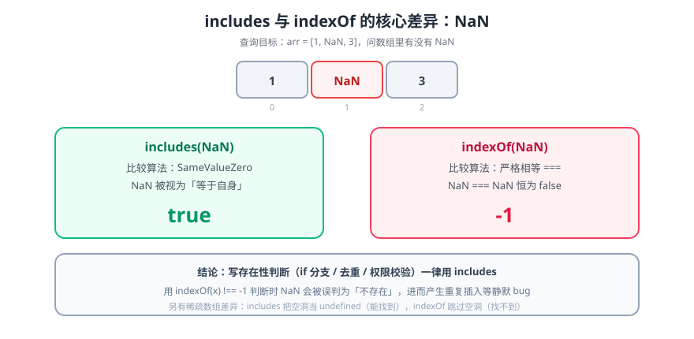

# Array.prototype.includes()方法

> `includes()` 是 **ES2016（ES7）** 新增的数组/字符串方法。它和 `indexOf()` 看起来重复，但**在 `NaN` 上行为完全不同**——这是选择它的唯一硬理由。

::: info 版本归属
`Array.prototype.includes` 属于 **ES2016（即 ES7）**。本库目录名为历史叫法，页内按年份标注版本。
:::



## 一句话定位

`arr.includes(x)` 返回布尔值，回答「在不在」；`arr.indexOf(x)` 返回下标或 `-1`，回答「在哪」。**只想知道存在性时用 `includes`**，语义更直白，且不会因为 `-1` 被当真值而写错条件。

## 一、语法

```javascript
// 数组
arr.includes(searchElement);
arr.includes(searchElement, fromIndex);

// 字符串也有同名方法（ES2015 起就有）
'hello'.includes('ell');          // true
```

| 参数 | 说明 |
| --- | --- |
| `searchElement` | 要查找的值。**使用 SameValueZero 比较** |
| `fromIndex` | 起始下标。负数表示从末尾倒数（`-1` = 最后一个）；超过长度返回 `false` |

```javascript
const arr = [1, 2, 3, 4, 5];

arr.includes(3);          // true
arr.includes(3, 3);       // false（从下标 3 开始找）
arr.includes(3, -2);      // true（从倒数第 2 个开始找）
arr.includes(9);          // false
```

## 二、与 `indexOf` 的三点差异

| 维度 | `includes` | `indexOf` |
| --- | --- | --- |
| 返回值 | 布尔 | 下标 / `-1` |
| **`NaN`** | **能找到**（`SameValueZero` 把 NaN 视为等于自身） | **找不到**（用 `===`，`NaN === NaN` 为 false） |
| 稀疏数组的空洞 | 视为 `undefined`，能找到 | 跳过空洞，找不到 |

```javascript
const arr = [1, NaN, 3];

arr.includes(NaN);        // true   ← 关键差异
arr.indexOf(NaN);         // -1
arr.indexOf(NaN) !== -1;  // false  ← 用 indexOf 写存在性判断会漏掉 NaN
```

::: danger 为什么这个差异值得单独记住
`NaN` 在真实数据里很常见：`Number('')`、`0/0`、`parseFloat('abc')`、某些数值计算的结果都是 NaN。用 `indexOf` 做「去重/存在性」判断时，**NaN 会被当成「不存在」而被重复插入**——这类 bug 不报错、只在特定数据下出现。
:::

## 三、常见用法

```javascript
// ① 条件判断（比 indexOf 更不容易写错）
if (tags.includes('featured')) { /* ... */ }

// ② 去重（用 Set，includes 只负责判断）
const unique = [...new Set(list)];

// ③ 权限判断（注意大小写与前后空格，先规范化）
const canEdit = roles.map(r => r.trim().toLowerCase()).includes('admin');

// ④ 多值任一命中
const hit = ['a', 'b'].some(k => keys.includes(k));
```

## 四、注意事项

| 项 | 说明 |
| --- | --- |
| 比较方式 | `SameValueZero`：`0` 与 `-0` 视为相等；`NaN` 与 `NaN` 视为相等 |
| 对象比较 | **按引用**。`[{a:1}].includes({a:1})` 是 `false`——对象要用 `some` + 属性比较 |
| 稀疏数组 | 空洞被当成 `undefined`，会返回 `true`（与直觉不符） |
| 兼容性 | `Array.prototype.includes` 是**内建方法**，需要 polyfill（`core-js`）而不是转译 |
| 类型化数组 | `TypedArray.prototype.includes` 同样存在，语义一致 |

```javascript
// 对象数组的存在性判断：必须用 some
const list = [{ id: 1 }, { id: 2 }];
list.includes({ id: 1 });                    // false —— 引用不同
list.some(item => item.id === 1);            // true

// 稀疏数组的坑
const sparse = [1, , 3];                     // 下标 1 是空洞
sparse.includes(undefined);                  // true  ← 反直觉
```

## 五、验证方式

```shell
# ① 直接验证 NaN 差异（这是本页的核心判据）
node --input-type=module -e "
const arr = [1, NaN, 3];
console.log('includes:', arr.includes(NaN));
console.log('indexOf :', arr.indexOf(NaN));
"
# 期望：includes: true / indexOf : -1

# ② fromIndex 的负数语义
node --input-type=module -e "
const a = [1,2,3,4,5];
console.log(a.includes(3, -2), a.includes(3, 3));
"
# 期望：true false

# ③ 对象按引用的反直觉行为
node --input-type=module -e "console.log([{id:1}].includes({id:1}))"
# 期望：false
```

## 六、深入阅读

- [数组新方法](../../ES6/NewArrayMethod/index.md)：ES6 的 `find` / `findIndex` / `fill` 等方法
- [Set 和 Map](../../ES6/SetMap/index.md)：去重与成员判断的另一条路
- [指数运算符](IndexOper/index.md)：ES2016 的另一项新特性
- MDN · Array.prototype.includes：[developer.mozilla.org/zh-CN/docs/Web/JavaScript/Reference/Global_Objects/Array/includes](https://developer.mozilla.org/zh-CN/docs/Web/JavaScript/Reference/Global_Objects/Array/includes)
