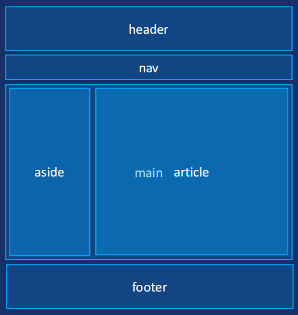

# HTML5 布局标签

网页的外观多种多样，但是大概都包含：页眉、导航栏、主内容、侧边栏、页脚等，**布局标签都是块级元素**。

这些标签受浏览器兼容性问题影响，PC端根据公司需求，移动端放心使用。

| 标签名                | 语义                                                                       |
| --------------------- | -------------------------------------------------------------------------- |
| `<header></header>`   | 整个页面，或部分区域的头部 (页眉)                                          |
| `<footer></footer>`   | 整个页面，或部分区域的底部 (页脚)                                          |
| `<nav></nav>`         | 导航                                                                       |
| `<article></article>` | 文章、帖子、杂志、新闻、博客、评论等                                       |
| `<section></section>` | 分块，页面中的某段文字，或文章中的某段文字（里面文字通常里面会包含标题）   |
| `<aside></aside>`     | 侧边栏                                                                     |
| `<main></main>`       | 文档的主要内容 (WHATWG 没有语义， IE 不支持)，每个页面只能有一个，几乎不用 |
| `<hgroup></hgroup>`   | 包裹连续的标题，如文章主标题、副标题的组合 （ W3C 将其删除）               |

关于 article 和 section：

1. article 里面可以有多个 section 。
2. section 强调的是分段或分块，如果想将一块内容分成几段的时候，可使用 section 元 素。
3. article 比 section 更强调独立性，一块内容如果比较独立、比较完整，应该使用 article 元素。

常用布局：

