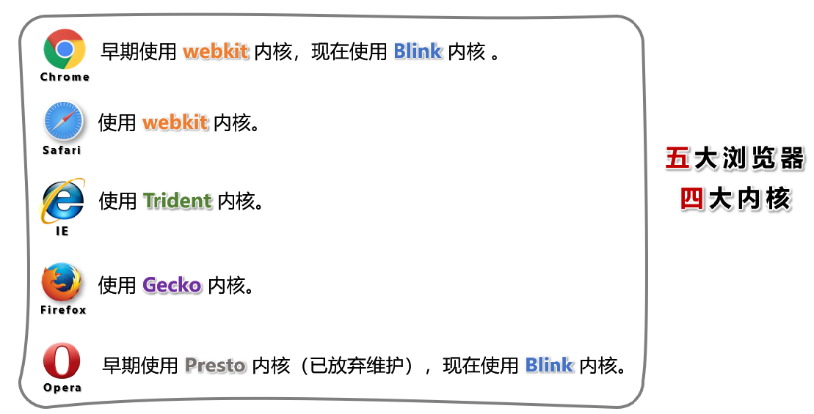

# HTML 概述

HTML(`HyperText Markup Language`，超文本标记语言)是一种用来告知浏览器如何组织页面的**标记**语言。

- 超文本：暂且简单理解为 “超级的文本”，和普通文本比，内容更丰富。
- 标记：文本要变成超文本，就需要用到各种标记符号。
- 语言：每一个标记的写法、读音、使用规则，组成了一个标记语言。

HTML 由一系列的标签组成。标记也称为标签 (元素)。大小写都可以，建议小写。

**标签组成**：

- 符号：标签用 `<` `>` 尖括号表示。

- 组成：开始标签、结束标签和内容。

  别称：标签也称为元素。

**标签分类**：大部分都是双标签，少数单标签。

## 相关国际组织

### IETF

全称：Internet Engineering Task Force（国际互联网工程任务组），成立于1985年底，是一个权威的互联网技术标准化组织，主要负责互联网相关技术规范的研发和制定，当前绝大多数国际互联网技术标准均出自IETF。

官网： https://www.ietf.org

### W3C

全称：World Wide Web Consortium（万维网联盟），创建于1994年，是目前Web技术领域，最具影响力的技术标准机构。共计发布了200多项技术标准和实施指南，对互联网技术的发展和应用起到了基础性和根本性的支撑作用。

官网： https://www.w3.org

### WHATWF

全称：Web Hypertext Application Technology Working Group（网页超文本应用技术工作小组）成立于2004年，是一个以推动网络HTML 5 标准为目的而成立的组织。由Opera、Mozilla基金会、苹果，等这些浏览器厂商组成。

官网： https://whatwg.org/

## 常见浏览器内核

## HTML 发展历史

从 HTML 1.0 开始发展，期间经历了很多版本，目前HTML的最新标准是：HMTL 5

## HTML5 概述

HTML5 是新一代的 HTML 标准，2014年10月由万维网联盟（ W3C ）完成标准制定。

官网地址：

- W3C 提供： https://www.w3.org/TR/html/index.html

- WHATWG 提供：https://whatwg-cn.github.io/html/multipage

HTML5 在狭义上是指新一代的 HTML 标准，在广义上是指：整个前端。

## HTML5 优势

1. 针对 JavaScript ，新增了很多可操作的接口。

2. 新增了一些语义化标签、全局属性。

3. 新增了多媒体标签，可以很好的替代 flash 。

4. 更加侧重语义化，对于 SEO 更友好。

5. 可移植性好，可以大量应用在移动设备上。

6. HTML5兼容性 支持： Chrome 、 Safari 、 Opera 、 Firefox 等主流浏览器。

## HTML5 兼容性

支持： Chrome 、 Safari 、 Opera 、 Firefox 等主流浏览器。

IE 浏览器必须是 9 及以上版本才支持 HTML5 ，且 IE9 仅支持部分 HTML5 新特性。
